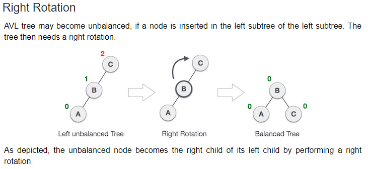
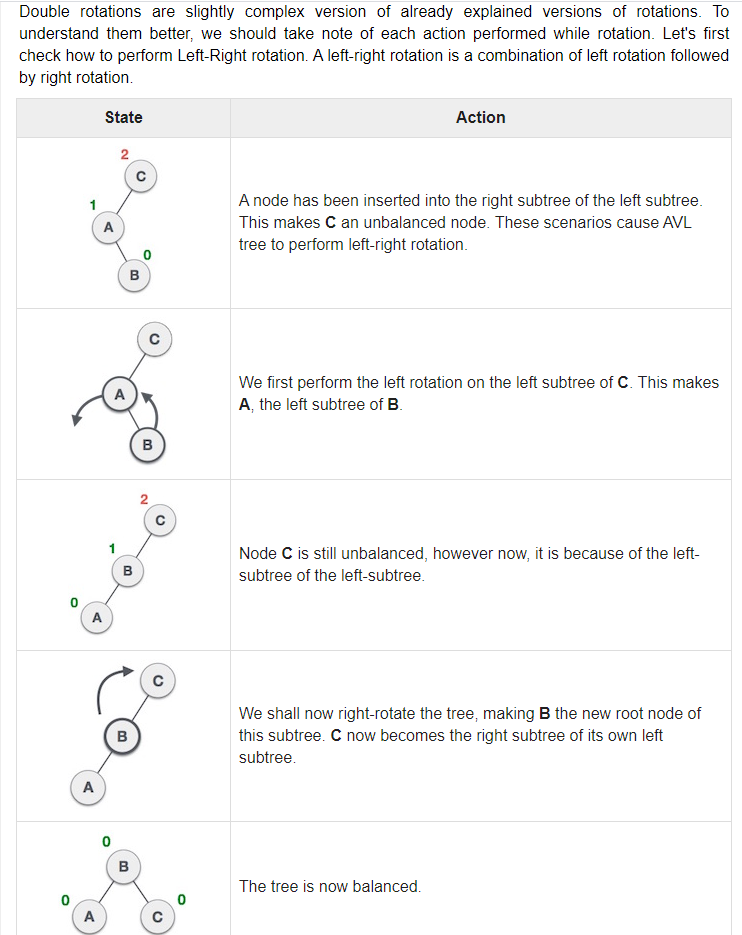
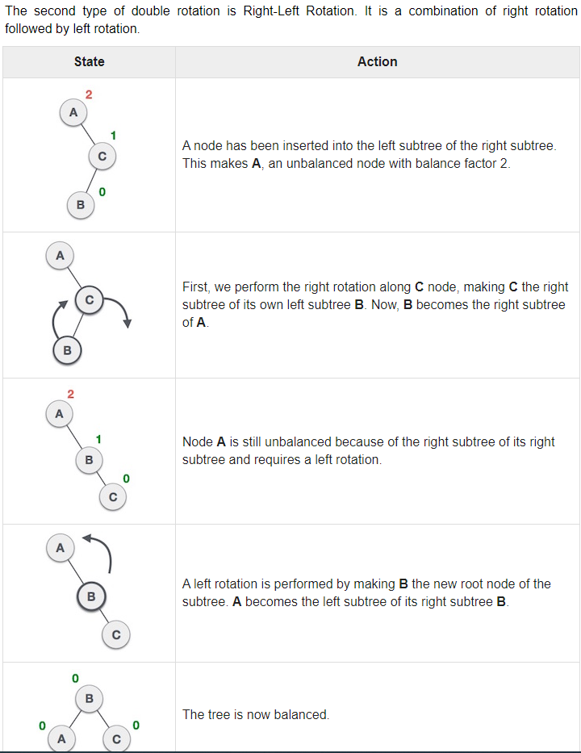

**AVL树**是最早被发明的 *自平衡二叉查找树*。
在 AVL 树中，任一节点对应的两棵子树的最大高度差为1，因此它也被称为**高度平衡树**。
查找、插入和删除在平均和最坏情况下的[时间复杂度](https://zh.wikipedia.org/wiki/时间复杂度)都是  。
增加和删除元素的操作则可能需要借由一次或多次树旋转，以实现树的重新平衡。

节点的平衡因子是它的左子树的高度减去它右子树的高度 (有时相反)。
带有平衡因子1，0或-1的节点被认为是平衡的。
带有平衡因子 -2 或 2 的节点被认为是不平衡的，并需要重新平衡这个树。
平衡因子可以直接存储在每个节点中，或从可能存储在节点中的子树高度计算出来。

##### 左旋

##### 右旋

##### 左右旋

##### 右左旋

