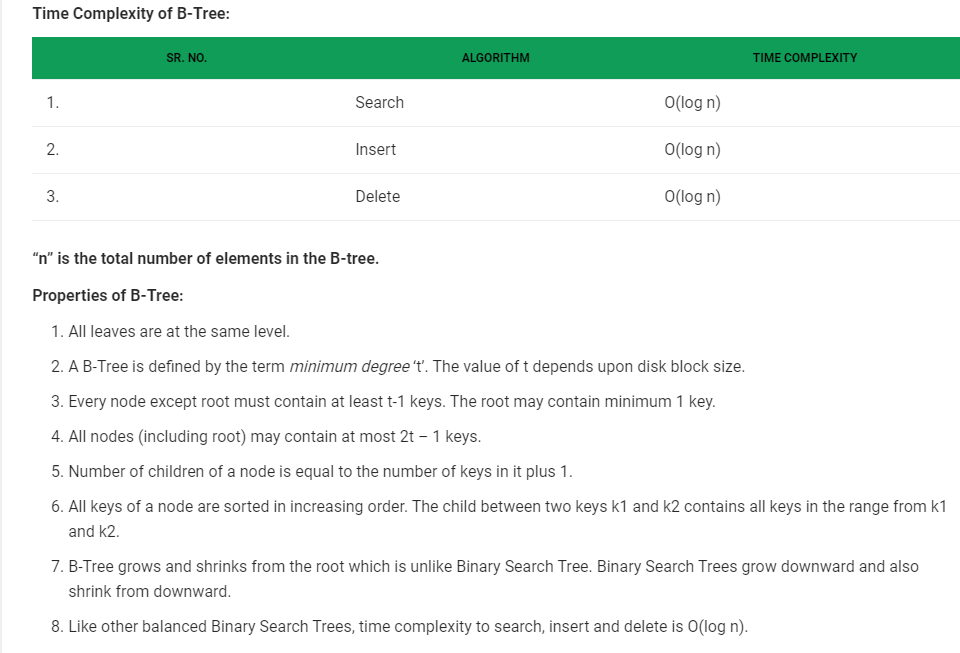

### 常用树数据结构

| 名称                                                         |
| ------------------------------------------------------------ |
| 二叉树                                                       |
| 二叉查找树 (Binary Search Trees) [BST]  / 二叉排序树 (Binary Sort Tree) |
| AVL 树 (Balanced binary search trees) [AVL]                  |
| 红黑树 (Red-Black Trees)                                     |
| B 树 (B Trees)                                               |
| B+ 树 (B+ Trees)                                             |

#### BST

BST（Binary Search Tree）目的是为了提高查找的性能，其查找在平均和最坏的情况下都是 logn 级别，接近二分查找。
- 若左子树不空，则左子树上所有节点的值均小于它的根节点的值
- 若右子树不空，则右子树上所有节点的值均大于它的根节点的值
- 左、右子树也分别为二叉排序树

#### AVL

AVL 树是最先发明的 `自平衡二叉查找树`。在 AVL 树中任何节点的两个子树的高度最大差别为 1，所以它也被称为`高度平衡树`。增加和删除可能需要通过一次或多次 `树旋转` 来重新平衡这个树。

- 本身首先是一棵二叉搜索树。

- 带有平衡条件：每个结点的左右子树的高度之差的绝对值（平衡因子）最多为1

AVL 树，本质上是带了平衡功能的二叉查找树（二叉排序树，二叉搜索树）。

#### Red-Black Trees

红黑树（Red Black Tree） 是一种自平衡二叉查找树。
红黑树是一种特化的 AVL 树 （平衡二叉树），都是在进行插入和删除操作时通过特定操作保持二叉查找树的平衡，从而获得较高的查找性能。

#### B Trees

#### B+ Trees