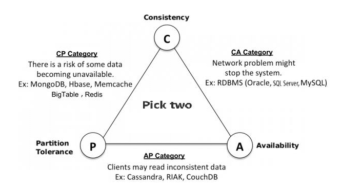
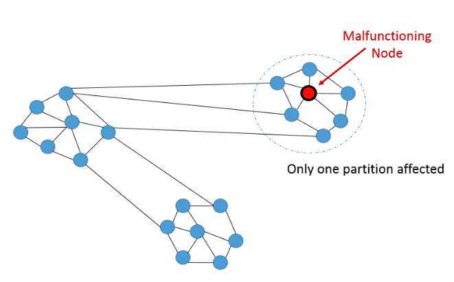
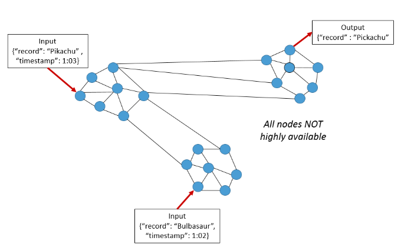
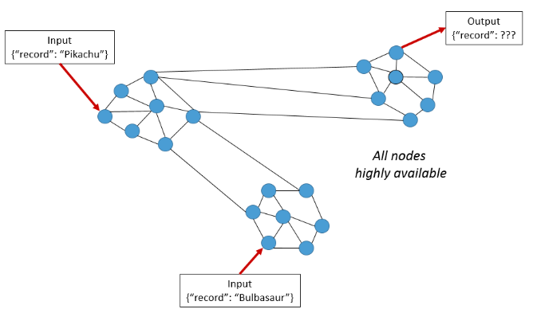

#### 分布式系统学习笔记 (distributed systems)

> 在过去当我们想存储更多数据或提高处理能力时，通常的选择是 (*scale vertically*) 垂直扩展（获得功能更强大的机器）或进一步优化现有代码库。
> 但是，随着并行处理和分布式系统的进步，更常见的是 (*horizontally*) 水平扩展或具有更多机器并行执行相同任务。
>
> 在 Apache 项目中看到了很多数据处理工具，例如 `Spark`，`Hadoop`，`Kafka`，`Zookeeper` 和 `Storm`

> CAP 定理最初是由 Eric Brewer 设计的，它是识别分布式系统设计的一种方法：但这不是唯一的方法。

为了有效地选择工具，`CAP`(科普屯)  定理的基本思想是必要的。

CAP 定理是一个概念，即分布式数据库系统只能具有 Consistency (一致性), Availability (可用性) and Partition Tolerance (分区容限) 中的 2 个。

CAP 定理在大数据世界中非常重要，尤其是当我们需要根据我们独特的用例在三者之间进行权衡时。

##### Partition Tolerance

尽管网络各节点间有一些数量的消息已经延迟，但系统然在继续运行。
容错分区的系统可以承受任何数量的网络故障，而这不会导致整个网络的故障。
数据记录可在节点和网络的组合之间充分复制，以通过间歇性中断来保持系统正常运行。
在处理现代分布式系统时，分区容限不是可选的而是必须的。因此，我们必须在一致性和可用性之间进行权衡。

##### High Consistency (高一致性)

这种情况表明，所有节点都同时看到相同的数据。
简而言之，执行读取操作将返回最近写入操作的值，从而导致所有节点都返回相同的数据。
如果事务以系统处于一致状态开始，并以系统处于一致状态结束，则系统具有一致性。
在此模型中，系统可以（并且确实）在事务期间转换为不一致状态，但是如果过程中的任何阶段出现错误，则整个事务都会回滚。
但是，节点将需要时间来更新，并且将不会经常在网络上可用。

*CAP* 定理陈述并遵循一个特定的一致性级别，这称为线性化一致性，需要遵守。
可线性化的一致性系统会在更新（通常为写操作）发生后立即更新副本。
它不会花时间在写入时的更新其他节点，因此可以保持一致性。
应当注意，同步行为是成本或性能方面的开销，因为不返回更新操作，并且阻塞后续的读取操作，直到复制完成。

##### High Availability (高可用性)

这种情况表明，每个请求都会获得成功/失败的响应。
要在分布式系统中实现可用性，需要系统 *100％* 的时间保持运行。
每个客户端都会得到响应，而不管系统中任何单个节点的状态如何。
衡量该指标很简单：可以提交读/写命令，或者不能提交。
因此，数据库是时间独立的，因为节点需要始终在线可用。
输出可以是其中任何一个。因此，为什么在高频分析流数据时高可用性不可行。

##### 小结 (conclusion)

分布式系统使我们能够达到过去根本无法获得的计算能力和可用性水平。
我们的系统在遍布全球的数据中心中具有更高的性能，更低的延迟以及近100％的正常运行时间。
最重要的是，当今的系统都在易于获得和配置且价格合理的商品硬件上运行。
但是代价就是。分布式系统比其单网络系统更为复杂。
了解分布式系统中的复杂性，为手头的任务（CAP）进行适当的权衡，以及为水平工作选择正确的工具是必要的。

---

###### CAP 权衡

无法同时满足一致性、可用性和分区容错性这三个特性

> CA without P：如果不要求 P（不允许分区），则 C（强一致性）和 A（可用性）是可以保证的。
> 但分区不是你想不想的问题，而是始终会存在，因此 CA 的系统更多的是允许分区后各子系统依然保持 CA
>
> CP without A：如果不要求 A（可用），相当于每个请求都需要在 Server 之间强一致，而 P（分区）会导致同步时间无限延长，如此 CP 也是可以保证的。很多传统的数据库分布式事务都属于这种模式。
>
> AP wihtout C：要高可用并允许分区，则需放弃一致性。
> 一旦分区发生，节点之间可能会失去联系，为了高可用，每个节点只能用本地数据提供服务，而这样会导致全局数据的不一致性。现在众多的 NoSQL 都属于此类。

---

##### CAP 相关的 BASE 协议

BASE 是 Basically Available (基本可用)、Soft state(软状态)和 Eventually consistent (最终一致性)三个短语的缩写。是对CAP中AP的一个扩展。

1. 基本可用: 分布式系统在出现故障时，允许损失部分可用功能，保证核心功能可用。
2. 软状态: 允许系统中存在中间状态，这个状态不影响系统可用性，这里指的是CAP中的不一致。
3. 最终一致: 最终一致是指经过一段时间后，所有节点数据都将会达到一致。

BASE 解决了 CAP 中理论没有网络延迟，在 BASE 中用软状态和最终一致，保证了延迟后的一致性。
BASE 和 ACID 是相反的，它完全不同于 ACID 的强一致性模型，而是通过牺牲强一致性来获得可用性，并允许数据在一段时间内是不一致的，但最终达到一致状态。