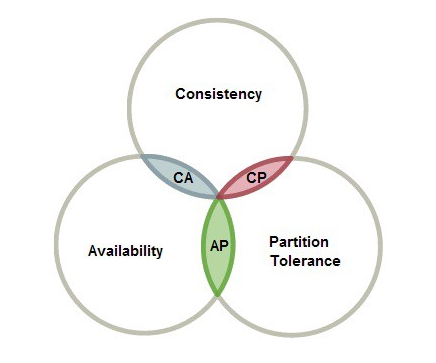

#### 分布式系统事务 (distributed)

#### 数据库本地事务 (ACID)

事务的四大特性： *ACID*

- *A* (Atomicity) 原子性
  一个事务 (transaction) 中所有操作，要么全部完成，要么全部不完成，不会结束在中间的某个环节。事务执行错误的时候会被回滚 (RollBack) 到事务最初的状态，就像该事务从未执行过。
- *C* (Consistency) 一致性
  事务执行前和执行后的数据都必须处于一致性的状态。如：系统中账户有 1000 元，无论是转账或者其它操作，系统的总金额都必须是 1000 元。事务执行成功，系统中所有的变化将正确的应用，系统处于有效的状态。事务中出现错误，系统所有变化将被回滚，返回事务操作前原始状态。
- *I* (Isolation) 隔离性
  在并发环境中，不同事务同事操作相同数据时，每个事务都有各自的完整数据空间。并发事务所做的修改必须与任何其它并发事务所做的修改隔离。事务查看数据时，要么是另一个事务修改它之前的状态，要么是修改后的状态，不会查看到事务修改中的状态。
- *D* (Durability) 持久性
  只要事务成功结束，它操作的所有数据库更新必须永久的保存下来。即使系统发生崩溃，重新启动数据库后系统还能恢复到事务成功结束后的状态。

*MySQL* *InnoDB* 实现原理
InnoDB 是 mysql 的一个存储引擎，在本地事务中，服务和资源在事务的包裹下可以看做是一体。

事务的 *ACID* 是通过 *InnoDB* 日志和锁来保证。
事务的隔离性是通过数据库锁的机制实现的，持久性通过 *redo log（重做日志）* 来实现。
原子性和一致性通过 *Undo log* 来实现。

*Undo Log* 为满足事务的原子性，在操作任何数据之前，首先将数据备份到一个地方（这个存储数据备份的地方称为 *Undo Log*），然后进行数据的修改，如果出现了错误或者用户执行了 *ROLLBACK* 语句，系统可以利用 *Undo Log* 中的备份将数据恢复到事务开始之前的状态。

*Redo Log* 记录的是新数据的备份。在事务提交前，只要将 *Redo Log* 持久化即可，不需要将数据持久化。
当系统崩溃时，虽然数据没有持久化，但是 *Redo Log* 已经持久化。系统可以根据 *Redo Log* 的内容，将所有数据恢复到最新的状态。

##### 分布式事务

> 分布式事务就是指事务的参与者、支持事务的服务器、资源服务器以及事务管理器分别位于不同的分布式系统的不同节点之上。
> 一次大的操作由不同的小操作组成，这些小的操作分布在不同的服务器上，且属于不同的应用，分布式事务需要保证这些小操作要么全部成功，要么全部失败。
> 本质上来说，分布式事务就是为了保证不同数据库的数据一致性。

分布式系统产生的原因： *Service 多个节点*，*Resource 多个节点*

##### 分布式事务基础

基本理论支持： *CAP* 
一致性（Consistency）、可用性（Availability）和分区容错性（Partition tolerance）

- *Consistency* (一致性) ：每次读取都会收到最近的写入或错误
- *Availability* (可用性) ： 每个请求都会收到一个（非错误）响应，但不能保证它包含最新的写操作
- *Partition tolerance* (分区容错性)：尽管节点之间的网络丢弃（或延迟）了任意数量的消息，但系统仍继续运行

当发生网络分区故障时，我们应该决定

- 取消操作，从而降低可用性，但确保一致性
- 继续进行操作，从而提供可用性，但存在风险不一致

CAP 定理表明，在存在网络分区的情况下，必须在一致性和可用性之间进行选择。

*请注意，CAP定理中定义的一致性与ACID数据库事务中保证的一致性有很大不同*

---

##### 分布式事务方案

> 出现分布式事务的原因
>
> 微服务过多，而微服务过多就会引出分布式事务。
> *建议：*需要事务的微服务聚合成一个单机服务，使用数据库的本地事务。
>
> 因为不论任何一种方案都会增加系统的复杂度，这样的成本实在是太高了，千万不要因为追求某些设计，而引入不必要的成本和复杂度。

#### 常用分布式事务解决方案

##### 1. XA 规范 1PC, 2PC, 3PC

XA 规范中分布式事务有 AP，RM，TM 组成

- *AP - Application Program (应用程序)*  AP 定义事务边界（定义事务开始和结束）并访问事务边界内的资源。
- *RM - Resource Manager (资源管理器)* RM 管理计算机共享的资源，许多软件都可以去访问这些资源，资源包含比如数据库、文件系统、打印机服务器等。
- *TM - Transaction Manager (事务管理器)* 负责管理全局事务，分配事务唯一标识，监控事务的执行进度，并负责事务的提交、回滚、失败恢复等。

XA 规范中的接口

- *xa_start* 负责开启或者恢复一个事务分支，并且管理 XID 到调用线程
- *xa_end* 负责取消当前线程与事务分支的关联
- *xa_prepare* 负责询问 RM 是否准备好了提交事务分支
- *xa_commit* 通知 RM 提交事务分支
- xa_rollback 通知 RM 回滚事务分支

XA 协议是使用了二阶段协议的

- 第一阶段 TM 要求所有的 RM 准备提交对应的事务分支，询问 RM 是否有能力保证成功的提交事务分支，RM 根据自己的情况，如果判断自己进行的工作可以被提交，那就就对工作内容进行持久化，并给 TM 回执 OK；否给 TM 的回执 NO。RM 在发送了否定答复并回滚了已经的工作后，就可以丢弃这个事务分支信息了。
- 第二阶段 TM 根据阶段1各个 RM prepare 的结果，决定是提交还是回滚事务。如果所有的 RM 都 prepare 成功，那么 TM 通知所有的 RM 进行提交；如果有 RM prepare 回执 NO 的话，则 TM 通知所有 RM 回滚自己的事务分支。

###### 2PC

角色：协调者（coordinator），参与者（participants, 或cohort）
保证事务在提交时，协调者和参与者处于一致性状态，如果其中有一个参与者出现了故障或者网络问题，不能及时的回应协调者，那么这次事务就宣告失败或者出现阻塞。
**准备阶段：**
事务协调者(事务管理器)给每个参与者(资源管理器)发送 Prepare 消息，每个参与者要么直接返回失败(如权限验证失败)，要么在本地执行事务，写本地的 redo 和 undo 日志，但不提交
**提交阶段：**
如果协调者收到了参与者的失败消息或者超时，直接给每个参与者发送回滚(Rollback)消息，否则，发送提交(Commit)消息，参与者根据协调者的指令执行提交或者回滚操作，释放所有事务处理过程中使用的锁资源。
(注意:必须在最后阶段释放锁资源)
**缺点：**

1. **同步阻塞问题：**在事务执行过程中，所有参与节点都是事务阻塞型的。参与者占有公共资源时，其他第三方节点访问公共资源则会处于阻塞。
2. **单点故障：**在 2PC 中由协调者进行协调，一旦协调者发生故障，参与者会阻塞。尤其在第二阶段 commit 阶段，协调者发生故障，那么所有的参与者还都处于锁定事务资源的状态中，而无法继续完成事务操作。
   *注：*如果是协调者挂掉，可以重新选举一个协调者，但是无法解决因为协调者宕机导致的参与者处于阻塞状态的问题
3. **数据不一致：**在二阶段提交的阶段二中，当协调者向参与者发送commit请求之后，发生了局部网络异常或者在发送commit请求过程中协调者发生了故障，导致只有一部分参与者接受到了commit请求。而在这部分参与者接到commit请求之后就会执行commit操作。但是其他部分未接到commit请求的机器则无法执行事务提交。于是整个分布式系统便出现了数据不一致性的现象。
4. **二阶段无法解决的问题：**协调者发出commit消息，并且只有部分参与者收到消息，此时协调者和收到消息的参与者发生宕机。那么即使协调者通过 选举协议 产生了新的协调者，这条事务的状态也是不确定的，集群中不能判断出事务是否被已经提交。

###### 3PC

相比 2PC，3PC 引入超时机制，并把2PC的准备阶段再次一分为二，这样三阶段提交就有 **CanCommit、PreCommit、DoCommit** 三个阶段。
主要解决：
减少阻塞，因为一旦参与者无法“及时”收到来自协调者的信息之后，他会默认执行commit，而不会一直持有事务资源并处于阻塞状态。

**问题：**数据一致性问题，例如，由于网络原因，协调者发送的 abort 响应没有及时被参与者接收到，那么参与者在等待超时之后执行了 commit 操作。这样就和其他接到 abort 命令并执行回滚的参与者之间存在数据不一致的情况。

##### 2. TCC

支付宝提出，是一个应用层面的 2PC
每个参与者需要3个操作，*Try/Confirm/Cancel*，也是2个阶段
阶段一：资源预留/资源检查，也就是事务协调者调用所有参与者的 Try 操作
阶段2：一起提交。如果所有的Try成功，一起执行Confirm。否则，所有的执行Cancel。

- Try 阶段：尝试执行,完成所有业务检查（一致性）,预留必须业务资源（准隔离性）
- Confirm 阶段：确认执行真正执行业务，不作任何业务检查，只使用 Try 阶段预留的业务资源，Confirm 操作满足幂等性。要求具备幂等设计，Confirm 失败后需要进行重试。
- Cancel 阶段：取消执行，释放 Try 阶段预留的业务资源 Cancel 操作满足幂等性 Cancel 阶段的异常和 Confirm 阶段异常处理方案基本上一致。

TCC适合一些：
强隔离性，严格一致性要求的活动业务。
执行事件较短的业务。