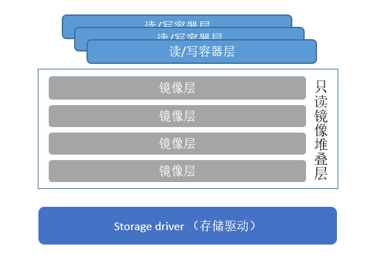
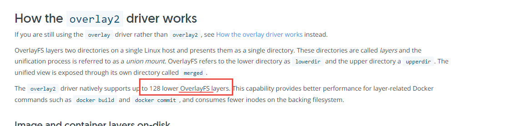
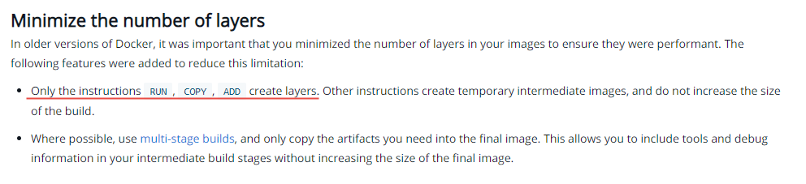
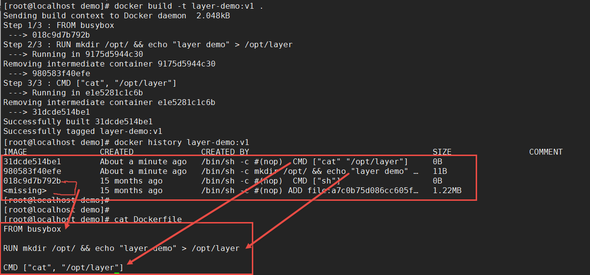
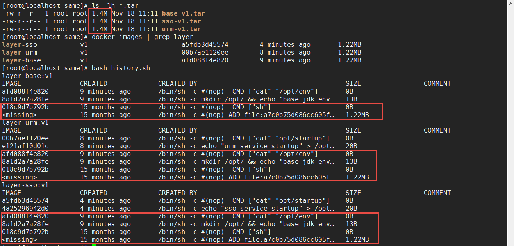
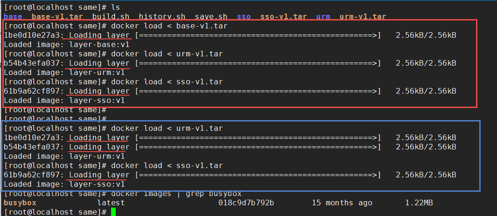
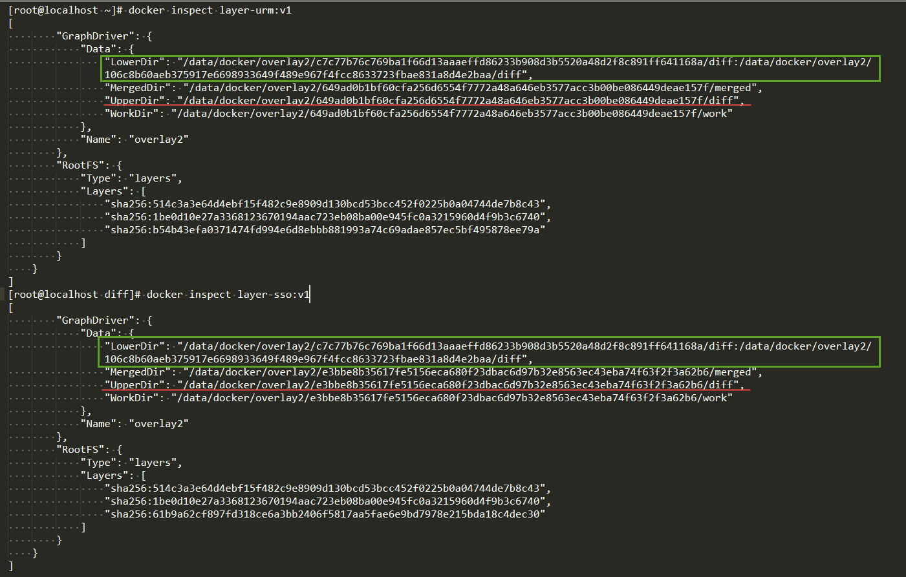
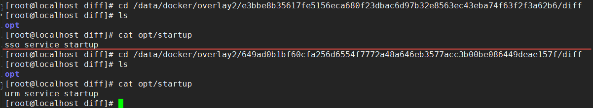

# docker分层机制

参考文档：[Dockerfile 最佳实践](https://docs.docker.com/develop/develop-images/dockerfile_best-practices/) ，[了解存储驱动（storage drivers)](https://docs.docker.com/storage/storagedriver/)，[OverlayFs 存储驱动 (storage drivers)](https://docs.docker.com/storage/storagedriver/overlayfs-driver/)

### 关于镜像、容器和层的一些重要概念

大体的 docker 运行架构



1. docker 的镜像层、可写容器层的内容是由底层的存储驱动管理的。所有存储驱动（`overlay2` docker 推荐使用）都使用可堆叠的图像层和写时复制 (copy-on-write CoW) 策略。
   - 堆叠镜像的存储驱动支持 (OverlayFS -  `overlay2`)
   - copy-on-write (CoW) 写时复制策略
2. 镜像层：`Dockerfile` 中的一条指令就会生成一镜像层。但是仅有 `RUN`，`COPY`，`ADD` 指令会生成 `overlay2` 镜像文件层，别的命令只会产生临时镜像修改镜像元数据。澄清一个误区，了解 docker 分层镜像时都会说镜像层级时会有限制的，目前最大支持 128 层。其实这里的 128 层是指 overlayFS 文件系统的层数，也就是最后的 Dockerfile 构建的镜像  `RUN`，`COPY`，`ADD`  最多仅能用 128 次。   
4. 镜像/容器区分：容器也是一层镜像，只是可写的镜像。容器下面的镜像是只读的。

#### 小结构建镜像时需要注意的点：

- Dockerfile 中的一条指令就会创建一镜像层，但是只有 `RUN`，`COPY`，`ADD` 会创建 `overlayFS` （堆叠/覆盖文件系统）层。所以普通镜像层可以有多层，但是带创建了文件的镜像层仅能在 128 之内，也就是  `RUN`，`COPY`，`ADD` 在构建镜像时仅能用 128 次内。**仅有  `RUN`，`COPY`，`ADD`  指令会增加镜像的大小**

- 文件系统层级尽可能的小

- 使用多阶段构建

- 利用构建缓存，同时要注意 **缓存问题** 

  - ```dockerfile
    FROM ubuntu:18.04
    RUN apt-get update
    RUN apt-get install -y curl
    
    FROM ubuntu:18.04
    RUN apt-get update (利用上面缓存镜像，这里不再执行)
    RUN apt-get install -y curl nginx （由于没有 update，这安装的软件版本可能不是最新的）
    ```

- 删除不用的文件，精简安装，删除构建产生的无效缓存
- 不安装没有必要的包


### Docker 镜像和层



镜像和层示例：

基础镜像，构建基础服务所需环境

```dockerfile
FROM busybox
RUN mkdir /opt/ && echo "base jdk env" > /opt/env
CMD ["cat", "/opt/env"]
```

```bash
docker build -t layer-base:v1 .
```

服务镜像，基于基础环境镜像

```dockerfile
# 模仿 urm 服务
FROM layer-base:v1
RUN echo "urm service startup" > /opt/startup
CMD ["cat", "opt/startup"]

# 模仿 sso 服务
FROM layer-base:v1
RUN echo "sso service startup" > /opt/startup
CMD ["cat", "opt/startup"]
```

构建服务镜像

```bash
# 构建 urm 镜像
docker build -t layer-urm:v1 .
# 构建 sso 镜像
docker build -t layer-sso:v1 .
```

构建完成后完整的镜像信息



导入镜像的展示信息



<font color="red">注意：</font>上面导入镜像时的提示，**Loading layer** （导入层）。思考**镜像和层**的关系。



当前 layer-urm:v1，layer-sso:v1 镜像对应的 overlay 文件



从上面可知，基于同一个基础镜像 layer-base:v1 构建的服务镜像对应的实际文件底层镜像文件都是一样的，仅当前层的文件变了。所以依赖的底层镜像文件仅会导入一次，下次还需要就会直接使用原有的镜像文件，不会再次导入。