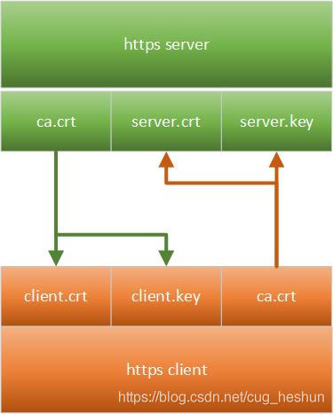

[参考文档（为什么 HTTPS 需要 7 次握手以及 9 倍时延）](https://draveness.me/whys-the-design-https-latency/)

## openssl 问题

### 问题一

openssl: error while loading shared libraries: libcrypto.so.1.1: cannot open shared object file: No such file or directory

```bash
echo "/usr/local/lib64/" >> /etc/ld.so.conf
ldconfig
```

## 证书

### 安全协议 [SSL/TLS]

SSL (Secure Sockets Layer 安全套接字协议)，及其继任者传输层安全（Transport Layer Security，TLS）是为网络通信提供安全及数据完整性的一种安全协议。TLS 与 SSL 在传输层与应用层之间对网络连接进行加密。

Secure Socket Layer，为 Netscape 所研发，用以保障在 Internet 上数据传输的安全，利用数据加密(Encryption)技术，可确保数据在网络上的传输过程中不会被截取及窃听。

SSL 协议位于 TCP/IP 协议与各种应用层协议之间，为数据通讯提供安全支持。

SSL 协议可分为两层：

1. SSL 记录协议（SSL Record Protocol）：它建立在可靠的传输协议（如 TCP）之上，为高层协议提供数据封装、压缩、加密等基本功能的支持。

2. SSL握手协议（SSL Handshake Protocol）：它建立在 SSL 记录协议之上，用于在实际的数据传输开始前，通讯双方进行身份认证、协商加密算法、交换加密密钥等。

术语：
* `CA` (Certification Authority、Certifying Authority) : 认证机构
* `HTTPS`（Hypertext Transfer Protocol Secure）：安全超文本传输协议
* `PKC` (Public-Key Certificate) ：公钥证书，也简称为证书（certificate）


Typically, x.509 certificates can have a [variety of file extension types that you can convert certificates and keys to](https://medium.com/@nirmaluchoudhari/converting-certificates-using-openssl-9957a743c66b), including:

- Certificate (.CRT) or (.CER)
- Distinguished encoding rules (.DER)
- Privacy-enhanced electronic mail (.PEM)

#### OpenSSL: Convert CRT to PEM:

Type the following code into your OpenSSL client:

```bash
openssl x509 -in cert.crt -out cert.pem

# Convert PEM to CRT (.CRT file)
openssl x509 -in certificate.pem -out certificate.crt
```

#### OpenSSL: Convert CER to PEM

```bash
openssl x509 -in cert.cer -out cert.pem
```

#### OpenSSL: Convert DER to PEM

```bash
openssl x509 -in cert.der -out cert.pem
openssl x509 -inform der -in certificate.cer -out certificate.pem

# Convert a PEM file to DER
openssl x509 -outform der -in certificate.pem -out certificate.der
```

#### Convert a PKCS#12 file (.pfx .p12) containing a private key and certificates to PEM

```bash
openssl pkcs12 -in keyStore.pfx -out keyStore.pem -nodes

# Convert a PEM certificate file and a private key to PKCS#12 (.pfx .p12)
openssl pkcs12 -export -out certificate.pfx -inkey privateKey.key -in certificate.crt -certfile CACert.crt
```


## 证书签发

参考文档 [证书双向认证](https://blog.csdn.net/cug_heshun2013/article/details/90735278) [ssl证书CA双向认证完整实现步骤](https://blog.csdn.net/hd243608836/article/details/118706090)

所谓证书双向认证是指：



- 服务端使用`ca.crt`校验客户端的`client.crt`和`client.key`
- 客户端使用`ca.crt`校验服务端的`server.crt`和`server.key`

### 生成 CA 根证书

生成 CA 密钥对   --->  生成根证书签发申请  ---> 根证书签发

```bash
# 1. 生成 CA 密钥对
# openssl genrsa -out file.pem 2048[4096] RSA
openssl genrsa -out ca/ca-key.pem 2048 RSA

# 2. 生成根证书的签发申请
# 证书访问的时候必须以域名的形式出现
# -subj "/C=CN/ST=BJ/L=BJ/O=HD/OU=dev/CN=ca/emailAddress=ca@world.com"
openssl req -new -key ca/ca-key.pem -out ca/ca-cert.csr -subj "/C=CN/ST=Shanghai/L=Shanghai/CN=localhost"

# 3. 生成根证书签发申请 (自签证书)
openssl x509 -req -days 3650 -sha1 -extensions v3_ca -signkey ca/ca-key.pem -in ca/ca-cert.csr -CAcreateserial -out ca/ca.cer

#转换证书格式 
openssl pkcs12 -export -clcerts -in ca/ca.cer -inkey ca/ca-key.pem -out ca/ca.p12

#查看证书
openssl x509 -in ca.crt -text -noout
```

###  生成服务端证书

CA 根证书   --->  生成服务器私钥 ---> 服务器证书签发申请  ---> 服务器证书签发

```bash
# 1. 生成要私钥
openssl genrsa -aes256 -out server/server-key.pem 2048

# 2. 生成服务端证书签发申请
openssl req -new -key server/server-key.pem -out server/server.csr -subj "/C=CN/ST=Shanghai/L=Shanghai/CN=localhost"

# 3. 生成服务端签发申请
openssl x509 -req -days 3560 -sha1 -extensions v3_req -CA ca/ca.cer -CAkey ca/ca-key.pem -CAserial server/ca.srl -CAcreateserial -in server/server.csr -out server/server.cer

# 4. 转换证书格式
openssl pkcs12 -export -clcerts -in server/server.cer -inkey server/server-key.pem -out server/server.p12
```

###  客户端证书

服务端根证书 ---> 生成客户端私钥 ---> 生成客户端签发申请 ---> 客户端证书签发

```bash
# 1. 生成客户端私钥
openssl genrsa -aes256 -out client/client-key.pem 2048

# 2. 生成客户端签发申请
openssl req -new -key client/client-key.pem -out client/client.csr -subj "/C=CN/ST=Shanghai/L=Shanghai/CN=localhost"

# 3. 客户端证书签发
# 该证书仅针对 drill.com 有效
openssl x509 -req -days 3650 -sha1 -extensions v3_req -CA ca/ca.cer -CAkey ca/ca-key.pem -CAserial server/ca.srl -in client/client.csr -out client/client.cer

# 转换证书格式
openssl pkcs12 -export -clcerts -in client/client.cer -inkey client/client-key.pem -out client/client.p12
```

### JAVA 证书

上面生成的证书目前在 JAVA 环境下还不能使用，需与转换为 "PKCS#12" 编码格式密钥文件才可以被 JAVA 的 keytool 工具管理。

```bash
# 1. 生成客户端证书
# 客户端证书随后是要发给浏览器
openssl pkcs12 -export -clcerts -name cas-client -inkey /root/cas/client/client-key.pem -in /root/cas/client/client.cer -out /root/cas/tomcat/client.p12

# 2. 生成服务端证书
# 主要有 tomcat 服务器使用
openssl pkcs12 -export -clcerts -name cas-server -inkey /root/cas/server/serverkey.pem -in /root/cas/server/server.cer -out /root/cas/tomcat/server.p12

# 3. 导入信任证书
# 将现在生成的服务器端证书导入到本机的受信任证书当中
# JDK 表示当前使用的证书得到了认可
keytool -importcert -trustcacerts -alias drill.cn -file /root/cas/ca/ca.cer -keystore /root/cas/tomcat/ca-trust.p12

# 4. 查看证书信息
keytool -list -keystore /root/cas/tomcat/client.p12 -storetype pkcs12 -v
```

生成 JKS 文件

```bash
keytool -keystore truststore.jks -keypass 123456 -storepass 123456 -alias ca -import -trustcacerts -file ca.cer
```

## tomcat 使用证书

tomcat 配置文件 `conf/server.xml`

### tomcat 单向认证

> 单向认证：只是在服务端提供一个公共的证书，所有的客户端连接之后都可以获得此公钥。
> 加密后，服务端可以利用私钥进行解密。

```
 <Connector port="443" protocol="HTTP/1.1"
        maxThreads="150" SSLEnabled="true" 
        schema="https" secure="true" clientAuth="false" sslProtocol="TLS"
        keystoreFile="/root/cas/tomcat/server.p12"
        keystoreType="pkcs12" keystorePass="luckluck" \>
```

### tomcat 双向认证

```
 <Connector port="443" protocol="HTTP/1.1"
        maxThreads="150" SSLEnabled="true" 
        schema="https" secure="true" clientAuth="true" sslProtocol="TLS"
        keystoreFile="/root/cas/tomcat/server.p12"
        keystoreType="pkcs12" keystorePass="luckluck"
        truststoreFile="/root/cas/tomcat/ca-trust.p12"
        truststoreType="jks"
        truststorePass="luckluck"/>
```

## 证书签发脚本

### ca.sh

```bash
# ca
#!/bin/bash

# Create directory hierarchy. 创建目录结构
mkdir -p ca
rm -f ca/*

# 生成 RSA 密钥对
CA_KEY_PATH=./ca/ca.key
CA_CSR_PATH=./ca/ca.csr
CA_CER_PATH=./ca/ca.cer

openssl genrsa -des3 -out ${CA_KEY_PATH} 2048
#  -subj "/C=CN/ST=Shanghai/L=Shanghai/O=default/OU=default/CN=ca.luck.com/emailAddress=ca@luck.com" 
openssl req -new -key ${CA_KEY_PATH} -out ${CA_CSR_PATH}
openssl x509 -req -days 3650 -signkey ${CA_KEY_PATH} -in ${CA_CSR_PATH} -CAcreateserial -out ${CA_CER_PATH}

```

### server.sh

```bash
#!/bin/bash

mkdir server
rm -f server/*

# 签发服务器证书
CA_KEY_PATH=./ca/ca.key
CA_CER_PATH=./ca/ca.cer
SERVER_KEY_PATH=./server/server.key
SERVER_CSR_PATH=./server/server.csr
SERVER_SRL_PATH=./server/server.srl
SERVER_CER_PATH=./server/server.cer
SERVER_P12_PATH=./server/server.p12
SERVER_EXT_PATH=./server/server.ext

# 解决 chrome 不安全
cat <<EOF > ${SERVER_EXT_PATH}
[SAN]
authorityKeyIdentifier = keyid,issuer
basicConstraints = CA:FALSE
keyUsage = digitalSignature, nonRepudiation, keyEncipherment, dataEncipherment
subjectAltName = @subj_alt_names

[subj_alt_names]
DNS.1 = *.luck.com
DNS.2 = ssl.luck.com
EOF

openssl genrsa -out ${SERVER_KEY_PATH} 2048 RSA
# -subj '/C=CN/ST=Shanghai/L=Shanghai/O=luck/OU=luck/CN=ssl.luck.com/emailAddress=ssl@luck.com'
openssl req -new -key ${SERVER_KEY_PATH} -out ${SERVER_CSR_PATH}
openssl x509 -req -sha256 -extfile ${SERVER_EXT_PATH} -extensions SAN -days 3560 -CA ${CA_CER_PATH} -CAkey ${CA_KEY_PATH} -CAserial ${SERVER_SRL_PATH} -CAcreateserial -in ${SERVER_CSR_PATH} -out ${SERVER_CER_PATH}
openssl pkcs12 -export -clcerts -in ${SERVER_CER_PATH} -inkey ${SERVER_KEY_PATH} -out ${SERVER_P12_PATH}

```

### client.sh

```bash
#!/bin/bash

mkdir client
rm -f client/*

# 签发client证书
CA_KEY_PATH=./ca/ca.key
CA_CER_PATH=./ca/ca.cer
CLIENT_KEY_PATH=./client/client.key
CLIENT_CSR_PATH=./client/client.csr
CLIENT_SRL_PATH=./server/server.srl
CLIENT_CER_PATH=./client/client.cer
CLIENT_P12_PATH=./client/client.p12

openssl genrsa -aes256 -out ${CLIENT_KEY_PATH} 2048
# -subj '/C=CN/ST=Shanghai/L=Shanghai/O=Default Company Ltd/CN=ss.luck.com/emailAddress=ssl@luck.com'
openssl req -new -key ${CLIENT_KEY_PATH} -out ${CLIENT_CSR_PATH}
openssl x509 -req -days 3650 -CA ${CA_CER_PATH} -CAkey ${CA_KEY_PATH} -CAserial ${CLIENT_SRL_PATH} -in ${CLIENT_CSR_PATH} -out ${CLIENT_CER_PATH}
openssl pkcs12 -export -clcerts -in ${CLIENT_CER_PATH} -inkey ${CLIENT_KEY_PATH} -out ${CLIENT_P12_PATH}

```

### 完整脚本

```bash
#!/bin/bash

# Create directory hierarchy. 创建目录结构
echo "create ca certificate"
mkdir -p ca
rm -f ca/*

# 生成 RSA 密钥对
CA_KEY_PATH=./ca/ca.key
CA_CSR_PATH=./ca/ca.csr
CA_CER_PATH=./ca/ca.cer

openssl genrsa -des3 -out ${CA_KEY_PATH} 2048
openssl req -new -key ${CA_KEY_PATH} -out ${CA_CSR_PATH} -subj "/C=CN/ST=Shanghai/L=Shanghai/O=default/OU=default/CN=ca.luck.com/emailAddress=ca@luck.com"
openssl x509 -req -sha256 -days 3650 -signkey ${CA_KEY_PATH} -in ${CA_CSR_PATH} -CAcreateserial -out ${CA_CER_PATH}

echo "create server certificate"
mkdir server
rm -f server/*

# 签发服务器证书
SERVER_KEY_PATH=./server/server.key
SERVER_CSR_PATH=./server/server.csr
SERVER_SRL_PATH=./server/server.srl
SERVER_CER_PATH=./server/server.cer
SERVER_P12_PATH=./server/server.p12
SERVER_EXT_PATH=./server/server.ext

# 解决 chrome 不安全
cat <<EOF > ${SERVER_EXT_PATH}
[SAN]
authorityKeyIdentifier = keyid,issuer
basicConstraints = CA:FALSE
keyUsage = digitalSignature, nonRepudiation, keyEncipherment, dataEncipherment
subjectAltName = @subj_alt_names

[subj_alt_names]
DNS.1 = *.luck.com
DNS.2 = ssl.luck.com
EOF

openssl genrsa -out ${SERVER_KEY_PATH} 2048 RSA
# -subj '/C=CN/ST=Shanghai/L=Shanghai/O=luck/OU=luck/CN=ssl.luck.com/emailAddress=ssl@luck.com'
openssl req -new -key ${SERVER_KEY_PATH} -out ${SERVER_CSR_PATH} -subj "/C=CN/ST=Shanghai/L=Shanghai/O=luck/OU=luck/CN=ssl.luck.com/emailAddress=ssl@luck.com"
openssl x509 -req -sha256 -extfile ${SERVER_EXT_PATH} -extensions SAN -days 3560 -CA ${CA_CER_PATH} -CAkey ${CA_KEY_PATH} -CAserial ${SERVER_SRL_PATH} -CAcreateserial -in ${SERVER_CSR_PATH} -out ${SERVER_CER_PATH}
openssl pkcs12 -export -clcerts -in ${SERVER_CER_PATH} -inkey ${SERVER_KEY_PATH} -out ${SERVER_P12_PATH}


echo "create client certificate"
mkdir client
rm -f client/*

# 签发client证书
CLIENT_KEY_PATH=./client/client.key
CLIENT_CSR_PATH=./client/client.csr
CLIENT_SRL_PATH=${SERVER_SRL_PATH}
CLIENT_CER_PATH=./client/client.cer
CLIENT_P12_PATH=./client/client.p12

openssl genrsa -aes256 -out ${CLIENT_KEY_PATH} 2048
# -subj '/C=CN/ST=Shanghai/L=Shanghai/O=Default Company Ltd/CN=ss.luck.com/emailAddress=ssl@luck.com'
openssl req -new -key ${CLIENT_KEY_PATH} -out ${CLIENT_CSR_PATH} -subj "/C=CN/ST=Shanghai/L=Shanghai/O=luck/OU=luck/CN=ss.luck.com/emailAddress=ssl@luck.com"
openssl x509 -req -sha256 -days 3650 -CA ${CA_CER_PATH} -CAkey ${CA_KEY_PATH} -CAserial ${CLIENT_SRL_PATH} -in ${CLIENT_CSR_PATH} -out ${CLIENT_CER_PATH}
openssl pkcs12 -export -clcerts -in ${CLIENT_CER_PATH} -inkey ${CLIENT_KEY_PATH} -out ${CLIENT_P12_PATH}

```

## java https 客户端

```bash
keytool -keystore ca.truststore -keypass 123456 -storepass 123456 -alias LuckCA -import -trustcacerts -file ca.cer
```

```java
public class HttpsClientCall {

    /**
     * 客户端证书路径，用了本地绝对路径，需要修改
     */
    private static final String CLIENT_CERT_FILE = "C:\\Users\\intel\\Desktop\\ssl2\\client\\client.p12";
    /**
     * 客户端证书密码
     */
    private static final String CLIENT_PWD = "123456";
    /**
     * 信任库路径，即 keytool 生成的那个自定义名称的库文件
     */
    private static final String TRUST_STORE_FILE = "C:\\Users\\intel\\Desktop\\ssl2\\ca\\ca.truststore";
    /**
     * 信任库密码，即 keytool 时的密码
     */
    private static final String TRUST_STORE_PWD = "123456";


    private static KeyStore loadKeyStore(String keyStorePath, String password, String type)
            throws KeyStoreException, IOException, CertificateException, NoSuchAlgorithmException {
        KeyStore ks = KeyStore.getInstance(type);
        try (FileInputStream is = new FileInputStream(keyStorePath)) {
            ks.load(is, password.toCharArray());
        }
        return ks;
    }

    private static String readResponseBody(InputStream inputStream) throws IOException {
        StringBuilder sb = new StringBuilder(128);
        try (BufferedReader br = new BufferedReader(new InputStreamReader(inputStream, StandardCharsets.UTF_8))) {
            String line;
            while ((line = br.readLine()) != null) {
                sb.append(line).append(System.lineSeparator());
            }
        }
        return sb.toString();
    }

    public static void httpsCall()
            throws NoSuchAlgorithmException, CertificateException, KeyStoreException,
            IOException, UnrecoverableKeyException, KeyManagementException {
        // 初始化密钥库
        KeyManagerFactory keyManagerFactory = KeyManagerFactory.getInstance("SunX509");
        KeyStore keyStore = loadKeyStore(CLIENT_CERT_FILE, CLIENT_PWD, "PKCS12");
        keyManagerFactory.init(keyStore, CLIENT_PWD.toCharArray());

        // 初始化信任库
        TrustManagerFactory trustManagerFactory = TrustManagerFactory.getInstance("SunX509");
        KeyStore trustKeyStore = loadKeyStore(TRUST_STORE_FILE, TRUST_STORE_PWD, "JKS");
        trustManagerFactory.init(trustKeyStore);

        // 初始化SSL上下文
        SSLContext ctx = SSLContext.getInstance("TLSv1.2");
        ctx.init(keyManagerFactory.getKeyManagers(), trustManagerFactory.getTrustManagers(), null);
        SSLSocketFactory sslSocketFactory = ctx.getSocketFactory();

        HttpsURLConnection.setDefaultSSLSocketFactory(sslSocketFactory);

        URL urlObj = new URL("https://ssl.luck.com");
        HttpsURLConnection con = (HttpsURLConnection) urlObj.openConnection();
        con.setRequestProperty("User-Agent", "Mozilla/5.0 (Windows NT 10.0; Win64; x64) AppleWebKit/537.36 (KHTML, like Gecko) Chrome/103.0.0.0 Safari/537.36");
        con.setRequestProperty("Accept-Language", "zh-CN;en-US,en;q=0.5");
        con.setRequestMethod("GET");
        String res = readResponseBody(con.getInputStream());

        System.out.println(res);
    }

    public static void main(String[] args) throws UnrecoverableKeyException, CertificateException, NoSuchAlgorithmException, KeyStoreException, IOException, KeyManagementException {
        httpsCall();
    }

}
```

