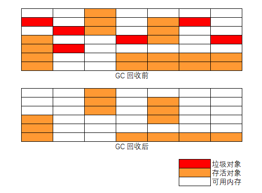
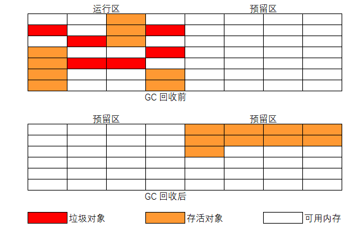
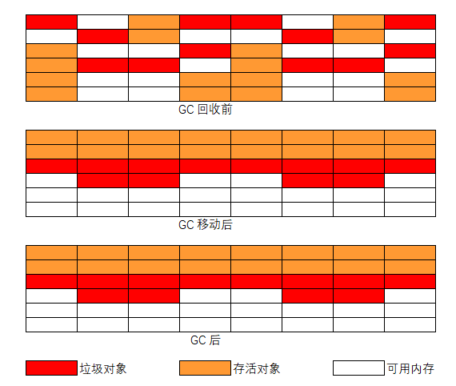
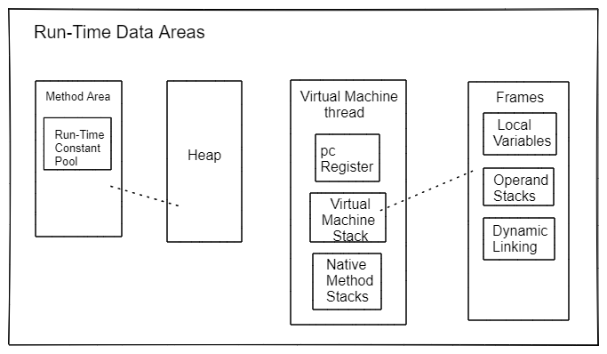
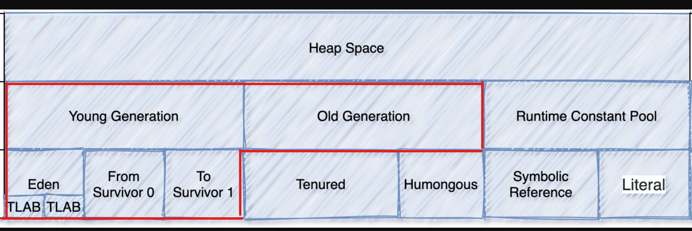

# 概述

## 什么是垃圾收集器 (Garbage Collector - GC)

参考 [javase 11 垃圾收集器调优文档](https://docs.oracle.com/en/java/javase/11/gctuning/introduction-garbage-collection-tuning.html) ，参考 [javase 8 垃圾收集器调优文档](https://docs.oracle.com/javase/8/docs/technotes/guides/vm/gctuning/introduction.html#sthref3)

垃圾收集器 (GC) 自动管理应用程序的动态内存分配请求。

垃圾收集器通过以下操作执行自动动态内存管理：

- 从操作系统分配和归还内存
- 在应用程序请求内存时将该内存分配给应用程序
- 确定该内存的哪些部分仍在由应用程序使用
- 回收未使用的内存让应用程序重用

*Java HotSpot* 垃圾收集器采用各种技术来提高这些操作的效率：

- 将分代清除与对象年龄结合使用，将精力集中在最有可能包含大量可回收内存的堆区域上
- 使用多个线程积极让操作并行化，或者在后台和应用程序并发的执行一些需要长时间运行的操作
- 尝试通过压缩存活的对象来恢复更大的连续空闲内存


# 判断对象是否存活算法

对于垃圾回收来说，判断并标识对象是否可回收是第一步，也就是如何判断对象是否存活，目前一般有两种方法：

- 引用计数法（Reference Counting）
- 可达性分析法 （GC Roots Tracing）

## 引用计数 (Reference counting)

引用计数是一种较古老的垃圾回收算法（垃圾收集器的早期实现）。原理是每个对象默认保存一个引用计数器，当此对象被引用时引用计数器加 1，相反，引用销毁时计数减 1，当计数器为 0 时，那么表示此对象没有被使用，当做垃圾被垃圾收集器回收。

引用计数器虽然实现简单，垃圾回收相对比较及时，但是存在对象的循环引用问题， 容错能力较差，若是算错就无法纠正。

## 可达性分析算法

可达性分析算法 (Reachability Analysis) 也叫根追踪算法 (Roots Tracing)，是目前最常用的垃圾收集算法，从对象的引用路径起点 (GC Roots) 开始搜索，若是对象在 GC Roots 引用链上没有与任何引用相连，此对象到 GC Roots 不可达，可以作为垃圾被垃圾回收器回收。

> 从根 (Roots) 直接可达的存活对象，Roots 包含应用程序线程堆栈和寄存器、静态对象等的对象引用，从堆 (Heap) 的其它地方 （如： 年轻代区域）

虽然可达性分析理论上很好理解，但是在实际的程序运行时，情况会变得更加的复杂，需要考虑的问题也会变难。因为在可达性分析的同时运行着的程序内存是一直在动态变的，会有一边分析一边又产生新的对象或修改原有分析对象等的情况。

### 对象三色标记

在可达性分析算法从 *GC Roots* 根往下搜索的时候，对象会存在三种状态，分别用三种颜色表示：

- 白：对象没有被标记到，搜索标记结束后会被当作垃圾回收掉
- 灰：对象被标记了，但是所在对象的属性字段还没有被标记，或者没有判断、标记完全
- 黑：对象被标记了，且它的所有内部属性字段也被标记完成

由于标记时运行程序和标记程序并发执行，就可能存在突变对象 (Mutator) ，当引用线程和 Garbage Collector 线程同时对对象进行修改，就会出现对象漏标的情况。

# 垃圾回收算法

当确定完对象是否存活（是否在被使用）的状态之后，就可以对死亡（不在使用）的对象垃圾内存进行回收。如何高效、正确的收集标识的可回收对象内存空间由垃圾回收算法解决：

- 标记-清除算法
- 标记-复制算法
- 标记-整理算法

## 标记-清除算法 (Mark-Sweep)

可以理解为有两个阶段： 1. 首先标记出所有需要回收的垃圾对象 2. 对标记的对象占用的内存空间进行释放。



算法缺点：

- 标记/清除的效率不高（对比复制算法），在标记/清除的过程中，会扫描整个堆内存，比较耗时
- 垃圾对象清理后，导致内存空间不连续，产生大量的小内存空间垃圾碎片，当有大量对象需要分配内存时，找不到满足的内存空间，触发下次垃圾收集（内存碎片问题）

## 标记-复制算法 (Mark-Copying)

针对上面**标记-清除**算法的执行效率和内存碎片缺点，提出的标记-复制算法。

标记复制算法把内存空间分成大小相同的两个区域（运行区、预留区）。所有创建的对象都放到运行区，当运行区内存不够时，将运行区收集/标记后的存活对象全部复制到预留区，然后清空整个运行区，在把预留区和运行区对换。垃圾就在两个区域变换时被清除，同时没有了内存碎片产生。



标记-复制算法在大量垃圾对象的情况时，只需复制少量的存活对象且不会产生内存碎片问题，新的对象内存分配只需移动堆的指针在顺序分配就好，兼容效率和内存碎片问题。

算法缺点：

- 内存被划分为两个区域，一半的预留区域没有使用，造成空间浪费（空间利用率低）
- 当内存中存活对象占多数时，需要复制大量的存活对象，才能释放少量的空间（效率低）

## 标记-整理算法  (Mark-Compact)

标记-复制算法要浪费一半内存空间，且在大多数对象都是存活状态时垃圾收集效率会很低，为了克服这个问题，又提出了标记整理算法。

标记-整理算法的标记阶段和上面的算法一致，在整理阶段不是进行直接清理，而是令所有存活的对象向内存的一端空间移动，然后直接清理掉存活对象边界以外的内存空间。



标记-整理算法解决了内存碎片问题，也不存在空间的浪费问题。

算法缺点：

- 标记和清除效率都不高，这种方式在标记和整理移动的过程中也是耗时的
- 当内存中大多是存活小对象，而垃圾对象少时，需要移动大量的存活对象才能换取少量的内存空间

# Java 内存布局

参考 [JavaSE 1.8 JVM 规范说明文档 - JVM 结构](https://docs.oracle.com/javase/specs/jvms/se8/html/jvms-2.html)，参考 [JavaSE 11 JVM 规范说明文档 - JVM 结构](https://docs.oracle.com/javase/specs/jvms/se11/html/jvms-2.html)

JVM 内存布局



JVM 堆内存布局，此处仅需关注红框部分区域内存，GC 也是在这内存区域执行。




# 标准版 HotSpot 虚拟机垃圾回收

*Standard Edition HotSpot Virtual Machine Garbage Collection*

参考 [JavaSE 11 HotSpot 虚拟机垃圾回收调优文档](https://docs.oracle.com/en/java/javase/11/gctuning/introduction-garbage-collection-tuning.html) ， 参考 [JavaSE 1.8 HotSpot 虚拟机垃圾回收调优文档](https://docs.oracle.com/javase/8/docs/technotes/guides/vm/gctuning/)

主流虚拟机（Hotspot VM）的垃圾回收都采用分代回收 (generational scavenging) 的算法。

“分代回收” 是基于对象的生命周期不同，所以针对不同生命周期的对象可以采取不同的回收方式，以便提高垃圾回收效率。

Hotspot VM 将内存划分为不同的物理区，就是“分代”思想的体现。JVM 内存主要由新生代、老年代、永久代构成 （JDK1.8 变为了 MetaSpace）。

- 新生代的垃圾回收（又称 **Minor GC**）：其中很多对象的生命周期很短，垃圾回收后只有少量对象存活，所以选用复制算法，只需要少量的复制成本就可以完成回收。
- 老年代的垃圾回收（又称 **Major GC**）：区域中对象存活率高，通常使用 “标记-清理” 或 “标记-整理” 算法。
- 整堆包括新生代和老年代的垃圾回收称为 **Full GC**：（HotSpot VM 里，除了 CMS 之外，其它能收集老年代的 GC 都会同时收集整个 GC 堆，包括新生代）。

**注意：** 各分区的大小对 GC 的性能影响很大，如何将各分区调整到合适的大小，分析活跃数据的大小是很好的切入点。


## 性能注意事项

垃圾收集器性能有两个最为主要的衡量标准：

- *吞吐量 (Throughput)* 未花费在垃圾收集中的总时间占的百分比。吞吐量包括分配时间。
- *暂停时间 (Pauses Time)* 应用程序由于垃圾收集而出现无响应的时间。

- *足迹目标 (Footprint Goal)* 

## **HotSpot** 垃圾收集器分类

参考 [JaveSE 8 可用垃圾收集器文档](https://docs.oracle.com/javase/8/docs/technotes/guides/vm/gctuning/collectors.html)， 参考 [JavaSE 11 可用垃圾收集器文档](https://docs.oracle.com/en/java/javase/11/gctuning/available-collectors.html)

*Java HotSpot VM* 包含了三种不同类型的垃圾收集器，每种都有不同的性能特性。

### 串型收集器

串型收集器 (*Serial Collector*)  使用单线程执行所有的垃圾收集工作，使得它相对来说十分的高效，由于没有多线程交流的消耗。十分适合单核心处理器的机器，因为它不能利用多核处理器硬件。

显式启用参数：`-XX:+UseSerialGC`

### 并行收集器

并行收集器 (*Parallel Collector*) 也称为吞吐量收集器)，它是类似于串行收集器的分代收集器。与串型收集器最大的不同在于，并行收集器使用多线程用于加速垃圾收集，并行的执行 **minor** 收集，这可以显着减少垃圾收集开销。适用在多处理器或多线程的硬件。

显式使用参数：`-XX:+UseParallelGC`

并行压缩 （Compaction） 是一项使并行收集器能够并行执行 **major** 收集的功能。在没有并行压缩的情况下，major 收集使用单个线程执行，这会显著限制可扩展性 （scalability）。

并行压缩在使用并行收集器选项 `-XX:+UseParallelGC` 时默认开启，也可以禁用使用 `-XX:-UseParallelOldGC` 选项。

### 并发收集器

并发标记扫描 (Concurrent Mark Sweep - CMS) 收集器和 Garbage-First  (G1) 垃圾收集器是两个主要并发的收集器。大多数并发收集器处理一些消耗较大的工作同应用并发执行。

- CMS collector：此收集器倾向于更短的垃圾收集暂停时间的应用（响应时间比整体吞吐量更重要），可以和垃圾收集器共享处理器资源 。
  使用 CMS 收集器参数： `-XX:+UseConcMarkSweepGC`
  **注意：** 在 JDK 9 下 CMS 收集器已经被弃用了。
- G1 垃圾收集器：属于服务器类型的收集器，适用于具有大量内存的多处理器机器。高概率在满足垃圾收集暂停时间（pause-time）目标下，同时实现高的吞吐量。
  使用 G1 收集器参数：`-XX:+UseG1GC`

## 垃圾收集器说明

### 并行收集器

参考 [JavaSE 8 并行垃圾收集器](https://docs.oracle.com/javase/8/docs/technotes/guides/vm/gctuning/parallel.html)， 参数 [JavaSE 11 并行垃圾收集器](https://docs.oracle.com/en/java/javase/11/gctuning/parallel-collector1.htm)

使用并行垃圾收集器：`-XX:+UseParallelGC`

在执行 *major collections* 是默认开启了并行压缩特性的，关闭并行压缩参数 `-XX:-UseParallelOldGC`。

**注意：** 

- 当线程数（N）大于 8 时，使用大于 5/8 * N 的线程数执行，N 小于 8 时执行线程就是 N。
- 减少垃圾收集器线程的数量并增加老年代的大小将减少碎片效应。

常用调整参数：

- **`-XX:ParallelGCThreads=<N>`** 参数指定并行垃圾回收的线程数
- **`-XX:GCTimeRatio=19`** 调整吞吐量，= `1 / (1 + <N>)`，总的垃圾收集时间占运行时间的 1/20 或者 5%。默认是 99，即总垃圾收集时间占 1%。

### CMS 并发收集器

参考 [JavaSE 11 CMS 垃圾收集器](https://docs.oracle.com/en/java/javase/11/gctuning/concurrent-mark-sweep-cms-collector.html)， 参考 [JavaSE 8 CMS 垃圾收集器](https://docs.oracle.com/javase/8/docs/technotes/guides/vm/gctuning/cms.html)

启用参数：`-XX:+UseConcMarkSweepGC`

注意：在 JDK 9 及其以上，CMS 收集器已弃用，强烈考虑改用 G1 收集器。

在执行应用程序线程的同时 CMS 收集器尝试通过使用单独的垃圾收集器线程跟踪可达对象，从而减少由于 major 收集而导致的暂停时间。

在每次 major 收集周期中，CMS 收集器在收集开始时暂停所有应用程序线程一小段时间，然后在收集中间再次暂停。第二次停顿往往是两次停顿中较长的一个。多个线程在两个暂停期间执行收集工作。一个或多个垃圾收集器线程完成收集的其余部分工作 （包括大部分活动对象的追踪和无法到达的对象的清除）。

Minor 收集可以与正在进行的 major 循环交错，并且以类似于并行收集器的方式完成。（特别是应用程序线程在 minor 收集期间停止）

#### CMS 的 4 个主要阶段

1. **`Init-mark`** 初始标记 (STW) ：该阶段进行可达性分析，标记 *GC Roots* 能直接关联到的对象，所以很快。 
2. **`concurrent marking phase`** 并发标记：由前阶段标记过的对象出发，所有可到达的对象都在本阶段中标记。 
3. **`Remark`** 重标记 (STW) ：暂停所有用户线程，重新扫描堆中的对象，进行可达性分析，标记活着的对象。因为并发标记阶段是和用户线程并发执行的过程，所以该过程中可能有用户线程修改某些活跃对象的字段，指向了一个未标记过的对象，如对象在并发标记开始时不可达，但是并行期间引用发生变化，变为对象可达，这个阶段需要重新标记出此类对象，防止在下一阶段被清理掉，这个过程也是需要 STW 的。**特别需要注意一点，这个阶段是以新生代中对象为根来判断对象是否存活的。** Remark 阶段必须扫描整个堆来判断对象是否存活，包括不可达对象。**为了修正并发标记期间因用户程序继续运作而导致标记产生变动的那一部分对象的标记记录**。
4. 并发清理，进行并发的垃圾清理。

```
[121,834s][info][gc] GC(657) Pause Initial Mark 191M->191M(485M) (121,831s, 121,834s) 3,433ms
[121,835s][info][gc] GC(657) Concurrent Mark (121,835s)
[121,889s][info][gc] GC(657) Concurrent Mark (121,835s, 121,889s) 54,330ms
[121,889s][info][gc] GC(657) Concurrent Preclean (121,889s)
[121,892s][info][gc] GC(657) Concurrent Preclean (121,889s, 121,892s) 2,781ms
[121,892s][info][gc] GC(657) Concurrent Abortable Preclean (121,892s)
[121,949s][info][gc] GC(658) Pause Young (Allocation Failure) 324M->199M(485M) (121,929s, 121,949s) 19,705ms
[122,068s][info][gc] GC(659) Pause Young (Allocation Failure) 333M->200M(485M) (122,043s, 122,068s) 24,892ms
[122,075s][info][gc] GC(657) Concurrent Abortable Preclean (121,892s, 122,075s) 182,989ms
[122,087s][info][gc] GC(657) Pause Remark 209M->209M(485M) (122,076s, 122,087s) 11,373ms
[122,087s][info][gc] GC(657) Concurrent Sweep (122,087s)
[122,193s][info][gc] GC(660) Pause Young (Allocation Failure) 301M->165M(485M) (122,181s, 122,193s) 12,151ms
[122,254s][info][gc] GC(657) Concurrent Sweep (122,087s, 122,254s) 166,758ms
[122,254s][info][gc] GC(657) Concurrent Reset (122,254s)
[122,255s][info][gc] GC(657) Concurrent Reset (122,254s, 122,255s) 0,952ms
[122,297s][info][gc] GC(661) Pause Young (Allocation Failure) 259M->128M(485M) (122,291s, 122,297s) 5,797ms
```

```
5.524: [GC (Allocation Failure) 5.524: [ParNew: 184320K->20480K(184320K), 0.0504061 secs] 216512K->89431K(286720K), 0.0504676 secs] [Times: user=0.19 sys=0.03, real=0.05 secs] 
5.575: [GC (CMS Initial Mark) [1 CMS-initial-mark: 68951K(102400K)] 89431K(286720K), 0.0050690 secs] [Times: user=0.00 sys=0.00, real=0.01 secs] 
5.580: [CMS-concurrent-mark-start]
5.613: [CMS-concurrent-mark: 0.033/0.033 secs] [Times: user=0.08 sys=0.01, real=0.03 secs] 
5.613: [CMS-concurrent-preclean-start]
5.614: [CMS-concurrent-preclean: 0.001/0.001 secs] [Times: user=0.00 sys=0.00, real=0.00 secs] 
5.614: [CMS-concurrent-abortable-preclean-start]
5.839: [CMS-concurrent-abortable-preclean: 0.117/0.225 secs] [Times: user=0.66 sys=0.03, real=0.23 secs] 
5.839: [GC (CMS Final Remark) [YG occupancy: 87270 K (184320 K)]5.839: [Rescan (parallel) , 0.0132045 secs]5.853: [weak refs processing, 0.0002210 secs]5.853: [class unloading, 0.0025123 secs]5.855: [scrub symbol table, 0.0025834 secs]5.858: [scrub string table, 0.0003542 secs][1 CMS-remark: 68951K(102400K)] 156221K(286720K), 0.0195119 secs] [Times: user=0.03 sys=0.00, real=0.02 secs] 
5.869: [CMS-concurrent-sweep-start]
5.894: [CMS-concurrent-sweep: 0.025/0.025 secs] [Times: user=0.13 sys=0.00, real=0.03 secs] 
5.894: [CMS-concurrent-reset-start]
5.894: [CMS-concurrent-reset: 0.000/0.000 secs] [Times: user=0.00 sys=0.00, real=0.00 secs]
```

#### CMS 主要的 3 个问题：

1. 内存碎片（原因是采用了标记-清除算法）
2. 对 CPU 资源敏感（原因是并发时和用户线程一起抢占 CPU）
3. 浮动垃圾：在并发标记阶段产生了新垃圾不会被及时回收，而是只能等到下一次 GC

[浮动垃圾的产生](https://docs.oracle.com/javase/8/docs/technotes/guides/vm/gctuning/cms.html)：第二次暂停是在并发跟踪阶段结束时进行的，它查找由于 CMS 收集器完成对象的引用后，应用程序线程对对象中的引用进行更新而导致并发跟踪遗漏的对象。该第二暂停称为重新标记暂停。

#### 参数调优

参考 [Java中 9 种常见的 CMS GC 问题分析与解决](https://tech.meituan.com/2020/11/12/java-9-cms-gc.html)

- **`-XX:CMSFullGCsBeforeCompaction`** ：设置在执行多少次 *Full GC* 后对内存空间进行压缩整理，默认是 0 就可以。

- CMS 提供 **`CMSScavengeBeforeRemark`** 参数，用来保证 Remark 前强制进行一次 **Minor GC**。

- -XX:-UseParNewGC ：搭配 ParNew 收集器就是 Serial 的多线程版本，除了使用多收集线程外其余都与 Serial 收集器一摸一样。

- -XX:+UseCMSCompactAtFullCollection ： 在上一次 CMS 并发 GC 执行过后，还要执行多少次 full GC 才会做压缩，默认是 0

- -XX:CMSInitiatingOccupancyFraction=70 ： 设定 CMS 在内存占用率达到 70% 时开始 GC (因浮动垃圾，一般较早 GC)

```
-XX:+UseConcMarkSweepGC -XX:-UseParNewGC
-XX:+UseCMSCompactAtFullCollection
-XX:CMSInitiatingOccupancyFraction=70
-XX:+CMSParallelRemarkEnabled
-XX:SoftRefLRUPolicyMSPerMB=0
-XX:+CMSClassUnloadingEnabled
```

总结来说，**CMS** 的设计聚焦在获取最短的时延，为此它 “不遗余力” 地做了很多工作，包括尽量让应用程序和 GC 线程并发、增加可中断的并发预清理阶段、引入卡表等，虽然这些操作牺牲了一定吞吐量但获得了更短的回收停顿时间。

### G1 并发收集器

参考 [JavaSE 11 G1 垃圾收集器说明文档](https://docs.oracle.com/en/java/javase/11/gctuning/garbage-first-g1-garbage-collector1.html)， 参考 [JavaSE 8 G1 垃圾收集器说明文档](https://docs.oracle.com/javase/8/docs/technotes/guides/vm/gctuning/g1_gc.html)

G1 垃圾收集器主要是平衡响应时间和吞吐量之间的垃圾收集器，设计目标是取代 CMS 收集器。针对具有大内存的多处理器机器。它试图在实现高吞吐量的同时以高概率满足垃圾收集 (GC) 暂停时间目标。

开启参数：`-XX:+UseG1GC`

同 CMS 相比，在以下方面表现的更出色： 

- G1 是有整理内存过程的垃圾收集器，不会产生很多内存碎片。
- G1 的 Stop The World (STW) 更可控，G1 在停顿时间上添加了预测机制，用户可以指定期望停顿时间。

Garbage-First (G1) 垃圾收集器，高概率满足 GC 暂停时间目标，同时保持良好的吞吐量。

G1 提供了两种 GC 模式，**Young GC** 和 **Mixed GC**，两种都是完全 **Stop The World** 的。 

* Young GC：选定所有年轻代里的 Region，通过控制年轻代的 region 个数，即年轻代内存大小，来控制 young GC 的时间开销。
* Mixed GC：选定所有年轻代里的 Region，外加根据 global concurrent marking 统计得出收集收益高的若干老年代 Region，在用户指定的开销目标范围内尽可能选择收益高的老年代 Region。

由此可知，Mixed GC 不是 full GC，它只能回收部分老年代的 Region，如果 mixed GC 实在无法跟上程序分配内存的速度，导致老年代填满无法继续进行 Mixed GC，就会使用 serial old GC（full GC）来收集整个 GC heap，所以 **G1 是不提供 full GC 的**。

#### 新概念

在 G1 的实现过程中，引入了一些新的概念，对于实现高吞吐、没有内存碎片、收集时间可控等功能起到了关键作用：

- **Region** 

传统的GC收集器将连续的内存空间划分为新生代、老年代和永久代（JDK 8 去除了永久代，引入了元空间Metaspace），这种划分的特点是各代的存储地址（逻辑地址，下同）是连续的。

而 G1 的各代存储地址是不连续的，每一代都使用了 n 个不连续的大小相同的 Region，每个 Region 占有一块连续的虚拟内存地址。

**注意：** 一个 Region 的大小可以通过参数 **`-XX:G1HeapRegionSize`** 设定，取值范围从 1M 到 32M，且是 2 的指数。如果不设定，那么 G1 会根据 Heap 大小自动决定。

- **SATB**

全称是 Snapshot-At-The-Beginning，由字面理解，是 GC 开始时活着的对象的一个快照。

针对对多核处理器（multiprocessor）、大容量内存（RAM）的服务器。堆（heap）大小在 6GB 左右或者更大，GC 延迟要求有限（稳定且可预测的暂停时间低于 0.5 秒）。

| 参数                               | 含义                                                         |
| :--------------------------------- | :----------------------------------------------------------- |
| -XX:G1HeapRegionSize=n             | 设置 Region 大小，并非最终值                                 |
| -XX:MaxGCPauseMillis               | 设置 G1 收集过程目标时间，默认值 200ms，不是硬性条件         |
| -XX:G1NewSizePercent               | 新生代最小值，默认值 5%                                      |
| -XX:G1MaxNewSizePercent            | 新生代最大值，默认值 60%                                     |
| -XX:ParallelGCThreads              | STW 期间，并行 GC 线程数                                     |
| -XX:ConcGCThreads=n                | 并发标记阶段，并行执行的线程数                               |
| -XX:InitiatingHeapOccupancyPercent | 设置触发标记周期的 Java 堆占用率阈值。默认值是 45%。这里的 java 堆占比指的是 non_young_capacity_bytes，包括 old+humongous |

#### 参数调优

```
-XX:+UseG1GC
-XX:G1HeapRegionSize=16m
-XX:G1ReservePercent=25
-XX:InitiatingHeapOccupancyPercent=30
-XX:SoftRefLRUPolicyMSPerMB=0
```

# 常用收集器参数

## GC 使用参数

```bash
# 查看正在使用的 GC, JDK8 默认使用的是 -XX:+UseParallelGC 垃圾回收器
java -XX:+PrintCommandLineFlags -version
```

| **GC Algorithm**                                            | **JVM argument**        |
| :---------------------------------------------------------- | :---------------------- |
| Serial GC                                                   | -XX:+UseSerialGC        |
| Parallel GC [JDK 8 default GC Algorithm] 吞吐量             | -XX:+UseParallelGC      |
| Concurrent Mark & Sweep (CMS) GC  [JDK 9 开始弃用] 响应时间 | -XX:+UseConcMarkSweepGC |
| G1 GC [JDK 9 Default gc algorithm] 平衡吞吐量和响应时间     | -XX:+UseG1GC            |
| Z GC （ JDK 11+，性能极好）                                 | -XX:+UseZGC             |

## 开启 GC 日志

JDK 8 ：

```bash
-verbose:gc # 详细的堆大小信息
-Xloggc:gc_%p_%t.log # GC 日志输出文件路径
-XX:+PrintGCDetails # 打印 GC 详情
-XX:+PrintGCTimeStamps # 打印 GC 发生的时间戳

-XX:+PrintTenuringDistribution # 打印 GC 发生时的分代信息
-XX:+PrintGCApplicationStoppedTime # 打印 GC 停顿时长

-XX:+UseGCLogFileRotation -XX:NumberOfGCLogFiles=5 -XX:GCLogFileSize=30m
```

JDK 9 和以上：

```bash
# 普通日志
-Xlog:gc:<file-path>
# 详细日志
-Xlog:gc*:<file-path>

# 完整示例
-Xlog:gc*:file=dir/gc_%p_%t.log:time,tags:filecount=5,filesize=30M
```

## 堆内存分配参数

推荐内存空间大小设置：

**活跃数据的大小**是指，应用程序稳定运行时长期存活对象在堆中占用的空间大小，也就是 Full GC 后堆中老年代占用空间的大小。

| 空间   | 倍数                                    |
| :----- | :-------------------------------------- |
| 总大小 | **3-4** 倍活跃数据的大小                |
| 新生代 | **1-1.5** 活跃数据的大小                |
| 老年代 | **2-3** 倍活跃数据的大小                |
| 永久代 | **1.2-1.5** 倍Full GC后的永久代空间占用 |

```bash
-Xms1g -Xmx1g
-Xmn800m # 年轻代内存 (Eden + Survivor * 2)
-Xss256k # 线程堆栈大小

# young:tenured generation = 1:2, young = 1/3, default new = 1/3
-XX:NewRatio=2

# 不常用，默认 eden/a survivor = 1:8,每个幸存者空间将是伊甸园大小的八分之一
# eden = 8/(8 + 1 + 1) * young, default eden = 8/10 = [young * n/(n + 2)]
-XX:SurvivorRatio=8
# 元数据空间大小
-XX:MetaspaceSize=265M
-XX:MaxMetaspaceSize=256m
```

## 调优步骤

明确应用程序的系统需求是性能优化的基础，系统的需求是指应用程序运行时某方面的要求，譬如：

- 高可用，可用性达到几个 9。 
- 低延迟，请求必须多少毫秒内完成响应。 
- 高吞吐，每秒完成多少次事务。

明确系统需求之所以重要，是因为上述性能指标间可能冲突。比如通常情况下，缩小延迟的代价是降低吞吐量或者消耗更多的内存或者两者同时发生。

若是主要关注高可用和低延迟两项指标，如何量化 GC 时间和频率对于响应时间和可用性的影响。通过这个量化指标，可以计算出当前 GC 情况对服务的影响，也能评估出 GC 优化后对响应时间的收益，这两点对于低延迟服务很重要。

- 在相同的内存分配率的前提下，新生代中的 Eden 区增加一倍，**Minor GC** 的次数就会减少一半。
  - Minor GC 时间更多取决于 GC 后存活对象的数量，而非 Eden 区的大小
- 对象生命周期的分布情况
  - 如果应用存在大量的短期对象，应该选择较大的年轻代
  - 如果存在相对较多的持久对象，老年代应该适当增大


增大 young 区，存在疑问，对 GC 最直观的印象来说，增大 young 区，YGC 的时长也会迅速增大。

知道 YGC 的耗时是由 `GC 标记 + GC 复制` 组成的，相对于 GC 复制，GC 标记是非常快的。而 young 区内大多数对象的生命周期都非常短，如果将 young 区增大一倍，GC 标记的时长会提升一倍，但到 GC 发生时被标记的对象大部分已经死亡， GC 复制的时长肯定不会提升一倍，所以我们可以放心增大 young 区大小。

## GC 日志阅读

```bash
[GC (Allocation Failure) [PSYoungGen: 130663K->2368K(152576K)] 130663K->2384K(500736K), 0.0052368 secs] [Times: user=0.00 sys=0.00, real=0.00 secs]

5.617（时间戳）: 
[GC（Young GC） 5.617（时间戳）: 
[ParNew（GC的区域）: 
43296K（垃圾回收前的大小）->7006K（垃圾回收以后的大小）(47808K)（该区域总大小）, 
0.0136826 secs（回收时间）] 
44992K（堆区垃圾回收前的大小）->8702K（堆区垃圾回收后的大小）(252608K)（堆区总大小）,
 0.0137904 secs（回收时间）] 
[Times: user=0.03（GC用户耗时） sys=0.00（GC系统耗时）, real=0.02 secs（GC实际耗时）]
```

> `[DefNew`, `[Tenured`, `[Perm` 表示 GC 发生的区域，区域的名称与使用的 GC 收集器相关。
> *Serial* 收集器中新生代名为 *Default New Generation*，显示的名字为 `[DefNew`。
> *ParNew* 收集器，显示的是 `[ParNew`，表示 *Parallel New Generation*。 
> *Parallel Scavenge* 收集器，新生代名为 `[PSYoungGen`。

> `young` 区域就是新生代，存放新创建对象；
> `tenured` 是年老代，存放在新生代经历多次垃圾回收后仍存活的对象；
> `perm` 是永生代，存放类定义信息、元数据等信息。
