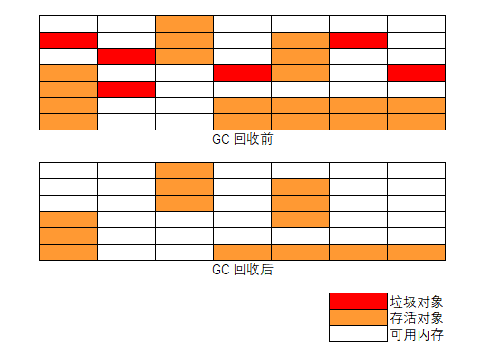
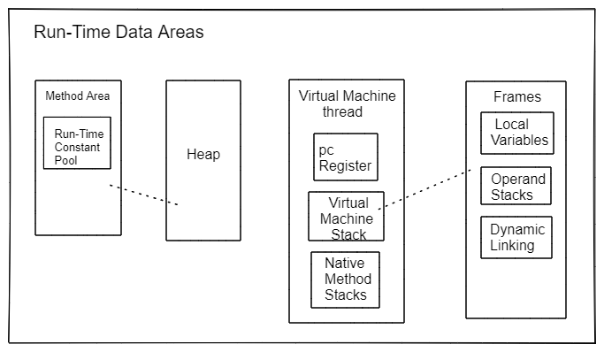
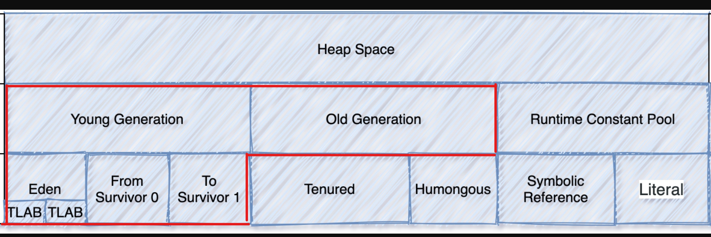

# 概述

## 什么是垃圾收集器 (Garbage Collector - GC)

参考 [javase 11 垃圾收集器调优文档](https://docs.oracle.com/en/java/javase/11/gctuning/introduction-garbage-collection-tuning.html) ，参考 [javase 8 垃圾收集器调优文档](https://docs.oracle.com/javase/8/docs/technotes/guides/vm/gctuning/introduction.html#sthref3)

垃圾收集器 (GC) 自动管理应用程序的动态内存分配请求。

垃圾收集器通过以下操作执行自动动态内存管理：

- 从操作系统分配和归还内存
- 在应用程序请求内存时将该内存分配给应用程序
- 确定该内存的哪些部分仍在由应用程序使用
- 回收未使用的内存让应用程序重用

*Java HotSpot* 垃圾收集器采用各种技术来提高这些操作的效率：

- 将分代清除与对象年龄结合使用，将精力集中在最有可能包含大量可回收内存的堆区域上
- 使用多个线程积极让操作并行化，或者在后台和应用程序并发的执行一些需要长时间运行的操作
- 尝试通过压缩存活的对象来恢复更大的连续空闲内存

# 判断对象是否存活算法

对于垃圾回收来说，判断并标识对象是否可回收是第一步，也就是如何判断对象是否存活，目前一般有两种方法：

- 引用计数法（Reference Counting）
- 可达性分析法 （GC Roots Tracing）

## 引用计数 (Reference counting)

引用计数是一种较古老的垃圾回收算法（垃圾收集器的早期实现）。原理是每个对象默认保存一个引用计数器，当此对象被引用时引用计数器加 1，相反，引用销毁时计数减 1，当计数器为 0 时，那么表示此对象没有被使用，当做垃圾被垃圾收集器回收。

引用计数器虽然实现简单，垃圾回收相对比较及时，但是存在对象的循环引用问题， 容错能力较差，若是算错就无法纠正。

## 可达性分析算法

可达性分析算法 (Reachability Analysis) 也叫根追踪算法 (Roots Tracing)，是目前最常用的垃圾收集算法，从对象的引用路径起点 (GC Roots) 开始搜索，若是对象在 GC Roots 引用链上没有与任何引用相连，此对象到 GC Roots 不可达，可以作为垃圾被垃圾回收器回收。

> 从根 (Roots) 直接可达的存活对象，Roots 包含应用程序线程堆栈和寄存器、静态对象等的对象引用，从堆 (Heap) 的其它地方 （如： 年轻代区域）

虽然可达性分析理论上很好理解，但是在实际的程序运行时，情况会变得更加的复杂，需要考虑的问题也会变难。因为在可达性分析的同时运行着的程序内存是一直在动态变的，会有一边分析一边又产生新的对象或修改原有分析对象等的情况。

### 对象三色标记

在可达性分析算法从 *GC Roots* 根往下搜索的时候，对象会存在三种状态，分别用三种颜色表示：

- 白：对象没有被标记到，搜索标记结束后会被当作垃圾回收掉
- 灰：对象被标记了，但是所在对象的属性字段还没有被标记，或者没有判断、标记完全
- 黑：对象被标记了，且它的所有内部属性字段也被标记完成

由于标记时运行程序和标记程序并发执行，就可能存在突变对象 (Mutator) ，当引用线程和 Garbage Collector 线程同时对对象进行修改，就会出现对象漏标的情况。

# 垃圾回收算法

当确定完对象是否存活（是否在被使用）的状态之后，就可以对死亡（不在使用）的对象垃圾内存进行回收。如何高效、正确的收集标识的可回收对象内存空间由垃圾回收算法解决：

- 标记-清除算法
- 标记-复制算法
- 标记-整理算法

## 标记-清除算法 (Mark-Sweep)

可以理解为有两个阶段： 1. 首先标记出所有需要回收的垃圾对象 2. 对标记的对象占用的内存空间进行释放。

算法缺点：

- 标记/清除的效率不高（对比复制算法），在标记/清除的过程中，会扫描整个堆内存，比较耗时
- 垃圾对象清理后，导致内存空间不连续，产生大量的小内存空间垃圾碎片，当有大量对象需要分配内存时，找不到满足的内存空间，触发下次垃圾收集（内存碎片问题）

## 标记-复制算法 (Mark-Copying)

针对上面**标记-清除**算法的执行效率和内存碎片缺点，提出的标记-复制算法。

标记复制算法把内存空间分成大小相同的两个区域（运行区、预留区）。所有创建的对象都放到运行区，当运行区内存不够时，将运行区收集/标记后的存活对象全部复制到预留区，然后清空整个运行区，在把预留区和运行区对换。垃圾就在两个区域变换时被清除，同时没有了内存碎片产生。

标记-复制算法在大量垃圾对象的情况时，只需复制少量的存活对象且不会产生内存碎片问题，新的对象内存分配只需移动堆的指针在顺序分配就好，兼容效率和内存碎片问题。

算法缺点：

- 内存被划分为两个区域，一半的预留区域没有使用，造成空间浪费（空间利用率低）
- 当内存中存活对象占多数时，需要复制大量的存活对象，才能释放少量的空间（效率低）

## 标记-整理算法  (Mark-Compact)

标记-复制算法要浪费一半内存空间，且在大多数对象都是存活状态时垃圾收集效率会很低，为了克服这个问题，又提出了标记整理算法。

标记-整理算法的标记阶段和上面的算法一致，在整理阶段不是进行直接清理，而是令所有存活的对象向内存的一端空间移动，然后直接清理掉存活对象边界以外的内存空间。

标记-整理算法解决了内存碎片问题，也不存在空间的浪费问题。

算法缺点：

- 标记和清除效率都不高，这种方式在标记和整理移动的过程中也是耗时的
- 当内存中大多是存活小对象，而垃圾对象少时，需要移动大量的存活对象才能换取少量的内存空间

# Java 内存布局

参考 [JavaSE 1.8 JVM 规范说明文档 - JVM 结构](https://docs.oracle.com/javase/specs/jvms/se8/html/jvms-2.html)，参考 [JavaSE 11 JVM 规范说明文档 - JVM 结构](https://docs.oracle.com/javase/specs/jvms/se11/html/jvms-2.html)

JVM 内存布局

JVM 堆内存布局，此处仅需关注红框部分区域内存，GC 也是在这内存区域执行。

# 标准版 HotSpot 虚拟机垃圾回收

*Standard Edition HotSpot Virtual Machine Garbage Collection*

参考 [JavaSE 11 HotSpot 虚拟机垃圾回收调优文档](https://docs.oracle.com/en/java/javase/11/gctuning/introduction-garbage-collection-tuning.html) ， 参考 [JavaSE 1.8 HotSpot 虚拟机垃圾回收调优文档](https://docs.oracle.com/javase/8/docs/technotes/guides/vm/gctuning/)

主流虚拟机（Hotspot VM）的垃圾回收都采用分代回收 (generational scavenging) 的算法。

“分代回收” 是基于对象的生命周期不同，所以针对不同生命周期的对象可以采取不同的回收方式，以便提高垃圾回收效率。

Hotspot VM 将内存划分为不同的物理区，就是“分代”思想的体现。JVM 内存主要由新生代、老年代、永久代构成 （JDK1.8 变为了 MetaSpace）。

- 新生代的垃圾回收（又称 **Minor GC**）：其中很多对象的生命周期很短，垃圾回收后只有少量对象存活，所以选用复制算法，只需要少量的复制成本就可以完成回收。
- 老年代的垃圾回收（又称 **Major GC**）：区域中对象存活率高，通常使用 “标记-清理” 或 “标记-整理” 算法。
- 整堆包括新生代和老年代的垃圾回收称为 **Full GC**：（HotSpot VM 里，除了 CMS 之外，其它能收集老年代的 GC 都会同时收集整个 GC 堆，包括新生代）。

**注意：** 各分区的大小对 GC 的性能影响很大，如何将各分区调整到合适的大小，分析活跃数据的大小是很好的切入点。
