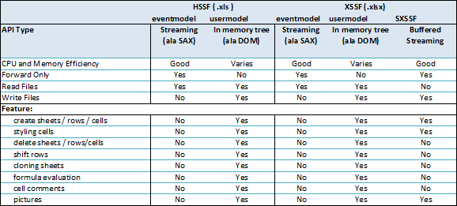

# POI 概述

HSSF 是 POI 项目中纯 Java 实现处理 Excel 97-2007 的格式 (.xls)，每个 sheet 限制在 65535 行，一般不会 OOM
XSSF 是 POI 项目用纯 Java 实现 Excel 2007 OOXML (.xlsx) 的格式。(1048576行，16384列)，伴随着 OOM 问题
3.8 版本后 SXSSF 是一个 API 兼容对 XSSF 的一种流式扩展，当处理十分大的电子表格和堆空间受限。特点是采用了滑动窗口的机制，低内存占用

## POI-HSSF 和 POI-XSSF/SXSSF 处理 Microsoft Excel Format Files

纯 Java 实现的 Excel 处理工具。

HSSF 处理 (97-2007) 格式 （.xls） 的 Excel 文件，XSSF 处理 2007 OOXML （.xlsx）格式的 Excel 文件。

如果只是读取电子表格数据，则根据文件格式使用 `org.apache.poi.hssf.eventusermodel` 包或 `org.apache.poi.xssf.eventusermodel` 包中的 eventmodel api。

如果要修改电子表格数据，请使用 usermodel api。也可以通过这种方式生成电子表格。

请注意，usermodel 系统比低级 eventusermodel 具有更高的内存占用，但具有更易于使用的主要优点。

另请注意，由于新的 XSSF 支持的 Excel 2007 OOXML (.xlsx) 文件是基于 XML 的，因此处理它们的内存占用高于旧的 HSSF 支持的 (.xls) 二进制文件。

### SXSSF

从 3.8-beta3 开始，POI 提供了一个构建在 XSSF 之上的低内存占用 SXSSF API。

SXSSF 是 XSSF 的 API 兼容流扩展（streaming），可在必须生成非常大的电子表格且堆空间有限时使用。

SXSSF 通过限制对滑动窗口内的行的访问来实现其低内存占用，而 XSSF 允许访问文档中的所有行。

不再出现在窗口中的旧行将无法访问，因为它们被写入磁盘。

[使用文档参考](https://poi.apache.org/components/spreadsheet/quick-guide.html)