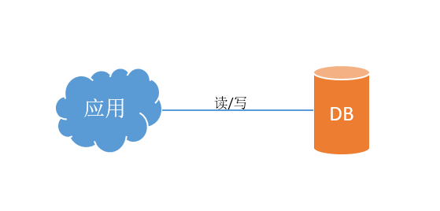
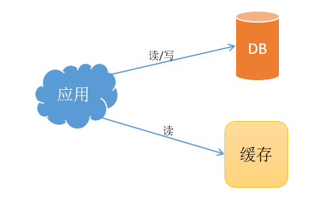
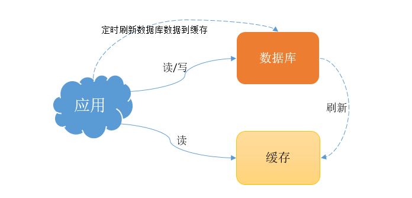
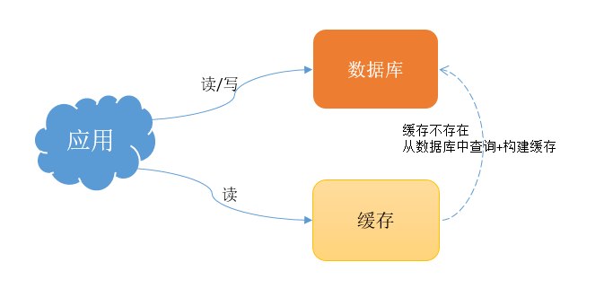
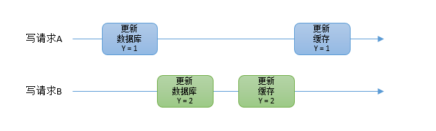

## 缓存和数据库一致性

- 为什么要引入缓存
- 引入缓存要考虑的问题 （缓存利用率/数据一致性）（引入缓存提高性能）
- 缓存利用率/数据一致性
- 数据一致性问题分析
    - 常见的数据库和缓存刷新方案
        1. 先更新数据库，再更新缓存；
        2. 先更新缓存，在更新数据库
        2. 先更新数据库，再删除缓存；
        3. 先删除缓存，再更新数据库；
    - 并发引起的数据一致性问题
    - 删除缓存数据一致性就保证了？
    - 如何保证操作数据库和缓存这两步骤成功？
    - 主从库延迟数据一致性问题分析？
- 需要保证缓存和数据库强一致性吗？
- 总结和拓展

## 为什么要引入缓存

简单的业务场景介绍。
如果你的业务处于起步阶段，流量非常小，那无论是读请求还是写请求，直接操作数据库即可，这时的架构模型大体是这样的：

当业务起来后，请求量越来越大，这时候系统所有请求都从数据库直接读取数据，肯定会出现性能问题。如果这时候不考虑缓存，那么系统优化大体可分为这两个方面：
- 提高 DB 所在物理的性能，但是越到后来，提高物理机的性能所带来的 DB 读/写性能提高见效甚微。
- 做数据库集群或数据库读写分离，但是会带来数据库维护和业务系统操作数据库难度。

基于以上的分析，在业务流量变大后，数据库性能无法支持大的并发读/写操作，系统的瓶颈大体会出现在 DB 层。
此时通常的做法是，引入 “缓存” 来提高读性能，分摊数据库的压力。

## 引入缓存
引入缓存后，请求就不用直接从数据库查询数据，可以支持查缓存获取数据，降低了数据库的压力，提高了“读”性能。
这时的系统架构大体如下：

目前优秀的缓存中间件有很多，但当下使用最广发的缓存中间件应该属 redis 了，它不仅性能非常高，还提供了很多友好的数据类型，可以很好地满足日常的业务需求。

## 引入缓存要考虑的问题

在使用了缓存之后，就会面临一个问题：以前的数据只存在数据库中，现在要放到缓存中读取，具体要怎么存呢？

这里来分析一个最简单直接的方案 - 全量数据刷到缓存中

- 数据库的数据，全量刷入缓存（不设置失效时间）
- 写请求只更新数据库，不更新缓存
- 启动一个定时任务，定时把数据库的数据更新到缓存中

这个方案的优点是，所有读请求都可以直接命中缓存，不需要再查数据库，性能非常高。
但缺点也很明显：

1. 缓存利用率低：不经常访问的数据，还一直留在缓存中
2. 数据不一致：因为是「定时」刷新缓存，缓存和数据库存在不一致（取决于定时任务的执行频率）

这里就展开了引入缓存需要考虑的两个重要问题，**缓存利用率**和**数据一致性**问题。

## 缓存利用率和数据一致性问题分析

### 缓存利用率
要使缓存利用率最大化，想到最简单方案是，缓存中只保留最近访问的热数据。但具体要怎么做呢？

- 请求中写的操作依旧只操作数据库
- 读请求先读缓存，如果缓存不存在，则从数据库读取，并重建缓存
- 写入缓存中的数据，都设置失效时间

这样一改变，缓存中不经常访问的数据，随着时间的推移，都会逐渐过期淘汰掉，最终缓存中保留的，都是经常被访问的热数据，缓存利用率得以最大化。

### 数据一致性

要想保证缓存和数据库实时一致，那就不能再用定时任务刷新缓存了。所以，当数据发生更新时，不仅要操作数据库，还要一并操作缓存。具体操作就是，修改一条数据时，不仅要更新数据库，也要连带缓存一起更新。

采用数据库和缓存都更新，就会存在先后问题：
1. 先更新缓存，后更新数据库
2. 先更新数据库，后更新缓存

如此采用哪种方案好呢？
如果在不考虑并发的情况下，上面两种方案都可以。

## 并发的情况下数据一致性分析

这里来分析在并发情况且所有操作都成功下**先更新数据库，后更新缓存**的这种缓存操作方案。

假设有写（A）和写（B）两个请求操作同一个数据 Y。

1. 请求 A 操作数据库，更新数据 Y = 1
2. 请求 B 操作数据库，更新数据 Y = 2
3. 请求 B 操作缓存，更新缓存 Y = 2
4. 请求 A 操做缓存，更新缓存 Y = 1

最终导致数据库中数据为 2 缓存中数据为 1，导致数据不一致。

归纳来说写操作 A 虽然先于写操作 B 发生，但 B 操作数据库和缓存的时间，却要比 A 的时间短，执行时序发生错乱，最终这条数据结果是不符合预期结果。

同样地，采用**先更新缓存，再更新数据库**的方案，也会有类似问题，这里就不详细分析。

在从**缓存利用率**的角度来分析这个方案也不太推荐。因为每次数据发生变更，都要更新缓存，但是缓存中的数据不一定会被马上读取，这就会导致缓存中可能存放了很多不常访问的数据，造成了缓存资源的浪费。而且很多情况下，写到缓存中的值，并不是与数据库中的值一一对应的，很有可能是先查询数据库，再经过一系列计算、拼装才能得出一个值，把这个值写到缓存中。

经上分析可知，更新数据库和更新缓存的方案，不仅缓存利用率不高，还会造成机器性能的浪费，而且还有缓存一致性的问题。

上面的两种方案中重点问题是在更新缓存的这一步操作，此方案问题是由缓存更新时许和数据库更新时许不一致问题导致，在此提出另一种方案：不直接更新缓存，而采用删除缓存，让读操作自己更新缓存。

## 删除缓存+更新数据库能保证数据一致行吗?

删除缓存 + 更新数据库对应的方案也有 2 种操作方式：
1. 先删除缓存，后更新数据库
2. 先更新数据库，后删除缓存

先删除缓存，后更新数据库分析。如果有两个并发的读/写操作数据 Y = 0：
1. 写操作 A 先删除缓存
2. 读操作 B 读取缓存，缓存不存在
3. 读操作 B 读取数据库数据，Y = 0
4. 写操作 A 更新数据库，Y = 1
5. 读操作 B 更新缓存，Y = 0

**一般来说，数据库的查询操作要快于写操作。**
在这读/写两个操作并发执行完成后，Y 的值在缓存中是 0（旧值），在数据库中是 1（新值），导致了数据不一致问题。可见，先删除缓存，后更新数据库，当发生读+写并发时，还是存在数据不一致的情况。

先更新数据库，后删除缓存分析。如果有两个并发的读/写操作数据 Y = 0：
1. 缓存为空
2. 读操作 B 读取缓存数据，缓存不存在
3. 读操作 B 查询数据库数据，Y = 0
4. 写操作 A 更新数据库，Y = 1
5. 写操作 A 删除缓存
6. 读操作 B 写入缓存，Y = 0

操作完成后，缓存数据 Y = 0（旧值），数据库数据 Y = 1（新值），数据不一致情况产生。
这种情况**理论**上是来说是可能发生的。其实概率很低，这是因为它必须满足 3 个条件：

1. 缓存刚好已失效
2. 读请求 + 写请求并发
3. 更新数据库 + 删除缓存的时间（步骤 4,5），要比读数据库 + 写缓存时间短（步骤 3 和 6）

但是在实现操作中，条件 3 发生的概率其实是非常低的。因为写数据库一般会先加锁且写比读数据库的时间更长，那么在读操作缓存到了旧值，那么随后写操作完成删除该旧值缓存，再有读操作来就是获取到的新值了。

经上分析，**先更新数据库 + 再删除缓存**的方案，也叫 Cache-Aside 模式，是可以保证数据一致性的。
虽该种方案也有可能出现脏数据，但是概率极低，业界推荐使用该方式进行缓存。

## 缓存步骤执行失败导致数据不一致分析

经过以上的分析都是基于缓存操作时正常的情况，如果更新/删除缓存步骤失败了，那么肯定会造成数据不一致的问题。于是如何保证操作缓存步骤成功执行成为了解决问题的关键。

程序中发生了异常，常用的补偿处理方式是？ **重试！**

无论是先操作缓存，还是先操作数据库，但凡执行失败了，就可以发起重试，尽可能地去做补偿。
那这是不是意味着，只要执行失败，就无脑重试就可以了呢？答案是否定的。
现实情况往往没有想的这么简单，失败后立即重试的问题在于：

1. 立即重试很大概率**还会失败**！
2. **重试次数**设置多少才合理？
3. 重试会一直占用这个线程资源，无法服务其它客户端请求

于是，虽然可以通过重试的方式解决问题，但这种**同步**重试的方案依旧不严谨。

那更好的方案应该怎么做？答案是：**异步重试**。
什么是异步重试？

- 其实就是把重试请求写到**消息队列**中，由专门的消费者来重试，直到成功。
- 简单做法使用特定的重试线程，异步执行重试操作。

还有更加直接的做法，为了避免第二步执行失败，可以把操作缓存这一步，直接放到消息队列中，由消费者来操作缓存。

到了这里也会有问题产生：
1. 写消息队列也有可能会失败？
2. 引入消息队列，这又增加了更多的维护成本，为了维护缓存和数据库数据一致性这样做值得吗？

还有一个比较隐蔽的问题：如果在执行失败的线程中一直重试，还没等执行成功，此时如果项目重启或宕机了，那这次重试请求也就丢失了，那这条数据在某段时间就不一致了。

经过上面的分析，要把重试或第二步缓存操作放到另一个服务中，此服务用消息队列最为合适。这是因为消息队列的特性，正好符合重试补偿的需求：
- 消息队列保证可靠性：写到队列中的消息，成功消费之前不会丢失（重启项目也不担心）
- 消息队列保证消息成功投递：下游从队列拉取消息，成功消费后才会删除消息，否则还会继续投递消息给消费者（符合我们重试的场景）

引入消息队列的维护成本问题：
- 写队列失败：操作缓存和写消息队列同时失败的概率其实是很小的
- 维护成本：项目中一般都会用到消息队列，维护成本并没有新增很多。如果项目没有用消息队列，那就需要在考虑一下。

如是项目目前并没有引入消息队列的需要，是否有更简单的方案，同时又可以保证一致性呢？

就是近几年比较流行的解决方案：订阅数据库变更日志，再操作缓存。具体来讲就是业务应用在修改数据时，只需修改数据库，无需操作缓存。
那什么时候操作缓存呢？这就和数据库的**变更日志**有关了。拿 MySQL 举例，当一条数据发生修改时，MySQL 就会产生一条变更日志（Binlog），可以订阅这个日志，拿到具体操作的数据，然后再根据这条数据，去删除对应的缓存。

订阅变更日志，目前也有了比较成熟的开源中间件，例如阿里的 canal，使用这种方案的优点在于：
- 无需考虑写消息队列失败情况：只要写 MySQL 成功，Binlog 肯定会有
- 自动投递到下游队列：canal 自动把数据库变更日志「投递」给下游的消息队列
当然，与此同时，需要投入精力去维护 canal 的高可用和稳定性。
现在很多数据库都逐渐开始提供订阅变更日志的功能了，也许在不久就不需要引入订阅中间件就可以订阅变更日志了。

至此，可以得出结论，想要保证数据库和缓存一致性，推荐采用**先更新数据库，在删除缓存**方案，并配合**消息队列**或**订阅变更日志**的方式来做。

## 主从库延迟和延迟双删问题分析

如果业务量足够大、并发请求很大时候，引入了缓存依然会有性能问题，查询操作最终还是需要去数据库查询数据，数据库的查询也会成为瓶颈，于是就会有数据库主从同步，读写分离的架构设计。
基于数据库主从，读写分离的设计在来分析一下**先更新数据库，在删除缓存**这种缓存操作方案还能保证数据一致性吗？

2 个线程要并发读写数据，可能场景：
1. 线程 A 要更新 Y = 2（原值 Y = 1）
2. 线程 A 先删除缓存
3. 线程 B 读缓存，发现不存在，从数据库中读取到旧值（Y = 1）
4. 线程 A 将新值写入数据库（X = 2）
5. 线程 B 将旧值写入缓存（X = 1）

操作完成后，数据库 Y = 2 （新值），缓存 Y = 1 （旧值)，此时数据不一致。理论可能发生，现实发生概率十分低。

在**先更新数据库，再删除缓存**方案下，**读写分离 + 主从库延迟**其实也会导致不一致：

1. 线程 A 更新主库 Y = 2（原值 Y = 1）
2. 线程 A 删除缓存
3. 线程 B 查询缓存，没有命中，查询**从库**得到旧值（从库 Y = 1）
4. 从库**同步**完成（主从库 Y = 2）
5. 线程 B 将旧值写入缓存（Y = 1）

操作完成后，数据库 Y = 2 （新值），缓存 Y = 1 （旧值)，此时数据不一致。

以上的两个问题产生的原因都是缓存最后被**回种了旧值**，如何解决改问题？有效的方法就是删除改缓存，让其重新在加载。

但是不能立即删，而是需要延迟删，这就是业界给出的方案：**缓存延迟双删策略**。
若是使用延时双删策略，这 2 个问题的解决方案是这样的：

解决第一个问题：在线程 A 删除缓存、更新完数据库之后，先**休眠一会**，再**删除**一次缓存。
解决第二个问题：线程 A 可以生成一条**延时消息**，写到消息队列中，消费者延时**删除**缓存。

这两个方案的目的，都是为了把缓存清掉，这样一来，下次就可以从数据库读取到最新值，写入缓存。

但问题来了，这个**延迟删除**缓存，延迟时间到底设置要多久呢？
1. 延迟时间要大于**主从复制**的延迟时间
2. 延迟时间要大于线程 B 读取数据库 + 写入缓存的时间
但是，这个时间在分布式和高并发场景下，其实是很难评估的。

很多时候，我们都是凭借经验大致估算这个延迟时间，例如延迟 1-5s，只能尽可能地降低不一致的概率。
最终，采用这种方案，也只是尽可能保证一致性而已，极端情况下，还是有可能发生不一致。

所以实际使用中，还是建议采用**先更新数据库，再删除缓存**的方案，同时要尽可能地保证**主从复制**不要有太大延迟，降低出问题的概率。

## 总结

缓存和数据库的数据一致性可以做到强一致吗？
在这里也许会想，以上这些方案还是不够完美，项目中就想让缓存和数据库**强一致**，到底能不能做到呢？ 其实很难。

要想做到强一致，最常见的方案是 2PC、3PC 等一致性协议，但它们的性能往往比较差，而且这些方案也比较复杂，还要考虑各种容错问题。

此时，容许我们换个角度思考一下，在项目中引入缓存的目的是什么？主要目的为了**性能**，是的没错，为了**性能**。

开始就有提到，一旦使用缓存，那必然要面临一致性问题。性能和一致性无法同时都做到都满足要求。
并且，拿前面讲到的方案示例来解析，当操作数据库和缓存完成之前，只要有其它请求可以进来，都有可能查到**中间状态**的数据。如果非要追求强一致，那必须要求所有更新操作完成之前期间，不能有**任何请求**进来。就有可以通过加**分布锁**的方式来实现，但要付出的性能代价，很可能会超过引入缓存带来的性能提升。

决定要使用缓存，就存在**缓存一致性**的问题，只能尽可能地去降低问题出现的概率。同时缓存都是有**失效时间**，就算在存在短期不一致，最后依旧有失效时间来兜底，这样也能达到最终一致。

最后归纳一下此次所讲内容：
1. 引用**缓存**来提高系统的并发性能
2. 引入缓存后，需要考虑缓存和数据库一致性问题，可选的方案有：[更新数据库 + 更新缓存]、[更新数据库 + 删除缓存]
3. [更新数据库 + 更新缓存方案] 方案解析
4. [更新数据库 + 删除缓存]的方案中解析
5. [先更新数据库，再删除缓存]方案下，解析如何保证两步都成功执行
6. 在[先更新数据库，再删除缓存]方案和[读写分离 + 主从库延迟]架构解析，**延迟双删**解决数据不一致的问题

性能和一致性不能同时满足，为了性能考虑，通常会采用**最终一致性**的方案
缓存和数据库一致性核心问题有 3 点：缓存利用率、并发、缓存 + 数据库一起成功问题
重试操作保证失败场景下数据一致性，同步重试会影响吞吐量，所以通常会采用异步重试的方案

## 拓展

引入缓存中间件，目前常用的是 Redis，如何保证 Redis 服务不会宕掉，保证 Redis 高可用。
若是要保证缓存操作成功，引入重试机制，采用消息队列服务，如何保证消息队列的高可用。