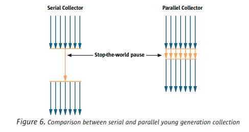
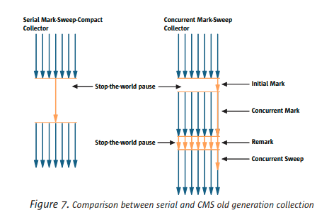
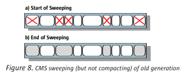

[G1 垃圾收集器文档](https://tech.meituan.com/2016/09/23/g1.html)

[高级语言虚拟机论坛](https://hllvm-group.iteye.com/group/wiki/2859-JVM)

## JVM GC 笔记

```bash
-XX:+UnlockExperimentalVMOptions
-XX:+UseEpsilonGC # 堆内存满的时候，不执行 GC，直接抛出 OutofMemory 异常并程序结束

–XX:+UseSerialGC
–XX:+UseParallelGC # 默认开启压缩，jdk1.8 默认使用
–XX:+UseParallelOldGC # 关闭压缩
–XX:+UseConcMarkSweepGC
-XX:+UseG1GC

-XX:+UseCompressedClassPointers # 开启指针压缩

# GC 信息
-XX:+PrintGCDetails
-XX:+PrintGCDateStamps
-XX:+PrintTenuringDistribution
-XX:+PrintHeapAtGC
-XX:+PrintReferenceGC
-XX:+PrintGCApplicationStoppedTime

# 日志分割
# GC 日志输出文件路径
-Xloggc:/path/gc.log
# 开启日志文件分隔
-XX:+UseGCLogFileRotation
# 最多分隔几个日志文件，在重头开始
-XX:NumberOfGCLogFiles=14
# 每个文件上限大小，超过就触发日志分割
-XX:GCLogFileSize=100M

# 查看正在使用的 GC, JDK8 默认使用的是 -XX:+UseParallelGC 垃圾回收器
java -XX:+PrintCommandLineFlags -version

-XX:InitialHeapSize=266235648 -XX:MaxHeapSize=4259770368 -XX:+PrintCommandLineFlags -XX:+UseCompressedClassPointers -XX:+UseCompressedOops -XX:-UseLargePagesIndividualAllocation -XX:+UseParallelGC
java version "1.8.0_251"
Java(TM) SE Runtime Environment (build 1.8.0_251-b08)
Java HotSpot(TM) 64-Bit Server VM (build 25.251-b08, mixed mode)

# 示例
-Xms2g -Xmx2g -Xmn1g -Xss256k -XXSurviorRatio=8 –XX:+UseConcMarkSweepGC -XX:+UseParNewGC -XX:MetaspaceSize=512m

-Xms30m -Xmx30m -XX:NewSize=20m -XX:+PrintGCDetails
```

#### 查看当前 GC 的状况

```
# 每隔一秒打印一次 gc 统计信息
jstat -gcutil <pid> 1000
```

GC 日志，需要在 JVM 启动参数添加

- `-XX:+PrintGCDateStamps`：打印 gc 发生的时间戳。
- `-XX:+PrintTenuringDistribution`：打印 gc 发生时的分代信息。
- `-XX:+PrintGCApplicationStoppedTime`：打印 gc 停顿时长
- `-XX:+PrintGCApplicationConcurrentTime`：打印 gc 间隔的服务运行时长
- `-XX:+PrintGCDetails`：打印 gc 详情，包括 gc 前/内存等。
- `-Xloggc:../gclogs/gc.log.date`：指定 gc log 的路径

去 [gceasy](https://gceasy.io/) 分析 GC 日志。

解决方式：

增大 young 区，存在疑问，对 GC 最直观的印象来说，增大 young 区，YGC 的时长也会迅速增大。

知道 YGC 的耗时是由 `GC 标记 + GC 复制` 组成的，相对于 GC 复制，GC 标记是非常快的。而 young 区内大多数对象的生命周期都非常短，如果将 young 区增大一倍，GC 标记的时长会提升一倍，但到 GC 发生时被标记的对象大部分已经死亡， GC 复制的时长肯定不会提升一倍，所以我们可以放心增大 young 区大小。

知道 GC 的提升机制，每次 GC 后，JVM 存活代数大于 `MaxTenuringThreshold` 的对象提升到老年代。当然，JVM 还有动态年龄计算的规则：按照年龄从小到大对其所占用的大小进行累积，当累积的某个年龄大小超过了 survivor 区的一半时，取这个年龄和 `MaxTenuringThreshold` 中更小的一个值，作为新的晋升年龄阈值

【想查看 JVM 里各个线程的资源占用情况该用什么工具？】

就是使用 `jtop`，jtop 只是一个 jar 包，它的项目地址在 [yujikiriki/jtop](https://github.com/yujikiriki/jtop)， 获取到 java 应用的 pid 后，使用 `java -jar jtop.jar [options] <pid>` 即可输出 JVM 内部统计信息。

火焰图工具 [FlameGraph](https://github.com/brendangregg/FlameGraph)

**注意**：*Hystrix*  使用信号量隔离模式也要注意一个问题：信号量只能限制方法是否能够进入执行，在方法返回后再判断接口是否超时并对超时进行处理，而无法干预已经在执行的方法，这可能会导致有请求超时时，一直占用一个信号量，但框架却无法处理。

### JDK支持的垃圾回收器

#### Serial 收集器

　　单线程收集器，收集时会暂停所有工作线程（我们将这件事情称之为 Stop The World，下称 STW），使用复制收集算法，虚拟机运行在 Client 模式时的默认新生代收集器。

#### ParNew收集器

　　ParNew 收集器就是 Serial 的多线程版本，除了使用多条收集线程外，其余行为包括算法、STW、对象分配规则、回收策略等都与 Serial 收集器一摸一样。对应的这种收集器是虚拟机运行在 Server 模式的默认新生代收集器，在单 CPU 的环境中，ParNew 收集器并不会比 Serial 收集器有更好的效果。

#### Parallel Scavenge （PS）收集器

　　Parallel Scavenge 收集器（下称 PS 收集器）也是一个多线程收集器，也是使用复制算法，但它的对象分配规则与回收策略都与 ParNew 收集器有所不同，它是以吞吐量最大化（即 GC 时间占总运行时间最小）为目标的收集器实现，它允许较长时间的 STW 换取总吞吐量最大化。

#### Serial Old 收集器

　　Serial Old 是单线程收集器，使用 标记－整理算法，是老年代的收集器，上面三种都是使用在新生代收集器。

#### CMS（Concurrent Mark Sweep）收集器

　　CMS 是一种以最短停顿时间为目标的收集器，使用 CMS 并不能达到 GC 效率最高（总体 GC 时间最小），但它能尽可能降低 GC 时服务的停顿时间，这一点对于实时或者高交互性应用（譬如证券交易）来说至关重要，这类应用对于长时间 STW 一般是不可容忍的。CMS 收集器使用的是标记－清除算法，也就是说它在运行期间会产生空间碎片，所以虚拟机提供了参数开启 CMS 收集结束后再进行一次内存压缩。

<font color="red">了解 GC 其中很重要一点就是了解 JVM 的内存分配策略：即对象在哪里分配和对象什么时候回收。</font>

采用分代收集机制，年轻代和老年代采用不同的收集算法。

- **-XX:+UseSerialGC**，虚拟机Client模式下的默认值，使用Serial（新生代）+ Serial Old（老年代）收集器；
  使用此参数开启 Serial，老年代默认会开启 Serial Old，新生代和老年代都会使用串行回收收集器。
  新生代使用复制算法，老年代使用标记-整理算法 (**DefNew + Tenured**)
- **-XX:+UseParNewGC**，使用ParNew + Serial Old，JDK9后不再支持；
  相当于 SerialGC 的并行版本。在垃圾收集时，必须暂停所有的工作线程直到它收集结束。
  只影响新生代的收集，不影响老年代。
  开启后会使用：ParNew（Young）+ Serial Old（Old）的收集器组合。
  新生代使用复制算法，老年代使用标记-整理算法。
  <font color="red">注意：ParNew + Tenured，但是这种组合已经不再推荐被使用</font>
- **-XX:+UseConcMarkSweepGC**，使用ParNew + CMS + Serial Old组合收集器，Serial Old作为CMS出现“Concurrent Mode Failure”错误后的备选；
    CMS非常适合堆内存大、CPU核数多的服务器端应用，也是G1出现之前大型应用的首选收集器
    使用 ParNew（Young）+CMS（Old）+Serial Old 的收集器组合（Serial Old将作为 CMS 出错的后备收集器）
- **-XX:+UseParallelGC**，使用Parallel Scavenge（新生代） + Serial Old（老年代）收集器，JDK9之前Server模式下的默认设置；jdk8 默认使用。
    Parallel 重点关注的是：可控制的吞吐量
    吞吐量=运行用户代码的时间/（运行用户代码时间+垃圾收集时间）
    高吞吐量意味着高效利用CPU的时间，它多用于在后台运算而不需要太多交互的任务
    -XX:ParallelGCThreads=数字N    表示启动多少个GC线程
    cpu>8 -> N=5/8 , cpu<8 -> N=实际个数
    **PSYoungGen+ParOldGen**
- **-XX:+UseParallelOldGC**，使用Parallel Scavenge（新生代） + Parallel Old（老年代）收集器；
- **-XX:+UseG1GC**，使用G1垃圾收集器，JDK9之后的Server模式默认值；

### JDK 1.8 支持常用的 GC 垃圾收集器

1. 串行 (Serialize) GC
–XX:+UseSerialGC

2. 并行 (Parallel) GC
-XX:+UseParallelGC (JDK 1.8 默认)
    -XX:ParallelGCThreads=<N>
    -XX:MaxGCPauseMillis=<N>
    -XX:GCTimeRatio=19

3. 并发 (Concurrent) GC
    3.1 Concurrent Mark Sweep (CMS) Collector
        -XX:+UseConcMarkSweepGC
        -XX:ConcGCThreads=<N>
    
    3.2 Garbage-First Garbage (G1) Collector [大内存的多处理器]
        -XX:+UseG1GC

### 常用 GC 垃圾收集算法

#### 1. 垃圾回收

##### 1.1 引用计数算法（Reference Counting）

每个对象中都会存储一个引用计数，每增加一个引用就 +1，消失一个引用就 -1。当引用计数器为 0 时就会判断该对象是垃圾，进行回收。

**弊端**：就是当有两个对象互相引用时，那么这两个对象的引用计数器都不为 0，那么就不会对其进行回收。

##### 1.2 可达性分析，根搜索算法（GC Roots Tracing）

使用根搜索算法判定对象是否存活。算法基本思路就是通过一系列的称为 “GC Roots” 的点作为起始进行向下搜索，当一个对象到 GC Roots 没有任何引用链（Reference Chain）相连，则证明此对象是不可用的。

在Java语言中，GC Roots 包括：

　　1. 在 VM栈（帧中的本地变量）中的引用
　　2. 方法区中的静态引用
　　3. JNI（即一般说的 Native 方法）中的引用

* 直接引用（GC Roots）：就是虚拟机栈帧中的局部或本地变量表、类加载器、static 成员、常量引用、Thread 等等中的引用直接到达。**[当前虚拟机栈中局部变量表中的引用的对象，方法区中类静态属性引用的对象，方法区中的常量引用的对象]**
* 间接引用：通过其它对象的引用来达到。

#### 2. 垃圾回收算法

##### 2.1 标记-清除 (mark-sweep)

标记所有需要回收的对象，然后统一回收被标记的对象。

**优点**：简单、明了、好操作

**缺点**：

*  标记/清除的效率不高（对比复制算法），在标记和清除的过程中、会扫描整个堆内存，比较耗时
* 会有空间碎片问题，空间不连续，如果有大一点的对象进来，发现没有连续的空间内存去进行分配，就会再一次的触发垃圾回收机制

##### 2.2 复制算法 (copying)

将可用内存按容量划分为大小相等的两块，每次只使用其中的一块。当这一块的内存用完了，就将还存活着的对象复制到另外一块上面，然后再把已使用过的内存空间一次清理掉。每次都是对整个半区进行内存回收，内存分配时也就不用考虑内存碎片等复杂情况，只要按顺序分配内存即可，实现简单，运行高效。只是这种算法的代价是将内存缩小为了原来的一半。（空间利用率低）

**优点**： 简单高效，不会出现内存碎片

**缺点**：内存利用率低，存活对象较多时效率明显降低，因为需要移动每个不可回收数据的内存实际位置

##### 2.3 标记-整理算法 (Mark-Compact)

标记过程仍然一样，但后续步骤不是进行直接清理，而是令所有存活的对象一端移动，然后直接清理掉这端边界以外的内存。

首先标记出所有需要回收的对象，在标记完成后，后续步骤不是直接对可回收对象进行清理，而是让所有存活的对象都向一端移动，然后直接清理掉端，边界以外的内存。

整理移动之后会得到一片连续的可分配内存空间。解决了空间碎片的问题，但是这种方式在标记和整理移动的过程中也是耗时的。

**优点**： 利用率100% ，没有内存碎片

**缺点**：标记和清除效率都不高（对比复制算法及标记清楚算法）


---

### 1. 并行 GC (Parallel Collector)

并行 *GC*  又被称为 *throughput collector* 吞吐量垃圾收集器

#### 1.1 使用并行收集器收集 *Young Generation*

并行收集器使用串行收集器使用的年轻一代收集算法的并行版本。
仍是一个 *STW* 的复制收集器，用许多 CPU 并行执行年轻代收集，减少垃圾收集开销，提高应用程序吞吐量



#### 1.2 使用并行收集器收集 *Old Generation*

使用与串行收集器相同的串行 mark-sweepcompact 收集算法来完成并行收集器的 *Old Generation* 圾收集

#### 1.3 使用命令参数

```bash
java -XX:+UseParallelGC -jar xxx.jar
```

#### 1.4 压缩对象

1. 每个代都被划分在固定大小的区域内
2. 标记阶段
   初始化从代码可以直接获取的对象分发到多个线程中各自标记 live 对象，致使所有的 live 对象都被并发标记线程标记完成。该区域的数据被更新信息关于对象的大小和位置。
3. 汇总阶段
   操作的是区域不是对象。

### 2. 并发标记清除收集器 (Concurrent Mark-Sweep (CMS) )

*Young generation* 收集通常不会导致很长的暂停。 *old generation* 尽管不频繁，可以导致很长的暂停，尤其是当 *heaps* 很大的时候。

*low-latency* collector [低延迟收集器]

CMS收集器以与并行收集器相同的方式收集年轻代。

使用CMS收集器收集的大多数 *old generation* 是在执行应用程序的同时完成的。
*CMS* 的收集周期开始于一个短暂的暂停
*initial mark* (初始化标记)：该暂停标识了可直接从应用程序代码访问的活动对象的初始集合。
*concurrent marking phase* 并发标记阶段：标记从初始化标记 live 对象集合中传递可达的对象。由于在标记阶段进行期间，应用程序正在运行并更新参考字段，不能保证所有的 live 对象在该阶段最后都被标记完成。为了处理这个问题，在第二阶段应用程序暂停来重新标记，称为 *remark*，通过重新访问在并发标记阶段修改的任何对象来最终确定标记。因为  *remark* 暂停比初始标记更重要，所以并行运行多个线程以提高其效率。在 *remark* 阶段结束后，所有的 *live* 对象在 *heap* 中的都被保证会被标记，于是随后的并发扫除阶段回收所有已经被鉴定的垃圾。



*CMS* 是唯一一个没有压缩功能的收集器。


**缺点：**

*CMS* 节约了时间，但是空闲的空间不在连续，收集器不能再使用简单的指针来指示可以将下一个对象分配到的下一个空闲位置。 相反它现在需要使用空闲列表。
也就是说，它创建了一些将未分配的内存区域链接在一起的列表，并且每次需要分配对象时，都必须在适当的列表（基于所需的内存量）中搜索足以容纳该对象的区域。 结果，与使用简单的“触手可及”技术相比，分配给旧一代的开销更大。 这也给年轻一代集合增加了额外的开销，因为在年轻一代集合中提升对象时，旧一代中的大多数分配都会发生。
另一个 *CMS* 缺点就是它需要比其它收集器更大的堆空间。如果允许该应用程序在标记阶段运行，则它可以继续分配内存，从而有可能继续增长旧的一代。
此外，尽管收集器保证在标记阶段识别所有活动对象，但是某些对象可能在该阶段成为垃圾，并且直到下一个旧的收集阶段才将它们回收。 这些对象称为浮动垃圾。
由于在缺乏内存压缩将会导致可能出现分段。为了处理碎片，CMS 收集器跟踪常用的对象大小，估计未来的需求，并可能拆分或合并空闲块以满足需求。

与其它收集器不同的是，当 *Old Generation* 变满后 *old Generation* 收集器不会启动收集垃圾。相反，它会尝试提前开始收集那么可以在 *old Generation* 满发生之前完成收集。否则，CMS收集器将恢复为并行和串行收集器使用的更耗时的“停止运行”标志压缩紧凑算法。

使用参数

```bash
java -XX:+UseConcMarkSweepGC -jar xxx.jar
```


总而言之，与并行收集器相比，CMS收集器有时会显着减少旧一代的停顿，但代价是年轻一代的停顿时间会稍长一些，吞吐量会有所降低，并且需要额外的堆大小。

### 3. G1 垃圾收集 (Garbage-First - G1)

G1收集器通过多种技术实现了高性能和暂停时间目标。

堆被划分为一组大小相等的堆区域，每个堆区域都有一个连续的虚拟内存范围。
G1 执行并发全局标记阶段，以确定整个堆中对象的活动性。
标记阶段完成后，G1知道哪些区域大部分为空。它首先收集这些区

域，这通常会产生大量的自由空间。
这就是为什么这种垃圾收集方法称为“垃圾优先”的原因。
顾名思义，G1 将其收集和压缩活动集中在可能充满可回收对象（即垃圾）的堆区域。
G1 使用暂停预测模型满足用户定义的暂停时间目标，并根据指定的暂停时间目标选择要收集的区域数。

G1将对象从堆的一个或多个区域复制到堆上的单个区域，并在此过程中压缩并释放内存。
疏散是在多处理器上并行执行的，以减少暂停时间并增加吞吐量。
因此，对于每个垃圾回收，G1 都会不断减少碎片。这超出了先前两种方法的能力。
<font color="blue">CMS（并发标记扫描）垃圾收集不会进行压缩。并行压缩仅执行整堆压缩，这会导致相当长的暂停时间。</font>

G1 的首要重点是为运行需要大堆且 GC 延迟有限的应用程序的用户提供解决方案。
这意味着堆大小约为 6 GB 或更大，并且稳定且可预测的暂停时间低于0.5秒。