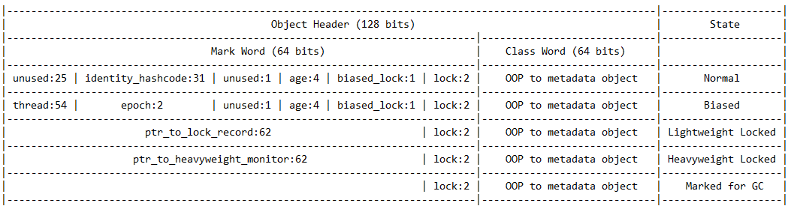
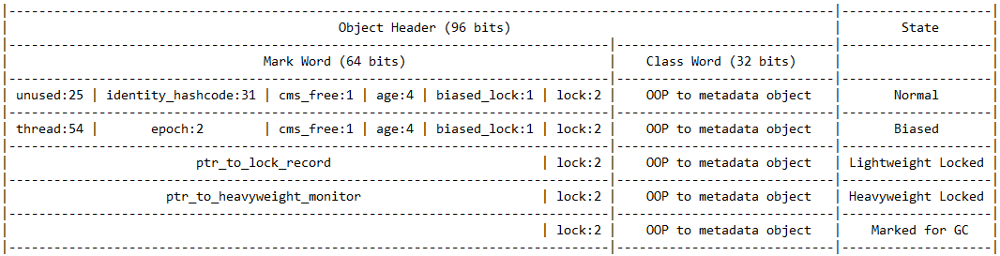

#### 1. java 对象头信息

分为两部分： `Mark Word` 和 `Class Word`

```c++
#ifndef SHARE_VM_OOPS_MARKOOP_HPP
//  --------
//             hash:25 ------------>| age:4    biased_lock:1 lock:2 (normal object)
//             JavaThread*:23 epoch:2 age:4    biased_lock:1 lock:2 (biased object)
//             size:32 ------------------------------------------>| (CMS free block)
//             PromotedObject*:29 ---------->| promo_bits:3 ----->| (CMS promoted object)
//
//  64 bits:
//  --------
//  unused:25 hash:31 -->| unused:1   age:4    biased_lock:1 lock:2 (normal object)
//  JavaThread*:54 epoch:2 unused:1   age:4    biased_lock:1 lock:2 (biased object)
//  PromotedObject*:61 --------------------->| promo_bits:3 ----->| (CMS promoted object)
//  size:64 ----------------------------------------------------->| (CMS free block)
//
//  unused:25 hash:31 -->| cms_free:1 age:4    biased_lock:1 lock:2 (COOPs && normal object)
//  JavaThread*:54 epoch:2 cms_free:1 age:4    biased_lock:1 lock:2 (COOPs && biased object)
//  narrowOop:32 unused:24 cms_free:1 unused:4 promo_bits:3 ----->| (COOPs && CMS promoted object)
//  unused:21 size:35 -->| cms_free:1 unused:7 ------------------>| (COOPs && CMS free block)

//  - hash contains the identity hash value: largest value is
//    31 bits, see os::random().  Also, 64-bit vm's require
//    a hash value no bigger than 32 bits because they will not
//    properly generate a mask larger than that: see library_call.cpp
//    and c1_CodePatterns_sparc.cpp.
//
//  - the biased lock pattern is used to bias a lock toward a given
//    thread. When this pattern is set in the low three bits, the lock
//    is either biased toward a given thread or "anonymously" biased,
//    indicating that it is possible for it to be biased. When the
//    lock is biased toward a given thread, locking and unlocking can
//    be performed by that thread without using atomic operations.
//    When a lock's bias is revoked, it reverts back to the normal
//    locking scheme described below.
//
//    Note that we are overloading the meaning of the "unlocked" state
//    of the header. Because we steal a bit from the age we can
//    guarantee that the bias pattern will never be seen for a truly
//    unlocked object.
//
//    Note also that the biased state contains the age bits normally
//    contained in the object header. Large increases in scavenge
//    times were seen when these bits were absent and an arbitrary age
//    assigned to all biased objects, because they tended to consume a
//    significant fraction of the eden semispaces and were not
//    promoted promptly, causing an increase in the amount of copying
//    performed. The runtime system aligns all JavaThread* pointers to
//    a very large value (currently 128 bytes (32bVM) or 256 bytes (64bVM))
//    to make room for the age bits & the epoch bits (used in support of
//    biased locking), and for the CMS "freeness" bit in the 64bVM (+COOPs).
//
//    [JavaThread* | epoch | age | 1 | 01]       lock is biased toward given thread
//    [0           | epoch | age | 1 | 01]       lock is anonymously biased
//
//  - the two lock bits are used to describe three states: locked/unlocked and monitor.
//
//    [ptr             | 00]  locked             ptr points to real header on stack
//    [header      | 0 | 01]  unlocked           regular object header
//    [ptr             | 10]  monitor            inflated lock (header is wapped out)
//    [ptr             | 11]  marked             used by markSweep to mark an object
//                                               not valid at any other time
//
//    We assume that stack/thread pointers have the lowest two bits cleared.
```

*Header 字节解析*

```
# 第一个字节
00001001
0     |    0001    |    0     | 01 
未使用 | GC 分代年龄 | 偏向锁标识 | 对象状态

# 因为 GC 年龄仅有 4 bit，所以最大轮询仅为 15

# 偏向锁标识为 1，JVM 启动时需要加载资源给这些对象添加偏向锁没有意义，才会有延迟加载
# 此时对象状态为 01

# 注意： 偏向锁标识为 0 对象状态标识为 01 标识无锁

# two lock bits are used to describe three states: locked/unlocked and monitor.
# 对象状态 ： 000 为轻量级锁， 010 为重量级锁，101 偏向锁， 001 无锁
# 重量级锁解锁后还是重量级锁，因为重量级锁释放会有延迟
# [ptr             | 00]  locked   ptr points to real header on stack
# [header      | 0 | 01]  unlocked regular object header
# [ptr             | 10]  monitor  inflated lock (header is wapped out)
# [ptr             | 11]  marked   used by markSweep to mark an object
#                                  not valid at any other time
```

`openjdk/hotspot/src/share/vm/runtime/globals.hpp` <font color="red">注意：偏向锁启动有延迟， 4000 </font>

偏向锁源码： `openjdk/hotspot/src/share/vm/runtime/biasedLocking.cpp`

```c++
void BiasedLocking::init() {
  // If biased locking is enabled, schedule a task to fire a few
  // seconds into the run which turns on biased locking for all
  // currently loaded classes as well as future ones. This is a
  // workaround for startup time regressions due to a large number of
  // safepoints being taken during VM startup for bias revocation.
  // Ideally we would have a lower cost for individual bias revocation
  // and not need a mechanism like this.
```

*synchronized 锁的变化*   *偏向锁 -> 轻量级锁 -> 重量级锁*
<font color="red">synchronized 是依赖操作系统实现的，同步锁的时候需要进行用户态到内核态的切换。</font>

```java
// 仅单个线程锁，为 (偏向锁 biased locking)
# 0 0000 101

// 锁资源处于竞争状态时，会由 偏向锁 升级为 轻量级锁
# 0 0000 000
# 自旋策略 JVM 提供了一种自旋锁，通过自旋方式不断尝试获取锁，从而避免线程被挂起阻塞。
# 基于大多数情况下，线程持有锁的时间都不会太长，线程被挂起阻塞可能会得不偿失

// 自旋失败多次，升级为 重量级锁  进行线程阻塞，减少 cpu 消耗
# 在状态下，未抢到锁的线程都会进入 Monitor，之后会被阻塞在 _WaitSet 队列中
# 当锁升级为重量级锁后，未抢到锁的线程都会被阻塞，进入阻塞队列
```

##### 1.1 java header 表头格式 64bit


On a 64-bit jvm, the object header consists of 16 bytes. Arrays are additionally 4 bytes.
在64位jvm上，对象标头由16个字节组成。数组是另外4个字节

*64 bit jvm 指针压缩*


对象标头由12个字节组成。数组是另外4个字节。
关于指针压缩的一些知识。

##### 1.2 对象内部理解

内存布局：*Hotspot* 虚拟机中对象的内存布局分为三部分
**Object Header**, **Instance Data**, and **Alignment Padding**. [对象头，实例数据和对齐填充]

对象头包含了两部分信息：
第一部分用于存储对象本身的运行数据，(哈希码，GC生成年龄，锁定状态标志等)
另一部分是类型指针，它指向其类元数据

虚拟机使用此指针来确定此对象是类的哪个实例(如果有一个句柄池方法，就没有这种东西)
如果是数组，那么还将有一个记录数组长度，如下表所示：

| Content                | Expression                                |
| :--------------------- | :---------------------------------------- |
| Mark Word              | Object hashCode or lock information, etc. |
| Class Metadata Address | Object type data pointer                  |
| Array length           | the length of the Array                   |

(*Mark Word*)标记字是一种非固定的数据结构，可在一个很小的空间中存储尽可能多的信息，并根据对象的状态多路复用其自身的存储空间。每种状态下的存储内容如下：

| Flag bit | status           | storage content                                |
| :------- | :--------------- | :--------------------------------------------- |
| 01       | Unlocked         | Object HashCode, age of generation             |
| 00       | Lightweight lock | Pointer to lock record                         |
| 10       | heavyweight lock | Pointer to lock record                         |
| 11       | GC tag           | empty                                          |
| 01       | biased           | biased thread ID, biased timestamp, object age |

<font color="blue">HotSpot虚拟机要求对象的起始地址必须是8字节的整数倍。</font>

##### 1.3 对象访问

对象存在于堆中，并且此引用存在于虚拟机堆栈中。
引用如何在堆中定位对象的位置？

内存分析工具使用 *jol-cli*

```xml
<dependency>
    <groupId>org.openjdk.jol</groupId>
    <artifactId>jol-cli</artifactId>
    <version>0.10</version>
</dependency>
```

```java
import org.openjdk.jol.info.ClassLayout;
import org.openjdk.jol.vm.VM;

System.out.println(VM.current().details());
System.out.println(ClassLayout.parseClass(A.class).toPrintable());
```

```bash
# Running 64-bit HotSpot VM.
# Using compressed oop with 3-bit shift.
# Using compressed klass with 3-bit shift.
# Objects are 8 bytes aligned.
# Field sizes by type: 4, 1, 1, 2, 2, 4, 4, 8, 8 [bytes]
# Array element sizes: 4, 1, 1, 2, 2, 4, 4, 8, 8 [bytes]

Instantiated the sample instance via default constructor.

java.lang.Object object internals:
OFFSET  SIZE   TYPE DESCRIPTION VALUE
  0     4   (object header)  01 00 00 00 (00000001 00000000 00000000 00000000) (1)
  4     4   (object header)  00 00 00 00 (00000000 00000000 00000000 00000000) (0)
  8     4   (object header)  e5 01 00 f8 (11100101 00000001 00000000 11111000) (-134217243)
 12     4   (loss due to the next object alignment)
Instance size: 16 bytes
Space losses: 0 bytes internal + 4 bytes external = 4 bytes total
```

http://hg.openjdk.java.net/jdk/jdk/file/19afeaa0fdbe/src/hotspot/share/oops/oop.hpp#l52
注意到对象头包含两部分：<font color="blue">*mark word* and *class word*.</font>
*class word* 包含了对象的类型信息，关联到描述该类的原始结构。
*mark word* 剩下的元数据就保存在这里。

标记字 (mark word) 的用法：

1. Storing the metadata (forwarding and object age) for moving GCs.
2. Storing the identity hash code.
3. Storing the locking information.

*注意：* 每个对象都必须有一个标记词，因为它处理每个 Java 对象共有的事情。这也是为什么它占用对象内部结构中的第一个插槽的原因，VM 需要在时间敏感的代码路径（STW GC）上非常快速地访问它。了解标记词的用例会突出显示其占用空间的下限。

https://hg.openjdk.java.net/code-tools/jol/file/tip/jol-samples/src/main/java/org/openjdk/jol/samples/

###### 1.3.1 Storing Object Ages for GCs

```java
// 跟踪对象地址信息
Object o = new Object();
ClassLayout layout = ClassLayout.parseInstance(o);
long lastAddr = VM.current().addressOf(o);
for (int i = 0; i < 100000; i++) {
    long cur = VM.current().addressOf(o);
    if (cur != lastAddr) {
        moves++;
        pw.printf("*** Move %2d, object is at %x%n", moves, cur);
        out.println(layout.toPrintable());
        lastAddr = cur;
    }
}

*** Move  1, object is at 721990350
0  4  (object header) 09 00 00 00 (00001001 00000000 00000000 00000000) (9)

*** Move  2, object is at 722e20668
0  4  (object header) 11 00 00 00 (00010001 00000000 00000000 00000000) (17)

*** Move  3, object is at 721988fb0
0  4  (object header) 19 00 00 00 (00011001 00000000 00000000 00000000) (25)

*** Move  4, object is at 72ab9eef0
0  4  (object header) 21 00 00 00 (00100001 00000000 00000000 00000000) (33)

*** Move  5, object is at 729710760
0  4  (object header) 29 00 00 00 (00101001 00000000 00000000 00000000) (41)

*** Move  6, object is at 739418c20
0  4  (object header) 31 00 00 00 (00110001 00000000 00000000 00000000) (49)

*** Move  7, object is at 5cd42a068
0  4  (object header) 31 00 00 00 (00110001 00000000 00000000 00000000) (49)
```

注意，每次对象移动都是向上计算的，记录了对象的年龄。七次移动后在6的次停止了。是由于 InitialTenuringThreshold = 7 的默认设置。如果增加该值，则该对象将经历更多的移动，直到到达老一代为止。

###### 1.3.2 Identity Hash Code

每个 Java 对象都有一个哈希码。如果没有用户定义，则使用默认的身份哈希码。由于身份哈希码在为给定对象计算后不应更改，因此我们需要将其存储在某个位置。在 Hotspot 中，它直接存储在目标对象的标记字中。根据身份哈希码接受的精度，可能需要多达4个字节来存储。由于上一节的原因，标记字已经至少有4个字节长，因此该空间可用。

*问题：* GC 移动记录和 hashcode 如何一起工作？
GC 移动对象时，实际上处理了对象的两份副本，一份在旧位置，一份在新位置。新对象带有所有原始标头。旧对象仅用于满足 GC 需求，因此我们可以使用 GC 元数据覆盖其标头。

```java
ClassLayout layout = ClassLayout.parseInstance(a);
out.println("hashCode: " + Integer.toHexString(a.hashCode()));
out.println(layout.toPrintable());

hashCode: 36aa7bc2
// 采用的是小端模式
0  4  (object header) 01 c2 7b aa (00000001 11000010 01111011 10101010) (-1434729983)
4  4  (object header) 36 00 00 00 (00110110 00000000 00000000 00000000) (54)
```

###### 1.3.3 Locking Data

Java同步采用了复杂的状态机制。由于可以同步每个 Java 对象，因此锁定状态应与任何 Java 对象相关联。标记词占据了大部分状态。


这些锁定转换的不同部分可以在对象标头中看到。例如，当Java锁偏向特定对象时，我们需要在对象附近记录有关该锁的信息。 <font color="red">biased locking</font>
*注意：* 偏向所的宽限期 (grace period) 要大于 5 秒。
您可能会注意到，释放锁定后标记词没有更改。 那是因为标记词现在包含对该对象有偏向的线程的引用。

```java
TimeUnit.SECONDS.sleep(6);
final A a = new A();
ClassLayout layout = ClassLayout.parseInstance(a);

synchronized (a) {
    out.println("**** With the lock");
    out.println(layout.toPrintable());
}

out.println("**** After the lock");
out.println(layout.toPrintable());

0 4  (object header)  05 00 00 00 (00000101 00000000 00000000 00000000) (5) # No Lock
4 4  (object header)  00 00 00 00 (00000000 00000000 00000000 00000000) (0)
8 4  (object header)  82 02 01 f8 (10000010 00000010 00000001 11111000) (-134151550)

0 4  (object header)  05 e8 00 a0 (00000101 11101000 00000000 10100000) (-1610553339)
4 4  (object header)  6e 7f 00 00 (01101110 01111111 00000000 00000000) (32622) # Biased lock
8 4  (object header)  82 02 01 f8 (10000010 00000010 00000001 11111000) (-134151550)# Biased lock

0 4  (object header)  05 e8 00 a0 (00000101 11101000 00000000 10100000) (-1610553339)
4 4  (object header)  6e 7f 00 00 (01101110 01111111 00000000 00000000) (32622)# Biased lock
8 4  (object header)  82 02 01 f8 (10000010 00000010 00000001 11111000) (-134151550)# Biased lock
```

注意我们如何在头文件中记录指向锁定描述符的本机指针 `e8 00 a0 6e 7f`，现在，该锁定偏向相关对象。

当我们没有偏见地锁定时，也会发生类似的事情

```java
// java -> JOLSample_14_FatLocking

0 4  (object header)  01 00 00 00 # No lock
4 4  (object header)  00 00 00 00
8 4  (object header)  82 02 01 f8

0 4  (object header)  78 09 29 d9 # Lightweight lock
4 4  (object header)  1e 7f 00 00
8 4  (object header)  82 02 01 f8

0 4  (object header)  aa 49 00 a0 # Heavyweight lock
4 4  (object header)  1e 7f 00 00
8 4  (object header)  82 02 01 f8

0 4  (object header)  aa 49 00 a0 # Heavyweight lock
4 4  (object header)  1e 7f 00 00
8 4  (object header)  82 02 01 f8

0 4  (object header)  09 00 00 00 # Lock recycled
4 4  (object header)  00 00 00 00
8 4  (object header)  82 02 01 f8
```

看到了锁的通常生命周期：第一个对象未记录任何锁，然后被其他线程获取，并安装了（轻量）同步锁，然后主线程争用了它，膨胀它，然后所有都解锁后，锁定信息仍引用膨胀的锁定。最后，在稍后的某个时间，锁被放气，对象释放与其的关联。

##### 1.4 观察：身份哈希码禁用偏向锁定

`JOLSample_26_IHC_BL_Conflict`
偏向锁定适用于新对象，但是当我们询问其 hashCode 时，计算出其身份哈希码（没有 Object.hashCode的 覆盖），它将计算的值安装在标记词中。后续锁定只能暂时替换身份哈希码值，但是一旦（无偏）锁定释放，该哈希值就会存在。由于无法再在标记字中存储有偏向的锁定信息，因此从现在开始，该信息不适用于该对象。

这种冲突只会影响一个实例吗？
潜在的问题是，无偏非常昂贵，因此，偏心的锁定机构会尝试使偏的频率最小化。如果机器检测到某些非偏见非常频繁，则可以决定应该对整个类别的对象进行偏见，或者将来完全不能对其施加偏见。

#### 2. class word

从本机机器的角度来看，每个对象只是一堆字节。在某些情况下，我们想知道在运行时处理的对象的类型是什么。需要的非详尽清单。

1. Runtime type checks. 运行时类型检查
2. Determining the object size. 确定对象的大小
3. Figuring out the target for virtual/interface call. 找出虚拟/接口调用的目标。

*Class Word* 也可以被压缩。即使类指针不是 Java 堆引用，它们仍然可以享受类似的优化。

##### 2.1 运行时类型检查

Java是一种类型安全的语言，因此它需要在许多路径上进行运行时类型检查。
*Class Word* 携带有关拥有的对象的实际类型的数据，这使编译器可以发出运行时类型检查。
运行时检查的效率取决于元数据类型的形状。

如果元数据以简单形式编码，则编译器甚至可以直接在代码流中内联那些检查。
在 Hotspot 中，类字保留指向 VM Klass 实例的本机指针，该实例包含许多元信息，包括其扩展的超类的类型，其实现的接口等。
它还带有 *Java mirror*，它是 java.lang.Class 的关联实例。
这种间接方式允许将 java.lang.Class 实例视为常规对象，并在 GC 期间不更新每个 *Class Word* 的情况下移动它们： java.lang.Class 可以移动，而 Klass 始终保持在同一位置。

#### 3. 总结

Java对象内部的故事很复杂，并且充满了静态和动态的权衡。
Java对象的大小可以根据内部因素而变化，例如 JVM bitness，JVM 功能集等。
大小可以根据运行时配置而变化，例如堆大小，压缩引用模式，使用的GC。