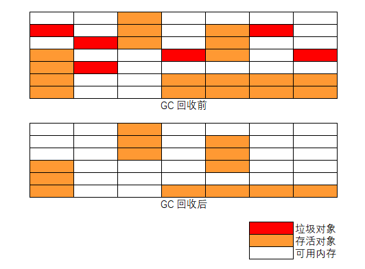
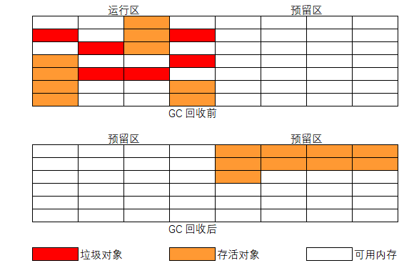
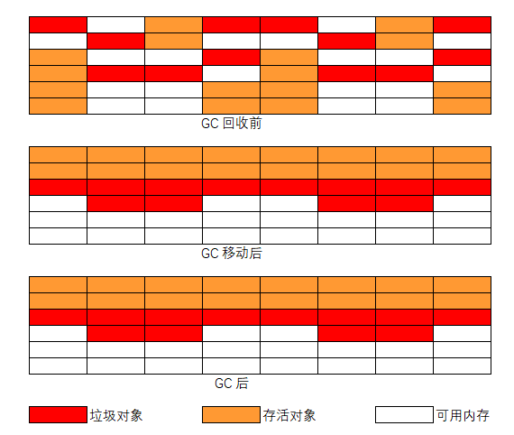
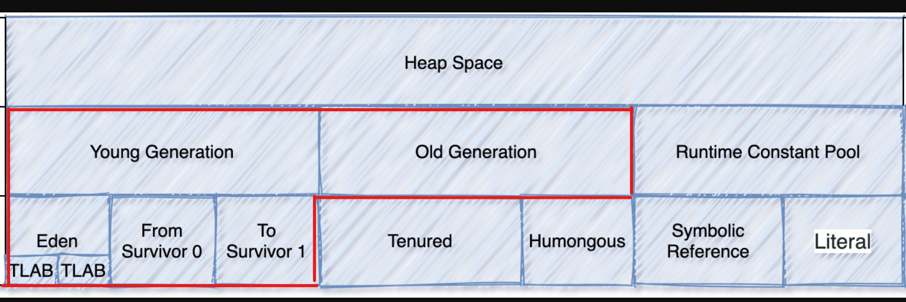

# Java 垃圾收集器 [GC (Garbage Collection) ]

参考文档：

- [标准版 HotSpot 虚拟机垃圾收集调优指南](https://docs.oracle.com/javase/8/docs/technotes/guides/vm/gctuning/)
- [美团 G1 垃圾收集器介绍](https://tech.meituan.com/2016/09/23/g1.html)
- [高级语言虚拟机论坛](https://hllvm-group.iteye.com/group/wiki/2859-JVM)
- [JVM 参数编辑](https://jvmmemory.com/)
- [应用应该大内存/小内存解析](https://blog.heaphero.io/2019/06/21/large-or-small-memory-size-for-my-app/)
- [7 个重要的 JVM 参数](https://blog.gceasy.io/2020/03/18/7-jvm-arguments-of-highly-effective-applications/)
- [美团 GC 分析](https://tech.meituan.com/2020/11/12/java-9-cms-gc.html)

在 Java 中需要关心内存的动态分配和垃圾（生命周期结束的对象实例）回收的问题，一切都交给 JVM 来处理。至于 JVM 如何回收无用的对象实例、如何释放空间开发者就无需关注。

垃圾回收就是释放生命周期结束后的对象实例占用的空间。

- 什么样的对象实例会被当作垃圾回收？（当一个对象不能再从正在运行的程序中的任何指针访问时，它就被认为是垃圾）

- 当对象实例被确定为垃圾后采用什么样的策略来回收（释放空间）？（垃圾收集算法）
- 在商业虚拟机中有哪些典型的垃圾收集器？

# 垃圾收集（GC）

## 判断/标识对象是否可回收

对于垃圾回收来说，判断并标识对象是否可回收是第一步，也就是如何判断对象是否存活，目前一般有两种方法：

- 引用计数法（Reference Counting）
- 可达性分析法 （GC Roots Tracing）

### 引用计数算法

当对象被引用一次，引用计数器加 1，对象失去引用时引用计数器减 1，计数器为 0 时就可以判断对象生命周期结束，可以回收。此算法简单、高效，但是存在对象循环引用计数问题。

### 可达性分析-根搜索算法

使用的是根搜索算法判定对象是否存活，常用的判断对象是否存活的算法。

根搜索算法的基本思路是通过称为 ***"GC Roots"*** 的根节点一直向下搜索（类似顺藤摸瓜）。从 *GC Roots* 向下搜索的过程中会构成一条对象之间相连的引用链（Reference  Chain），只要在引用链上的对象就是可达的（存活对象），在引用链之外的对象就是不可达，不可达对象就会被判定、标记为可为可回收对象。

在 JAVA 中，称为 *GC Roots* 的对象有：

- 虚拟机栈帧上本地变量表中的引用对象（方法参数、局部变量、临时变量）
- 方法区中的静态属性引用类型对象、常量引用对象
- 本地方法栈中的引用对象（Native 方法的引用对象）
- Java 虚拟机内部的引用对象，如异常对象、系统类加载器等
- 所以被同步锁（synchronize）持有的对象
- Java 虚拟机内部情况的注册回调、本地缓存等

虽然可达性分析理论上很好理解，但是在实际的程序运行时，情况会变得更加的复杂，需要考虑的问题也会变难。因为在可达性分析的同时运行着的程序内存是一直在动态变的，会有一边分析一边又产生新的对象或修改原有分析对象等的情况。

#### 对象三色标记

在可达性分析算法从 *GC Roots* 根往下搜索的时候，对象会存在三种状态，分别用三种颜色表示：

- 白：对象没有被标记到，搜索标记结束后会被当作垃圾回收掉
- 灰：对象被标记了，但是所在对象的属性字段还没有被标记，或者没有判断、标记完全
- 黑：对象被标记了，且它的所有内部属性字段也被标记完成

由于标记时运行程序和标记程序执行并发阶存在，突变对象 (Mutator) 和 Garbage Collector 线程同时对对象进行修改，就会出现白对象漏标的情况。

## 垃圾回收算法

如何判断对象是否可回收问题由可达性分析算法解答了。

垃圾回收的过程中，内存空间如何变化？如何高效、正确的收集标识的可回收对象内存空间由垃圾回收算法解决：

- 标记-清除算法
- 标记-复制算法
- 标记-整理算法

### 标记-清除算法（mark-sweep）

可以理解为有两个阶段： 1. 首先标记出所有需要回收的垃圾对象 2. 对标记的对象占用的内存空间进行释放。



算法缺点：

- 标记/清除的效率不高（对比复制算法），在标记/清除的过程中，会扫描整个堆内存，比较耗时
- 垃圾对象清理后，导致内存空间不连续，产生大量的小内存空间垃圾碎片，当有大对象需要分配内存时，找不到满足的内存空间，触发下次垃圾收集（内存碎片问题）

### 标记-复制算法（mark-copying）

针对上面**标记-清除**算法的执行效率和内存碎片缺点，提出的标记-赋值算法。

标记复制算法把内存空间分成大小相同的两个区域（运行区、预留区）。所有创建的对象都放到运行区，当运行区内存不够时，将运行区收集/标记后的存活对象全部复制到预留区，然后清空整个运行区，在把预留区和运行区对换。垃圾就在两个区域变换时被清除，同时没有了内存碎片产生。



标记-复制算法在大量垃圾对象的情况时，只需复制少量的存活对象且不会产生内存碎片问题，新的对象内存分配只需移动堆的指针在顺序分配就好，兼容的效率和内存碎片问题。

缺点：

- 内存被划分为两个区域，一半的预留区域没有使用，造成空间浪费（空间利用率低）
- 当内存中存活对象占多数时，需要复制大量的存活对象，才能释放少量的空间（效率低）

### 标记-整理算法（mark-compact）

标记-复制算法要浪费一半内存空间，且在大多数对象都是存活状态时垃圾收集效率会很低，为了克服这个问题，又提出了标记整理算法。

标记-整理算法的标记阶段和上面的算法一致，在整理阶段不是进行直接清理，而是令所有存活的对象向内存的一端空间移动，然后直接清理掉存活对象边界以外的内存空间。



标记-整理算法解决了内存碎片问题，也不存在空间的浪费问题。

缺点：

- 标记和清除效率都不高，这种方式在标记和整理移动的过程中也是耗时的
- 当内存中大多是存活小对象，而垃圾对象少时，需要移动大量的存活对象才能换取少量的内存空间

# JDK 1.8 常用的垃圾收集器

## JDK 1.8 中 JVM 的内存布局

参考文档：

- [JVM 运行区内存布局](https://docs.oracle.com/javase/specs/jvms/se8/html/jvms-2.html#jvms-2.5)

JVM 运行数据区域内存布局


JVM 堆内存布局，此处仅需关注红框部分区域内存，GC 也是在这内存区域执行。



## 标准版 HotSpot 虚拟机垃圾收集

主流虚拟机（Hotspot VM）的垃圾回收都采用 “分代回收” 的算法。

“分代回收” 是基于这样一个事实：对象的生命周期不同，所以针对不同生命周期的对象可以采取不同的回收方式，以便提高回收效率。

Hotspot VM 将内存划分为不同的物理区，就是“分代”思想的体现。JVM 内存主要由新生代、老年代、永久代构成 （JDK1.8 变为了 MetaSpace）。

- 新生代的垃圾回收（又称 **Minor GC**）：其中很多对象的生命周期很短，垃圾回收后只有少量对象存活，所以选用复制算法，只需要少量的复制成本就可以完成回收。
- 老年代的垃圾回收（又称 **Major GC**）：区域中对象存活率高，通常使用 “标记-清理” 或 “标记-整理” 算法。
- 整堆包括新生代和老年代的垃圾回收称为 **Full GC**：（HotSpot VM 里，除了 CMS 之外，其它能收集老年代的 GC 都会同时收集整个 GC 堆，包括新生代）。

**注意：** 各分区的大小对GC的性能影响很大。如何将各分区调整到合适的大小，分析活跃数据的大小是很好的切入点。

### 垃圾收集的目标

基于行为的调优。

**`-XX:+UseParallelGC (jdk 1.8 default)`** 对于并行（parallel）收集器，Java SE 提供了两个基于实现应用程序指定行为的垃圾收集调优参数：**最大暂停时间**（ maximum pause time）目标和应用程序**吞吐量**（throughput ）目标，这两个选项在其他收集器中不可用。

- 最大暂停时间：暂停时间是垃圾收集器停止应用程序并恢复不再使用的空间的持续时间 （`-XX:MaxGCPauseMillis=<nnn>`）
- 吞吐量：是根据收集垃圾所花费的时间和在垃圾收集之外花费的时间（称为应用程序时间）比值来衡量的。`-XX:GCTimeRatio=<nnn>`，垃圾收集时间与应用时间的比值为 `1/(1 + <nnn>)`
- 脚印目标（Footprint Goal）：如果已达到吞吐量和最大暂停时间目标，则垃圾收集器会减小堆的大小，直到无法满足其中一个目标（始终是吞吐量目标）。然后解决未实现的目标。

性能（Performance）注意事项：

- 吞吐量（*Throughput*）：吞吐量是长时间考虑的未花费在垃圾收集中的总时间的百分比。吞吐量包括分配所花费的时间（但通常不需要调整分配速度）。（高吞吐，每秒完成多少次事务）
- 暂停（*Pauses*）时间：暂停是应用程序由于垃圾收集而出现无响应的时间。（低延迟，请求必须多少毫秒内完成响应）

## JDK 1.8 可用的收集器

[参考官方标准 gc 说明文档](https://docs.oracle.com/javase/8/docs/technotes/guides/vm/gctuning/)

- 串型（Serial）收集器：`-XX:+UseSerialGC`
- 并行（Parallel）收集器：**吞吐量**，`-XX:+UseParallelGC (default)` [(major collections)默认启用并行压缩]，`-XX:-UseParallelOldGC` 关闭并行压缩。
- 并发（concurrent）收集器：**暂停时间**，保持垃圾收集暂停时间短，`-XX:+UseConcMarkSweepGC` 【CMS 】，需要设置大的堆内存空间。还可以选用 `-XX:+UseG1GC` G1 收集器。

| **GC Algorithm**                                            | **JVM argument**        |
| ----------------------------------------------------------- | ----------------------- |
| Serial GC                                                   | -XX:+UseSerialGC        |
| Parallel GC （Java 8 Default GC Algorithm）吞吐量           | -XX:+UseParallelGC      |
| Concurrent Market & Sweep (CMS) GC ，响应时间               | -XX:+UseConcMarkSweepGC |
| G1 GC （Java 9 Default gc algorithm），平衡吞吐量和响应时间 | -XX:+UseG1GC            |
| Shenandoah GC                                               | -XX:+UseShenandoahGC    |
| Z GC （ JVM 11+，性能极好）                                 | -XX:+UseZGC             |
| Epsilon GC                                                  | -XX:+UseEpsilonGC       |

### 常用 JVM 参数

推荐内存空间大小设置：**活跃数据的大小**是指，应用程序稳定运行时长期存活对象在堆中占用的空间大小，也就是 Full GC 后堆中老年代占用空间的大小。

| 空间   | 倍数                                    |
| :----- | :-------------------------------------- |
| 总大小 | **3-4** 倍活跃数据的大小                |
| 新生代 | **1-1.5** 活跃数据的大小                |
| 老年代 | **2-3** 倍活跃数据的大小                |
| 永久代 | **1.2-1.5** 倍Full GC后的永久代空间占用 |

调整内存空间布局参数：

```bash
# 打印 GC 信息参数
-XX:+PrintGCDetails # 打印 gc 详情
-verbose:gc # 详细的堆大小信息
-XX:+PrintGCDateStamps # 打印 gc 发生的时间戳
-XX:+PrintTenuringDistribution # 打印 gc 发生时的分代信息
-XX:+PrintGCApplicationStoppedTime # 打印 gc 停顿时长
-Xloggc:/path/gc.log # GC 日志输出文件路径

# 内存分配
-Xms2g -Xmx2g
-Xmn1g # 年轻代最大内存
-Xss256k 
-XX:NewRatio=2 # young:tenured generation = 1:2, young = 1/3, default new = 1/3
-XX:SurvivorRatio=8 # 这通常对性能调优并不重要 eden/a survivor = 1:8,每个幸存者空间将是伊甸园大小的八分之一， eden = 8/(8 + 1 + 1) * young, default eden = 8/10 = [young * n/(n + 2)]
-XX:MetaspaceSize=265M
```

```
# -verbose:gc
[GC 325407K->83000K(776768K), 0.2300771 secs]
[Full GC 267628K->83769K(776768K), 1.8479984 secs]
# 325407K->83000K : 表示垃圾收集前后活动对象的大小
# (776768K) : 堆中可用的内存数，数字只包括 survivor 空间之一
# 0.2300771 secs : 执行垃圾收集使用的时间

# -XX:+PrintGCDetails
[GC [DefNew: 64575K->959K(64576K), 0.0457646 secs] 196016K->133633K(261184K), 0.0459067 secs]
# 64575K->959K(64576K), 0.0457646 secs ： 次要收集回收了大约 98% 的年轻代，用时 0.0457646 secs
# 196016K->133633K(261184K) ： 整个堆减少到大约 51%

# -XX:+PrintGCTimeStamps : 添加了时间戳
```

### 并行（Parallel）收集器

参考文档：[并行收集器介绍](https://docs.oracle.com/javase/8/docs/technotes/guides/vm/gctuning/parallel.html)

并行垃圾收集器主要是针对 **吞吐量（*Throughput*）** 调优的垃圾收集器。

与串型垃圾收集器不同点在于使用多线程加速垃圾收集，默认情况下，次要（minor）和主要（major）垃圾收集都并行执行以进一步减少垃圾收集开销。

**注意：** 当线程数（N）大于 8 时，使用大于 5/8 * N 的线程数执行，N 小于 8 时执行线程就是 N。

开启参数：`-XX:+UseParallelGC`，在执行 *major collections* 是默认开启了并行压缩特性的，关闭并行压缩参数 `-XX:-UseParallelOldGC`。

减少垃圾收集器线程的数量并增加老年代的大小将减少这种碎片效应。

#### 常用调整参数

- **`-XX:ParallelGCThreads=<N>`** 参数指定并行垃圾回收的线程数
- **`-XX:GCTimeRatio=19`** 调整吞吐量，= `1 / (1 + <N>)`，总的垃圾收集时间占运行时间的 1/20 或者 5%。默认是 99，即总垃圾收集时间占 1%。

### 并发（Concurrent）收集器

参考文档：[常用并发垃圾收集器说明](https://docs.oracle.com/javase/8/docs/technotes/guides/vm/gctuning/concurrent.html)，[CMS 标记清除垃圾收集器介绍](https://docs.oracle.com/javase/8/docs/technotes/guides/vm/gctuning/cms.html#concurrent_mark_sweep_cms_collector)，[G1 (Garbage-First) 垃圾收集器介绍](https://docs.oracle.com/javase/8/docs/technotes/guides/vm/gctuning/g1_gc.html#garbage_first_garbage_collection)

并发收集器执行和应用程序并发执行的，为了保证垃圾收集的暂停时间尽可能的短。

#### 并发标记清除 (CMS) 垃圾收集器

并发 CMS 垃圾收集器主要是针对 **最短暂停时间** 调优的垃圾收集器，*CMS* 是唯一一个没有压缩功能的收集器。

开启参数：`  -XX:+UseConcMarkSweepGC`

##### CMS 的 4 个主要阶段

1. **`Init-mark`** 初始标记 (STW) ：该阶段进行可达性分析，标记 *GC Roots* 能直接关联到的对象，所以很快。 
2. **`concurrent marking phase`** 并发标记：由前阶段标记过的对象出发，所有可到达的对象都在本阶段中标记。 
3. **`Remark`** 重标记 (STW) ：暂停所有用户线程，重新扫描堆中的对象，进行可达性分析，标记活着的对象。因为并发标记阶段是和用户线程并发执行的过程，所以该过程中可能有用户线程修改某些活跃对象的字段，指向了一个未标记过的对象，如对象在并发标记开始时不可达，但是并行期间引用发生变化，变为对象可达，这个阶段需要重新标记出此类对象，防止在下一阶段被清理掉，这个过程也是需要 STW 的。**特别需要注意一点，这个阶段是以新生代中对象为根来判断对象是否存活的。** Remark 阶段必须扫描整个堆来判断对象是否存活，包括不可达对象。**为了修正并发标记期间因用户程序继续运作而导致标记产生变动的那一部分对象的标记记录**。
4. 并发清理，进行并发的垃圾清理。

##### CMS 主要存在的 3 个问题：

1. 内存碎片（原因是采用了标记-清除算法）
2. 对 CPU 资源敏感（原因是并发时和用户线程一起抢占 CPU）
3. 浮动垃圾：在并发标记阶段产生了新垃圾不会被及时回收，而是只能等到下一次 GC

[浮动垃圾的产生](https://docs.oracle.com/javase/8/docs/technotes/guides/vm/gctuning/cms.html)：第二次暂停是在并发跟踪阶段结束时进行的，它查找由于CMS收集器完成对对象的引用后，应用程序线程对对象中的引用进行更新而导致并发跟踪遗漏的对象。该第二暂停称为重新标记暂停。

##### 参数调优

**`-XX:CMSFullGCsBeforeCompaction`** ：设置在执行多少次 *Full GC* 后对内存空间进行压缩整理，默认是 0 就可以。

CMS 提供 **`CMSScavengeBeforeRemark`** 参数，用来保证 Remark 前强制进行一次 **Minor GC**。

总结来说，**CMS** 的设计聚焦在获取最短的时延，为此它 “不遗余力” 地做了很多工作，包括尽量让应用程序和 GC 线程并发、增加可中断的并发预清理阶段、引入卡表等，虽然这些操作牺牲了一定吞吐量但获得了更短的回收停顿时间。

#### G1 (Garbage-First) 垃圾收集器

G1 垃圾收集器主要是平衡响应时间和吞吐量之间的垃圾收集器，设计目标是取代 CMS 收集器。针对具有大内存的多处理器机器。它试图在实现高吞吐量的同时以高概率满足垃圾收集 (GC) 暂停时间目标。

开启参数：`-XX:+UseG1GC`

同 CMS 相比，在以下方面表现的更出色： 

- G1 是有整理内存过程的垃圾收集器，不会产生很多内存碎片。
- G1 的 Stop The World (STW) 更可控，G1 在停顿时间上添加了预测机制，用户可以指定期望停顿时间。

Garbage-First (G1) 垃圾收集器，高概率满足 GC 暂停时间目标，同时保持良好的吞吐量。

G1 提供了两种 GC 模式，**Young GC** 和 **Mixed GC**，两种都是完全 **Stop The World** 的。 

* Young GC：选定所有年轻代里的 Region，通过控制年轻代的 region 个数，即年轻代内存大小，来控制 young GC 的时间开销。
* Mixed GC：选定所有年轻代里的 Region，外加根据 global concurrent marking 统计得出收集收益高的若干老年代 Region，在用户指定的开销目标范围内尽可能选择收益高的老年代 Region。

由此可知，Mixed GC 不是 full GC，它只能回收部分老年代的 Region，如果 mixed GC 实在无法跟上程序分配内存的速度，导致老年代填满无法继续进行 Mixed GC，就会使用 serial old GC（full GC）来收集整个 GC heap，所以 **G1 是不提供 full GC 的**。

##### 引入的新概念

在G1的实现过程中，引入了一些新的概念，对于实现高吞吐、没有内存碎片、收集时间可控等功能起到了关键作用：

**Region** 

传统的GC收集器将连续的内存空间划分为新生代、老年代和永久代（JDK 8 去除了永久代，引入了元空间Metaspace），这种划分的特点是各代的存储地址（逻辑地址，下同）是连续的。

而 G1 的各代存储地址是不连续的，每一代都使用了 n 个不连续的大小相同的 Region，每个 Region 占有一块连续的虚拟内存地址。

**注意：** 一个 Region 的大小可以通过参数 **`-XX:G1HeapRegionSize`** 设定，取值范围从 1M 到 32M，且是 2 的指数。如果不设定，那么 G1 会根据 Heap 大小自动决定。

**SATB**

全称是 Snapshot-At-The-Beginning，由字面理解，是 GC 开始时活着的对象的一个快照。

针对对多核处理器（multiprocessor）、大容量内存（RAM）的服务器。堆（heap）大小在 6GB 左右或者更大，GC 延迟要求有限（稳定且可预测的暂停时间低于 0.5 秒）。

| 参数                               | 含义                                                         |
| :--------------------------------- | :----------------------------------------------------------- |
| -XX:G1HeapRegionSize=n             | 设置 Region 大小，并非最终值                                 |
| -XX:MaxGCPauseMillis               | 设置 G1 收集过程目标时间，默认值 200ms，不是硬性条件         |
| -XX:G1NewSizePercent               | 新生代最小值，默认值 5%                                      |
| -XX:G1MaxNewSizePercent            | 新生代最大值，默认值 60%                                     |
| -XX:ParallelGCThreads              | STW 期间，并行 GC 线程数                                     |
| -XX:ConcGCThreads=n                | 并发标记阶段，并行执行的线程数                               |
| -XX:InitiatingHeapOccupancyPercent | 设置触发标记周期的 Java 堆占用率阈值。默认值是 45%。这里的 java 堆占比指的是 non_young_capacity_bytes，包括 old+humongous |

## GC 调优

### 优化步骤

明确应用程序的系统需求是性能优化的基础，系统的需求是指应用程序运行时某方面的要求，譬如：

- 高可用，可用性达到几个 9。 
- 低延迟，请求必须多少毫秒内完成响应。 
- 高吞吐，每秒完成多少次事务。

明确系统需求之所以重要，是因为上述性能指标间可能冲突。比如通常情况下，缩小延迟的代价是降低吞吐量或者消耗更多的内存或者两者同时发生。

若是主要关注高可用和低延迟两项指标，如何量化 GC 时间和频率对于响应时间和可用性的影响。通过这个量化指标，可以计算出当前 GC 情况对服务的影响，也能评估出 GC 优化后对响应时间的收益，这两点对于低延迟服务很重要。

- 在相同的内存分配率的前提下，新生代中的 Eden 区增加一倍，**Minor GC** 的次数就会减少一半。
  - Minor GC 时间更多取决于 GC 后存活对象的数量，而非 Eden 区的大小
- 对象生命周期的分布情况
  - 如果应用存在大量的短期对象，应该选择较大的年轻代
  - 如果存在相对较多的持久对象，老年代应该适当增大