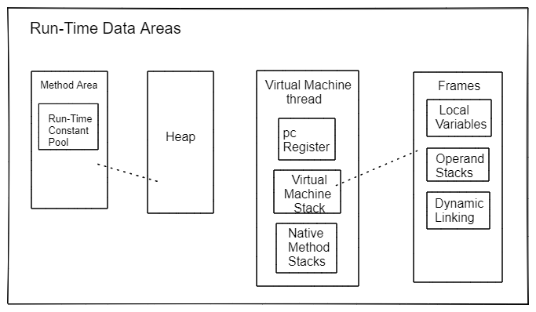

# JDK 1.8 虚拟机（JVM）的结构

## 引用（Reference）类型和值（Value）

有三种引用类型：类类型 (`class`)、数组类型(`array`)、接口类型(`interface`)
数据的元素类型可是：原始类型、类(class)类型、接口类型
引用类型默认值为 `null` (指向没有对象)

## 运行时（Run-Time）数据区

Java 虚拟机定义了在程序执行期间使用的各种运行时数据区域。其中一些数据区是在 Java 虚拟机启动时创建的，只有在 Java 虚拟机退出时才会被销毁。其他数据区域是每个线程。每个线程的数据区域在创建线程时创建，并在线程退出时销毁。

### 堆（Heap）

**Java 虚拟机有一个在所有 Java 虚拟机线程之间共享的堆（*Heap*）**。堆是为所有类实例和数组分配内存的运行时（run-time）数据区域。

堆是在虚拟机启动（start-up）时创建的。对象的堆存储由自动存储管理系统回收（garbage collector）；对象永远不会被显式释放（deallocated）。

堆相关异常：*OutOfMemoryError*

### 方法区（Method Area）

**Java 虚拟机有一个在所有 Java 虚拟机线程之间共享的方法区。**

方法区类似于传统语言的编译代码的存储区，或者类似于操作系统进程中的“文本”（text）段。它存储每个类的结构，例如：**运行时常量池**（run-time constant pool）、字段（field）和方法数据（method data），以及方法（method）和构造函数（constructors）的代码，包括类、实例和接口初始化中使用的特殊方法。

方法区是在虚拟机启动（start-up）时创建。尽管方法区在逻辑上是堆的一部分，但简单的实现可能会选择不进行垃圾收集或压缩它。

相关异常：*OutOfMemoryError*

#### 运行时常量池（run-time pool）

运行时常量池 （*run-time constant pool*） 是类文件（*class*）中常量池表（*constant_pool*）在每个类（*per-class*）或每个接口（*per-interface*）运行时的表示。

它包含多种常量（constants），从编译时（*compile-time*）已知的数字文本到必须在运行时解析的方法和字段引用。运行时常量池的功能类似于传统编程语言的符号表，尽管它包含比典型符号表更广泛的数据。

每个运行时常量池都是从 Java 虚拟机的方法区分配的，类或接口的运行时常量池是在 Java 虚拟机创建类或接口时构建的。

可能发生的异常：*OutOfMemoryError*

### 虚拟机线程

#### PC 寄存器 (Program Counter Register)

Java 虚拟机支持多个线程同时执行。**每个 Java 虚拟机（*Java Virtual Machine*）线程都有自己的 *pc*（program counter）寄存器（register）。**

在任何时候，每个 Java 虚拟机线程都在执行单个方法的代码，即该线程的当前方法。如果该方法不是本地（*native*）方法，则 *pc* 寄存器保存当前正在执行的 Java 虚拟机指令的地址。如果当前线程正在执行的方法是本地（*native*）方法，Java 虚拟机的 pc 寄存器的值是未定义（*undefined*）的。

Java 虚拟机的 pc 寄存器足够大，可以保存特定平台上的 *returnAddress* 或本地指针。

#### Java 虚拟机栈（Stacks）

**每个 Java 虚拟机线程都有一个私有的 Java 虚拟机堆栈，与线程同时创建**。Java 虚拟机堆栈存储帧（*Frame*）。Java 虚拟机堆栈类似于 C 等传统语言的堆栈，它保存局部（local）变量和部分结果，并参与方法调用和返回。

因为除了推送（push）和弹出（pop）帧（Frame）外，Java 虚拟机堆栈永远不会被直接操作，因此帧可能是堆分配的。

Java 虚拟机堆栈的内存不需要是连续的。

和栈相关的异常：*StackOverflowError*，*OutOfMemoryError*

#### 本地方法栈（Native Method Stacks）

本地方法（*native*）：由不是 Java 编程语言所编写的方法。

本机方法堆栈也可以被 Java 虚拟机指令集的解释器实现使用，例如 C。无法加载本地方法且本身不依赖传统堆栈的 Java 虚拟机实现不需要提供本地方法堆栈。

如果提供，**本地方法堆栈通常在创建每个线程时为每个线程分配**。

可能产生的异常：*StackOverflowError*，*OutOfMemoryError*

## 栈帧 （Frames）

帧（Frame）用于存储数据和部分结果，以及执行动态链接、方法返回值和调度异常。

**每次调用方法时都会创建一个新栈帧。**栈帧在其方法调用完成时被销毁，无论该完成是正常的还是突然的（抛出未捕获的异常）。

**帧是从创建帧的线程的 Java 虚拟机堆栈中分配的**。每个帧都有自己的局部变量（local variables）数组、自己的操作数堆栈、对当前方法所在类的运行时常量池的引用。

局部变量数组和操作数堆栈的大小在编译时确定，并与与帧关联的方法的代码一起提供。因此帧数据结构的大小只取决于 Java 虚拟机的实现，这些结构的内存可以在方法调用时同时分配。

只有一个帧，即执行方法的帧，在给定的控制线程中的任何点都是活动的。该帧称为当前帧（*current frame*），其方法称为当前方法（*current method*）。定义当前方法的类就是当前类（*current class*）。对局部变量和操作数堆栈的操作通常参考（reference）当前帧。

如果一个帧（frame）的方法调用另一个方法或如果它的方法完成，则该帧不再是当前的。当方法被调用时，且控制转移到新的方法时会创建一个新的栈帧，然后把创建的新栈帧变成为当前帧。

在方法返回时，当前帧将其方法调用的结果（如果有）传递回前一帧。然后丢弃当前帧，因为前一帧变成当前帧。

注意：由线程创建的栈帧是属于该线程本身的，不能被任何其他线程引用。

#### 局部变量（Local Variables）

每个栈帧都包含了一个称为局部变量（*local variables*）的变量数组。一个帧的局部变量数组长度在编译时（compile time）就确定了，在类或接口中以二进制表示提供，伴随着栈帧关联的方法的代码。

单个局部变量可以保存一个类型的值 `boolean`, `byte`, `char`, `short`, `int`, `float`, `reference`, 或 `returnAddress`。一对局部变量可以保存一个类型的值 `long` 或 `double`。

局部变量通过索引来寻址。第一个局部变量的索引为零。当且仅当整数索引值在 0 到局部变量数组长度之间的值才被认为是合法的索引值。

Java 虚拟机使用局部变量在方法调用时传递参数。在类方法调用时，任何参数都在从局部变量 0 开始的连续局部变量中传递。

*在实例方法调用时，局部变量 0 始终用于传递对正在调用实例方法的对象的引用（在 Java 语句中，指的是 this）*。随后，任何参数都从局部变量 1 开始在连续的局部变量中传递。

####  操作栈 （Operand Stacks）

每个栈帧都包含一个称为操作栈（*operand stack*）的后进先出（last-in-first-out LIFO）的栈。一个帧的操作栈深度在编译时就确定了，伴随着帧相关的方法代码提供。

在上下文清楚的地方，我们有时会将当前帧的操作数堆栈简称为操作数堆栈。

创建包含它的帧时，操作数堆栈为空。Java 虚拟机提供指令以将局部变量或字段中的常量或值加载到操作数堆栈上。其它 Java 虚拟机指令从操作数堆栈中获取操作数对其进行操作，然后将结果推回操作数堆栈。操作数堆栈还用于准备要传递给方法的参数和接收方法结果。

操作数堆栈上的每个条目都可以保存任何 Java 虚拟机类型的值，包括 long 或 double 类型的值。

#### 动态链接（Dynamic Linking）

每个帧都包含对当前方法类型的运行时常量池的引用，以支持方法代码的动态链接（*dynamic linking*）。

方法和变量的这种后期绑定使得方法使用的其它类中的更改不太可能破坏此代码。

#### 普通方法调用完成（Normal Method Invocation Completion）

如果当前方法的调用正常完成，则可能会向调用方法返回一个值。当被调用的方法执行返回指令之一时会发生这种情况，选择的返回指令必须适合返回值的类型（如果有）。

在这种情况下，当前帧用于恢复调用者的状态，包括其局部变量和操作数堆栈，调用者的程序计数器适当地递增以跳过方法调用指令。然后在调用方法的帧中正常继续执行，并将返回值（如果有）推送到该帧的操作数堆栈中。

#### 异常方法调用完成（Abrupt Method Invocation Completion）

如果在方法中执行 Java 虚拟机指令导致 Java 虚拟机抛出异常，并且该异常不在方法内处理，则方法调用会突然完成。

执行 *athrow* 指令也会导致显式抛出异常，如果当前方法未捕获到异常，则会导致方法调用突然完成。

突然完成的方法调用永远不会向其调用者返回值。