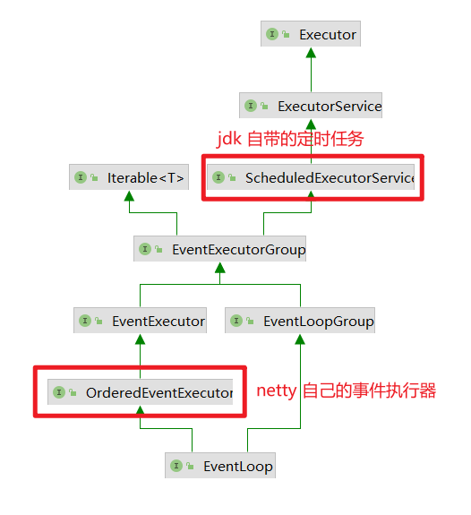
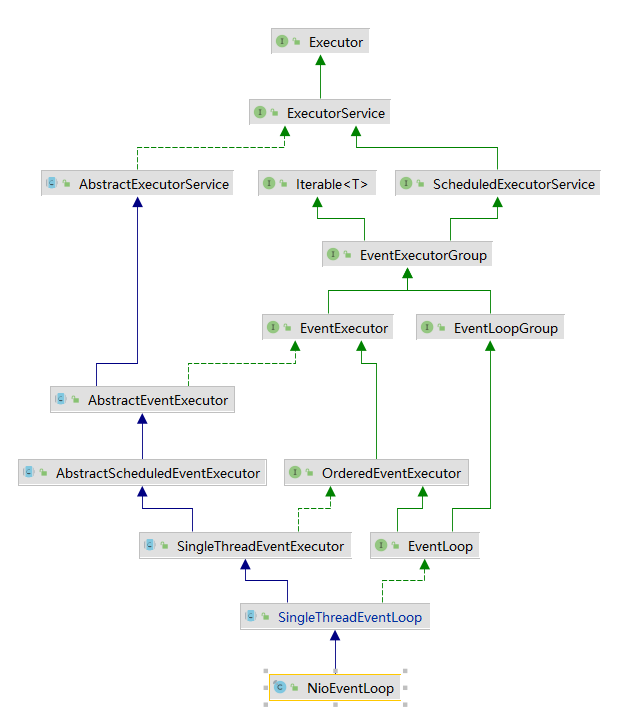

# Netty 开始示例

## 开始 hello world 示例

### 服务端编码

```java
// boss 只负责 ServerSocketChannel 上的 accept 事件，此线程数无意义，仅会占用一个线程处理 accept
NioEventLoopGroup bossGroup = new NioEventLoopGroup(1);
// Worker Event Loop (selector, thread)
// boss 负责处理连接， worker(child) 负责 SocketChannel 处理读写
NioEventLoopGroup workerGroup = new NioEventLoopGroup(4);

ServerBootstrap serverBootstrap = new ServerBootstrap();
serverBootstrap.group(bossGroup, workerGroup);
serverBootstrap.channel(NioServerSocketChannel.class);
// 定义 worker(child) 能执行那些操作
// Channel 代表和客户端进行读写的通道， Initializer 负责添加 handler
serverBootstrap.childHandler(new ChannelInitializer<NioSocketChannel>() {
    @Override
    protected void initChannel(NioSocketChannel ch) throws Exception {
        // 将 ByteBuf 转为字符串
        ch.pipeline().addLast(new StringDecoder());
        // 自定义 handler 处理器
        ch.pipeline().addLast(new ChannelInboundHandlerAdapter() {
            @Override
            public void channelRead(ChannelHandlerContext ctx, Object msg) throws Exception {
                // 打印上一个 handler 处理后的字符串
                System.out.println(msg);
            }
        });
    }
});

// 绑定监听端口
serverBootstrap.bind(19090);
```

### 客户端编码

```java
// 事件处理组
NioEventLoopGroup workerGroup = new NioEventLoopGroup(4);
// 创建启动类
Bootstrap bootstrap = new Bootstrap();
bootstrap.group(workerGroup);
// 选择  channel 的实现
bootstrap.channel(NioSocketChannel.class);
// 添加处理器
bootstrap.handler(new ChannelInitializer<NioSocketChannel>() {
    // 在连接建立后会被调用
    @Override
    protected void initChannel(NioSocketChannel ch) throws Exception {
        // 添加 String 编码器
        ch.pipeline().addLast(new StringEncoder());
    }
});
// 连接到 server
// sync() - 同步阻塞方法，直到连接完成建立，最后得到建立好连接的 channel
Channel channel = bootstrap.connect(new InetSocketAddress("127.0.0.1", 19090)).sync().channel();
// 发送消息
channel.writeAndFlush("Hello, World!");
```

## netty 提示说明

- **`Channel`** 数据处理的通道
- **`handler`** 为数据处理的工序，**`pipeline`** 负责发布事件 （读、读完成）传递给每个 handler 处理，handler 也分为 inBound 和 outBount 两类。
- **`EventLoop`** 执行数据处理操作
  - 一个 EvnetLoop 可以处理多个 channle io 操作，并且 channel 整个生命周期都仅会和一个 eventloop 会绑定
  - EventLoop 处理任务可分为普通任务和定时任务
  - EventLoop 按照 pipeline 顺序依次按照 handler 处理数据，每个 handler 可以指定 EventLoop 处理任务

**注意：** 一但连接建立完成，channel 就会好指定 EventLoop 某个线程处理器绑定，不会变更

- 单线程没法异步提高效率，必须配合多线程、多核 CPU 才能发挥异步的优势
- 异步没有缩短响应时间，反而会有所增加
- 合理的进行异步任务拆分，是利用异步的关键

## 组件

### EventLoop

EventLoop 内部是单线程执行器（同时维护了一个 selector），内部 run 方法循环处理 Channel 上不间断的 io 事件。



EventLoop 继承关系比较复杂，主要的继承关系为：

- 一是继承自 *java.util.concurrent.ScheduledExecutorService* ，因此包含了线程池中的所有方法
- 继承自 netty 自己的 *OrderedEventExecutor (空接口) - EventExecutor* 处理 io 事件
  - 提供 *`EventExecutor#inEventLoop(java.lang.Thread)`* 方法判断线程是否属于此 EventLoop
  - *`EventExecutor#parent`* 方法来看自己属于那个 EventLoopGroup

```java
// 创建事件循环组
// io 事件，可以处理普通任务、定时任务
// 默认构造方法，初始化线程数为 NettyRuntime.availableProcessors() * 2 ，最小默认为 1
NioEventLoopGroup group = new NioEventLoopGroup(2);

// MultithreadEventExecutorGroup.MultithreadEventExecutorGroup(int, Executor, EventExecutorChooserFactory, Object...)
// children = new EventExecutor[nThreads];
// 获取下一个事件循环对象 ，内部是一个指定线程大小的数组
// 这里指定的线程数量为 2，轮询使用 EventLoop
System.out.println(group.next()); // io.netty.channel.nio.NioEventLoop@5bc79255
System.out.println(group.next()); // io.netty.channel.nio.NioEventLoop@47ef968d
System.out.println(group.next()); // io.netty.channel.nio.NioEventLoop@5bc79255

// 处理普通任务
group.next().submit(() -> {
    try {
        Thread.sleep(1000);
    } catch (InterruptedException e) {
        e.printStackTrace();
    }
    logger.debug("ok");  // nioEventLoopGroup-2-1  线程处理
});
// 处理定时任务，nioEventLoopGroup-2-2 执行
group.next().scheduleAtFixedRate(() -> logger.debug("group schedule fix rate task"), 0, 1, TimeUnit.SECONDS);

logger.debug("main");

// 仅可以处理 普通任务，定时任务
// DefaultEventLoopGroup defaultGroup = new DefaultEventLoopGroup();
```

#### 指定具体 handler 的处理 EventLoop

```java
// 独立的事件循环组，处理耗时的业务操作
DefaultEventLoopGroup defaultLoopGroup = new DefaultEventLoopGroup(4);
new ServerBootstrap()
    .group(new NioEventLoopGroup(1), new NioEventLoopGroup(2))
    .channel(NioServerSocketChannel.class)
    .childHandler(new ChannelInitializer<NioSocketChannel>() {
        @Override
        protected void initChannel(NioSocketChannel ch) throws Exception {
            // 处理读事件
            ch.pipeline().addLast("handler1", new ChannelInboundHandlerAdapter(){
                // msg 没有 StringDecoder -> ByteBuf
                @Override
                public void channelRead(ChannelHandlerContext ctx, Object msg) {
                    // 使用创建的 worker 中绑定的 EventLoop 处理此操作 nioEventLoopGroup-4-1
                    ByteBuf byteBuf = (ByteBuf) msg;
                    logger.debug("handler1 read msg {}", byteBuf.toString(StandardCharsets.UTF_8));
                    // 将消息传递给下一个 handler 处理
                    ctx.fireChannelRead(msg);
                }
            });
            // 指定这个 handler 处理需要的 EventLoop
            ch.pipeline().addLast(defaultLoopGroup, "handler2", new ChannelInboundHandlerAdapter(){
                // msg 没有 StringDecoder -> ByteBuf
                @Override
                public void channelRead(ChannelHandlerContext ctx, Object msg) {
                    // 使用的是创建的指定 EventLoop 来处理这个操作 defaultEventLoopGroup-2-1
                    ByteBuf byteBuf = (ByteBuf) msg;
                    logger.debug("handler2 read msg {}", byteBuf.toString(StandardCharsets.UTF_8));
                }
            });
        }
    }).bind(19090);
```

#### hander 执行者 (EventLoop) 切换

```java
// AbstractChannelHandlerContext.invokeChannelRead(io.netty.channel.AbstractChannelHandlerContext, java.lang.Object)
static void invokeChannelRead(final AbstractChannelHandlerContext next, Object msg) {
    // Handler 如何切换具体的执行 EventLoop (执行人) ? msg -> NioSocketChannel , 返回当前 msg (NioSocketChannel)
    final Object m = next.pipeline.touch(ObjectUtil.checkNotNull(msg, "msg"), next);
    // 获取当前正在处理的 EventExecutor (NioEventLoop - 从 Channel 中获取的)，
    // 下一个 handler 的事件循环是否与当前事件处理是同一个线程
    EventExecutor executor = next.executor();
    // 是，直接调用， - GlobalEventExecutor.inEventLoop { return thread == this.thread; }
    if (executor.inEventLoop()) {
        next.invokeChannelRead(m);
    } else {
        // 不是，将要执行的代码任务逻辑交给下一个事件循环处理（换执行人）
        executor.execute(new Runnable() {
            @Override
            public void run() {
                next.invokeChannelRead(m);
            }
        });
    }
}
```

#### ChannelFuture 异步处理

```java
// 创建启动类
Bootstrap bootstrap = new Bootstrap();
bootstrap.group(new NioEventLoopGroup(4));
// 选择  channel 的实现
bootstrap.channel(NioSocketChannel.class);
// 添加处理器
bootstrap.handler(new ChannelInitializer<NioSocketChannel>() {
    // 在连接建立后会被调用
    @Override
    protected void initChannel(NioSocketChannel ch) throws Exception {
        // 添加 String 编码器
        ch.pipeline().addLast(new StringEncoder());
    }
});

// 带有 Future / Promise 的类型都是要和异步方法配套使用，处理结果
// 连接到 server， connect() -> 连接是耗时的，方法是
// 异步（main 发起调用，真正内部执行 connect() 的是 NioEventLoopGroup 线程调用执行）
// 非阻塞（调用完 connect() 不会阻塞，继续向下执行，因为调用 connect 的线程不关心结果）
ChannelFuture channelFuture = bootstrap.connect(new InetSocketAddress("127.0.0.1", 19090));

// 方法 1. 使用 sync() 同步处理
// sync() - 同步阻塞方法，直到连接完成建立，最后得到建立好连接的 channel
// 没有调用 syc() 获取到的 Channel 还是没有建立好连接的不完整的对象，无法发送数据，建立连接的是 NIO 线程
/*Channel channel = channelFuture.sync().channel();
        channel.writeAndFlush("Hello");
        System.out.println(channel);
        System.out.println("channel");*/

// 方法 2 , 使用 addListener 方法异步处理，等任务完成后执行回调函数
channelFuture.addListener(new ChannelFutureListener() {
    @Override
    public void operationComplete(ChannelFuture future) throws Exception {
        // 在 NIO 线程里建立好连接后会调用   OperationComplete
        Channel ch = future.channel();
        // nioEventLoopGroup-2-1
        logger.debug("channel {}", ch);
        ch.writeAndFlush("Hello");
    }
});
```

#### channel 关闭操作

```java
// 关闭方式，CloseFuture 对象，1) 同步处理关闭 2) 异步处理关闭
ChannelFuture closeFuture = channel.closeFuture();
System.out.println("waiting close ...");
// 方法 1. 同步关闭
/*closeFuture.sync();
System.out.println("处理关闭后的操作");
workerGroup.shutdownGracefully();*/

// 方法 2. 异步关闭
closeFuture.addListener(new ChannelFutureListener() {
    @Override
    public void operationComplete(ChannelFuture future) throws Exception {
        logger.debug("处理关闭后的操作");
        workerGroup.shutdownGracefully();
    }
});
```

### Future & Promise

netty 中处理异步会使用 **`Future`** 和 **`Promise`** 这两个异步接口。

- `Future` 是和 JDK 中的 Future 同名的接口，且继承自 JDK 的 Future，可以同步、异步得到处理结果，但是都必须得等到处理的任务结束。
- `Promise` 不仅有 Netty Future 的功能，而且脱离了任务独立存在，作为线程间任务结果的传递容器，继承自 Netty Future 接口。

#### Netty Future

future 的创建和结果赋值都不是调用着自己可以控制的，由异步框架自己处理。

```java
NioEventLoopGroup group = new NioEventLoopGroup();
// 任何一个 EventLoop 里仅有一个线程
EventLoop eventLoop = group.next();
io.netty.util.concurrent.Future<Integer> future = eventLoop.submit(new Callable<Integer>() {
    @Override
    public Integer call() throws Exception {
        logger.debug("调用计算");
        Thread.sleep(1000L);
        return 80;
    }
});

logger.debug("等待执行结果");
// netty 同步获取
/*Integer result = future.get();
logger.debug("结果 {}", result);
group.shutdownGracefully();*/

// netty 异步调用
future.addListener(new GenericFutureListener<io.netty.util.concurrent.Future<? super Integer>>() {
    @Override
    public void operationComplete(io.netty.util.concurrent.Future<? super Integer> future) throws Exception {
        // 这里是回调方法，结果可能是已经得到了，没必要在异步获取结果了。
        // 这里的调用线程和执行的 EventLoop 线程是同一个 (nioEventLoopGroup-2-1)
        Object result = future.getNow();
        logger.debug("结果 {}", result);
        group.shutdownGracefully();
    }
});
```

#### promise

```java
// 创建 EventLoop 对象
NioEventLoopGroup group = new NioEventLoopGroup(2);
EventLoop eventLoop = group.next();
// 可以主动自己创建 Promise
DefaultPromise<Integer> promise = new DefaultPromise<>(eventLoop);

new Thread(() -> {
    logger.debug("内部线程计算中");
    try {
        Thread.sleep(5000L);
    } catch (InterruptedException e) {
        e.printStackTrace();
    }
    // 任意一个线程处理结果，然后把结果放到 promise 中
    //promise.setSuccess(60);
    promise.setFailure(new IllegalArgumentException("参数错误"));
}).start();

// promise 也有同步和异步处理结果
logger.debug("等待处理结果 ...");
Integer result = promise.get();
logger.debug("结果 {}", result);
group.shutdownGracefully();

// 异步: promise.addListener(new GenericFutureListener<io.netty.util.concurrent.Future<? super Integer>>() { });
```

### Handler & Pipeline

ChannelHander 处理 Channel 上的各种事件，分为入站、出站两种，所有的 ChannelHandler 被连接成串就是 PipeLine 了。

- 入站处理器通常是 `ChannelInboundHandlerAdapter` 的子类，主要用于读取客户端的数据、会写结果
- 出站处理器通常是 `ChannelOutboundHandlerAdapter` 的子类，主要用于对写回结果进行加工。

netty 默认会自动添加 head (链头) / tail (链尾) 两个处理器。

Handler 的处理执行顺序：`ch.pipeline().addLast(handler)`

- 对于入站：addLast 顺序是 h1 -> h2 -> h3 , 正确处理顺序 h1 -> h2 -> h3
- 对应出站：addLast 顺序是 h1 -> h2 -> h3 , 正确处理顺序  h3 -> h2 -> h1

```java
pipeline.addLast("in3", new ChannelInboundHandlerAdapter() {
    @Override
    public void channelRead(ChannelHandlerContext ctx, Object msg) throws Exception {
        logger.debug("in3");
        ByteBuf byteBuf = ctx.alloc().buffer().writeBytes("Server Echo".getBytes(StandardCharsets.UTF_8));

        // 调用 SocketChannel write 数据时，是从整个 pipeline 链的最后 (tail) 往 head 开始处理
        ch.writeAndFlush(byteBuf);
        // ChannelHandlerContext write 数据时，是从在 pipeline 当前 handler 处理节点开始往 head 节点处理
        // ctx.writeAndFlush(byteBuf);
        // msg -> 把当前 handler 处理好的数据作为参数传给下一个 handler 处理
        // 若是没有往下调用下一个 handler 处理数据，整个 pipeline handler 处理链就断掉了
        super.channelRead(ctx, msg);
        // 或调用 ctx 的 fireChannelRead 方法调用下个 handler 处理数据
        // ctx.fireChannelRead(msg);
    }
});
```

##### EmbeddedChannel 模拟 channel 操作

```java
EmbeddedChannel channel = new EmbeddedChannel(in1, in2, in3, out1, out2, out3);
// 模拟入站操作
ByteBuf byteBuf = ByteBufAllocator.DEFAULT.buffer().writeBytes("Hello".getBytes(StandardCharsets.UTF_8));
channel.writeInbound(byteBuf);
// 模拟出站操作
ByteBuf byteBuf2 = ByteBufAllocator.DEFAULT.buffer().writeBytes("Hello".getBytes(StandardCharsets.UTF_8));
channel.writeOutbound(byteBuf2);
```

## TCP 协议粘包和半包问题分析

tcp 以一个段 （segmente）为单位发送数据报，每次发送需要应答 （ack）处理，为了加大发送吞吐量，引入了**滑动窗口**，起到了一个缓冲区的作用，同时也起到了流量控制的作用（可能导致粘包）。

粘包：

- 现象：发送 abc, def ，收到的是 abcdef
- 原因：
  - 应用层：接收方 ByteBuf 设置太大 （Netty 默认 1024）
  - 滑动窗口
  - Nagle 算法：会造成粘包，（许多小的包会汇聚为一个大的包一起发送）

半包：

- 现象：发送 abcdef ，接受到 abc ， def
- 原因：
  - 应用层：接收方 ByteBuf 小于实际发送的数据量
  - 滑动算法
  - MSS 限制：发送数据超过 MSS （MTU） 限制后，会把数据切分，造成半包

本质是 TCP 流式协议，消息无边界。

### 解决方案

- 短连接，发送一次关闭一下 (不推荐)

- 定长数据包，采用 **`FixedLengthFrameDecoder`** 处理器
- 基于固定分隔符，**`LineBasedFrameDecoder`**
- 基于指定长度格式处理，**`LengthFieldBasedFrameDecoder`** （推荐，常用）

```java
LengthFieldBasedFrameDecoder(
    int maxFrameLength, // 数据帧的最大长度，默认 1024
    int lengthFieldOffset, // 记录数据长度所在的偏移字节数
    int lengthFieldLength, // 记录当前帧数据长度的数据所占字节数
    int lengthAdjustment, // 从 Length 数据后调整多少字节为数据开始
    int initialBytesToStrip) // 要删除的字节数，从头开始
```

```java
public static void main(String[] args) {
    LengthFieldBasedFrameDecoder decoder = new LengthFieldBasedFrameDecoder(1024, 0, 4, 0, 4);
    LoggingHandler loggingHandler = new LoggingHandler(LogLevel.DEBUG);

    EmbeddedChannel channel = new EmbeddedChannel(decoder, loggingHandler);

    ByteBuf buffer = ByteBufAllocator.DEFAULT.buffer();
    prepareBuffer(buffer, "Hello World");
    prepareBuffer(buffer, "abcedfg");
    prepareBuffer(buffer, "Lover World");

    channel.writeInbound(buffer);
}

private static void prepareBuffer(ByteBuf buffer, String msg) {
    byte[] bytes = msg.getBytes(StandardCharsets.UTF_8);
    buffer.writeInt(bytes.length);
    buffer.writeBytes(bytes);
}
```

---

# Netty 源码分析

## 1. JDK API 创建 NIO Socket

```java
// 1. 创建事件选择器
Selector selector = Selector.open();
// 2. 创建 ServerSocketChannel
ServerSocketChannel ssc = ServerSocketChannel.open();
// 3. 注册 ServerSocket 到 Selector 上
SelectionKey sscKey = ssc.register(selector, 0, ssc);
// 4. 绑定 channel 到指定端口上
ssc.bind(new InetSocketAddress("0.0.0.0", 19090));
// 5. 关注、感兴趣 accept - 客户端连接事件
sscKey.interestOps(SelectionKey.OP_ACCEPT);
```

## 2. Netty init & register regFuture(ChannelFuture)

netty socket 创建和初始化主要关注 **`io.netty.bootstrap.AbstractBootstrap#doBind`** 方法处理。

**`io.netty.bootstrap.AbstractBootstrap#initAndRegister`** -> 初始化和注册。


线程处理 **`Executor`** 工具类 `io.netty.util.internal.ThreadExecutorMap`，每个任务单独执行 `io.netty.util.concurrent.ThreadPerTaskExecutor`， `io.netty.util.concurrent.DefaultThreadFactory`。

`io.netty.channel.DefaultSelectStrategyFactory`

**`MultithreadEventExecutorGroup`** 内部会创建指定线程的 `NioEventLoop` - `EventExecutor[] children = new EventExecutor[nThreads]; children[i] = new NioEventLoop(...)`

- [x] `MultithreadEventExecutorGroup` 内部关键变量
  - `Executor executor = new ThreadPerTaskExecutor(newDefaultThreadFactory());`
    - `ThreadPerTaskExecutor`
  - `EventExecutor[] children = new EventExecutor[nThreads];` - `NioEventLoop` (多少事件线程执行任务)
  - **`EventExecutorChooserFactory.EventExecutorChooser chooser = chooserFactory.newChooser(children);`**  轮询选择事件任务线程来执行任务选择器
    - `DefaultEventExecutorChooserFactory`
    - `PowerOfTwoEventExecutorChooser`
    - `GenericEventExecutorChooser`

- [x] **`io.netty.channel.nio.NioEventLoop`** 关键变量
  - `java.nio.channels.Selector selector` 内部优化后的 selector，key 集合为数组类型
  - `java.nio.channels.Selector unwrappedSelector` JDK 原生 NIO api Selector
  - [x] **NioEventLoop#run** 方法循环处理 Selector NIO 事件和普通事件
- [x] **`io.netty.channel.SingleThreadEventLoop`**
  - `Queue<Runnable> tailTasks = PlatformDependent.<Runnable>newMpscQueue()`
- [x] **`io.netty.util.concurrent.SingleThreadEventExecutor`**
  - `Executor executor = ThreadExecutorMap.apply(executor, this);` 封装 *executor ->ThreadPerTaskExecutor* ，每次运行任务线程 `executor.execute(apply(command, eventExecutor));`
  - `Queue<Runnable> taskQueue = PlatformDependent.<Runnable>newMpscQueue()` 任务队列
  - `Thread thread = doStartThread() -> thread = Thread.currentThread();` **把当前 NioEventLoop 和指定的线程绑定， Selector 使用固定的线程处理任务**
  - [x] 重点轮询执行任务队列任务代 **`SingleThreadEventExecutor#doStartThread`**
    - `executor.execute(new Runnable() { 内部就是 Selector 事件和普通任务处理 }`
    - `SingleThreadEventExecutor.this.run();`  -> `NioEventLoop#run`
    - **后续执行任务仅是往 taskQueue 队列添加而已，在由上一步死循环获取任务处理**
- [x] **`io.netty.util.concurrent.AbstractEventExecutor`** 用来执行线程任务
  - `PromiseTask` 会被线程重新包装




- [x] `NioServerSocketChannel#newChannel` 创建 ServerSocketChannel [main 主线程]
- [x] `AbstractChannel.AbstractUnsafe#register0` - `AbstractNioChannel#doRegister` 注册 ServerSocketChannel 到 Selector 上 [NioEventLoopGroup 线程处理，切换了线程]
  - 原生 ServerSocketChannel 注册到 Selector 上，未关注任何事件
- [x] `AbstractBootstrap#doBind0`  - `AbstractChannel.AbstractUnsafe#bind` - `NioServerSocketChannel#doBind` 绑定端口
- [x]  `AbstractChannel.AbstractUnsafe#invokeLater` - `DefaultChannelPipeline#fireChannelActive` - `AbstractNioChannel#doBeginRead` Channel 激活时，关注感兴趣 ACCEPT 事件 

### 2.1 init

- [x] 创建 **`NioServerSocketChannel`**

**`ReflectiveChannelFactory#newChannel`**  利用反射调用默认构造方式生成实例

`NioServerSocketChannel#newChannel` 创建 *Channel*，内部调用 JDK 的 `SelectorProvider.provider().openServerSocketChannel();` 也就是 NIO 使用方法内部实现 `ServerSocketChannel.open();`，在设置 *Channel* 为非阻塞模式。

比 JDK 中多步骤：`AbstractNioChannel`

- 创建 `Unsafe unsafe = AbstractNioMessageChannel.NioMessageUnsafe`
- 创建 *ChannelPipeline*- `DefaultChannelPipeline`
  - `SucceededChannelFuture` 异步方法调用
  - 默认的 *head*(`HeadContext`)、*tail* (`TailContext`) 处理器链[双向链表]

注意：上面步骤此时还没有执行 *register* 注册步骤。**`ServerBootstrap#init`** 中往 *Pipeline* 添加 **`ChannelInitializer`** 处理，由 main 线程切换到 `EventLoop` 线程处理。

### 2.2 register

注意：`NioEventLoop` 中会初始化一个 **`Selector`**

**`io.netty.bootstrap.AbstractBootstrap#initAndRegister`** 创建完 *NioServerSocketChannel* 后在注册改 *Channel* 到 `EventLoopGroup` 中的 `Selector` 上。

`MultithreadEventLoopGroup#register(Channel)` - `SingleThreadEventLoop#register(Channel)` 关注点是，这个注册采用异步方式，使用了 netty 自己的 `DefaultChannelPromise` 异步处理注册

处理注册 `AbstractChannel.AbstractUnsafe#register` 方法中执行，**处理注册逻辑会切换线程到 EventLoop 处理**

处理 *register* 真实逻辑在 **`io.netty.channel.AbstractChannel.AbstractUnsafe#register0`**，是在 *NioEventLoopGroup 线程中处理的*

注意：`EventExecutor` 使用线程是懒加载的，当有任务需要处理时才创建线程启动处理。放到 task 队列 **`MpscUnboundedArrayQueue`** 中，后续在处理。

异步处理 register 类 `PendingRegistrationPromise`，**切换线程处理** **`AbstractBootstrap#doBind0`**,绑定操作 `NioServerSocketChannel#doBind`

