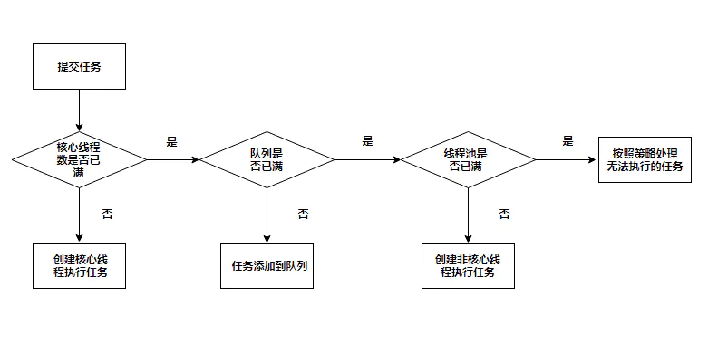

### Executors 线程池工具

创建线程池后返回 `ExecutorService` 执行任务。推荐使用 `ThreadPoolExecutor` 手动创建迎合业务需求线程池。

线程池中线程服用的优点：

- 减少资源创建 => 减少内存开销，创建线程占用内存
- 降低系统开销 => 创建线程需要时间，会延迟处理的请求
- 提高稳定稳定性 => 避免无限创建线程引起的`OutOfMemoryError`【简称OOM】

#### 合理创建线程池中线程数量

- **CPU密集型** => 线程池的大小推荐为 `CPU` 数量 + 1，`CPU` 数量可以根据 `Runtime.availableProcessors` 方法获取
- **IO密集型** => `CPU` 数量 * `CPU` 利用率 * (1 + 线程等待时间/线程 CPU 时间)

#### 常创建的线程池

内部调用的类 `ThreadPoolExecutor` 创建线程池

```java
ThreadPoolExecutor(int corePoolSize, int maximumPoolSize, long keepAliveTime,
                          TimeUnit unit, BlockingQueue<Runnable> workQueue)
```

##### Executors.newSingleThreadExecutor()

```java
/*
* 创建一个单线程的线程池
* 线程池只有一个线程在工作，单线程串行执行所有任务；
* 此线程池保证所有任务的执行顺序按照任务的提交顺序执行
* corePoolSize、maximumPoolSize 都为 1 的线程池，无界队列，此线程池一般用于顺序执行任务
* */
ExecutorService singleThreadExecutor = Executors.newSingleThreadExecutor();
// 内部调用
new ThreadPoolExecutor(1, 1, 0L, TimeUnit.MILLISECONDS, 
                       new LinkedBlockingQueue<Runnable>());

// 采用的无界队列
public LinkedBlockingQueue() { this(Integer.MAX_VALUE); }
```

<font color="red">注意：</font> 允许的请求队列长度为 `Integer.MAX_VALUE`，可能会堆积大量的请求，从而导致 `OOM`。

##### Executors.newFixedThreadPool(10)

```java
/*
* 创建固定大小的线程池
* 每次提交一个任务就创建一个线程，直到线程达到线程池的最大大小，一旦达到最大值就会保持不变
* corePoolSize、maximumPoolSize一样，线程数不会超过 nThreads，也不会出现空闲线程回收
* 任务执行顺序是无序的
* */
ExecutorService fixedThreadPool = Executors.newFixedThreadPool(10);
// 创建方式
ThreadPoolExecutor(nThreads, nThreads, 0L, TimeUnit.MILLISECONDS, 
                   new LinkedBlockingQueue<Runnable>())
// 采用的无界队列
public LinkedBlockingQueue() { this(Integer.MAX_VALUE); }
```

<font color="red">注意：</font> 允许的请求队列长度为 `Integer.MAX_VALUE`，可能会堆积大量的请求，从而导致 `OOM`。

##### Executors.newCachedThreadPool()

```java
/*
* 创建一个可缓存的线程池
* 如果线程池的大小超过了处理任务所需要的线程，会回收部分空闲的线程
* 当任务数增加时，此线程池又可以智能的添加新线程来处理任务。
* 此线程池不会对线程池大小做限制，线程池大小完全取决于系统能够创建的最大线程大小
*
* 任务执行顺序是无序的
*
* 无核心线程数，最大线程数为 int 的最大值
* 使用 SynchronousQueue 队列，此队列不存放任务
* 每次有任务过来如果没有空闲线程就会创建新的线程来执行此任务
* */
ExecutorService cachedThreadPool = Executors.newCachedThreadPool();
// 内部创建
ThreadPoolExecutor(0, Integer.MAX_VALUE, 60L, TimeUnit.SECONDS,
                   new SynchronousQueue<Runnable>())
// 队列
public SynchronousQueue() { this(false); }
```

<font color="red">注意：</font> 允许的创建线程数量为 `Integer.MAX_VALUE`，可能会创建大量的线程，从而导致 `OOM`。

##### Executors.newScheduledThreadPool(4)

```java
/*
* new DelayedWorkQueue() 采用的是延迟队列
* */
final DateTimeFormatter timeFormatter = DateTimeFormatter.ofPattern("HH:mm:ss.SSS");
ScheduledExecutorService scheduledThreadPool = Executors.newScheduledThreadPool(4);
/*
* 会在固定的周期（period）速率调用任务
* 若是任务执行时间大于 period，则任务执行完后立马执行下个任务
* 若是任务执行时间小于 period，则下一个任务需要等待 period 到达后才能执行
* initialDelay + 2 * period
* */
scheduledThreadPool.scheduleAtFixedRate(
        () -> System.out.println(timeFormatter.format(LocalTime.now()) + " scheduleAtFixedRate task execute"),
        1, 1, TimeUnit.SECONDS);
/*
* 每隔多少 period 时间执行任务，是在上一个任务执行完成后，等待 period 执行下一个任务
* */
scheduledThreadPool.scheduleWithFixedDelay(
        () -> System.out.println(timeFormatter.format(LocalTime.now()) + " scheduleWithFixedDelay task execute"),
        1, 1, TimeUnit.SECONDS);

// 内部创建
public ScheduledThreadPoolExecutor(int corePoolSize) {
    super(corePoolSize, Integer.MAX_VALUE, 0, NANOSECONDS, new DelayedWorkQueue());
}
```

<font color="red">注意：</font> 允许的创建线程数量为 `Integer.MAX_VALUE`，可能会创建大量的线程，从而导致 `OOM`。

#### ThreadPoolExecutor

```java
/*
* 工作队列 workQueue [BlockingQueue<Runnable>]
* 有界队列： ArrayBlockingQueue
* 可选的有界队列：LinkedBlockingQueue，LinkedBlockingDeque
* 无界队列：DelayQueue，PriorityBlockingQueue
*
* 线程池创建工厂：class DefaultThreadFactory implements ThreadFactory
*
* 拒绝策略： class AbortPolicy implements RejectedExecutionHandler
* */
ThreadPoolExecutor executor = new ThreadPoolExecutor(4, 10, 60L, TimeUnit.SECONDS,
        new ArrayBlockingQueue<>(8));

// 构造方法
ThreadPoolExecutor(int corePoolSize, int maximumPoolSize, long keepAliveTime,
                   TimeUnit unit, BlockingQueue<Runnable> workQueue, 
                   ThreadFactory threadFactory, 
                   RejectedExecutionHandler handler)
```

