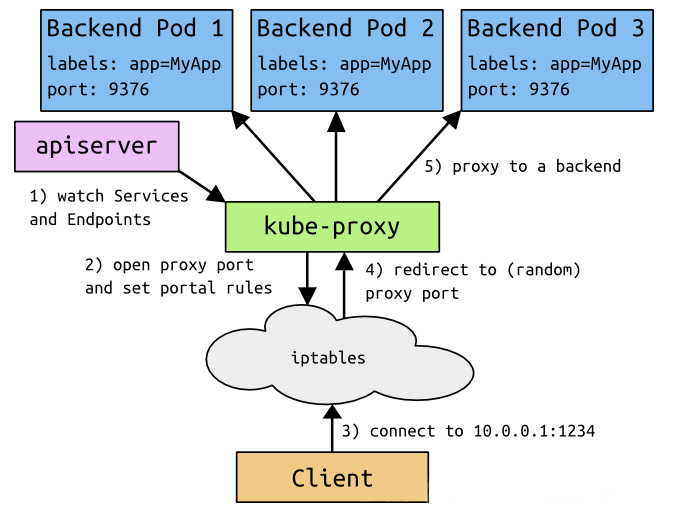
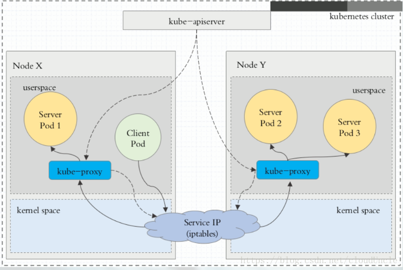
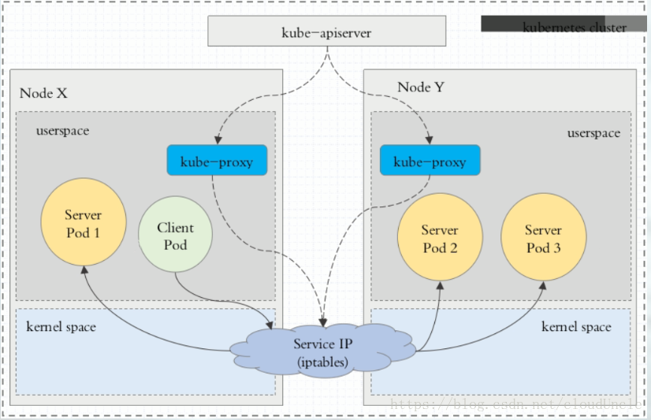
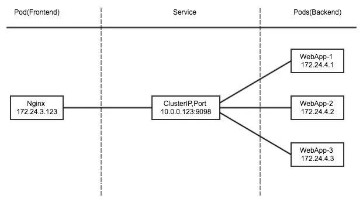
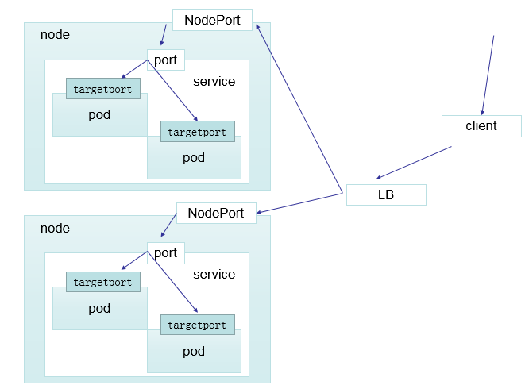
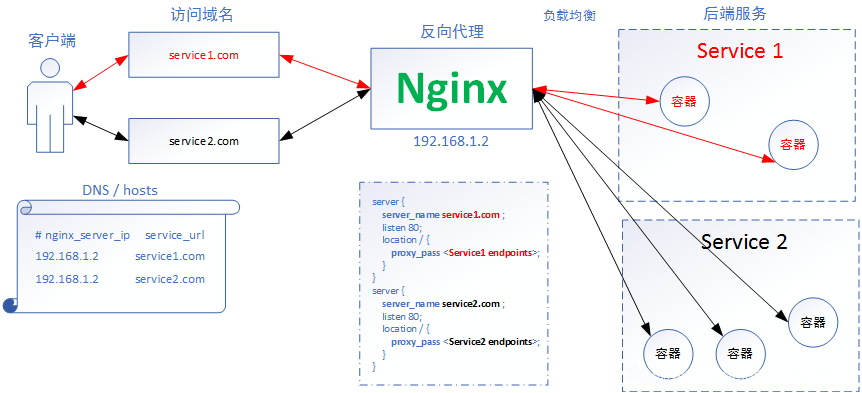
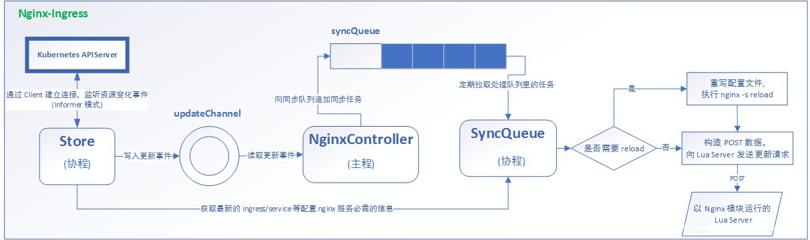

# 所用工具

## 1. ipvsadm

`IPVS` 代理信息查看工具，查看负载均衡详细信息

```bash
ipvsadm -Ln
```

# Service 的概念

Kubernetes `Service` 定义了这样一种抽象，一个 `Pod` 的逻辑分组，一种可以访问它们的策略 -- 通常称为微服务。 这一组 `Pod` 能够被 `Service` 访问到，通常是通过 `Label Selector`

`Service` 能够提供负载均衡的能力，但是在使用上存在限制。只提供 4 层负载均衡能力，而没有 7 层功能，但有时我们可能需要更多的匹配规则来转发请求，这点上 4 层负载均衡是不支持的。

# Service 的类型

`Service` 在 `kubernetes` 中有四种类型

- `ClusterIp` : 默认类型，自动分配一个仅 Cluster 内部可以访问的虚拟 IP
- `NodePort`：在 `ClusterIP` 基础上为 `Service` 在每台机器上绑定一个端口，这样就可以通过 `:NodePort` 来访问该
- `LoadBalancer`：在 `NodePort` 的基础上，借助 cloud provider 创建一个外部负载均衡器，并将请求转发到 `:NodePort`
- `ExternalName`：把集群外部的服务引入到集群内部来，在集群内部直接使用。没有任何类型代理被创建，这只有 kubernetes 1.7 或更高版本的 kube-dns 才支持



# VIP 和 Service 代理

在 Kubernetes 集群中，每个 Node 运行一个 `kube-proxy` 进程。 `kube-proxy` 负责为 `Service` 实现了一种 `VIP` (虚拟 IP) 的形式，而不是 `ExternalName` 的形式。 在 Kubernetes v1.0 版本，代理完全在 **userspace**。在 Kubernetes v1.1 版本，新增了 iptables 代理，但并不是默认的运行模式。从 Kubernetes v1.2 起，默认就是 iptables 代理。在 Kubernetes v1.8.0-beta.0 中，添加了 `ipvs` 代理

在 Kubernetes 1.14 版本开始默认使用 `ipvs` 代理

在 Kubernetes v1.0 版本，`Service` 是 "4层" (TCP/UDP over IP) 概念。在 Kubernetes v1.1 版本,新增了 `Ingress` API (beta 版)，用来表示 7 层 (HTTP) 服务

# 代理模式的分类

## I、userspace 代理模式



## II、iptables 代理模式



## III、ipvs 代理模式

这种模式，`kube-proxy` 会监视 Kubernetes `Service` 对象和 `Endpoints` ，调用 `netlink` 接口以相应地创建 `ipvs` 规则并定期与 Kubernetes `Service` 对象和 `Endpoints` 对象同步 `ipvs` 规则，以确保 `ipvs` 状态与期望一致。访问服务时，流量将被重定向到其中一个后端 Pod

与 `iptables` 类似，`ipvs` 于 `netfilter` 的 `hook` 功能，但使用哈希表作为底层数据结构并在内核空间中工作。这意味着 `ipvs` 可以更快地重定向流量，并且在同步代理规则时具有更好的性能。此外，`ipvs` 为负载均衡算法提供了更多选项

- `rr` :轮询调度
- `lc` :最小连接数
- `dh` :目标哈希
- `sh` :源哈希
- `sed`:最短期望延迟
- `nq` : 不排队调度


# ClusterIP

clusterIP 主要在每个 node 节点使用 iptables，将发向 clusterIP 对应端口的数据，转发到 kube-proxy 中。然后 kube-proxy 自己内部实现有负载均衡的方法，并可以查询到这个 service 下对应 pod 的地址和端口，进而把数据转发给对应的 pod 的地址和端口



为了实现图上的功能，主要需要以下几个组件的协同工作:
- apiserver 用户通过 kubectl 命令向 apiserver 发送创建 service 的命令，apiserver 接收到请求后将数据存储到 etcd 中
- kube-proxy kubernetes 的每个节点中都有一个叫做 kube-porxy 的进程，这个进程负责感知 service，pod 的变化，并将变化的信息写入本地的 iptables 规则中
- iptables 使用 NAT 等技术将 virtualIP 的流量转至 endpoint 中

## 创建 ClusterIP Service

### 创建 deployment 资源

svc-deploy.yaml 文件

```yaml
apiVersion: apps/v1
kind: Deployment
metadata:
  name: myapp-deploy
  namespace: default
spec:
  replicas: 3
  selector:
    matchLabels:
      app: myapp
      release: stabel
  template:
    metadata:
      labels:
        app: myapp
        release: stabel
        env: test
    spec:
      containers:
        - name: myapp
          image: harbor.nihility.cn/library/myapp:v1
          imagePullPolicy: IfNotPresent
          ports:
            - name: http
              containerPort: 80
```

部署

```bash
$ kubectl apply -f svc-deployment.yaml
kubectl get pods -o wide
kubectl get deployments -o wide
```

### 创建 deployment 资源对应的 Service

svc-service.yaml

```yaml
apiVersion: v1
kind: Service
metadata:
  name: svc-clusterIP
  namespace: default
spec:
  # 配置的 Service 类型
  type: ClusterIP
  selector:
    # 选择 deployment labels 中的属性
    app: myapp
    release: stabel
  ports:
    - name: http
      port: 80
      targetPort: 80
```

部署

```bash
kubectl apply -f svc-service.yaml
kubectl delete -f svc-service.yaml

kubectl get svc -o wide
ipvsadm -Ln
    TCP  10.108.45.27:80 rr
      -> 10.244.2.9:80                Masq    1      0          0
      -> 10.244.3.9:80                Masq    1      0          0
      -> 10.244.3.10:80               Masq    1      0          0

curl 10.108.45.27/hostname.html
```

# Headless Service

有时不需要或不想要负载均衡，以及单独的 Service IP 。遇到这种情况，可以通过指定 ClusterIP (spec.clusterIP) 的值为 “None” 来创建 Headless Service 。这类 Service 并不会分配 Cluster IP， kube-proxy 不会处理它们，而且平台也不会为它们进行负载均衡和路由。

svc-handless.yaml

```yaml
apiVersion: v1
kind: Service
metadata:
  name: svc-headless
  namespace: default
spec:
  selector:
    app: myapp
  clusterIP: None
  ports:
    - port: 80
      targetPort: 80
```

部署， svc 一旦创建成功，将会写入到 coredns 当中，写入规则为 [svc-name].[namesapce name].[cluster 域名]

示例： myapp-handless.default.svc.cluster.local.

```bash
kubectl apply -f svc-handless.yaml

kubectl get svc -o wide
	-> myapp-headless   ClusterIP   None    <none>    80/TCP   42s   app=myap

kubectl get pod -n kube-system -o wide
# 解析 corndns 域名, A 记录解析
yum install -y bind-utils
dig -t A svc-headless.default.svc.cluster.local. @10.244.0.6
```

# NodePort

nodePort 的原理在于在 node 上开了一个端口，将向该端口的流量导入到 kube-proxy，然后由 kube-proxy 进一步到给对应的 pod

svc-nodeport.yaml

```yaml
apiVersion: v1
kind: Service
metadata:
  name: svc-nodeport
  namespace: default
spec:
  type: NodePort
  selector:
    app: myapp
    release: stabel
  ports:
    - name: http
      port: 80
      targetPort: 80
```

```bash
kubectl apply -f svc-nodeport.yaml

kubectl get svc
-> myapp-nodeport          NodePort    10.103.250.38    <none>        80:31189/TCP     21s
curl 10.103.250.38/hostname.html		# 通过内部地址访问
curl http://10.10.100.8:31189/hostname.html	# 通过主机 ip 地址和暴露的端口访问
```

# LoadBalancer

loadBalancer 和 nodePort 其实是同一种方式。区别在于 loadBalancer 比 nodePort 多了一步，就是可以调用 cloud provider 去创建 LB 来向节点导流



# ExternalName

这种类型的 Service 通过返回 CNAME 和它的值，可以将服务映射到 externalName 字段的内容( 例如: k8s.nihility.cn)。ExternalName Service 是 Service 的特例，它没有 selector，也没有定义任何的端口和 Endpoint。相反的，对于运行在集群外部的服务，它通过返回该外部服务的别名这种方式来提供服务

svc-external.yaml

```yaml
kind: Service
apiVersion: v1
metadata:
  name: svc-external
  namespace: default
spec:
  type: ExternalName
  externalName: k8s.nihility.cn
```

```bash
kubectl apply -f svc-external.yaml
-> svc-external  ExternalName   <none>  k8s.nihility.cn  <none>  10s  <none>

kubectl get svc -o wide

dig -t A svc-external.default.svc.cluster.local. @10.244.0.6
-> svc-external.default.svc.cluster.local.	30 IN CNAME k8s.nihility.cn.
```

把外部的流量引入集群内

当查询主机 svc-external.defalut.svc.cluster.local ( SVC_NAME.NAMESPACE.svc.cluster.local )时，集群的 DNS 服务将返回一个值 k8s.nihility.cn 的 CNAME 记录。访问这个服务的工作方式和其他的相同，唯一不同的是重定向发生在 DNS 层，而且不会进行代理或转发

---

# kubernetes Ingress

## 简介

Ingress-Nginx github 地址：https://github.com/kubernetes/ingress-nginx
Ingress-Nginx 官方网站：https://kubernetes.github.io/ingress-nginx/

nginx 也是以一个 `NodePort` 方式部署。





## 安装 Ingress-Nginx

安装 ingress controller

```bash
wget -O ingress-nginx-controller-v0.34.1-deploy.yaml https://raw.githubusercontent.com/kubernetes/ingress-nginx/controller-v0.34.1/deploy/static/provider/cloud/deploy.yaml
kubectl apply -f https://raw.githubusercontent.com/kubernetes/ingress-nginx/controller-v0.34.1/deploy/static/provider/baremetal/deploy.yaml

docker pull us.gcr.io/k8s-artifacts-prod/ingress-nginx/controller:v0.34.1@sha256:0e072dddd1f7f8fc8909a2ca6f65e76c5f0d2fcfb8be47935ae3457e8bbceb20
docker pull docker.io/jettech/kube-webhook-certgen:v1.2.2

kubectl apply -f ingress-nginx-controller-v0.34.1-deploy.yaml

kubectl get pods -n ingress-nginx
kubectl get pods -n ingress-nginx -l app.kubernetes.io/name=ingress-nginx --watch

# Detect installed version
POD_NAMESPACE=ingress-nginx
POD_NAME=$(kubectl get pods -n $POD_NAMESPACE -l app.kubernetes.io/name=ingress-nginx --field-selector=status.phase=Running -o jsonpath='{.items[0].metadata.name}')

kubectl exec -it $POD_NAME -n $POD_NAMESPACE -- /nginx-ingress-controller --version
```

暴露 svc 方案

```bash
# 大写 o， 不是零
wget -O ingress-svc-nodeport-v0.34.1-deploy.yaml https://raw.githubusercontent.com/kubernetes/ingress-nginx/controller-v0.34.1/deploy/static/provider/baremetal/deploy.yaml  

kubectl apply -f ingress-svc-nodeport-v0.34.1-deploy.yaml

kubectl get svc -n ingress-nginx
kubectl get pods -n ingress-nginx -l app.kubernetes.io/name=ingress-nginx --watch
```

## Ingress HTTP 代理访问

<font color="red">注意：</font> `apiVersion: extensions/v1beta1` 在 **v1.16** 版本后已经弃用，更改为 ``apiVersion: apps/v1`

deployment、Service、Ingress Yaml 文件，ingress-http-deploy.yaml

```yaml
apiVersion: apps/v1
kind: Deployment
metadata:
  name: deployment-ingress
  namespace: default  
spec:
  replicas: 2
  selector:
    matchLabels:
      # 要和 metadata.labels 中的标签对应
      name: nginx
  template:
    metadata:
      labels:
        name: nginx
    spec:
      containers:
      - name: nginx
        image: harbor.nihility.cn/library/myapp:v1
        imagePullPolicy: IfNotPresent
        ports:
          - containerPort: 80
---
apiVersion: v1
kind: Service
metadata:
  name: ingress-svc
  namespace: default    
spec:
  ports:
  - port: 80
    targetPort: 80
    protocol: TCP
  selector:
    name: nginx
---
apiVersion: extensions/v1beta1
kind: Ingress
metadata:
  name: ingress-nginx-test
  namespace: default    
spec:
  rules:
  - host: www1.nihility.com
    http:
      paths:
      - path: /
        backend:
          serviceName: ingress-svc
          servicePort: 80
```

部署

```bash
kubectl apply -f ingress-http-deploy.yaml

kubectl get pods
kubectl get svc

kubectl get svc -n ingress-nginx
-> ingress-nginx-controller NodePort 10.104.2.233 <none> 80:31144/TCP,443:32186/TCP   42m

kubectl get ingress
kubectl delete ingress --all
```

