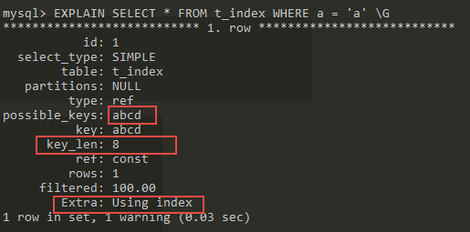
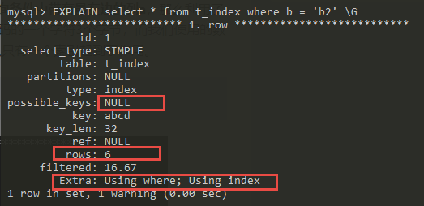
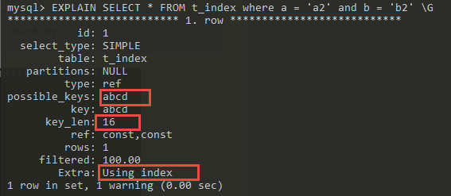
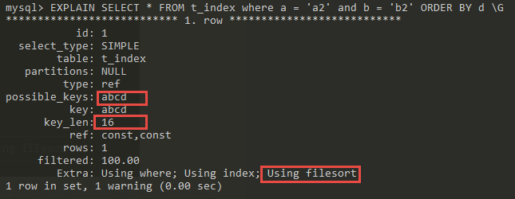
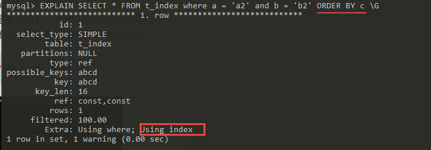

#### 1. Mysql 索引管理

##### 1.1 建立索引

```sql
ALTER TABLE 表名 ADD [UNIQUE|FULLTEXT|SPATIAL] INDEX|KEY [索引名] (字段名1[(长度)] [ASC| DESC]) [USING 索引方法]；

CREATE [UNIQUE|FULLTEXT|SPATIAL] INDEX INDEX_NAME ON TABLE_NAME(COLUMN_NAME,...) [USAGE];
-- [UNIQUE|FULLLTEXT]：表示可选择的索引类型，唯一索引还是全文索引，不加话就是普通索引。
-- column_name(length)：列名，length 这一列的前 length 行记录添加索引。

示例：
ALTER TABLE EXAMPLE_TABLE ADD UNIQUE INDEX (TABLE_FIELD);
ALTER TABLE EXAPMLE_TABLE ADD INDEX (FIELD1, FIELD2);

ALTER TABLE EXAMPLE_TABLE ADD PRIMARY KEY(field);
ALTER TABLE EXAMPLE_TABLE MODIFY field INT AUTO_INCREMENT;
```

##### 1.2 查看索引

```sql
SHOW INDEX FROM table_name ;
```

##### 1.3 删除索引

```sql
ALTER TABLE table_name DROP INDEX index_name ;
ALTER TABLE table_name DROP PRIMARY KEY;
DROP INDEX INDEX_NAME ON TABLE_NAME;
```

##### 1.4 索引效果分析

```sql
EXPLAIN SELECT * FROM TABLE_NAME WHERE .... ;
```

EXPLAIN 指标 - type 联接类型
结果值从好到坏依次是：
system > const > eq_ref > ref > fulltext > ref_or_null > index_merge > unique_subquery > index_subquery > range > index > ALL。
一般来说，得保证查询至少达到range级别。

---

#### 索引分类

索引分为：聚集索引，辅助索引，联合索引，覆盖索引

##### 聚集索引

就是按照每张表的主键构造一颗 B+ 树，同时叶子节点存储整张表的行记录数，也将聚集索引的叶子节点成为“数据页”，聚集索引的特性决定了表中的行记录数据也是索引的一部分。同 B+ 树数据结构一样，每个数据页都通过一个双向链表进行链接。
数据页只能按照一颗 B+ 树进行排序，因此每张表只能有一个聚集索引，由于数据页定义了逻辑顺序，聚集索引能够很快的在数据页访问指针进行范围的查找数据。
聚集索引在物理上不是连续的，在逻辑上是连续的，前面已经说过是通过双向链表进行维护，物理存储可以不按照主键顺序存储。

##### 辅助索引

辅助索引（也称非聚集索引），叶子节点并不包含行记录的全部数据。叶子节点除了包含键值外，每个叶子节点还包含了一个书签，该书签告诉 InnoDB 存储引擎可以从哪里找到辅助索引相对应行的记录。因此 InnoDB 存储引擎的辅助索引的书签就是相应整行数据的聚集索引键。
一个表中可以有多个辅助索引。例如，一个辅助索引树需要遍历 3 次才能找到主键索引，如果聚集索引树的高为同样为 3，那么它还需要对聚集索引树进行三次查找，最终才能找到一个完整的数据页，因此一共需要 6 次 IO 访问才能得到最终的数据页。

##### 联合索引

联合索引是指对表上多个列进行建立索引，联合索引本质还是一颗B+树，不同的是索引的键值数量不是 1 个，而是大于等于 2。联合索引的键值在 B+ 树中也是有序的，通过叶子节点可以在逻辑的顺序上读出所有数据。

```sql
ALTER TABLE t_index ADD INDEX abcd(a,b,c,d);
```

会单独创建索引 a/b/c/d

###### 联合索引生效原则

**最左匹配原则：** 创建组合索引，以最左边的为准，只要查询条件中带有最左边的列，那么查询就会使用到索引。

```sql
EXPLAIN SELECT * FROM t_index WHERE a = 'a' \G
```





依据上一张图，可以看出没有使用索引，possible_keys 为空， rows 为 6，因为总表就 6 条数据，说明为全表扫描，没有使用索引查询。





key_len 为 16 说明使用了两个索引，char(2) 使用 utf8mb4 时，一个 char 为 4 byte。说明有使用索引，Extra 中 Using filesort 表面使用了文件排序。因为使用了 a,b 索引，但当用 d 字段排序时， (a,b)/(b,a) 这两个索引并美哟排序，**联合索引的一个好处，索引的下一个字段会自动排序。**



##### 覆盖索引

InnoDB 存储引擎支持覆盖索引（或称索引覆盖），就是从辅助索引中就可以直接得到查询的记录，而不需要再次查询聚集索引中的记录。使用覆盖索引的好处就是，辅助索引不包括整行记录的所有信息，所以覆盖索引的大小要小于聚集索引，因此可以减少 IO 操作。
覆盖索引是非聚集组合索引的一种形式，它包括在查询里的 Select、Join 和 Where 子句用到的所有列（即建立索引的字段正好是覆盖查询语句 [select 子句] 与查询条件 [Where 子句] 中所涉及的字段，也就是索引包含了查询正在查找的所有数据）

---

#### 索引的优/缺点，其它

##### 特点

- 可以加快数据库的检索速度
- 降低数据库插入、修改、删除等维护的速度
- 只能创建在表上，不能创建在视图上
- 既可以直接创建也可以间接创建

##### 优点

- 创建唯一性索引，保证数据库表中的每一行数据的唯一性
- 大大加快数据的检索速度
- 加快数据库表之间的连接，特别是在实现数据的参考完整性方面特别有意义
- 在使用分组和排序字句进行数据检索时，同样可以显著减少查询的时间
- 通过使用索引，可以在查询中使用优化隐藏器，提高系统性能

##### 索引的缺点

- 创建索引和维护索引要耗费时间，这种时间随着数据量的增加而增加。
- 索引需要占物理空间，除了数据表占数据空间之外，每一个索引还要占一定的物理空间，如果要建立聚簇索引，那么需要的空间就会更大。
- 当对表中的数据进行增加、删除和修改的时候，索引也要动态的维护，这样就降低了数据的维护速度。

##### 适用场景

- 匹配全值
  对索引中所有列都指定具体值，即是对索引中的所有列都有等值匹配的条件。
- 匹配值的范围查询
  对索引的值能够进行范围查找。
- 匹配最左前缀
  仅仅使用索引中的最左边列进行查询，比如在 col1 + col2 + col3 字段上的联合索引能够被包含 col1、(col1 + col2)、（col1 + col2 + col3）的等值查询利用到，可是不能够被 col2、（col2、col3）的等值查询利用到。
  最左匹配原则可以算是 MySQL 中 B-Tree 索引使用的首要原则。
- 仅仅对索引进行查询
  当查询的列都在索引的字段中时，查询的效率更高，所以应该尽量避免使用 select *，需要哪些字段，就只查哪些字段。
- 匹配列前缀
  仅仅使用索引中的第一列，并且只包含索引第一列的开头一部分进行查找。
  能够实现索引匹配部分精确而其他部分进行范围匹配
  如果列名是索引，那么使用 column_name is null 就会使用索引，例如下面的就会使用索引：
  `explain select * from t_index where a is null \G`

##### 索引失效

- 以 % 开头的 like 查询不能利用 B-Tree 索引，执行计划中 key 的值为 null 表示没有使用索引
- 数据类型出现隐式转换的时候也不会使用索引，例如，`where 'age'+10=30`, 对索引列进行函数运算
- 正则表达式不会使用索引
- 字符串和数据比较不会使用索引
- 复合索引的情况下，假如查询条件不包含索引列最左边部分，即不满足最左原则 left most，是不会使用复合索引的
- 如果 MySQL 估计使用索引比全表扫描更慢，则不使用索引
- 用 or 分割开的条件，如果 or 前的条件中的列有索引，而后面的列中没有索引，那么涉及的索引都不会被用到
- 使用负向查询（not ，not in， not like ，&lt;&gt; ,!= ,!&gt; ,!&lt; ） 不会使用索引