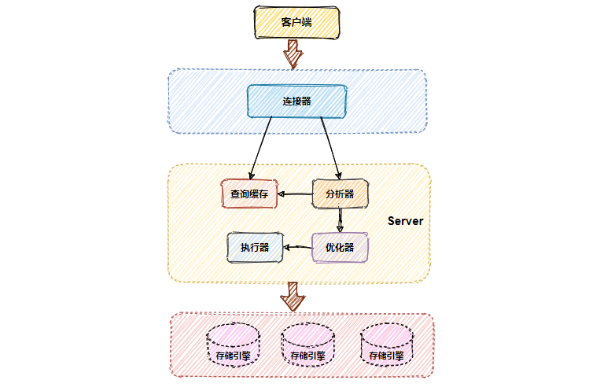

## Mysql 逻辑架构

Mysql 逻辑架构分为了三层。
* 第一层：处理客户端连接、授权认证、安全校验等。
* 第二层：服务器 *Server* 层，负责对 SQL 解析、分析、优化、执行操作引擎等。
* 第三层：存储引擎，负责 MYSQL 中数据的存储和提取。



> Mysql 的服务层是不管理事务的，事务是由存储引擎实现的，而 Mysql 中支持事务的存储引擎属 `InnoDB` 使用最为广泛，下面提到的存储引擎都以 `InnoDB` 为主。


MySQL 更新数据的基础流程，其中包括 `redo log`、`bin log`、`undo log`三种日志间的大致关系。

### Mysql 重做日志 (redo log)

`redo log` 属于 MySQL 存储引擎 `InnoDB` 的事务日志。

MySQL 的数据是存放在磁盘中的，每次读写数据都需做磁盘 *IO* 操作，如果并发场景下性能就会很差。为此 MySQL 提供了一个优化手段，引入缓存 *Buffer Pool*。这个缓存包含了磁盘中**部分**数据页 *page* 的映射，以此来缓解数据库的磁盘压力。

当从数据库读数据时，首先从缓存中读取，如果缓存中没有，则从磁盘读取后放入缓存。当向数据库写入数据时，先向缓存写入，此时缓存中的数据页数据变更，这个数据页称为脏页，`Buffer Pool` 中修改完数据后会按照设定的更新策略，定期刷到磁盘中，这个过程称为刷脏页。

如果刷脏页还未完成，可 MySQL 由于某些原因宕机重启，此时 `Buffer Pool` 中修改的数据还没有及时的刷到磁盘中，就会导致数据丢失，无法保证事务的持久性。

为了解决这个问题引入了 `redo log`，`redo Log` 如其名侧重于重做！它记录的是数据库中每个页的修改，而不是某一行或某几行修改成怎样，可以用来恢复提交后的物理数据页，且只能恢复到最后一次提交的位置。

`redo log` 用到了 `WAL（Write-Ahead Logging）` 技术，这个技术的核心就在于修改记录前，一定要先写日志，并保证日志先落盘，才能算事务提交完成。

有了 `redo log` 再修改数据时，`InnoDB` 引擎会把更新记录先写在 `redo log` 中，在修改 `Buffer Pool` 中的数据，当提交事务时，调用 `fsync` 把 `redo log` 刷入磁盘。至于缓存中更新的数据文件何时刷入磁盘，则由后台线程异步处理。

> 注意：此时 `redo log` 的事务状态是 prepare，还未真正提交成功，要等 bin log 日志写入磁盘完成才会变更为 commit，事务才算真正提交完成。

这样一来即使刷脏页之前 MySQL 意外宕机也没关系，只要在重启时解析 redo log 中的更改记录进行重放，重新刷盘即可。

#### 大小固定

`redo log` 采用固定大小，循环写入的格式。当 `redo log` 写满之后，重新从头开始如此循环写，形成一个环状。因为 `redo log` 记录的是数据页上的修改，如果 `Buffer Pool` 中数据页已经刷磁盘后，那这些记录就失效了，新日志会将这些失效的记录进行覆盖擦除。


上图中的 `write pos` 表示 *redo log* 当前记录的日志序列号 `LSN`(log sequence number)，写入还未刷盘，循环往后递增；`check point` 表示 *redo log* 中的修改记录已刷入磁盘后的 LSN，循环往后递增，这个 LSN 之前的数据已经全落盘。

`write pos` 到 `check point` 之间的部分是 redo log 空余的部分（绿色），用来记录新的日志；`check point` 到 `write pos` 之间是 *redo log* 已经记录的数据页修改数据，此时数据页还未刷回磁盘的部分。当 `write pos` 追上 `check point` 时，会先推动 `check point` 向前移动，空出位置（刷盘）再记录新的日志。

> **注意**：redo log 日志满了，在擦除之前，需要确保这些要被擦除记录对应在内存中的数据页都已经刷到磁盘中了。擦除旧记录腾出新空间这段期间，是不能再接收新的更新请求的，此刻 MySQL 的性能会下降。所以在并发量大的情况下，合理调整 redo log 的文件大小非常重要。

`redo log` 的存在使得 `Innodb` 引擎具有了 `crash-safe` 的能力，即 MySQL 宕机重启，系统会自动去检查 `redo log`，将修改还未写入磁盘的数据从 `redo log` 恢复到 MySQL 中。


### undo log（回滚日志）

`undo log` 也是属于 MySQL 存储引擎 `InnoDB` 的事务日志。

`undo log` 属于逻辑日志，如其名主要起到回滚的作用，它是保证事务原子性的关键。记录的是数据修改前的状态，在数据修改的流程中，同时会记录一条与当前操作相反的逻辑日志到 `undo log` 中。

同一个事物内的一条记录被多次修改，那是不是每次都要把数据修改前的状态都写入 `undo log` 呢？答案是不会的！

`undo log` 只负责记录事务开始前要修改数据的原始版本，当我们再次对这行数据进行修改，所产生的修改记录会写入到 `redo log`，`undo log` 负责完成回滚，`redo log` 负责完成前滚。

**回滚**：未提交的事务，即事务未执行 `commit`。但该事务内修改的脏页中，可能有一部分脏块已经刷盘。如果此时数据库实例宕机重启，就需要用回滚来将先前那部分已经刷盘的脏块从磁盘上撤销。

**前滚**：未完全提交的事务，即事务已经执行 `commit`，但该事务内修改的脏页中只有一部分数据被刷盘，另外一部分还在 `buffer pool` 缓存上，如果此时数据库实例宕机重启，就需要用前滚来完成未完全提交的事务。将先前那部分由于宕机在内存上的未来得及刷盘数据，从 `redo log` 中恢复出来并刷入磁盘。

> 数据库实例恢复时，先做前滚，后做回滚。

依据 MySQL 数据更新流程图就会发现，`undo log`、`redo log`、`bin log`三种日志都是在刷脏页之前就已经刷到磁盘了的，相互协作最大限度保证了用户提交的数据不丢失。

### bin log（归档日志）

`bin log` 是一种数据库 Server 层（和什么引擎无关），以二进制形式存储在磁盘中的逻辑日志。`bin log` 记录了数据库所有 `DDL` 和 `DML` 操作（不包含 `SELECT` 和 `SHOW` 等命令，因为这类操作对数据本身并没有修改）。

默认情况下，二进制日志功能是关闭的。可以通过以下命令查看二进制日志是否开启：

```mysql
mysql> SHOW VARIABLES LIKE 'log_bin';
```

`bin log` 也被叫做 `归档日志`，因为它不会像 `redo log` 那样循环写擦除之前的记录，而是会一直记录日志。一个 `bin log` 日志文件默认最大容量 `1G`（也可以通过 `maxbinlogsize` 参数修改），单个日志超过最大值，则会新创建一个文件继续写。

```
mysql> show binary logs;
```

`bin log` 日志的内容格式其实就是执行 SQL 命令的反向逻辑，这点和 `undo log` 有点类似。一般来说开启 `bin log` 都会给日志文件设置过期时间（`expire_logs_days` 参数，默认永久保存），要不然日志的体量会非常庞大。

```
mysql> show variables like 'expire_logs_days';
mysql> SET GLOBAL expire_logs_days=30;
```

`bin log` 主要应用于 MySQL 主从模式（`master-slave`）中，主从节点间的数据同步；以及基于时间点的数据还原。