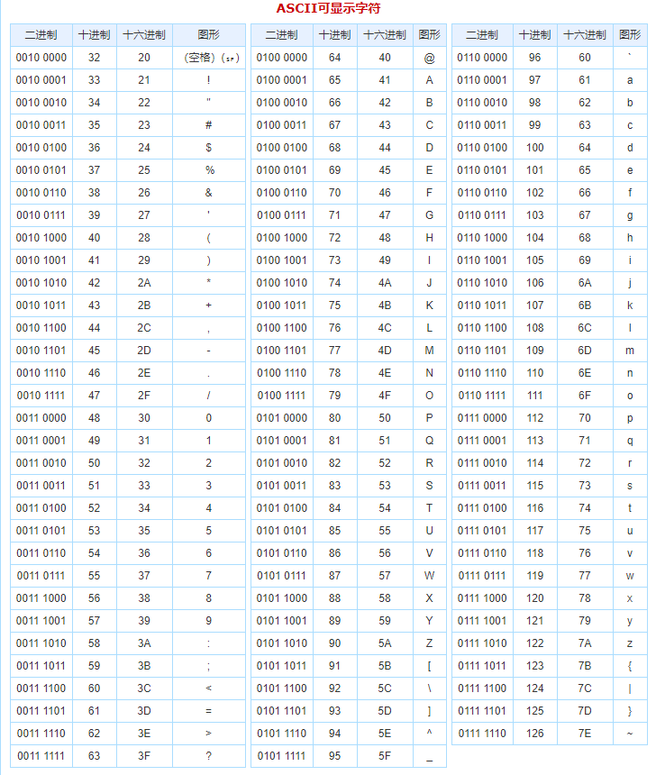
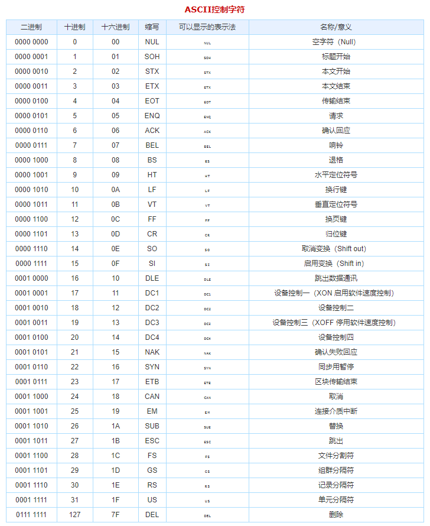

### 字符集

#### ASCII 字符集






#### Unicode 字符集

`Unicode` 只是一个 16 位代码，其中每个字符占用 16 位，因此可能有 65,536 个字符。（错误理解）

`Unicode` 联盟为每个字母中的每个柏拉图字母分配了一个魔幻数字，其写法如下：`U+0639`。这个魔法数称为代码点（*code point*）。*U+* 表示  "Unicode"，数字为十六进制（hexadecimal）。英语字母 **A** -> **U+0041**。

查看字符集 [the Unicode web site](http://www.unicode.org/)

**Hello** 代码点表示 U+0048 U+0065 U+006C U+006C U+006F，但这并不是存储在内存或展示在邮件中的形式。

##### Encoding 编码方式

最后创造了 `UTF-8` 编码格式，`UTF-8` 是另一个使用 8 位字节将 Unicode 代码点的字符串（那些神奇的 *U+* 数字）存储在内存中的系统。在 UTF-8 中，从 0-127 的每个代码点都存储在一个字节中。实际上，只有代码点 128 和更高的代码点使用 2、3 存储，最多 6 个字节。

这样做的好处是，英语文本在 UTF-8 中的外观与在 ASCII 中的外观完全相同，因此美国人甚至不会注意到任何错误。只有世界其他地方才可以跳过障碍。

具体来说，**Hello**，即 U+0048 U+0065 U+006C U+006C U+006F，将被存储为 48 65 6C 6C 6F，这可是！与ASCII，ANSI 和地球上每个 OEM 字符集的存储方式相同。

**不知道字符串使用什么编码就没有意义。**您不能再把头埋在沙子里，并假装“纯文本”是 ASCII。**没有纯文本这样的东西。** （**There Ain’t No Such Thing As Plain Text.**）

常用编码 `UTF-8` or `ASCII` or `ISO 8859-1` (`Latin 1`) or `Windows 1252` (Western European)

我们如何保存有关字符串编码方式的信息？好吧，有标准的方法可以做到这一点。对于电子邮件，应该在表格的标题中包含一个字符串

> **Content-Type: text/plain; charset="UTF-8"**


---

计算机唯一可以存储和使用的东西是位 (bit)。

一个 *bit* 仅能有两个值 : `yes` or `no`, `true` or `false`, `1` or `0` 或者其它可以称为两个值。要使用位来表示除位之外的所有内容，我们需要规则。我们需要使用一种编码方案或简称编码将一系列位转换为字母，数字和图片之类的东西。

ASCII 位序列对应字符规则：

|       bits | character |
| ---------: | :-------- |
| `01000001` | A         |
| `01000010` | B         |
| `01000011` | C         |
| `01000100` | D         |
| `01000101` | E         |
| `01000110` | F         |

编码意味着使用某种东西来代表其他东西。编码是一组规则，用于将某些内容从一种表示形式转换为另一种表示形式。

- 字符集 (**character set, charset**)
  可以编码的字符集。 ASCII 编码包含 128 个字符的字符集。”本质上是“编码”的同义词。
- 代码页 (**code page**)
  将字符映射到数字或位序列的代码的“页面”。又名“桌子”。本质上是“编码”的同义词。
- 字符串 (**string**)
  字符串是一串串在一起的物品。位字符串是一堆位，例如 `01010011`。字符串是一堆字符，`例如这样`。与“序列”同义。

---

**UTF-8 是 Unicode 的一种实现方式，也就是它的字节结构有特殊要求，所以我们说一个汉字的范围是 0X4E00到 0x9FA5，是指 unicode 值，至于放在 utf-8 的编码里去就是由三个字节来组织**

UTF-8 是一种变长字节编码方式。对于某一个字符的 UTF-8 编码，如果只有一个字节则其最高二进制位为 0；如果是多字节，其第一个字节从最高位开始，连续的二进制位值为 1 的个数决定了其编码的位数，其余各字节均以 10 开头。UTF-8 最多可用到 6 个字节。 

UTF-8 的编码规则

- 对于单字节的符号，字节的第一位设为 0，后面 7 位为这个符号的 unicode 码。因此对于英语字母，UTF-8 编码和 ASCII 码是相同的。
- 对于 n 字节的符号（n>1），第一个字节的前 n 位都设为 1，第 n+1 位设为 0，后面字节的前两位一律设为 10。剩下的没有提及的二进制位，全部为这个符号的 unicode 码。

```
Unicode符号范围       | UTF-8编码方式
(十六进制)            | （二进制）
---------------------+---------------------------------------
0000 0000-0000 007F  |  0xxxxxxx
0000 0080-0000 07FF  |  110xxxxx 10xxxxxx
0000 0800-0000 FFFF  |  1110xxxx 10xxxxxx 10xxxxxx
0001 0000-0010 FFFF  |  11110xxx 10xxxxxx 10xxxxxx 10xxxxxx

已知 “严” 的 unicode 是 4E25（100111000100101），4E25 处在第三行的范围内
从 “严” 的最后一个二进制位开始，依次从后向前填入格式中的 x，多出的位补 0
“严” 的 UTF-8 编码是 “11100100 10111000 10100101”，转换成十六进制就是 E4B8A5

严 |     0100   111000   100101  | 4E25
三 | 1110xxxx 10xxxxxx 10xxxxxx
转 | 11100100 10111000 10100101  | E4B8A5
```

