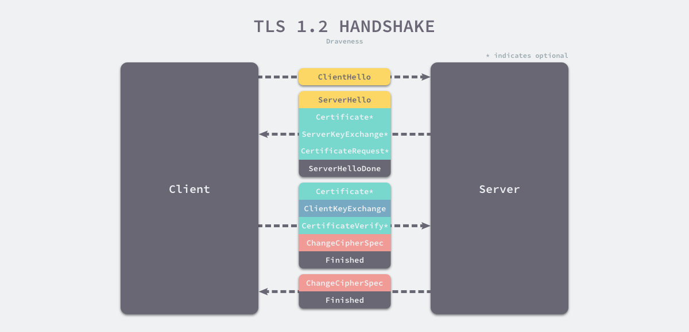

[参考文档](https://draveness.me/whys-the-design-https-latency/)

### HTTP / HTTPS

HTTP 协议（Hypertext Transfer Protocol）已经成为互联网上最常用的应用层协议，然而其本身只是用于传输超文本的网络协议，不会提供任何安全上的保证，使用明文在互联网上传输数据包使得窃听和中间人攻击成为可能，通过 HTTP 传输密码其实与在互联网上裸奔也差不多。

网景（Netscape）在 1994 年设计了 HTTPS 协议，使用安全套接字层（Secure Sockets Layer，SSL）保证数据传输的安全[1](https://draveness.me/whys-the-design-https-latency/#fn:1)，随着传输层安全协议（Transport Layer Security，TLS）的发展，目前我们已经使用 TLS 取代了废弃的 SSL 协议，不过仍然使用 SSL 证书一词[2](https://draveness.me/whys-the-design-https-latency/#fn:2)。

HTTPS 是对 HTTP 协议的扩展，我们可以使用它在互联网上安全地传输数据[3](https://draveness.me/whys-the-design-https-latency/#fn:3)，然而 HTTPS 请求的发起方第一次从接收方获取响应需要经过 4.5 倍的往返延迟（Round-Trip Time，RTT）。本文将详细介绍请求发起和响应的过程，分析为什么 HTTPS 协议需要通过 4.5-RTT 的时间获得服务提供方的响应：

- TCP 协议 — 通信双方通过三次握手建立 TCP 连接[4](https://draveness.me/whys-the-design-https-latency/#fn:4)；
- TLS 协议 — 通信双方通过四次握手建立 TLS 连接[5](https://draveness.me/whys-the-design-https-latency/#fn:5)；
- HTTP 协议 — 客户端向服务端发送请求，服务端发回响应；

### TCP

TCP/IP 协议簇建立了互联网中通信协议的概念模型，该协议簇中的两个主要协议就是 TCP 和 IP 协议。TCP/ IP 协议簇中的 TCP 协议能够保证数据段（Segment）的可靠性和顺序，有了可靠的传输层协议之后，应用层协议就可以直接使用 TCP 协议传输数据，不在需要关心数据段的丢失和重复问题[1](https://draveness.me/whys-the-design-tcp-message-frame/#fn:1)。

HTTP 协议作为应用层协议，它需要底层的传输层协议为其提供基本的数据传输功能，HTTP 协议一般都会使用 TCP 协议作为底层协议。为了阻止错误的建立历史连接，TCP 协议通信的双方会通过三次握手建立 TCP 连接[6](https://draveness.me/whys-the-design-https-latency/#fn:6)。

TCP 连接的双方会通过三次握手确定 TCP 连接的初始序列号、窗口大小以及最大数据段，这样通信双方就能利用连接中的初始序列号保证双方数据段的不重不漏、通过窗口大小控制流量并使用最大数据段避免 IP 协议对数据包的分片[7](https://draveness.me/whys-the-design-https-latency/#fn:7)。

最初版本的 TCP 协议确实会通过三次通信建立 TCP 连接，在目前的大多数场景下，三次握手也是无法避免的，不过在 2014 年提出的 TCP 快启（TCP Fast Open，TFO）却可以在某些场景下通过一次通信建立 TCP 连接[8](https://draveness.me/whys-the-design-https-latency/#fn:8)。

### TLS

TLS 的作用是在可靠的 TCP 协议上构建安全的传输通道，其本身是不提供可靠性保障的，还需要下层可靠的传输层协议。在通信双方建立可靠的 TCP 连接之后，就需要通过 TLS 握手交换双方的密钥了，在这里将介绍 TLS 1.2 的连接建立过程[9](https://draveness.me/whys-the-design-https-latency/#fn:9)：

1. 客户端向服务端发送 Client Hello 消息，其中携带客户端支持的协议版本、加密算法、压缩算法以及**客户端生成的随机数**；
2. 服务端收到客户端支持的协议版本、加密算法等信息后；
   1. 向客户端发送 Server Hello 消息，并携带选择特定的协议版本、加密方法、会话 ID 以及**服务端生成的随机数**；
   2. 向客户端发送 Certificate 消息，即服务端的证书链，其中包含证书支持的域名、发行方和有效期等信息；
   3. 向客户端发送 Server Key Exchange 消息，传递**公钥**以及签名等信息；
   4. 向客户端发送可选的消息 Certificate Request，验证客户端的证书；
   5. 向客户端发送 Server Hello Done 消息，通知服务端已经发送了全部的相关信息；
3. 客户端收到服务端的协议版本、加密方法、会话 ID 以及证书等信息后，验证服务端的证书；
   1. 向服务端发送 Client Key Exchange 消息，包含**使用服务端公钥加密后的随机字符串**，即预主密钥（Pre Master Secret）；
   2. 向服务端发送 Change Cipher Spec 消息，通知服务端后面的数据段会加密传输；
   3. 向服务端发送 Finished 消息，其中包含加密后的握手信息；
4. 服务端收到 Change Cipher Spec 和 Finished 消息后；
   1. 向客户端发送 Change Cipher Spec 消息，通知客户端后面的数据段会加密传输；
   2. 向客户端发送 Finished 消息，验证客户端的 Finished 消息并完成 TLS 握手；

TLS 握手的关键在于利用通信双方生成的随机字符串和服务端的公钥生成一个双方经过协商后的密钥，通信的双方可以使用这个对称的密钥加密消息防止中间人的监听和攻击，保证通信的安全。

在已经建立好 TCP 和 TLS 通道上传输数据是比较简单的事情，HTTP 协议可以直接利用下层建立的可靠的、安全的通道传输数据。客户端通过 TCP 的套接字接口向服务端写入数据，服务端在接收到数据、进行处理后通过相同的途径返回。因为整个过程需要客户端发送请求以及服务端返回响应，所以耗时是 1-RTT。