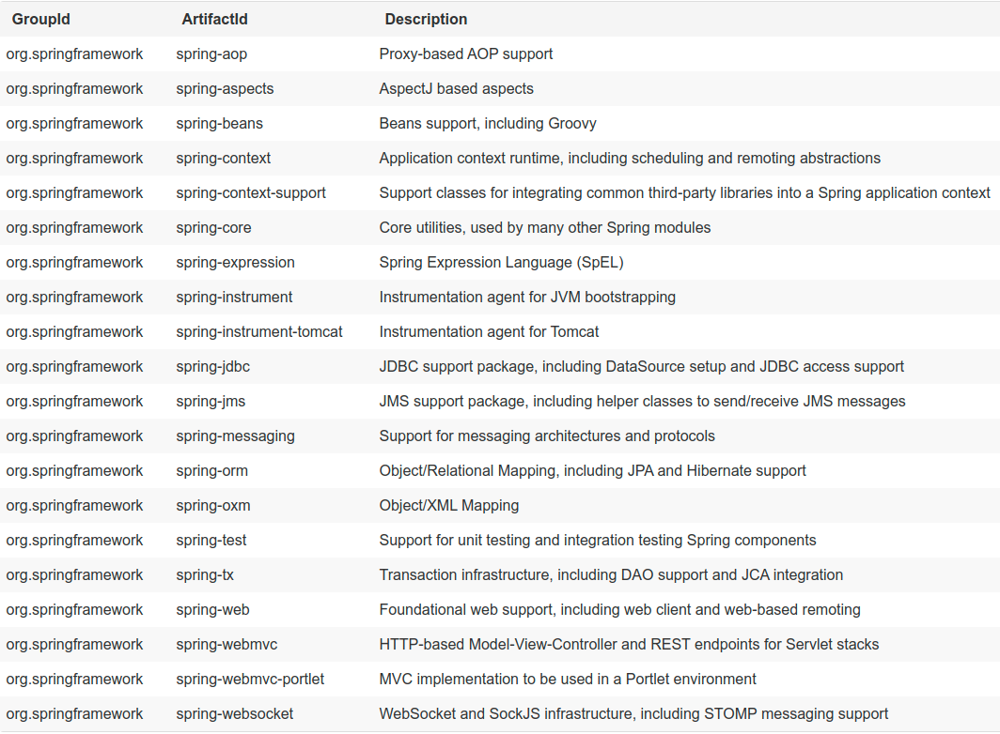
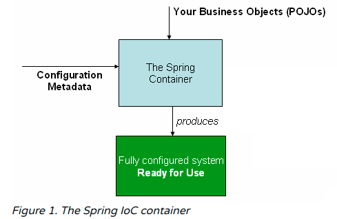
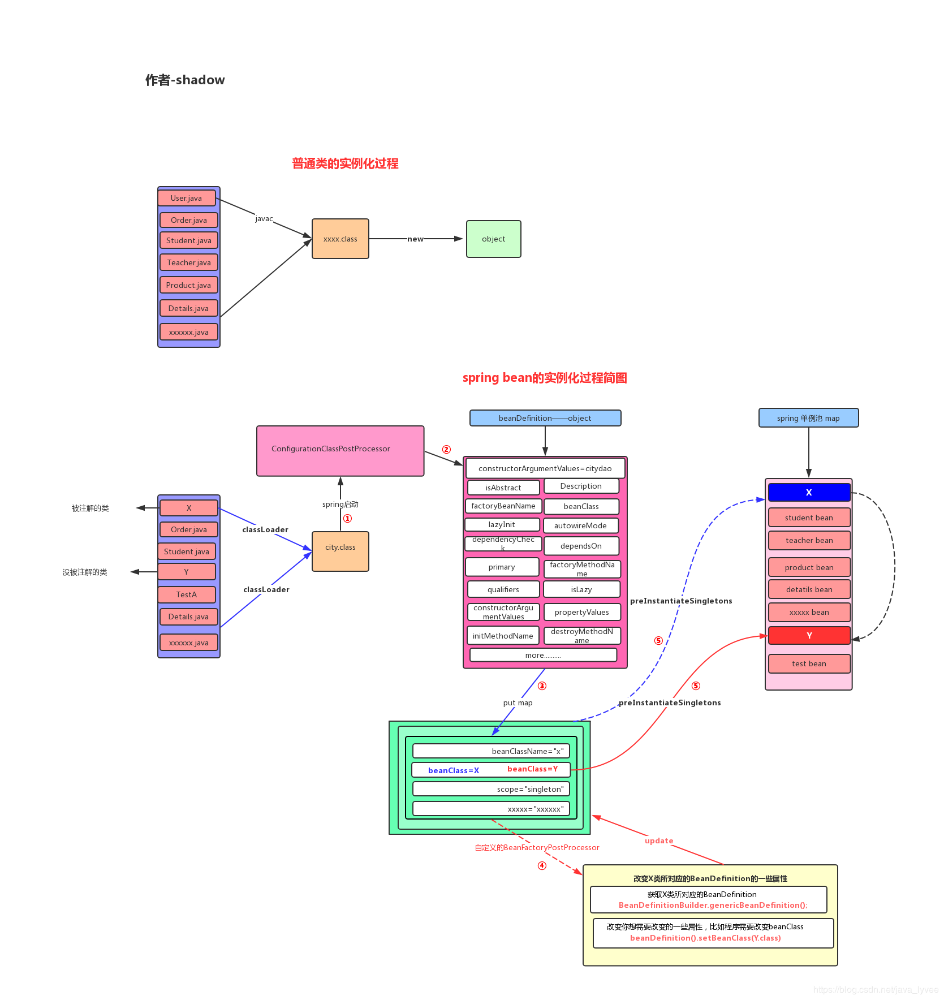

### Spring Core 核心源码阅读

*spring framework core* 主要提供一些常用工具，供其它模块使用。



*Spring Framework* 框架中最重要的控制反转 (*IOC*) 容器。
然后就是 *Aspect-Oriented Programming* `AOP` 面向切面编程 技术。
*Spring Framework* 有自己的 *AOP* 框架， spring 与 *AspectJ* 的集成。
*AspectJ* 是当前最成熟的 *Java* 企业 *AOP* 的实现，功能最丰富。


Spring Framework 中容器的拓展点

```java
1. Bean 实例化后的初始化操作 和 销毁 操作
	1.1 添加 @PostConstruct 和 @PreDestroy
    1.2 实现接口 InitializingBean 和 DisposableBean
    1.3 自定义方法 init-method 和 destroy-method
2. 各种 xxxAware 的接口
    2.1 管理 Bean 名称的 BeanNameAware 接口
    2.2 管理 spring 容器的元素据 ApplicationContextAware 接口
3. 各种 PostProcessor 后置处理器接口 (一般会和 Ordered 接口一同使用)
	3.1 处理 Bean 实例化后的操作 BeanPostProcessor
    3.2 处理 Bean 工厂的 BeanFactoryPostProcessor
```

<font color="blue">`BeanPostProcessor` 是工厂钩子接口，允许自定义修改新的 bean 实例，检查标记接口或者用代理在覆盖它们</font>
不是后置处理器
`ApplicationContexts` 能够自动检测在 beans 定义中的 `BeanPostProcessor` bean，在随后的创建 bean 中应用它们。普通的 bean 工厂允许编程式注册 `post-processor`，应用与通过该工厂创建的所有 Bean。

`postProcessBeforeInitialization` 接口方法 `post-processor` 填充 beans
`postProcessAfterInitialization` 接口方法 `post-processor` 代理包装 beans

<font color="blue">`BeanFactoryPostProcessor` 自定义修改应用 context 中 bean 的定义，以适应上下文基础 Bean 工厂的 Bean 属性值。</font>
`ApplicationContext` 可以自动检测到 `BeanFactoryPostProcessor` beans 在 beans 的定义中，然后在其它 bean 创建之前应用它们。
常用来自定义配置文件达到系统管理员目标，覆盖在 ApplicationContext 中 bean 的属性配置。

#### 1. *IOC* 容器

*IoC* - *Spring's Inversion of Control* 容器 [sping 控制反转的容器]

##### 1.1 简介 IoC 容器和 *Beans*

Inversion of Control (IoC) 又被称为 dependency injection (DI) 依赖注入。
通过构造函数参数，工厂方法的参数或对象实例在工厂方法构造或返回之后在对象实例上设置属性。
然后，容器在创建bean时注入那些依赖项。

`org.springframework.beans` 和 `org.springframework.context` 包是 *Spring Framework* 的 *IoC* 容器的基础。

`BeanFactory` 接口提供了管理任意类型 *object* 高级配置机制的能力。
`ApplicationContext` 是 `BeanFactory` 的一个子接口。
`BeanFactory`  extends `ListableBeanFactory` extends `ApplicationContext`

- 易于和 *AOP* 特性集成
- *Message* 资源处理 - 国际化
- 事件的发布
- 应用层指定的 context， 如 *web* 应用的 `WebApplicationContext`

简而言之，`BeanFactory` 提供了可配置的框架和基本的功能性，`ApplicationContext` 添加了更多企业级规范的功能。`ApplicationContext` 是 `BeanFactory` 的完整超集，对 `Spring` 的 `IoC` 容器专门使用。

<font color="blue">在 *Spring* 中，对象构成了应用程序的骨干，由 *spring IoC* 容器管理的对象称为 *Bean*。</font>
Bean 是由 Spring IoC 容器实例化、组装和以其他方式管理的对象。**Bean** 及其之间的**依赖关系**反映在容器使用的**配置元数据**中。

##### 1.2 容器概述

`org.springframework.context.ApplicationContext` 接口表示 *Spring IoC* 容器，并负责实例化，配置和组装 *Bean*。容器通过读取配置元数据来获取有关要实例化，配置和组装哪些对象的指令。配置元数据以 XML，Java 注解或 Java 代码表示。

*Spring* 提供了`ApplicationContext` 接口的几种实现。在独立应用程序中，通常创建实例 `ClassPathXmlApplicationContext` 或者 `FileSystemXmlAppContext`。



###### 1.2.1 配置元数据

*Configuration metadata* 是应用开发者告知 *Spring* 容器如何实例化、配置、组装应用程序中的对象。

> 基于 XML 配置的元数据不是唯一允许的形式。
> Spring IoC 容器本身与实际写入此配置的元素据格式完成脱钩。
> 现在许多开发者倾向于 基于  Java 配置的方式。

- *Annotation-based Configuration*  spring 2.5 引入了基于注解配置元数据的支持
- *Java-based Configuration* 从 spring 3.0 开始，Spring JavaConfig 项目提供的许多功能已成为核心 Spring Framework 的一部分。因此，可以使用 Java 而不是 XML 文件来定义应用程序类外部的 bean。
  参阅 `@Configuration`，`@Bean`，`@Import` 和 `@DependsOn` 注解。

spring 容器一定管理 Spring 配置组成的至少一个，通常是多个 *bean* 的定义。
基于 *XML* 配置是在 `<beans/>` 下的 `<bean/>` 标签中配置。
基于 *Java* 代理是在 `@Configuration` 注解类中通常使用 `@Bean` 注解方式配置 *bean*。

但是，可以使用 Spring 与 AspectJ 的集成来配置在 IoC 容器控制之外创建的对象。

###### 1.2.2 实例化一个 容器

```java
ApplicationContext context = new ClassPathXmlApplicationContext("services.xml", "daos.xml");
```

###### 1.2.3 使用容器

`ApplicationContext` 是高级工厂的接口，该工厂能够维护不同 bean 及其依赖关系的注册表。

```java
// retrieve configured instance
PetStoreService service = context.getBean("petStore", PetStoreService.class);
```

##### 1.3 Bean 概述

*Spring IoC* 容器管理一个或多个 *beans*。这些 bean 是使用提供给容器的配置元数据创建的。

在容器本身内，这些 bean 定义表示为 `BeanDefinition` 对象，其中包含（除其他信息外）以下元数据：

- *A package-qualified* [包限定] 的类名：将定义 Bean 的实际实现类
- Bean行为配置元素，在容器中的 bean 以那个状态表现 (scope, lifecycle callbacks 等)
- 对其它 bean 做所需工作的引用。这些引用也称为协作者或依赖项。
- 要在新创建的对象中设置的其它配置设置 - 如：池的大小限制或在用于管理连接池的 bean 中使用的连接数。

元数据转换为构成每个bean定义的一组属性。

| Property                 | Explained in…                                                |
| :----------------------- | :----------------------------------------------------------- |
| Class                    | [Instantiating Beans](https://docs.spring.io/spring/docs/5.1.15.RELEASE/spring-framework-reference/core.html#beans-factory-class) |
| Name                     | [Naming Beans](https://docs.spring.io/spring/docs/5.1.15.RELEASE/spring-framework-reference/core.html#beans-beanname) |
| Scope                    | [Bean Scopes](https://docs.spring.io/spring/docs/5.1.15.RELEASE/spring-framework-reference/core.html#beans-factory-scopes) |
| Constructor arguments    | [Dependency Injection](https://docs.spring.io/spring/docs/5.1.15.RELEASE/spring-framework-reference/core.html#beans-factory-collaborators) |
| Properties               | [Dependency Injection](https://docs.spring.io/spring/docs/5.1.15.RELEASE/spring-framework-reference/core.html#beans-factory-collaborators) |
| Autowiring mode          | [Autowiring Collaborators](https://docs.spring.io/spring/docs/5.1.15.RELEASE/spring-framework-reference/core.html#beans-factory-autowire) |
| Lazy initialization mode | [Lazy-initialized Beans](https://docs.spring.io/spring/docs/5.1.15.RELEASE/spring-framework-reference/core.html#beans-factory-lazy-init) |
| Initialization method    | [Initialization Callbacks](https://docs.spring.io/spring/docs/5.1.15.RELEASE/spring-framework-reference/core.html#beans-factory-lifecycle-initializingbean) |
| Destruction method       | [Destruction Callbacks](https://docs.spring.io/spring/docs/5.1.15.RELEASE/spring-framework-reference/core.html#beans-factory-lifecycle-disposablebean) |

可以通过访问 ApplicationContext's 的 BeanFactory 由 `getBeanFactory()` 方法调用，返回 `DefaultListableBeanFactory` 的实现，支持注册 bean 通过方法 `registerSingletone(..)` 和 `registerBeanDefinition(..)` 方法。

###### 1.3.1 Beans 的命名

<font color="blue">每个bean具有一个或多个标识符。标识符在承载 Bean 的容器内必须是唯一的。</font> 
一个 bean 通常只有一个标识符。但是，如果需要多个，则可以将多余的别名视为别名。

*注意：* beans 的别名可以放到 XML 配置 *<bean>* 标签的 *name* 属性当中，多个可以用 comma (`,`) semicolon (`;`) 或者是空格分割。

> Bean 的命名约定
> bean 名称以小写字母开头，并从那里用驼峰式大小写。如 `accountManager`
>
> spring 在 component scanning 在 classpath 中，产生为命名的 bean 组件时，采用简单的 class 名称，在将首字母小写。特定情况，当 class 名称的开始几个字母都是大写，原始的外壳将保留下。
> 如： UNUsualBean -> UNUsualBean 一样

###### 1.3.2 实例化 Beans

- 通常，容器本身通过反射性调用其构造函数直接创建 Bean 的情况下，指定要构造的 Bean 类，这在某种程度上等同于使用 new 运算符的 Java 代码。

- 要指定包含要创建对象的静态工厂方法的实际类，在不太常见的情况下，容器将在类上调用静态工厂方法以创建 Bean。

  > *com.example* 包中有 class *Something* ，包含内部 *static* 类 *Otherthing*， bean 中 class 属性为 
  > *`com.example.Something$Otherthing`*
  > **请注意**，名称中使用 $ 字符将嵌套的类名与外部类名分开。

通过静态的工厂方法创建对象

```xml
<bean id="clientService"
    class="examples.ClientService"
    factory-method="createInstance"/>
```

```java
public class ClientService {
    private static ClientService clientService = new ClientService();
    private ClientService() {}

    public static ClientService createInstance() {
        return clientService;
    }
}
```

实例化通过使用一个实例的工厂方法

```xml
<!-- the factory bean, which contains a method called createInstance() -->
<bean id="serviceLocator" class="examples.DefaultServiceLocator">
    <!-- inject any dependencies required by this locator bean -->
</bean>

<!-- the bean to be created via the factory bean -->
<bean id="clientService"
    factory-bean="serviceLocator"
    factory-method="createClientServiceInstance"/>
<!-- 一个实例中可以包含多个实例化工厂方法 -->
<bean id="accountService"
    factory-bean="serviceLocator"
    factory-method="createAccountServiceInstance"/>
```

```java
public class DefaultServiceLocator {
    private static ClientService clientService = new ClientServiceImpl();
    private static AccountService accountService = new AccountServiceImpl();
    
    public ClientService createClientServiceInstance() {
        return clientService;
    }
    public AccountService createAccountServiceInstance() {
        return accountService;
    }
}
```

##### 1.4 依赖关系

###### 1.4.1 DI 依赖注入

Dependency injection (DI) 从根本上讲，该过程是相反的，因此又命名为控制反转 *IoC*。
*DI* 有两个重要的变体：基于构造器的依赖注入，基于 setter 的依赖注入。

`ApplicationContext` 支持 *constructor-based* 和 *setter-based* 依赖注入的方式管理 bean。

`BeanDefinition` 实例接口

*constructor-based* 和 *setter-based*  可以混合使用，推荐强制用 *constructores* 然后可选使用 *setter* 方法注入。
Spring团队通常提倡注入构造函数，因为它使您可以将应用程序组件实现为不可变的对象，并确保所需的依赖项不为 null。setter 注入的一个好处是，setter 方法可使该类的对象在以后重新配置或重新注入。

**依赖处理的步骤**

容器执行 bean 的依赖注入步骤：

- `ApplicationContext` 被创建和初始化描述所有 bean 的配置元数据。配置元数据可以由 XML、Java code、注解 指定
- 对于每个 bean，其依赖关系都以属性，构造函数参数或static-factory方法的参数的形式表示（如果使用它而不是普通的构造函数）。当 bean 实现被创建时，这些依赖项将会提供给 bean。
- 每个属性或构造函数参数都是要设置的值的实际定义，或者是对容器中另一个 bean 的引用。
- 每个值的属性或构造函数参数都将从其指定的格式转换为该属性或构造函数参数的实际类型。默认情况下， Spring 可以将以字符串格式提供的值转换为所有内置类型，例如 int，long，String，boolean 等。

在创建容器时，Spring 容器会验证每个 bean 的配置。但是，<font color="blue">在实际创建 Bean 创建完成之前，不会设置 Bean 属性本身。</font>
仅在请求时才创建 Bean。

> 循环依赖
> 如果主要使用构造函数注入，则可能会创建无法解决的循环依赖方案。
> 如：类 A 通过构造函数注入需要类 B 的实例，而类 B 通过构造函数注入需要类 A 的实例。
> 解决办法是采用 setter 依赖注入。

在实际创建 bean 时，Spring 设置属性并尽可能晚地解决依赖关系。

###### 1.4.2 依赖性和详细配置

###### 1.4.4 懒初始化 beans

默认情况下，作为初始化过程的一部分，ApplicationContext 实现会急于创建和配置所有单例 bean。
延迟初始化的 bean 告诉 IoC 容器在首次请求时而不是在启动时创建一个 bean 实例。

当延迟初始化的 bean 是未延迟初始化的单例 bean 的依赖项时，ApplicationContext 会在启动时创建延迟初始化的 bean，因为它必须满足单例的依赖关系。延迟初始化的 bean 被注入到其他未延迟初始化的单例 bean 中。

###### 1.4.5 自动装配协作器 

Spring 容器可以自动装配协作 bean 之间的关系。

优势：

- 自动装配可以大大减少指定属性或构造函数参数的需要。
- 随着对象的发展，自动装配可以更新配置。

自动装配模式 (4 种)

| Mode          | Explanation                                                  |
| :------------ | :----------------------------------------------------------- |
| `no`          | 默认）无自动装配，Bean 引用必须由 ref 元素定义。             |
| `byName`      | Autowiring by property name. <br />Spring looks for a bean with the same name as the property that needs to be autowired. For example, if a bean definition is set to autowire by name and it contains a `master` property (that is, it has a `setMaster(..)` method), Spring looks for a bean definition named `master` and uses it to set the property. |
| `byType`      | Lets a property be autowired if exactly one bean of the property type exists in the container. If more than one exists, a fatal exception is thrown, which indicates that you may not use `byType` autowiring for that bean. If there are no matching beans, nothing happens (the property is not set). |
| `constructor` | Analogous to `byType` but applies to constructor arguments. If there is not exactly one bean of the constructor argument type in the container, a fatal error is raised. |

当一个 A singleton bean 依赖一个 B property bean 时，B 也变为了单实例。
一个解决方案是放弃某些控制反转。实现 `ApplicationContextAware` 接口。

```java
public class CommandManager implements ApplicationContextAware {

    private ApplicationContext applicationContext;

    public Object process(Map commandState) {
        // grab a new instance of the appropriate Command
        Command command = createCommand();
        // set the state on the (hopefully brand new) Command instance
        command.setState(commandState);
        return command.execute();
    }

    protected Command createCommand() {
        // notice the Spring API dependency!
        return this.applicationContext.getBean("command", Command.class);
    }

    public void setApplicationContext(
            ApplicationContext applicationContext) throws BeansException {
        this.applicationContext = applicationContext;
    }
}
```

查找方法注入

##### 1.5 Bean 的范围

创建 bean 定义时，将创建一个配方，用于创建该 bean 定义所定义的类的实际实例。
Bean 定义是配方的想法很重要，因为它意味着与类一样，可以从一个配方中创建许多对象实例。

| Scope                                                        | Description                                                  |
| :----------------------------------------------------------- | :----------------------------------------------------------- |
| [singleton](https://docs.spring.io/spring/docs/5.1.15.RELEASE/spring-framework-reference/core.html#beans-factory-scopes-singleton) | (Default) Scopes a single bean definition to a single object instance for each Spring IoC container. |
| [prototype](https://docs.spring.io/spring/docs/5.1.15.RELEASE/spring-framework-reference/core.html#beans-factory-scopes-prototype) | Scopes a single bean definition to any number of object instances. |
| [request](https://docs.spring.io/spring/docs/5.1.15.RELEASE/spring-framework-reference/core.html#beans-factory-scopes-request) | Scopes a single bean definition to the lifecycle of a single HTTP request. That is, each HTTP request has its own instance of a bean created off the back of a single bean definition. Only valid in the context of a web-aware Spring `ApplicationContext`. |
| [session](https://docs.spring.io/spring/docs/5.1.15.RELEASE/spring-framework-reference/core.html#beans-factory-scopes-session) | Scopes a single bean definition to the lifecycle of an HTTP `Session`. Only valid in the context of a web-aware Spring `ApplicationContext`. |
| [application](https://docs.spring.io/spring/docs/5.1.15.RELEASE/spring-framework-reference/core.html#beans-factory-scopes-application) | Scopes a single bean definition to the lifecycle of a `ServletContext`. Only valid in the context of a web-aware Spring `ApplicationContext`. |
| [websocket](https://docs.spring.io/spring/docs/5.1.15.RELEASE/spring-framework-reference/web.html#websocket-stomp-websocket-scope) | Scopes a single bean definition to the lifecycle of a `WebSocket`. Only valid in the context of a web-aware Spring `ApplicationContext`. |

###### 1.5.1 Singleton Scope

The scope of the Spring singleton is best described as being per-container and per-bean. 
这个和 GoF 设计模式中的单例模式不同。

The singleton scope is the default scope in Spring.

###### 1.5.2 Prototype Scope [原型]

 As a rule, you should use the prototype scope for all **stateful** beans and the singleton scope for **stateless** beans.

与其他作用域相比，Spring不能管理原型Bean的完整生命周期。
容器实例化，配置或组装原型对象，然后将其交给客户端，而无对该原型实例的进一步记录。
因此，尽管在不考虑作用域的情况下在所有对象上都调用了初始化生命周期回调方法，但在原型的情况下，不会调用已配置的销毁生命周期回调。超过该时间点的所有生命周期管理必须由客户端处理。

您不能将原型作用域的 bean 依赖项注入到您的单例 bean 中，因为当 Spring 容器实例化单例bean并解析并注入其依赖项时，该注入仅发生一次。

##### 1.6 自定义 Bean 的性质

Spring框架提供了许多接口，可用于自定义 Bean 的性质。

- Lifecycle Callbacks
- `ApplicationContextAware` / `BeanNameAware`
- Other `Aware` Interface

###### 1.6.1 Lifecycle Callbacks 生命周期回调

与容器的bean生命周期管理进行交互，可以实现接口 `InitializingBean` 和 `DisposableBean` 接口。
容器就会调用 `afterPropertiesSet()`  对于前者和 `destroy()` 对于后者，让 Bean 在初始化和销毁时执行某些操作。

> *JSR-250* 定义的注解 `@PostCOnstruct` 和 `@PreDestroy` 通常认为是现代 Spring 应用接收生命周期回调的最佳实践。使用这些注解意味着 beans 不在和 Spring 规范接口向耦合。
> 也可以考虑使用 `init-method` 和 `destory-method` 定义 bean 的元数据。

在内部地，Spring Framework 使用 `BeanPostProcessor` 接口实现来处理任意的回调接口，它可以查找和调用恰当的方法。若是想自定义特性或者其它的生命周期行为，可以自己实现接口 `BeanPostProcessor` 。

此外初始化的销毁的回调，spring 管理的对象或许会实现接口 `Lifecycle`，以至于那些对象可以参与到启动和关闭的处理，由容器自定的声明周期驱动。

**初始化回调**
`org.springframework.beans.factory.InitializingBean` 接口让一个 bean 执行初始化工作当容器把 bean 的所有所需属性完全设置后。

```java
void afterPropertiesSet() throws Exception;
```

<font color="blue">推荐别用这个 `InitializingBean` 接口，因为它不必要将代码耦合到 Spring</font>
可替换的，推荐使用注解 `@PostConstruct` 或者指定 POJO 的初始化方法。 `init-method` 在 xml <bean/> 标签中的属性。还有就是 `@Bean` 注解的 *initMethod* 属性配置。

**销毁回调**

`org.springframework.beans.factory.DisposableBean` 接口实现，当容器销毁是让 bean 回调。

```java
void destroy() throws Exception;
```

也是不推荐使用该销毁回调接口 `DisposableBean`，没有必要和 spring 耦合起来。
推荐使用注解 `@PreDestroy` 或者指定一个一般的方法可以支持 bean 的定义。 xml 配置可在 <bean/> 标签属性 `destroy-method` 上配置要回调的销毁方法。还有就是 `@Bean` 注解的 *destroyMethod* 属性配置。

> 注意： spring 可以自动推断出 `destroy-method` ， 前提是实现接口  `java.lang.AutoCloseable` 或者 `java.io.Closeable` 。
> 请注意，这是Java配置的默认行为。

Spring 容器保证在为 bean 提供所有依赖项后立即调用配置的初始化回调。
因此，在原始 bean 引用上调用了初始化回调，这意味着 AOP 拦截器等尚未应用于 bean。
<font color="blue">首先完全创建目标 bean，然后应用带有其拦截器链的 AOP 代理。</font>
**组合生命周期机制**

- The [`InitializingBean`](https://docs.spring.io/spring/docs/5.1.15.RELEASE/spring-framework-reference/core.html#beans-factory-lifecycle-initializingbean) and [`DisposableBean`](https://docs.spring.io/spring/docs/5.1.15.RELEASE/spring-framework-reference/core.html#beans-factory-lifecycle-disposablebean) callback interfaces
- Custom `init()` and `destroy()` methods
- The [`@PostConstruct` and `@PreDestroy` annotations](https://docs.spring.io/spring/docs/5.1.15.RELEASE/spring-framework-reference/core.html#beans-postconstruct-and-predestroy-annotations). 
  You can combine these mechanisms to control a given bean.

如果为一个 bean 配置了多个生命周期机制，并且为每个机制配置了不同的方法名称，则将按照此注释后列出的顺序执行每个已配置的方法。但是，如果配置了相同的方法名称，方法仅执行一次。

为同一个bean配置的具有不同初始化方法的多种生命周期机制如下：

1. `@PostConstruct` 注释的方法
2. `InitializingBean`  回调接口定义的 `afterPropertiesSet（）`
3. 自定义的 *init()* 方法

销毁方法回调：

1. `@PreDestroy` 注解的方法
2. `DisposableBean` 定义的接口方法 `destroy`
3. 用户自定义的 `destroy()` 方法

**启动和关机回调**
接口 `Lifecycle` 和该接口的扩展 `LifecycleProcessor`

在非 web-based 的 `ApplicationContext` 中优雅的关闭容器

```java
AnnotationConfigApplicationContext ctx = new AnnotationConfigApplicationContext();
ctx.register(ApplicationConfig.class);
ctx.refresh();

/* 优雅的关闭容器，在非 web 的 context */
ctx.registerShutdownHook();
```

###### 1.6.2 `ApplicationContextAware` 和 `BeanNameAware`

`ApplicationContextAware` 和 `BeanNameAware` 接口。
当 `ApplicationContext` 创建了一个对象实例它实现了 `ApplicationContextAware` 接口，那么该实例提供了一个 `ApplicationContext` 的引用。

```java
public interface ApplicationContextAware {
    void setApplicationContext(ApplicationContext applicationContext) throws BeansException;
}
```

因此，Bean 可以通过编程的方式处理创建它们的 `ApplicationContext`，通过 `ApplicationContext` 接口或者通过转型到引用知道该接口的子类，如：`ConfigurableApplicationContext`　暴露出传统的功能。

一种用途是通过编程方式检索其它 bean。
但是，通常应避免使用它，因为它将代码耦合到 Spring，并且不遵循控制反转样式，将协作者作为属性提供给 bean。

实现 `BeanNameAware` 接口的类

```java
public interface BeanNameAware {
    void setBeanName(String name) throws BeansException;
}
```

该接口方法传入的 name 参数正是定义该 bean 的名称。

##### 1.8 容器扩展点

通常，应用程序开发人员不需要为 `ApplicationContext` 实现类提供子类。
相反，可以通过插入特殊集成接口的实现来扩展 Spring IoC 容器。

###### 1.8.1 自定义 Beans 使用 `BeanPostProcessor`

`BeanPostProcessor` 接口定义了回调方法，就可以实现类提供自己的实例化逻辑，依赖解析逻辑和等待功能。
如果您想在 Spring 容器完成实例化，配置和初始化 bean 之后实现一些自定义逻辑，则可以插入一个或多个自定义 `BeanPostProcessor` 实现。

可以配置多个 `BeanPostProcessor` 实例，控制实例执行通过 `order` 属性。通过实现 `Ordered` 接口。

```java
postProcessBeforeInitialization // 处理在 bean 初始化处理之前

postProcessAfterInitialization // 在 bean 初始化处理之后
```

> `BeanPostProcessor`  实例在 bean 实例上操作(运行)。
> 即，Spring Io C容器实例化一个 bean 实例，然后 BeanPostProcessor 实例完成其工作。
>
> `BeanPostProcessor` 实例是按容器划分作用域的。仅在使用容器层次结构时，这才有意义。
> 表示一个容器的 `BeanPostProcessor` 不能在另一个容器中执行，哪怕是同层级。
>
> 更改实际的 bean 定义，相反，您需要使用 `BeanFactoryPostProcessor`

可以提供 proxy 的封装。

<font color="blue">ApplicationContext 自动检测实现 BeanPostProcessor 接口的配置元数据中定义的所有 bean</font>
ApplicationContext 将这些 bean 注册为后处理器，以便在后面 bean 创建时可以调用它们。 
Bean 后处理器可以与其它 Bean 相同的方式部署在容器中

由于 BeanPostProcessor 需要及早实例化才能应用于上下文中其他 bean 的初始化，因此这种早期类型检测至关重要。<font color="red">通过编程式注入容器</font>

```java
AnnotationConfigApplicationContext ctx = new AnnotationConfigApplicationContext();

/* 提前注入容器 BeanPostProcessor，推荐方式 */
final ConfigurableListableBeanFactory cbf = ctx.getBeanFactory();
cbf.addBeanPostProcessor(new MyBeanPostProcessor());

ctx.refresh();
```

注意： 推荐同时实现接口 `BeanPostProcessor`,`Ordered`，决定执行的顺序。
还要注意，以编程方式注册的 BeanPostProcessor 实例始终在通过自动检测注册的实例之前进行处理，而不考虑任何明确的顺序。

> 实现 BeanPostProcessor 接口的类是特殊的，并且容器对它们的处理方式有所不同。
> 它们直接引用的所有 BeanPostProcessor 实例和 Bean 在启动时都会实例化，是 ApplicationContext 特殊启动阶段的一部分。
> 接下来，以排序方式注册所有 BeanPostProcessor 实例，并将其应用于容器中的所有其它 bean。
> 因为 AOP 自动代理是作为 BeanPostProcessor 本身实现的，所以 BeanPostProcessor 实例或它们直接引用的 bean 都不适合进行自动代理，因此，没有编织的方面。
>
> 例如，如果您有一个用 `@Resource` 注释的依赖项，其中字段或设置器名称不直接与 bean 的声明名称相对应，并且不使用 **name** 属性，那么 Spring 将访问其他 bean 以按类型匹配它们。

```java
public class MyBeanPostProcessor implements BeanPostProcessor, Ordered {}
```

###### 1.8.2 自定义配置元数据使用 `BeanFactoryPostProcessor`

`BeanFactoryPostProcessor` 和 `BeanPostProcessor` 不同点在于前者操作的是 bean 的配置元数据。
Spring IoC 容器允许 `BeanFactoryPostProcessor` 读取配置元数据，并有可能在容器实例化除 `BeanFactoryPostProcessor` 实例以外的任何 bean 之前更改它。

可以配置多个 `BeanFactoryPostProcessor` 实例，实现 `Ordered` 接口指定执行顺序。

> 如果要更改实际的 bean 实例，就是说，从配置元数据创建的对象，然后仅需使用 `BeanPostProcessor`。
> 从技术上讲，可以在 `BeanFactoryPostProcessor` 中使用 Bean 实例，但会导致 bean 过早的实例化，违反了标准的容器声明周期。这可能会导致负面影响，例如绕过 bean 后处理。
>
> 同样，BeanFactoryPostProcessor 实例是按容器划分作用域的。仅在使用容器层次结构时才有意义。

```java
/* 添加配置 bean 元数据 */
ctx.addBeanFactoryPostProcessor(new MyBeanFactoryPostProcessor());
```

`org.springframework.beans.factory.config.PropertyPlaceholderConfigurer` 示例。类名替换

###### 1.8.3 自定义实例化逻辑 `FactoryBean`

实现 `FactoryBean` 接口，本身就是许多的工厂。
`FactoryBean` 接口是可插入 Spring IoC 容器的实例化逻辑的一点。

```java
// 三个方法
public interface FactoryBean<T> {
    // 返回这个工厂创建的对象实例，实例可以共享，具体取决于该工厂是否返回单例或原型。
	@Nullable
	T getObject() throws Exception;

    // 返回 getObject() 返回对象的类型， null 如果提前不知道
	@Nullable
	Class<?> getObjectType();

	default boolean isSingleton() { return true; }
}
```

Spring 框架中的许多地方都使用了 `FactoryBean` 概念和接口。 Spring 附带了 50 多个 FactoryBean 接口实现。

```java
ctx.getBean("&myBean"); // 返回的是 该 FactoryBean 工厂实现 bean 本身
ctx.getBean("myBean"); // 返回 FactoryBean 工厂生产的 bean 实例
```

##### 1.9 基于注解的容器配置

注释注入在XML注入之前执行。因此，XML配置将覆盖通过两种方法连接的属性的注释。

> <font color="red">`@Required` 注解在 Spring Framework 5.1 正式被弃用。</font>

将选择通过匹配 Spring 容器中的 bean 可以满足的依赖关系数量最多的构造函数。如果没有一个候选者满意，则将使用主/默认构造函数（如果存在）。如果一个类仅声明一个单一的构造函数开始，即使没有注释，也将始终使用它。带注释的构造函数不必是公共的。

> `@Autowired`，`@Inject`，`@Value` 和 `@Resource` 注解由 Spring `BeanPostProcessor` 实现处理。
> 这意味着您不能在自己的 BeanPostProcesso r或 BeanFactoryPostProcessor 类型（如果有）中应用这些注释。

1.9.3 微调基于注解的自动注入 `@Primary`

由于按类型自动装配可能会导致多个候选对象，因此通常有必要更好地控制选择过程。
一种实现此目标的方法是使用 Spring 的 `@Primary` 注解。如果候选对象中仅存在一个主 bean，则它将成为自动装配的值。

1.9.4 微调基于注解的自动注入 `@Qualifier`
`@Primary` 影响使用按类型的自动注入，同时有多个可注入对象，当一个有主的候选可以解决问题。

对于后备匹配，bean 名称被认为是默认的限定符值。

但是，尽管您可以使用此约定按名称引用特定的 bean，但 `@Autowired` 基本上是关于带有可选语义限定符的类型驱动的注入。是按类型注入的关键字。

`@Autowire` 是按类型类自动注入
`@Resource` 是按唯一的名称注入，只有具有单个参数的字段和 bean 属性设置器方法才支持

###### 1.9.7 注入用 `@Resource`

JSR-250 `@Resource`  注解支持，可以用在 field，bean 的属性 setter 方法上。
该注解有个 name 的属性，默认情况下，Spring 将该值解释为要注入的 Bean 名称，换而言之，按 名称 注入的语法。
如果未明确指定名称，则默认名称是从字段名称或 setter 方法派生的。
如果是字段，则采用字段名称。在使用 setter 方法的情况下，它采用 bean 属性名称。

```java
@Resource // 这里是注入 movieFinder bean 的名称
public void setMovieFinder(MovieFinder movieFinder) {
    this.movieFinder = movieFinder;
}
```

<font color="red">像 `@Resource`, `@PostConstruct` 和 `@PreDestroy` 注解原来是标准的 Java 库，从 JDK 6 到 8，在 JDK 9 中 `javax.annotation` 被设置为弃用，JDK 11 彻底删除</font>
若是需要使用添加 maven 依赖 `javax.annotation-api`

##### 1.10 classpath 扫描和组件管理

> 从 Spring 3.0 开始，提供了很多 JavaConfig 的支持。
>
> the `@Configuration`, `@Bean`, `@Import`, and `@DependsOn` annotations

###### 1.10.1 `@Component` 注解和进一步的原型注解

`@Repository` 表示 DAO (Data Access Object) 资料库的职责。
 `@Component`, `@Service`, 和 `@Controller` 注解都是基于 `@Component` 注解基础。

###### 1.10.2 使用元注解和组合注解

元注解是指可以用在别的注解之上的注解。

###### 1.10.3 自动检测类并注册Bean定义

Spring 可以自动检测构造型类，并向 `ApplicationContext` 注册相应的 `BeanDefinition` 实例。

> `<context:componente-scan>` 隐式的允许 `<context:annotation-config>`
>
> 扫描类路径包需要在类路径中存在相应的目录条目。

此外，当 *XML* 配置使用 `component-scan` 元素时，将隐式包括 `AutowiredAnnotationBeanPostProcessor` 和 `CommonAnnotationBeanPostProcessor`

###### 1.10.4 自定义扫描过滤器

| Filter Type          | Example Expression           | Description                                                  |
| :------------------- | :--------------------------- | :----------------------------------------------------------- |
| annotation (default) | `org.example.SomeAnnotation` | An annotation to be present at the type level in target components. |
| assignable           | `org.example.SomeClass`      | A class (or interface) that the target components are assignable to (extend or implement). |
| aspectj              | `org.example..*Service+`     | An AspectJ type expression to be matched by the target components. |
| regex                | `org\.example\.Default.*`    | A regex expression to be matched by the target components class names. |
| custom               | `org.example.MyTypeFilter`   | A custom implementation of the `org.springframework.core.type .TypeFilter` interface. |

```java
@Configuration
@ComponentScan(basePackages = "org.example",
        includeFilters = @Filter(type = FilterType.REGEX, pattern = ".*Stub.*Repository"),
        excludeFilters = @Filter(Repository.class))
public class AppConfig {
    ...
}
```

```xml
<beans>
    <context:component-scan base-package="org.example">
        <context:include-filter type="regex"
                expression=".*Stub.*Repository"/>
        <context:exclude-filter type="annotation"
                expression="org.springframework.stereotype.Repository"/>
    </context:component-scan>
</beans>
```

###### 1.10.5 在 Component 中定义 Bean 的元数据

```java
@Component
public class FactoryMethodComponent {

    @Bean @Scope("prototype")
    public TestBean prototypeInstance(InjectionPoint injectionPoint) {
        return new TestBean("prototypeInstance for " + injectionPoint.getMember());
    }
}
```

常规 Spring 组件中的 `@Bean` 方法的处理方式与 Spring `@Configuration` 类中的 `@Bean` 方法不同。
区别在于，使用 `CGLIB` 不能增强 `@Component` 类，以拦截方法和字段调用。
`CGLIB` 代理是一种调用 `@Configuration` 类中 `@Bean` 方法中的方法或字段的方法，用于创建 Bean 元数据引用以协作对象。
此类方法不是使用常规 Java 语义调用的，而是通过容器进行的，以提供通常的生命周期管理和 Spring Bean 的代理，即使通过 `@Bean` 方法的编程调用引用其他Bean时也是如此。
相反，在普通 `@Component` 类内的 `@Bean` 方法中调用方法或字段具有标准 Java 语义，而无需特殊的 CGLIB 处理或其他约束。

> 可以将 `@Bean` 方法声明为静态方法，从而允许在不将其包含配置类创建为实例的情况下调用它们。
>
> 对静态 `@Bean` 方法的调用永远不会被容器拦截，即使在 `@Configuration` 类中也是如此，由于技术限制：CGLIB 子类只能覆盖非静态方法。
> 结果，直接调用另一个 `@Bean` 方法具有标准的Java语义，从而导致直接从工厂方法本身直接返回一个独立的实例。

一般情况下 `@Bean` 都是和 `@Configuration` 搭配使用。
<font color="blue">`@Configuration` 注解类会被 spring 用 CGLIB 子类化。而 `@Component` 注解没有此限制。</font>
如果使用 `@Bean` 注解和 `@Component` 注解组合需要完成 bean 之间相互依赖注入的话，官方推荐采用构造方法或者方法级别的依赖注入

```java
@Component
public final class Config {
    @Bean()
    public C c(){
        return new C();
    }
 
    @Bean
    public B b(C c){//构造方法注入
        return new B(c);
    }
    
    @Bean
    public B b(){ // 的到的不是同一个 c bean 实例， Configuration 就可以
        return new B(c());
    }
}
```

###### 1.10.6 命名自动检测的组件

默认为类名首字母小写，驼峰命名法。

```java
@Service("myMovieLister") -> 查找 myMovieLister Bean name
public class SimpleMovieLister

@Repository -> 查找 movieFinderImpl bean name
public class MovieFinderImpl implements MovieFinder
```

> 自定义 Bean 名称，实现 `BeanNameGenerator` 接口，确保包含默认的无参数构造函数。然后，在配置扫描器时提供完全限定的类名。

```java
@Configuration
@ComponentScan(basePackages = "org.example", nameGenerator = MyNameGenerator.class)
public class AppConfig { }
```

##### 1.12 基于 java 的容器配置

- 基本概念： `@Bean` 和 `@Configuration`
- 初始化 Spring 容器 `AnnotationConfigApplicationContext`
- 使用 `@Bean` 注解
- 使用 `@Configuration` 注解
- 组成基于 Java 的配置
- Bean 的定义配置文件
- `PropertySource` 抽象
- 使用 `@PropertySource`
- 声明中的占位符解析

###### 1.12.1 基本概念 `@Bean` 和 `@Configuration`

Spring 的新 Java 配置支持中的主要构件是 `@Configuration` 注释的类和 `@Bean` 注释的方法。

`@Bean` 注解用于指示一个方法实例化，配置和初始化要由 Spring IoC 容器管理的新对象。
用 `@Configuration` 注解类表示该类的主要目的是作为 Bean 定义的来源。
此外，`@Configuration` 类允许通过调用同一类中的其它 `@Bean` 方法来定义 Bean 间的依赖关系。

> 全 `@Configuration` 和 精简版 `@Bean` 模式
>
> 如果在未使用 `@Configuration` 注释的类中声明 `@Bean` 方法，则称为以“精简”模式进行处理。
> Bean 的方法声明在 `@Component` 或者在普通旧类中都被认为是 “精简” 版。
> 与包含类主要的不同和 `@Bean` 方法是一种额外的奖励。
>
> 服务组件可以通过每个适用的组件类上的其它 `@Bean` 方法向容器公开管理视图。在这种情况下，`@Bean` 方法是一种通用的工厂方法机制。
>
> 与完整的 `@Configuration` 不同，精简 `@Bean` 方法无法声明 Bean 之间的依赖关系。
> 取而代之的是，它们在其包含组件的内部状态上进行操作，并且还可以根据其可能声明的参数进行操作。
> 因此，此类 `@Bean` 方法不应调用其它 `@Bean` 方法。
> 实际上，每个此类方法仅是用于特定 bean 引用的工厂方法，而没有任何特殊的运行时语义。
> <font color="blue">积极副作用是，不必在运行时应用 CGLIB 子类，因此在类设计方面没有任何限制（即，包含类可能是最终类，依此类推）</font>
>
> 在常见情况下，`@Bean` 方法将在 `@Configuration` 类中声明，以确保始终使用“完全”模式，因此跨方法引用将重定向到容器的生命周期管理。
> 这样可以防止通过常规 Java 调用意外地调用同一 `@Bean` 方法，从而有助于减少在“精简”模式下运行时难以追查的细微错误。

###### 1.12.2 初始化 Spring 容器 `AnnotationConfigApplicationContext`

`AnnotationConfigApplicationContext` 实在 Spring 3.0 中引入的。
是多功能 `ApplicationContext` 的实现，有能力处理 `@Configuration` 类作为输入，还可以处理常规 `@Component` 注解类和 JSR-330 注解类元数据。

提供 `@Configuration` 类作为输入时，`@Configuration` 类本身将注册为 Bean 定义，并且该类中所有已声明的 `@Bean` 方法也将注册为 Bean 定义。

提供 `@Component` 和 JSR-330 类时，它们将注册为 bean 定义，并且假定在必要时在这些类中使用了诸如 `@Autowired` 或 `@Inject` 之类的 DI 元数据

> 请记住，`@Configuration` 类使用 `@Component` 的元注释，因此它们是组件扫描的候选对象。
>
> 根据 `refresh()` 方法，其所有 `@Bean` 方法都将被处理并注册为容器内的 Bean 定义。

**支持 Web 应用**  `AnnotationConfigWebApplicationContext`

`WebApplicationContext` 是 `AnnotationConfigApplicationContext` 的一个变体。
在配置 Spring `ContextLoaderListener` Servlet 监听器，Spring MVC `DispatcherServlet` 等时，可以使用此实现。

基于 xml 配置的 Spring MVC 应用

```xml
<web-app>
    <!-- Configure ContextLoaderListener to use AnnotationConfigWebApplicationContext
        instead of the default XmlWebApplicationContext -->
    <context-param>
        <param-name>contextClass</param-name>
        <param-value>
            org.springframework.web.context.support.AnnotationConfigWebApplicationContext
        </param-value>
    </context-param>

    <!-- Configuration locations must consist of one or more comma- or space-delimited
        fully-qualified @Configuration classes. Fully-qualified packages may also be
        specified for component-scanning -->
    <context-param>
        <param-name>contextConfigLocation</param-name>
        <param-value>com.acme.AppConfig</param-value>
    </context-param>

    <!-- Bootstrap the root application context as usual using ContextLoaderListener -->
    <listener>
        <listener-class>org.springframework.web.context.ContextLoaderListener</listener-class>
    </listener>

    <!-- Declare a Spring MVC DispatcherServlet as usual -->
    <servlet>
        <servlet-name>dispatcher</servlet-name>
        <servlet-class>org.springframework.web.servlet.DispatcherServlet</servlet-class>
        <!-- Configure DispatcherServlet to use AnnotationConfigWebApplicationContext
            instead of the default XmlWebApplicationContext -->
        <init-param>
            <param-name>contextClass</param-name>
            <param-value>
                org.springframework.web.context.support.AnnotationConfigWebApplicationContext
            </param-value>
        </init-param>
        <!-- Again, config locations must consist of one or more comma- or space-delimited
            and fully-qualified @Configuration classes -->
        <init-param>
            <param-name>contextConfigLocation</param-name>
            <param-value>com.acme.web.MvcConfig</param-value>
        </init-param>
    </servlet>

    <!-- map all requests for /app/* to the dispatcher servlet -->
    <servlet-mapping>
        <servlet-name>dispatcher</servlet-name>
        <url-pattern>/app/*</url-pattern>
    </servlet-mapping>
</web-app>
```

**接收生命周期回调**

任意定义了 `@Bean` 注解的类支持常规的生命周期回调，可以使用 `@PostConstruct` 和 `@PreDestroy` 注解，来自 `JSR-250` 规范。

还完全支持常规的 Spring 生命周期回调。仅 Bean 实现了 `InitializingBean` ，`DisposableBean` 和 `Lifecycle` 接口，它们各自的方法由容器调用。

标准的 `*Aware` 接口集任然完全的支持，(`BeanFactoryAware`, `@BeanNameAware`, `MessageSourceAware`, `ApplicationContextAware` 等)

> 默认情况下，使用 Java 配置定义有 public 的 `close` 或者 `shutdown` 方法会自动的加入销毁回调。
> 关闭默认的回调 `@Bean(destroyMethod="")` 关闭默认的 推断 模式。

###### 1.12.4 使用 `@Configuration` 注解

`@Configuration` 是类级别的注释，指示对象是 Bean 定义的源。
`@Configuration` 类通过 public  `@Bean` 注释方法声明 bean。
对 `@Configuration` 类的 `@Bean` 方法的调用也可以用于定义 Bean 之间的依赖关系。

**注入 内部 Bean 的依赖关系**

```java
@Configuration
public class AppConfig {
    @Bean
    public BeanOne beanOne() {
        return new BeanOne(beanTwo());
    }

    @Bean
    public BeanTwo beanTwo() {
        return new BeanTwo();
    }
}
```

`beanOne`  接收 `beanTwo` 的一个引用 通过构造器注入。
*注意：* 声明 inter-bean 依赖有效仅在 `@Bean` 方法声明在 `@Configuration` 类中。不能声明 inter-bean 依赖关系使用原始的 `@Component` 类中。

**Lookup Method Injection (查找方法注入)**

查找方法注入 是一项高级功能应该很少使用。
在一种情况下很有用，一个 singleton-scoped 的 bean 依赖于一个 prototype-scoped bean。

```java
public abstract class CommandManager {
    public Object process(Object commandState) {
        // grab a new instance of the appropriate Command interface
        Command command = createCommand();
        // set the state on the (hopefully brand new) Command instance
        command.setState(commandState);
        return command.execute();
    }

    // okay... but where is the implementation of this method?
    protected abstract Command createCommand();
}

@Bean
@Scope("prototype")
public AsyncCommand asyncCommand() {
    AsyncCommand command = new AsyncCommand();
    // inject dependencies here as required
    return command;
}

@Bean
public CommandManager commandManager() {
    // return new anonymous implementation of CommandManager with createCommand()
    // overridden to return a new prototype Command object
    return new CommandManager() {
        protected Command createCommand() {
            return asyncCommand();
        }
    }
}
```

<font color="red">所有的 `@Configuration` 类在 startup-time 都被子类化用 `CGLIB`，在子类中，子方法在调用父方法并创建新实例之前，首先检查容器中是否有任何缓存（作用域）的 bean</font>
*注意* 从 Spring 3.2 后，就不需要添加 *CGLIB* 到 classpath，已经被重新打包 `org.springframework.cglib` 

由于 CGLIB 在启动时会动态添加功能，因此存在一些限制。特别是，配置类不能是 `final` 的。
但是，从 4.3 版本开始，配置类中允许使用任何构造函数，包括使用 `@Autowired` 或单个非默认构造函数声明进行默认注入。

`@Component` 中仅能 依赖注入 在 构造器方法 或者 方法 层级上。

###### 1.12.5 基于 Java 的组合配置

Spring 的基于 Java 的配置功能使您可以组合注解，从而降低配置的复杂性。

**使用 `@Import` 注解**

和 `<import/>` xml 配置标签类似，`@Import` 注解允许加载 `@Bean` 的定义从其他配置类。

```java
@Configuration
public class ConfigA {
    @Bean
    public A a() { return new A(); }
}

@Configuration
@Import(ConfigA.class)
public class ConfigB {
    @Bean
    public B b() { return new B(); }
}
```

现在在实例化 Context 是不需要同时指定两个配置类，仅需要指定 ConfigB 就可以了。

```java
ApplicationContext ctx = new AnnotationConfigApplicationContext(ConfigB.class);

// now both beans A and B will be available...
A a = ctx.getBean(A.class);
B b = ctx.getBean(B.class);
```

> 从 Spring Framework 4.2 开始， `@Import` 还支持常规组件类的引用，类似与 `AnnotationConfigApplicationContext.register` 方法。
>
> 如果要通过使用一些配置类作为入口点来显式定义所有组件，从而避免组件扫描，则此功能特别有用。

```java
@Configuration
public class ServiceConfig {
    @Bean
    public TransferService transferService(AccountRepository accountRepository) {
        return new TransferServiceImpl(accountRepository);
    }
}

@Configuration
public class RepositoryConfig {
    @Bean
    public AccountRepository accountRepository(DataSource dataSource) {
        return new JdbcAccountRepository(dataSource);
    }
}

@Configuration
@Import({ServiceConfig.class, RepositoryConfig.class})
public class SystemTestConfig {
    @Bean
    public DataSource dataSource() {
        // return new DataSource
    }
}

public static void main(String[] args) {
    ApplicationContext ctx = new AnnotationConfigApplicationContext(SystemTestConfig.class);
    // everything wires up across configuration classes...
    TransferService transferService = ctx.getBean(TransferService.class);
    transferService.transfer(100.00, "A123", "C456");
}
```

<font color="blue">记住，`@Configuration` 类最终只是容器中的另一个 Bean，这意味着它们可以利用 `@Autowired` 和 `@Value` 注入以及与其他任何 bean 相同的其它功能</font>

> 确保以这种方式注入的依赖项只是最简单的一种。
>
> `@Configuration` 类是在上下文初始化期间非常早地处理的，并且强制以这种方式注入依赖项可能导致意外的早期初始化。如上例所示，尽可能使用基于参数的注入。
>
> 另外，通过 `@Bean` 使用 `BeanPostProcessor` 和 `BeanFactoryPostProcessor` 定义时要特别小心。

```java
@Configuration
public class RepositoryConfig {

    private final DataSource dataSource;

    @Autowired
    public RepositoryConfig(DataSource dataSource) {
        this.dataSource = dataSource;
    }

    @Bean
    public AccountRepository accountRepository() {
        return new JdbcAccountRepository(dataSource);
    }
}
```

> 从 Spring Framework 4.3 开始，才支持 `@Configuration` 类中的构造方法注入。
> 还要注意，如果目标 bean 仅定义一个构造函数，则无需指定 `@Autowired`

###### 1.12.5 有条件地包含 `@Configuration` 类或 `@Bean` 方法

`@Profile` 在指定的场景才使用指定配置或 Bean。
`@Profile` 注解实际上是通过使用更灵活的 `@Conditional` 注解来实现的。
`@Conditional` 注解指定了在 `@Bean` 注册之前要先询问。`org.springframework.context.annotation.Condition` 接口的实现。

**结合 Java 和 XML 配置**
`@Configuration` 注解加上 `@ImportResource` 注解引入指定 xml 配置。

```xml
<beans>
    <!-- enable processing of annotations such as @Autowired and @Configuration -->
    <context:annotation-config/>
    <context:property-placeholder location="classpath:/com/acme/jdbc.properties"/>
    
    <!-- 也可以直接扫描包 -->
    <!-- picks up and registers AppConfig as a bean definition -->
    <context:component-scan base-package="com.acme"/>
    
    <bean class="com.acme.AppConfig"/>
</beans>
```

`@Configuration` 类为核心，使用 XML 用 `@ImportResource` 注解

```java
@Configuration
@ImportResource("classpath:/com/acme/properties-config.xml")
public class AppConfig {
    @Value("${jdbc.url}")
    private String url;
}
```

##### 1.13 环境抽象化

`org.springframework.core.env.Environment` 接口是一个在容器中的抽象化集成。该模型在应用环境中有两个关键的方面 `profiles` 和 `properties`

概要文件是仅在给定概要文件处于活动状态时才向容器注册的 Bean 定义的命名逻辑组。
可以将 Bean 分配给概要文件，无论是以 XML 定义还是带有注释。
与配置文件相关的环境对象的作用是确定当前哪些配置文件（如果有）处于活动状态，以及默认情况下哪些配置文件（如果有）应处于活动状态。

属性在几乎所有应用程序中都起着重要作用，并且可能源自多种来源：properties 文件，JVM 系统 properties，系统环境变量，JNDI ， servlet context 参数，特殊的 Porperties 对象， Map 对象 等。
环境对象与属性相关的作用是为用户提供方便的服务接口，用于配置属性源并从中解析属性。

###### 1.13.1 Bean 定义的 profiles

Bean 定义配置文件在核心容器中提供了一种机制，该机制允许在不同环境中注册不同的 Bean。
“environment” 一词对不同的用户而言可能意味着不同的含义，并且此功能可以帮助解决许多用例

**使用 `@Profile`**

```java
@Configuration
@Profile("development")
public class StandaloneDataConfig {

    @Bean
    public DataSource dataSource() {
        return new EmbeddedDatabaseBuilder()
            .setType(EmbeddedDatabaseType.HSQL)
            .addScript("classpath:com/bank/config/sql/schema.sql")
            .addScript("classpath:com/bank/config/sql/test-data.sql")
            .build();
    }
}

@Configuration
@Profile("production")
public class JndiDataConfig {

    @Bean(destroyMethod="")
    public DataSource dataSource() throws Exception {
        Context ctx = new InitialContext();
        return (DataSource) ctx.lookup("java:comp/env/jdbc/datasource");
    }
}
```

profile 字符串可以用包含一个简单的额 profile 名称 (`production`) 也可以是 profile 的表达式。

- `！` 逻辑上 "not" 这个 profile
- `&` 逻辑上 "and" 多个 profile
- `|` 逻辑上 "or" 多个 profile

可以多个操作符混用， `production & (us-ease | en-central)`

`@Profile` 注解为一个元注解，也可和其它注解组合使用

```java
@Target(ElementType.TYPE)
@Retention(RetentionPolicy.RUNTIME)
@Profile("production")
public @interface Production {}
```

> 如果 `@Configuration` 类用 `@Profile` 标记，则除非该类中的一个或多个指定的配置文件处于活动状态，否则所有与该类关联的 `@Bean` 方法和 `@Import` 批注都会被绕过。

**激活 Profile**

```java
AnnotationConfigApplicationContext ctx = new AnnotationConfigApplicationContext();
// 激活配置一个 profile
ctx.getEnvironment().setActiveProfiles("development");
// 可以同时激活多个
ctx.getEnvironment().setActiveProfiles("profile1", "profile2");

ctx.register(SomeConfig.class, StandaloneDataConfig.class, JndiDataConfig.class);
ctx.refresh();
```

配置运行时参数

```bash
-Dspring.profiles.active="profile1,profile2"
```

**Default profile**

```java
@Configuration
@Profile("default")
public class DefaultDataConfig {}
```

若果没有 profile 被激活，那么就是默认的 profile 激活。
可以看这是为一个或多个 bean 提供默认定义的一种方法。如果启用了任何配置文件，则默认配置文件将不适用。

###### 1.13.2 `PropertySource` 抽象

```java
ApplicationContext ctx = new GenericApplicationContext();
Environment env = ctx.getEnvironment();
boolean containsMyProperty = env.containsProperty("my-property");
```

> 执行的搜索是分层的。默认情况下，系统属性优先于环境变量。请注意，属性值不会合并，而是会被前面的条目完全覆盖。
> 对于常见的 `StandardServletEnvironment`，完整层次结构如下，最高优先级条目位于顶部：
>
> 1. ServletConfig parameters (if applicable — for example, in case of a `DispatcherServlet` context)
> 2. ServletContext parameters (web.xml context-param entries)
> 3. JNDI environment variables (`java:comp/env/` entries)
> 4. JVM system properties (`-D` command-line arguments)
> 5. JVM system environment (operating system environment variables)

**使用 `@PropertySource`**

```java
@Configuration
@PropertySource("classpath:/com/myco/app.properties")
// 或者可以使用占位符
@PropertySource("classpath:/com/${my.placeholder:default/path}/app.properties")
public class AppConfig {
    @Autowired
    Environment env;
}
```

##### 1.16 `BeanFactory`

`BeanFactory` API 为 Spring 的 IoC 功能提供了基础。
它的特定关系主要用于与 Spring 的其他部分以及相关的第三方框架集成，它的 `DefaultListableBeanFactory` 实现是一个更高级别的 `GenericApplicationContext` 容器内的关键委托。

`BeanFactory`  相关接口 (`BeanFactoryAware`，`InitializingBean`，`DisposableBean`)  是其他框架组件的重要集成点。通过不需要任何注释，甚至不需要反射，它们可以在容器及其组件之间进行非常有效的交互。
应用程序级 Bean 可以使用相同的回调接口，但通常更喜欢通过注释或通过编程配置进行声明式依赖注入。

请注意，核心 `BeanFactory` API 层级及其 `DefaultListableBeanFactory` 实现不对配置格式或要使用的任何组件注解进行假设。所有这些特点都是通过扩展 (`XmlBeanDefinitionReader` 和 `AutowiredAnnotationBeanPostProcessor`) 引入的，并以核心元数据表示形式对共享 `BeanDefinition` 对象进行操作。这就是使 Spring 的容器如此灵活和可扩展的本质。

1.16.1 `BeanFactory` 或者 `ApplicationContext`

用 `GenericApplicationContext` 和它的子类 `AnnotationConfigApplicationContext` 作为通常实现类自定义启动。这些是所有常见用途的 Spring 核心容器的主要入口点：加载配置文件，触发类路径扫描，以编程方式注册 Bean 定义和带注释的类，以及（从5.0版本开始）注册功能性 Bean 定义。

由于 `ApplicationContext` 包含了 `BeanFactory` 的所有功能，所以通常建议在普通 `BeanFactory` 上使用，除非需要完全控制 Bean 处理的方案。使用 `ApplicationContext`  常规检测到几种 Bean (通过 bean 名称，或者 bean 的类型，特殊的 `post-processors`)，普通的 `DefaultListableBeanFactory` 不知道任何特殊的 bean。

对于许多扩展的容器功能，例如注释处理和 AOP 代理，`BeanPostProcessor` 扩展点是必不可少的。
如果仅使用普通的 `DefaultListableBeanFactory`，则默认情况下不会检测到此类 post-processors 并将其激活。<font color="blue">这种情况可能会造成混淆，因为您的 bean 配置实际上并没有错。而是在这种情况下，需要通过其他设置完全引导容器。</font>

| Feature                                                 | `BeanFactory` | `ApplicationContext` |
| :------------------------------------------------------ | :------------ | :------------------- |
| Bean instantiation/wiring                               | Yes           | Yes                  |
| Integrated lifecycle management                         | No            | Yes                  |
| Automatic `BeanPostProcessor` registration              | No            | Yes                  |
| Automatic `BeanFactoryPostProcessor` registration       | No            | Yes                  |
| Convenient `MessageSource` access (for internalization) | No            | Yes                  |
| Built-in `ApplicationEvent` publication mechanism       | No            | Yes                  |

```java
DefaultListableBeanFactory factory = new DefaultListableBeanFactory();

// now register any needed BeanPostProcessor instances
factory.addBeanPostProcessor(new AutowiredAnnotationBeanPostProcessor());
factory.addBeanPostProcessor(new MyBeanPostProcessor());
```

```java
DefaultListableBeanFactory factory = new DefaultListableBeanFactory();
XmlBeanDefinitionReader reader = new XmlBeanDefinitionReader(factory);
reader.loadBeanDefinitions(new FileSystemResource("beans.xml"));

// bring in some property values from a Properties file
PropertyPlaceholderConfigurer cfg = new PropertyPlaceholderConfigurer();
cfg.setLocation(new FileSystemResource("jdbc.properties"));

// now actually do the replacement
cfg.postProcessBeanFactory(factory);
```

在这两种情况下，显式的注册步骤都不方便，这就是为什么在 Spring 支持的应用程序中，与普通的 `DefaultListableBeanFactory` 相比，首选各种 `ApplicationContext` 变体的原因，特别是在典型企业设置中依赖 `BeanFactoryPostProcessor` 和 `BeanPostProcessor` 实例扩展容器功能时。

> `AnnotationConfigApplicationContext` 已注册了所有常用的注释 post-processors，并且可以通过配置注释在幕后引入其他处理器，例如 `@EnableTransactionManagement`
>
> 在 Spring 基于注释的配置模型的抽象级别上，bean 后处理器的概念仅是内部容器详细信息。


---

#### 2. spring core 源码解读

##### 2.1 关注点

1. 对于 `@Configuration` 注解类 Spring 会默认进行 CGLIB 代理增强
2. spring 底层就是通过反射实例化一个 bean 中的对象的

##### 2.2 Spring Bean  生命周期

重点类

```java
DefaultListableBeanFactory#preInstantiateSingletons()
AbstractBeanFactory#doGetBean()
DefaultSingletonBeanRegistry#getSingleton()
AbstractAutowireCapableBeanFactory#createBean()
```

```java
Spring 容器 ApplicationContext 初始化
AbstractApplicationContext#refresh() 中

AbstractApplicationContext#invokeBeanFactoryPostProcessors(beanFactory)
完成了 BeanFactory 中 BeanDefinition 中 beanDefinitionMap bean 配置元数据的集合
重点是 注册 完成所有 scan 到的 @Bean 的所有定义配置元数据

AbstractApplicationContext#finishBeanFactoryInitialization(beanFactory)
初始化所有的 spring bean 定义，针对的是 单例 非懒加载 的 bean 实例

DefaultListableBeanFactory#preInstantiateSingletons()
实例化所有的 bean 定义中 单例 非懒加载 的实例
    
AbstractBeanFactory#getBean(beanName)
BeanFactory 中的获取 Bean 实例

AbstractBeanFactory#doGetBean()
-> DefaultSingletonBeanRegistry#getSingleton(beanName)
-> DefaultSingletonBeanRegistry#getSingleton(beanName,singletonFactory)
-> AbstractBeanFactory#doGetBean()
-> AbstractAutowireCapableBeanFactory#createBean()
-> AbstractAutowireCapableBeanFactory#doCreateBean() 正真的创建 bean 实例
-> AbstractAutowireCapableBeanFactory#createBeanInstance() 创建 bean 中的实例
-> SimpleInstantiationStrategy#instantiate() 实例化单例
注意： 仅是实例化了一个 BeanWrapper 的对象，里面的对象只是 new 了出来，没有做属性的依赖注入
    仅是构造方法调用

    DefaultSingletonBeanRegistry 类中的三级缓存
缓存单例对象， bean name to bean instance，就是 spring 单例的容器
单例的缓存池
Map<String, Object> singletonObjects = new ConcurrentHashMap<>(256);
缓存早一点的单例对象
Map<String, Object> earlySingletonObjects = new HashMap<>(16);
缓存单例工厂
Map<String, ObjectFactory<?>> singletonFactories = new HashMap<>(16);

DefaultSingletonBeanRegistry#getSingleton(java.lang.String, boolean)

protected Object getSingleton(String beanName, boolean allowEarlyReference) {

Object singletonObject = this.singletonObjects.get(beanName);
if (singletonObject == null && isSingletonCurrentlyInCreation(beanName)) {
	synchronized (this.singletonObjects) {
		singletonObject = this.earlySingletonObjects.get(beanName);
		if (singletonObject == null && allowEarlyReference) {
			ObjectFactory<?> singletonFactory = this.singletonFactories.get(beanName);
			if (singletonFactory != null) {
				singletonObject = singletonFactory.getObject();
				this.earlySingletonObjects.put(beanName, singletonObject);
				this.singletonFactories.remove(beanName);
			}
		}
	}
}

return singletonObject;
}
```

`AbstractAutowireCapableBeanFactory#doCreateBean` 

`AbstractAutowireCapableBeanFactory#populateBean`
Bean 的 DI 配置

`ConfigurationClassPostProcessor` 具体的 DI 处理类
`ConfigurationClassPostProcessor.ImportAwareBeanPostProcessor#postProcessProperties`

```java
默认的后置处理器
ApplicationContextAwareProcessor
ConfigurationClassPostProcessor$ImportAwareBeanPostProcessor
PostProcessorRegistrationDelegate$BeanPostProcessorChecker
AnnotationAwareAspectJAutoProxyCreator -> 负责处理 aop AspectJ 增强
CommonAnnotationBeanPostProcessor
AutowiredAnnotationBeanPostProcessor -> 负责处理 spring 注解元数据
ApplicationListenerDetector

DI 处理
CommonAnnotationBeanPostProcessor#postProcessProperties()
CommonAnnotationBeanPostProcessor#findResourceMetadata()
InjectionMetadata#inject() 自动注入

# AbstractAutowireCapableBeanFactory
××××××××××× 开始自动注入
AutowiredAnnotationBeanPostProcessor#postProcessProperties()
# 字段 field DI - Autowired 注解
AutowiredAnnotationBeanPostProcessor
InjectionMetadata#inject() 自动注入
AutowiredAnnotationBeanPostProcessor#inject()
DefaultListableBeanFactory#resolveDependency()
DependencyDescriptor#DependencyDescriptor()

DefaultListableBeanFactory#resolveDependency()

依赖获取对象实例
DependencyDescriptor#resolveCandidate() -: 获取依赖对象的 Bean beanFactory.getBean(beanName)

循环依赖的处理 A <-> B 互相 Autowire 依赖
先实例化 bean A，创建 Bean A 中 A 对象的实例，但是此时还不是一个 Bean
	-> singletonObjects 还没有添加该 Bean A 实例
    -> singletonFactories 保存了此时创建 Bean A 的工厂 (中)
    -> earlySingletonObjects 还没有添加该 Bean A 实例
处理属性 B DI 依赖，此时 getSingleton() 发现 Bean B 也没有实例化
实例化 Bean B, 创建 Bean B 中 B 对象的实例，但此时也还不是一个完整 Bean 实例
	-> singletonObjects 还没有添加该 Bean B 实例
    -> singletonFactories 保存了此时创建 Bean B 的工厂 (中)
    -> earlySingletonObjects 还没有添加该 Bean B 实例
处理属性 A DI 依赖注入，此时 getSingleton() 步骤
    -> 获取 singletonObjects 中 A 的实例，没有
    -> 获取 A 实例为空，但是 singletonsCurrentlyInCreation 正在创建中有 Bean A|B
    -> earlySingletonObjects 中获取 Bean A，但是没有，返回 null
    -> DefaultSingletonBeanRegistry 中 allowEarlyReference 为 true
    -> singletonFactories 中获取 Bean A，含有该 A Bean 的 BeanFactory
    -> 从该 BeanFactory 工厂中创建 A 实例
    -> earlySingletonObjects 存入 Bean A : BObject
    -> singletonFactories 删除 A
把获取的 A 对象注入到 B 的 A 属性上
回到处理 Bean A 的属性 B 操作上，返回刚才处理完成的 Bean B 实例，完成属性的反射注入

AbstractBeanFactory#doGetBean()
	- DefaultSingletonBeanRegistry#getSingleton()
AbstractAutowireCapableBeanFactory#createBean()
AbstractAutowireCapableBeanFactory#doCreateBean()
	- AbstractAutowireCapableBeanFactory#createBeanInstance()
    - AbstractAutowireCapableBeanFactory#instantiateBean() 反射生成 Bean 中实例 BeanWrapper
    - BeanUtils#instantiateClass() 反射生成对象实例
AbstractAutowireCapableBeanFactory#populateBean()
	- AutowiredAnnotationBeanPostProcessor#postProcessProperties()
	- AutowiredAnnotationBeanPostProcessor.AutowiredFieldElement#inject()
	- DefaultListableBeanFactory#resolveDependency()
	- DependencyDescriptor#resolveCandidate() - beanFactory.getBean(beanName)
AutowiredAnnotationBeanPostProcessor.AutowiredFieldElement#inject() 完成 filed 反射注入
    - InjectionMetadata#inject()
AbstractAutowireCapableBeanFactory#initializeBean() 完成最后的 Bean 初始化，配置 AOP 代理
```

```java
DefaultListableBeanFactory#preInstantiateSingletons()
AbstractBeanFactory#doGetBean()
AbstractAutowireCapableBeanFactory#createBean()
重点
AbstractAutowireCapableBeanFactory#doCreateBean()

DefaultSingletonBeanRegistry#getSingleton()
三级缓存
```

