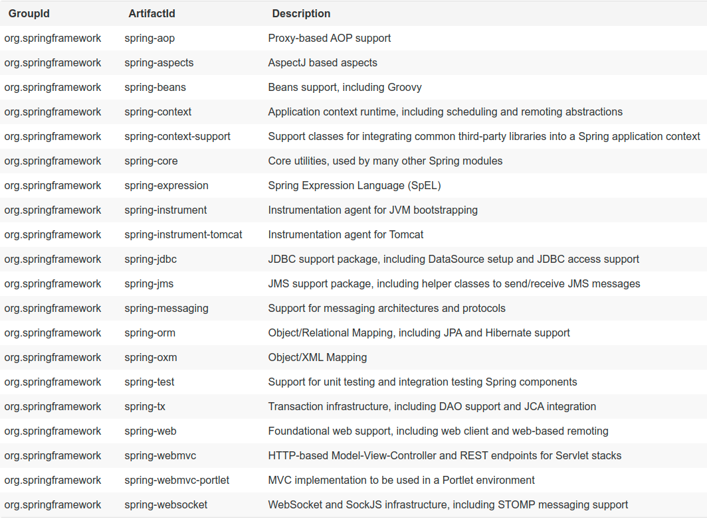

#### 1. IoC Container

##### 1.1 介绍 spring Ioc 容器和 Beans

> Ioc - Inversion of Control (控制反转)
> DI -  dependency injection (依赖注入)

`org.springframework.beans` 和 `org.springframework.context` 包是 *Spring Framework* 的 *IoC* 容器的基础包。`BeanFactory` 接口提供了一种高级的配置机制，能够管理任何类型的对象。`ApplicationContext` 是 `BeanFactory` 的一个子接口，它添加了：

- 更轻松的和 *Spring 的 AOP* 集成
- 消息的资源处理 (用于国际化)
- 事件发布
- 应用层特定的 context，例如 `WebApplicationContext` 用在 web 应用当中

在 *Spring* 中，构成应用程序主干并由 *Spring IoC* 容器管理的对象称为 *bean*。

#### 2. Resources

#### 3. Validation, Data Binding, and Type Conversion

#### 4. Spring Expression Language (SpEL)

#### 5. Aspect Oriented Programming with Spring (AOP)