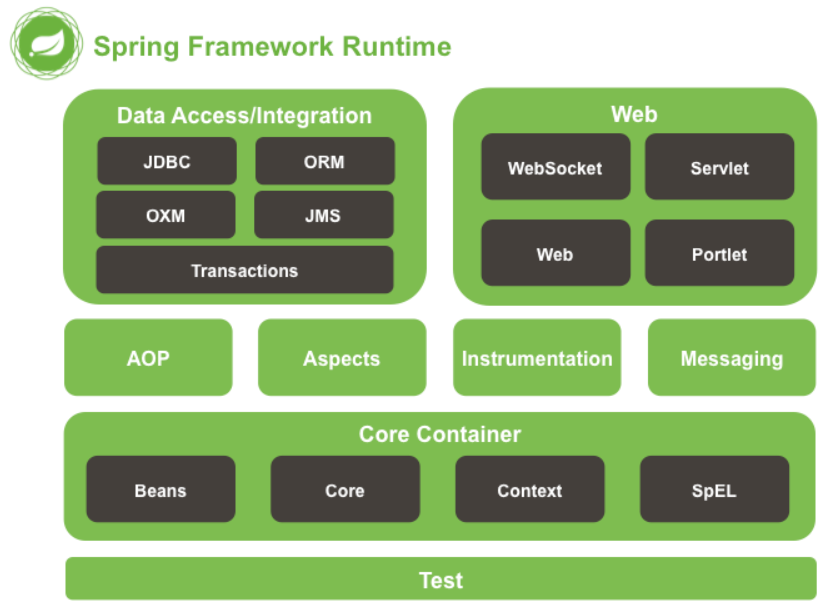
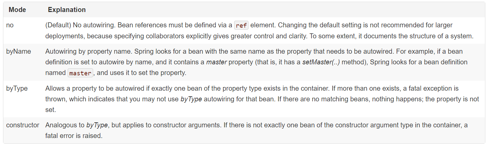
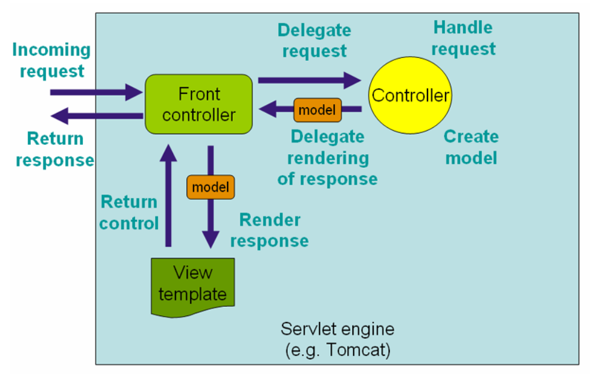

| 名词简写 |                         全称                         |           含义           |
| :------: | :--------------------------------------------------: | :----------------------: |
|   RMI    |               Remote Method Invocation               |       远程方法调用       |
|   AOP    |             Aspect-Oriented Programming              |       面向方面编程       |
|  POJOs   |                plain old Java objects                |    普通的旧 Java 对象    |
|   IoC    |                 Inversion of Control                 |         控制反转         |
|   EJB    |                Enterprise Java Beans                 |      Java 企业 Bean      |
|   JMX    |              Java Management Extensions              |      Java 管理扩展       |
|   JNDI   |          Java Name and Directory Interface           |      命名和目录接口      |
|    EL    |     extension of the unified expression language     |        表达式语言        |
|   JSP    |                  Java Server Pages                   |        服务器页面        |
| AspectJ  |                AspectJ 定义了AOP 语法                |      面向切面的框架      |
|   JDBC   |              Java Database Connectivity              |     Java 数据库连接      |
|   ORM    |              Object Relational Mapping               |       对象关系映射       |
|   OXM    |               O/X Mapper (Object/XML)                |                          |
|   JMS    |                 Java Message Service                 |       Java消息服务       |
|   JPA    |                 Java Persistence API                 |      Java持久层API       |
|   JDO    |                   Java Data Object                   |       Java数据对象       |
|   JAXB   |          Java Architecture for XML Binding           | 根据XML Schema产生Java类 |
|    GA    |                 General Availability                 |      正式发布的版本      |
|   BOM    |                  bill of materials                   |    bill of materials     |
|   JCL    | Jakarta Commons Logging API (Apache Commons Logging) |                          |
|   EOL    |                     End-of-life                      |      项目终止/停产       |
|   JNDI   |         Java Naming and Directory Interface          |    Java命名和目录接口    |
|   SPI    |                                                      |                          |
|   SpEL   |              Spring Expression Language              |                          |
|   DNF    |               Disjunctive Normal Form                |         析取范式         |
|   LTW    |                  Load-time weaving                   |       加载时间编织       |
|   TDD    |               test-driven-development                |       测试驱动开发       |
|   JTA    |                 Java Transaction API                 |                          |
|   JPA    |                 Java Persistence API                 |                          |
|   JDO    |                  Java Data Objects                   |                          |
|  *CMT*   |           *Container Managed Transaction*            |                          |
|   SPI    |              service provider interface              |                          |
|   MVC    |                model-view-controller                 |                          |
|   SWF    |                   Spring Web Flow                    |                          |

##### 笔记

`sprintboot `钟爱惯例约定优先于配置

`Dependency Injection and Inversion of Control` (依赖注入和控制反转)

- `spring `模块 (20 个)

  Core Container, Data Access/Integration, Web, AOP (Aspect Oriented Programming), Instrumentation, Messaging, and Test.
  

  1. Core Container
     `spring-core, spring-beans, spring-context, spring-context-support, spring-expression`
     `org.springframework.beans.factory.BeanFactory`
     `org.springframework.context.ApplicationContext`
  2. AOP
     `spring-aop, spring-aspects, spring-instrument, spring-instrument-tomcat`
  3. Messaging
     `spring-messaging` (springfromework4)
  4. Data Access/Integration
     `spring-jdbc, spring-tx, spring-orm, spring-oxm, spring-jms`
  5. web
     `spring-web, spring-webmvc, spring-websocket, spring-webmvc-portlet`
  6. test
     `spring-test`

**注意：**依赖管理和依赖注入是不一样的事情。

|       GroupId       |        ArtifactId        |                         Description                          |
| :-----------------: | :----------------------: | :----------------------------------------------------------: |
| org.springframework |        spring-aop        |                   Proxy-based AOP support                    |
| org.springframework |      spring-aspects      |                    AspectJ based aspects                     |
| org.springframework |       spring-beans       |               Beans support, including Groovy                |
| org.springframework |      spring-context      | Application context runtime, including scheduling and remoting abstractions |
| org.springframework |  spring-context-support  | Support classes for integrating common third-party libraries into a Spring application context |
| org.springframework |       spring-core        |      Core utilities, used by many other Spring modules       |
| org.springframework |    spring-expression     |              Spring Expression Language (SpEL)               |
| org.springframework |    spring-instrument     |         Instrumentation agent for JVM bootstrapping          |
| org.springframework | spring-instrument-tomcat |               Instrumentation agent for Tomcat               |
| org.springframework |       spring-jdbc        | JDBC support package, including DataSource setup and JDBC access support |
| org.springframework |        spring-jms        | JMS support package, including helper classes to send/receive JMS messages |
| org.springframework |     spring-messaging     |      Support for messaging architectures and protocols       |
| org.springframework |        spring-orm        | Object/Relational Mapping, including JPA and Hibernate support |
| org.springframework |        spring-oxm        |                      Object/XML Mapping                      |
| org.springframework |       spring-test        | Support for unit testing and integration testing Spring components |
| org.springframework |        spring-tx         | Transaction infrastructure, including DAO support and JCA integration |
| org.springframework |        spring-web        | Foundational web support, including web client and web-based remoting |
| org.springframework |      spring-webmvc       | HTTP-based Model-View-Controller and REST endpoints for Servlet stacks |
| org.springframework |  spring-webmvc-portlet   |    MVC implementation to be used in a Portlet environment    |
| org.springframework |     spring-websocket     | WebSocket and SockJS infrastructure, including STOMP messaging support |


###### 指定 spring 的仓库地址

```xml
注意：
1. maven china mirror：
<repository>
    <id>maven-net-cn</id>
    <name>Maven China Mirror</name>
    <url>http://maven.net.cn/content/groups/public/</url>
    <releases>
        <enabled>true</enabled>
    </releases>
    <snapshots>
        <enabled>false</enabled>
    </snapshots>
</repository>

2. maven 检索 jar 的顺序：
	local repository -> 本地配置文件中的 mirrors -> pom 文件中配置

release:
<repositories>
    <repository>
        <id>io.spring.repo.maven.release</id>
        <url>https://repo.spring.io/release/</url>
        <snapshots><enabled>false</enabled></snapshots>
    </repository>
</repositories>

milestones (里程碑):
<repositories>
    <repository>
        <id>io.spring.repo.maven.milestone</id>
        <url>https://repo.spring.io/milestone/</url>
        <snapshots><enabled>false</enabled></snapshots>
    </repository>
</repositories>

snapshots:
<repositories>
    <repository>
        <id>io.spring.repo.maven.snapshot</id>
        <url>https://repo.spring.io/snapshot/</url>
        <snapshots><enabled>true</enabled></snapshots>
    </repository>
</repositories>

-----------------
gradle:
repositories {
    mavenCentral()
    maven { url "https://repo.spring.io/release" }
	// release/milestone/snapshot
}

// 使用
dependencies {
    compile("org.springframework:spring-context:4.3.25.RELEASE")
    testCompile("org.springframework:spring-test:4.3.25.RELEASE")
}
```

###### 统一管理依赖，所有使用 spring 的版本同一

```xml
maven: dependencyManagement (BOM)

<dependencyManagement>
    <dependencies>
        <dependency>
            <groupId>org.springframework</groupId>
            <artifactId>spring-framework-bom</artifactId>
            <version>4.3.25.RELEASE</version>
            <type>pom</type>
            <scope>import</scope>
        </dependency>
    </dependencies>
</dependencyManagement>

```

###### 下载  spring jar bao

`URL` https://repo.spring.io/release/org/springframework/spring/


---

##### Spring 日志

###### Log4j 1.2 或者 2.x

> Log4j 1.2 is EOL in the meantime.
> Log4j 2.3 is the last Java 6 compatible release, with newer Log4j 2.x releases requiring Java 7+. 

*log4j 1.2*

```xml
<dependencies>
    <dependency>
        <groupId>org.springframework</groupId>
        <artifactId>spring-core</artifactId>
        <version>4.3.25.RELEASE</version>
    </dependency>
    <dependency>
        <groupId>log4j</groupId>
        <artifactId>log4j</artifactId>
        <version>1.2.17</version>
    </dependency>
</dependencies>

-----
在项目根路径下 ： log4j.properties or log4j.xml
log4j.rootCategory=INFO, stdout

log4j.appender.stdout=org.apache.log4j.ConsoleAppender
log4j.appender.stdout.layout=org.apache.log4j.PatternLayout
log4j.appender.stdout.layout.ConversionPattern=%d{ABSOLUTE} %5p %t %c{2}:%L - %m%n

log4j.category.org.springframework.beans.factory=DEBUG

```

*log4j 2.x*

```xml
<log4j.version>2.11.1</log4j.version>

<!-- 直接使用 log4j2 -->
<dependency>
    <groupId>org.apache.logging.log4j</groupId>
    <artifactId>log4j-core</artifactId>
    <version>${log4j.version}</version>
</dependency>
<dependency>
    <groupId>org.apache.logging.log4j</groupId>
    <artifactId>log4j-web</artifactId>
    <version>${log4j.version}</version>
</dependency>
<dependency>
    <groupId>org.apache.logging.log4j</groupId>
    <artifactId>log4j-jcl</artifactId>
    <version>${log4j.version}</version>
</dependency>

import org.apache.logging.log4j.LogManager;
import org.apache.logging.log4j.Logger;
private static final Logger logger = LogManager.getLogger(LogTest.class);

----------------------------------
classpath: log4j2.xml, log4j2.properties
<?xml version="1.0" encoding="UTF-8"?>
<Configuration status="WARN">
  <Appenders>
    <Console name="Console" target="SYSTEM_OUT">
      <PatternLayout pattern="%d{HH:mm:ss.SSS} [%t] %-5level %logger{36} - %msg%n"/>
    </Console>
  </Appenders>
  <Loggers>
    <Logger name="org.springframework.beans.factory" level="DEBUG"/>
    <Root level="error">
      <AppenderRef ref="Console"/>
    </Root>
  </Loggers>
</Configuration>
```

*使用 slf4j 代理 log4j*

```xml
在运行时候 (runtime)
<dependencies>
  <dependency>
    <groupId>org.apache.logging.log4j</groupId>
    <artifactId>log4j-slf4j-impl</artifactId>
    <version>2.6.2</version>
  </dependency>
</dependencies>

-----------------
<slf4j.version>1.7.25</slf4j.version>
<log4j.version>2.11.1</log4j.version>

<!-- 使用 slf4j API -->
<dependency>
    <groupId>org.slf4j</groupId>
    <artifactId>slf4j-api</artifactId>
    <version>${slf4j.version}</version>
</dependency>
<!-- 引入 log4j2 -->
<dependency>
    <groupId>org.apache.logging.log4j</groupId>
    <artifactId>log4j-core</artifactId>
    <version>${log4j.version}</version>
</dependency>
<dependency>
    <groupId>org.apache.logging.log4j</groupId>
    <artifactId>log4j-web</artifactId>
    <version>${log4j.version}</version>
</dependency>
<dependency>
    <groupId>org.apache.logging.log4j</groupId>
    <artifactId>log4j-jcl</artifactId>
    <version>${log4j.version}</version>
</dependency>
<!-- 使用 slf4j 桥接 log4j2 -->
<dependency>
    <groupId>org.apache.logging.log4j</groupId>
    <artifactId>log4j-slf4j-impl</artifactId>
    <version>${log4j.version}</version>
</dependency>

import org.slf4j.Logger;
import org.slf4j.LoggerFactory;
private static final Logger logger = LoggerFactory.getLogger(LogTest.class);
```

*使用 slf4j*
JCL 的桥接，SLF4j 绑定到 Log4j，Log4j 自己提供

```xml
<dependencies>
    <dependency>
        <groupId>org.springframework</groupId>
        <artifactId>spring-core</artifactId>
        <version>4.3.25.RELEASE</version>
        <exclusions>
            <exclusion>
                <groupId>commons-logging</groupId>
                <artifactId>commons-logging</artifactId>
            </exclusion>
        </exclusions>
    </dependency>
    <dependency>
        <groupId>org.slf4j</groupId>
        <artifactId>jcl-over-slf4j</artifactId>
        <version>1.7.21</version>
    </dependency>
    <dependency>
        <groupId>org.slf4j</groupId>
        <artifactId>slf4j-log4j12</artifactId>
        <version>1.7.21</version>
    </dependency>
    <dependency>
        <groupId>log4j</groupId>
        <artifactId>log4j</artifactId>
        <version>1.2.17</version>
    </dependency>
</dependencies>

---
由于 logback 直接实现了 slf4j，所以仅仅需要依赖
<slf4j.version>1.7.25</slf4j.version>
<logback.version>1.2.3</logback.version>
<!-- 直接使用 logback -->
<dependency>
    <groupId>org.slf4j</groupId>
    <artifactId>jcl-over-slf4j</artifactId>
    <version>${slf4j.version}</version>
</dependency>
<dependency>
    <groupId>ch.qos.logback</groupId>
    <artifactId>logback-classic</artifactId>
    <version>${logback.version}</version>
</dependency>
```


---

###### IOC 容器

> Ioc (Inversion of  Controller) 又被称为 DI (dependency injection)

The `org.springframework.beans` and `org.springframework.context` packages are the basis for Spring Framework’s `IoC` container. 

`org.springframework.beans.factory.BeanFactory` 接口提供了配置管理任何类型的对象
`org.springframework.context.ApplicationContext`是 `Beanfactory`的子接口


###### 一个 spring 配置文件管理多个配置

```xml
<beans>
    <import resource="services.xml"/>
    <import resource="resources/messageSource.xml"/>
    <import resource="/resources/themeSource.xml"/>
    <bean id="bean1" class="..."/>
    <bean id="bean2" class="..."/>
</beans>
```

###### 从 ApplicationContext 获取 bean

```java
ApplicationContext context = new ClassPathXmlApplicationContext(configLocation);
BeanTest bean = context.getBean("bean", BeanTest.class);
```

###### Bean 初始化的命名

1. 使用初始化 bean 类的 Naming bean，首写字母小写 `ScanBean -> scanBean`
2. 有多个字符，且第一个和第二个字母均为大写，就保留原始类名

###### Bean 的别名

```xml
<bean id="bean" class="cn.nihility.test.TestBean"></bean>
<alias name="bean" alias="alia_bean"/>

-------
多个应用不同的对象在同一个系统使用相同的名称
<alias name="myApp-dataSource" alias="subsystemA-dataSource"/>
<alias name="myApp-dataSource" alias="subsystemB-dataSource"/>
```

###### xml 配置内部类

```xml
class : A$InnerClass -> 采用 $ 使用内部类
<bean id="innerClass" class="cn.nihility.bean.BeanDemo$InnerClass"></bean>
```

###### 使用工厂方法创建 bean

```xml
<bean id="factoryBean" class="cn.nihility.bean.FactoryBean" factory-method="getInstance"></bean>
```

###### 通过一个 bean 的创建方法来构建另一个 bean

```xml
<bean id="factoryInstance" class="cn.nihility.bean.BeanFactory"></bean>

<bean id="createBean" factory-bean="factoryInstance" factory-method="createBean"></bean>
```

**注意:** 一个工厂类可以用来创建多个 bean 类型

###### 构造函数初始化 bean

> 当要通过初始化对象的构造函数参数列表没有带歧义的参数是，bean 构造函数参数填入顺序和书写顺序一致

```xml
<bean id="constructorBean" class="cn.nihility.bean.BeanDemo">
    <constructor-arg value="constructor bean name"/>
    <constructor-arg value="30"/>
</bean>

--- 通过下标 (index) 指定要传递的构造函数
<bean id="constructorBean" class="cn.nihility.bean.BeanDemo">
    <constructor-arg index="0" value="constructor bean name"/>
    <constructor-arg index="1" value="30"/>
</bean>

--- 直接指定构造参数的名称
<bean id="exampleBean" class="examples.ExampleBean">
    <constructor-arg name="years" value="7500000"/>
    <constructor-arg name="ultimateAnswer" value="42"/>
</bean>
注意：要编译在 debug 模式下，或者添加显示的 @ConstructorProperties 构造参数注解，java 在编译的时候参数名称会丢失
@ConstructorProperties({"years", "ultimateAnswer"})
public ExampleBean(int years, String ultimateAnswer) {
	this.years = years; this.ultimateAnswer = ultimateAnswer; 
}
```

> java 编译参数名称丢失
> 在 jdk8 前，编译的时候会把参数名称解析为 arg0, arg1 -> test(String name)  -> test(String arg0)
>
> 1. 在编译的时候打开编译参数 -parameters
> 2. 在 maven 配置<plugin>
>    	<plugin>
>       	    <groupId>org.apache.maven.plugins</groupId>
>       	    <artifactId>maven-compiler-plugin</artifactId>
>       	    <version>3.3</version>
>       	    <configuration>
>       		    <source>1.8</source>
>       		    <target>1.8</target>
>       		    <compilerArgs>
>       			    <font color="red"> <compilerArg>-parameters</compilerArg> </font>
>       		    </compilerArgs>
>       	       </configuration>
>            </plugin>


> <font color="red">构造函数和 setter 依赖注入， spring 更加推荐强制的使用构造参数依赖注入</font>

###### Bean 的静态方法构造

```xml
<bean id="beanProcessFactory" class="cn.nihility.bean.BeanProcess" factory-method="getInstance">
    <constructor-arg ref="constructorBean"></constructor-arg>
    <constructor-arg value="234"></constructor-arg>
</bean>

---------------------
public static BeanDemo getInstance(BeanDemo otherbean, String description) {
    BeanDemo beanDemo = new BeanDemo();
    beanDemo.setName("constructor arg bean name");
    beanDemo.setAge(20);
    System.out.println("Bean constructor static factory method");
    return beanDemo;
}
```

###### 直接使用 bean id 的引用

```xml
<bean id="theTargetBean" class="..."/>

<bean id="theClientBean" class="...">
    <property name="targetName">
    	<idref bean="theTargetBean"/>
    </property>
</bean>
```

> 推荐使用， idref 会在容器部署的时候校验该引用的 bean 是否存在

###### 内部 bean

```xml
<bean id="outer" class="...">
    <!-- instead of using a reference to a target bean, simply define the target bean inline -->
    <property name="target">
        <bean class="com.example.Person"> <!-- this is the inner bean -->
            <property name="name" value="Fiona Apple"/>
            <property name="age" value="25"/>
        </bean>
    </property>
</bean>
```

###### `<list/> <set/> <map/> <props/>`

```xml
<bean id="moreComplexObject" class="example.ComplexObject">
    <!-- results in a setAdminEmails(java.util.Properties) call -->
    <property name="adminEmails">
        <props>
            <prop key="administrator">administrator@example.org</prop>
            <prop key="support">support@example.org</prop>
            <prop key="development">development@example.org</prop>
        </props>
    </property>
    <!-- results in a setSomeList(java.util.List) call -->
    <property name="someList">
        <list>
            <value>a list element followed by a reference</value>
            <ref bean="myDataSource" />
        </list>
    </property>
    <!-- results in a setSomeMap(java.util.Map) call -->
    <property name="someMap">
        <map>
            <entry key="an entry" value="just some string"/>
            <entry key ="a ref" value-ref="myDataSource"/>
        </map>
    </property>
    <!-- results in a setSomeSet(java.util.Set) call -->
    <property name="someSet">
        <set>
            <value>just some string</value>
            <ref bean="myDataSource" />
        </set>
    </property>
</bean>
```

*The value of a map key or value, or a set value, can also again be any of the following elements:*

```
bean | ref | idref | list | set | map | props | value | null
```

###### 处理空字符 Null 和 empty string

```xml
empty string :
<property name="email" value=""/>  -> bean.setEmail("");

null:
<property name="email">
	<null/>
</property>
-> bean.setEmail(null);
```

###### `depends-on` 使用

> The `depends-on` attribute can explicitly force one or more beans to be initialized before the bean using this element is initialized. 

```xml
<bean id="beanOne" class="ExampleBean" depends-on="manager,accountDao">
    <property name="manager" ref="manager" />
</bean>

<bean id="manager" class="ManagerBean" />
<bean id="accountDao" class="x.y.jdbc.JdbcAccountDao" />
```

lazy initialized (延后初始化)

> `ApplicationContext`  默认为立即初始化(在部署的时候就初始完成)，可以立即发现错误
> 延迟加载初始化是在调用到该对象的时候才初始化，延后了初始化的时间，有可能导致错误许久后才被发现

```xml
<bean id="lazy" class="com.foo.ExpensiveToCreateBean" lazy-init="true"/>
```

**注意:** 一个 `lazy initialized` bean 被一个不是 `lazy initialized` 的单例 bean 依赖， 那么这个 `lazy` bean 也会在启动的时候初始化，因为必须满足单例的依赖。延迟初始化注入到一个非延迟初始化的 bean，那么这个 bean 就不是延迟初始化的 bean

```xml
配置全局懒加载,默认是非延迟加载的
<beans default-lazy-init="true"></beans>
```


###### 自动装配的模式



|          模式          |                             解释                             |
| :--------------------: | :----------------------------------------------------------: |
|   no (无) [default]    |     必须采用 `ref` 来引用其它的 `bean`，记录了系统的结构     |
|    byName (按名称)     | 使用属性的名称来注入，按照名称的 setter 注入, master -> setMaster() |
|    byType (按类型)     | 按照类型注入，如果容器确定有这个类型的对象那么就装配这个对象，若是与有多个相同的类型就是报错，一个类型都不存在就不装配 |
| constructor (构造函数) | 和 `byType` 类似，若是容器内没有相同类型的构造函数参数，那就会报错 |

###### Bean 的生命范围

|                            Scope                             | Description                                                  |
| :----------------------------------------------------------: | :----------------------------------------------------------- |
| [singleton](https://docs.spring.io/spring/docs/4.3.25.RELEASE/spring-framework-reference/htmlsingle/#beans-factory-scopes-singleton) | (Default) Scopes a single bean definition to a single object instance per Spring IoC container. |
| [prototype](https://docs.spring.io/spring/docs/4.3.25.RELEASE/spring-framework-reference/htmlsingle/#beans-factory-scopes-prototype) | Scopes a single bean definition to any number of object instances. |
| [request](https://docs.spring.io/spring/docs/4.3.25.RELEASE/spring-framework-reference/htmlsingle/#beans-factory-scopes-request) | Scopes a single bean definition to the lifecycle of a single HTTP request; that is, each HTTP request has its own instance of a bean created off the back of a single bean definition. Only valid in the context of a web-aware Spring `ApplicationContext`. |
| [session](https://docs.spring.io/spring/docs/4.3.25.RELEASE/spring-framework-reference/htmlsingle/#beans-factory-scopes-session) | Scopes a single bean definition to the lifecycle of an HTTP `Session`. Only valid in the context of a web-aware Spring `ApplicationContext`. |
| [globalSession](https://docs.spring.io/spring/docs/4.3.25.RELEASE/spring-framework-reference/htmlsingle/#beans-factory-scopes-global-session) | Scopes a single bean definition to the lifecycle of a global HTTP `Session`. Typically only valid when used in a Portlet context. Only valid in the context of a web-aware Spring `ApplicationContext`. |
| [application](https://docs.spring.io/spring/docs/4.3.25.RELEASE/spring-framework-reference/htmlsingle/#beans-factory-scopes-application) | Scopes a single bean definition to the lifecycle of a `ServletContext`. Only valid in the context of a web-aware Spring `ApplicationContext`. |
| [websocket](https://docs.spring.io/spring/docs/4.3.25.RELEASE/spring-framework-reference/htmlsingle/#websocket-stomp-websocket-scope) | Scopes a single bean definition to the lifecycle of a `WebSocket`. Only valid in the context of a web-aware Spring `ApplicationContext`. |

**注意：** 默认的 singleton 范围是指 *每一个容器每一个 singleton bean*
一个 `prototype`  范围的 bean 注入到一个 `singleton`  范围后就成为了唯一的一个实例对象


##### spring 注解使用

> spring 中 annotation injection 在 xml 配置之前，所以 xml 配置的属性会覆盖掉 *注解* 的配置

**注意：** 开启 spring 注解需要添加配置

```xml
<context:annotation-config />

显式的注册后置处理
AutowiredAnnotationBeanPostProcessor, CommonAnnotationBeanPostProcessor PersistenceAnnotationBeanPostProcessor
---------------
同前配置 RequiredAnnotationBeanPostProcessor
```

**注意：**`<context:annotation-config />` 仅查找注解在所定义的相同应用上下文配置
例如： 把此配置放在 `WebApplicationContext` for a `DispatcherServlet` 那么仅检查 `@Autowired` 在 `controllers` 中


###### `@Required` 作用在 method

###### `@Autowired` *CONSTRUCTOR, METHOD, PARAMETER, FIELD* <font color="blue">按照 bean 的类型自动注入</font>

> JSR 300 规范中 `@Inject` 注解可以替代 `@Autowired`

<font color="red">当 `@Autowired` 注解在类构造函数上时，构造函数仅有一个可以不用写该注解
</font>

```java
public class A {
    private B b;
    @Autowired  // 这里的这个注解可要可不要
    public A(B b) {
        this.b = b;
    }
}
```

*可以把所有的类型放到一个 List/Array/Set 等集合中*

```java
public class A {
    @Autowired
    private List<B> listb;
}
```

*若 `@Autowired` 注入的类型有多个 bean，那么要在确定注入 bean 上添加 `@Primary` 注解*

```java
<bean class="test.TB" primary="true"></bean>
    
@Bean
@Primary
public TB getTB() {}
```

*使用 `@Qualifier` 指定要注入 bean 的名称*

```java
class A {
    @Autowired
    @Qualifier("bb")
    private B b;
    
    // 或者
	@Autowired
	public void prepare(@Qualifier("bb") B b) {}
}

-----------------
XML 配置
<context:annotation-config/>

<bean class="example.SimpleMovieCatalog">
	<qualifier value="main"/>
</bean>

<bean class="example.SimpleMovieCatalog">
	<qualifier value="action"/>
    // 或者加上类型
	 <qualifier type="example.Genre" value="Comedy"/>
</bean>

```

> `@Autowired` + `@Qualifier` 会先获取所有类型相同的 bean 再在这些 bean 中选择 id 与限定符一致的 bean

*自定义 Qualifier*

```java
@Target({ElementType.FIELD, ElementType.PARAMETER})
@Retention(RetentionPolicy.RUNTIME)
@Qualifier
public @interface MovieQualifier {
    String genre();
    Format format();
}

public enum Format {
    VHS, DVD, BLURAY
}

public class MovieRecommender {
    @Autowired
    @MovieQualifier(format=Format.VHS, genre="Action")
    private MovieCatalog actionVhsCatalog;
}

--------------
XML
<bean class="example.SimpleMovieCatalog">
    <qualifier type="MovieQualifier">
        <attribute key="format" value="VHS"/>
        <attribute key="genre" value="Comedy"/>
    </qualifier>
</bean>
```

###### `@Resource` *TYPE, FIELD, METHOD* <font color="blue">按照名称属性注入</font>

```java
public class AnnotationResource {
    private BeanDemo bean;
    @Resource(name = "secondBean")
    public void setBean(BeanDemo secondBean) { this.bean = secondBean; }
}
```

> <font color="blue">若没有显示的指定名称，放在字段上就是字段的变量名称，放在方法上就是参数的名称
> 解析的顺序，先查看 `ApplicationContext` 中是否有 `@Rsource` 指定的限定符，在查找类型的 `@Primary`</font>

```java
@Configuration
public class AnnotationBeanConfig {
    @Bean
    public IAnnotationBean generateAnnotationBean() {
        return new IAnnotationBeanImpl();
    }
}
// 这里这个 bean 的 name 就是方法的名称 generateAnnotationBean

class BeanInit {
    public void init() {}
    public void destroy {}
}

@Configuration
public class AnnotationBeanConfig {
    @Bean(initMethod = "init", destroyMethod = "destroy")
    public BeanInit generateAnnotationBean() {
        return new BeanInit();
    }
}

```


###### 声明类的原型

`@Repository` `@Component`, `@Service`, and `@Controller`. `@Component`
*配置 package 的自动扫描*

```java
@Configuration
@ComponentScan(basePackage="com.test") // @ComponentScan("com.test")
public class AppConfig {}

-----
XML: 
<context:component-scan base-package="org.example"/>
```

`AutowiredAnnotationBeanPostProcessor` and `CommonAnnotationBeanPostProcessor` 会自动引入
不引入配置:

```xml
<context:component-scan base-package="cn.nihility.bean" annotation-config="false" />
```

*配置扫描类型*

> `@Component`, `@Repository`, `@Service`, `@Controller`, or `@Configuration` 这些是默认就会扫描的

| Filter Type          | Example Expression           | Description                                                  |
| -------------------- | ---------------------------- | ------------------------------------------------------------ |
| annotation (default) | `org.example.SomeAnnotation` | An annotation to be present at the type level in target components. |
| assignable           | `org.example.SomeClass`      | A class (or interface) that the target components are assignable to (extend/implement). |
| aspectj              | `org.example..*Service+`     | An AspectJ type expression to be matched by the target components. |
| regex                | `org\.example\.Default.*`    | A regex expression to be matched by the target components class names. |
| custom               | `org.example.MyTypeFilter`   | A custom implementation of the `org.springframework.core.type .TypeFilter` interface. |

```java
@Configuration
@ComponentScan(basePackages = "org.example",
        includeFilters = @Filter(type = FilterType.REGEX, pattern=".*Stub.*Repository"),
        excludeFilters = @Filter(Repository.class))
public class AppConfig {
    ...
}

--------------------
XML

<beans>
    <context:component-scan base-package="org.example">
        <context:include-filter type="regex" expression=".*Stub.*Repository"/>
        <context:exclude-filter type="annotation"
                expression="org.springframework.stereotype.Repository"/>
    </context:component-scan>
</beans>
```

> `@Bean` 放在 `@Component` 和 `@Configuration` 是不一样的
> `@Component` 没有 *CGLIB* 增强拦截调用方法和字段.
>
> <font color="red">The `@Bean` methods in a regular Spring component are processed differently than their counterparts inside a Spring `@Configuration` class. The difference is that `@Component` classes are not enhanced with CGLIB to intercept the invocation of methods and fields. CGLIB proxying is the means by which invoking methods or fields within `@Bean` methods in `@Configuration` classes creates bean metadata references to collaborating objects; such methods are *not* invoked with normal Java semantics but rather go through the container in order to provide the usual lifecycle management and proxying of Spring beans even when referring to other beans via programmatic calls to `@Bean` methods. In contrast, invoking a method or field in an `@Bean` method within a plain `@Component` class *has* standard Java semantics, with no special CGLIB processing or other constraints applying.</font>

> 生成的 `Bean` 的默认名称为类名
> @Service("Specific Name")
> @Component -- > "component"
> public class Component {}


**注意:** 在 `@Configuration` 中一个 bean 可以用该 configuration 中的另一个 bean 方法,在当中配置的 `@Bean` 相当于在 XML 中配置的 `<bean/>`

```java
@Configuration
public class AppConfig {
    @Bean
    public MyService myService() { return new MyServiceImpl(); }
}

-----------------
xml:
<beans>
    <bean id="myService" class="com.acme.services.MyServiceImpl"/>
</beans>
```

----

##### Spring 的 context 初始化方式

###### 使用 XML 方式初始化 `ClassPathXmlApplicationContext`

```java
ApplicationContext context 
    = new ClassPathXmlApplicationContext("classpath:spring/applicationContext.xml");

BeanTest bean = context.getBean("testBean", BeanTest.class);
```

###### 使用注解的方式初始化 `ApplicationContext` -> `AnnotationConfigApplicationContext` 

```java
public static void main(String[] args) {
    ApplicationContext ctx = new AnnotationConfigApplicationContext(AppConfig.class);
    MyService myService = ctx.getBean(MyService.class);
    myService.doStuff();
}

// 无参数稍后注册方式
AnnotationConfigApplicationContext ctx = new AnnotationConfigApplicationContext();
ctx.register(AppConfig.class, OtherConfig.class);
ctx.register(AdditionalConfig.class);
ctx.scan("com.test"); // 扫描包
ctx.refresh();
```

###### 配置启动 config 类

```java
@Configuration
@ComponentScan(basePackages = {"com.bean"})
public class AppConfig {}

ApplicationContext ctx = new AnnotationConfigApplicationContext(AppConfig.class);

----------------
类似 XML :
<beans>
	<context:component-scan base-package="com.bean"/>
</beans>
```

web application 应用的 `AnnotationConfigWebApplicationContext`

```xml
<web-app>
    <!-- Configure ContextLoaderListener to use AnnotationConfigWebApplicationContext
        instead of the default XmlWebApplicationContext -->
    <context-param>
        <param-name>contextClass</param-name>
        <param-value>
            org.springframework.web.context.support.AnnotationConfigWebApplicationContext
        </param-value>
    </context-param>

    <!-- Configuration locations must consist of one or more comma- or space-delimited
        fully-qualified @Configuration classes. Fully-qualified packages may also be
        specified for component-scanning -->
    <context-param>
        <param-name>contextConfigLocation</param-name>
        <param-value>com.acme.AppConfig</param-value>
    </context-param>

    <!-- Bootstrap the root application context as usual using ContextLoaderListener -->
    <listener>
        <listener-class>org.springframework.web.context.ContextLoaderListener</listener-class>
    </listener>

    <!-- Declare a Spring MVC DispatcherServlet as usual -->
    <servlet>
        <servlet-name>dispatcher</servlet-name>
        <servlet-class>org.springframework.web.servlet.DispatcherServlet</servlet-class>
        <!-- Configure DispatcherServlet to use AnnotationConfigWebApplicationContext
            instead of the default XmlWebApplicationContext -->
        <init-param>
            <param-name>contextClass</param-name>
            <param-value>
                org.springframework.web.context.support.AnnotationConfigWebApplicationContext
            </param-value>
        </init-param>
        <!-- Again, config locations must consist of one or more comma- or space-delimited
            and fully-qualified @Configuration classes -->
        <init-param>
            <param-name>contextConfigLocation</param-name>
            <param-value>com.acme.web.MvcConfig</param-value>
        </init-param>
    </servlet>

    <!-- map all requests for /app/* to the dispatcher servlet -->
    <servlet-mapping>
        <servlet-name>dispatcher</servlet-name>
        <url-pattern>/app/*</url-pattern>
    </servlet-mapping>
</web-app>
```


###### 注解方式使用 `@Bean` 

> `@Bean` 可以用在 `@Configuration` 或者 `@Component` 注解的类中
> <font color="red">`@Bean` 注解在指定返回类型方法上，方法名就是 bean 的 id，返回值就是 bean 的 class 类型</font>

```java
@Configuration
public class Appconfig {
    @Bean
	public TransferServiceImpl transferService() { 
        return new TransferServiceImpl(); 
    }
}
所在 Bean 的容器时 ApplicationContext

------------- 等同于 XML 配置
<beans>
    <bean id="transferService" class="com.bean.TransferServiceImpl"/>
</beans>
        
```

**注意：** 若是类中有默认的 public `close/shutdown` 方法，spring 容器会默认的把他们加入销毁回调中

###### 内部 bean 的依赖注入

```java
@Configuraiton
public class Appconfig {
    @Bean
    public Foo foo() { return new Foo(); }
	@Bean
    public Bar bar() {return new Bar(foo()); }
}
```

**注意：**<font color="red">像上面的内部 bean 直接依赖仅可以用在 `@Cofniguration` 的配置类中，在 `@Component` 中则不能使用</font>

###### 基于 java 的配置组合 `@Import`

```java
@Configuration
public class ConfigA {}

@Configuration
@Import(ConfigA.class)
public class ConfigB {}

// 仅需要依赖配置 B 就好
ApplicationContext ctx = new AnnotationConfigApplicationContext(ConfigB.class);

```

**注意：**  `@Configuration` 注解下一个类中的 bean 默认是不能直接访问另一个 `@Configuration` 中的 bean， 这是需要加 `@Import`
**注意:** <font color="red">如果使用 XML 配置的方式还想要使用注解，需要在 xml 中声明</font>

```xml
<beans>
    <!-- enable processing of annotations such as @Autowired and @Configuration -->
    <context:annotation-config/>
    
    <!-- 或者改为 component-scan 包含了 annotation-config 的功能 -->
    <!-- picks up and registers AppConfig as a bean definition -->
    <context:component-scan base-package="com.acme"/>
</beans>
```

###### 在类注解的机制下添加 XML 配置文件的支持 `@ImportResource`

```java
@Configuration
@ImportResource("classpath:spring/config.xml")
public class AppConfig {
    @Value("${name}")
    private String name;
}

------------
config.xml
<beans>
	<context:property-placeholder location="classpath:properties/jdbc.properties"/>
</beans>
```

###### 按照配置加载指定 bean `@Profile`

```java
@Configuration
@Profile("development")
public class ConfigA {}

AnnotationConfigApplicationContext ctx = new AnnotationConfigApplicationContext();
ctx.getEnvironment().setActiveProfiles("development");
ctx.register(AnnotationConfig.class);
ctx.refresh();
```

###### 注入 *properties* 属性值 `@PropertySource`

```java
@Configuration
@PropertySource(encoding = "utf-8", value = {"classpath:properties/use.properties"})
public class PropertySourceConfig {
    @Autowired
    Environment env;

    @Bean
    public IBean propertySourceIBean() {
        System.out.println("Property Source IBean name = " + 
                           env.getProperty("name") + " : age = " 
                           + env.getProperty("age"));
        return new IBeanImpl("name", 100);
    }
```

##### 资源 `Resource`

| Prefix     | Example                          | Explanation                                                  |
| ---------- | -------------------------------- | ------------------------------------------------------------ |
| classpath: | `classpath:com/myapp/config.xml` | Loaded from the classpath.                                   |
| file:      | `file:///data/config.xml`        | Loaded as a `URL`, from the filesystem. [[1\]](https://docs.spring.io/spring/docs/4.3.25.RELEASE/spring-framework-reference/htmlsingle/#ftn.d5e6195) |
| http:      | `https://myserver/logo.png`      | Loaded as a `URL`.                                           |
| (none)     | `/data/config.xml`               | Depends on the underlying `ApplicationContext`.              |

```java
Resource template = ctx.getResource("classpath:some/resource/path/myTemplate.txt");

Resource template = ctx.getResource("file:///some/resource/path/myTemplate.txt");
Resource template = ctx.getResource("https://myhost.com/resource/path/myTemplate.txt");
```

###### 内置的 spring Resource 的实现

`URLResource`
`file:` 表示文件系统路径， `http:`表示通过 http 访问资源 `ftp:` 可以通过 ftp 访问的资源

`ClassPathResource`, `FileSystemResource`, `ServletContextResource`, `InputStreamResource`, `ByteArrayResource`

###### `classpath*:`和 `classpath:` 区别

```java
classpath：只会到你的 class 路径中查找找文件。
classpath*：不仅包含 class 路径，还包括 jar 文件中（class 路径）进行查找。
注意： 用 classpath*: 需要遍历所有的 classpath，所以加载速度是很慢的；
应该尽可能规划好资源文件所在的路径，尽量避免使用 classpath*
```

###### `FileSystemApplicationContext` 不是 真正的 `ResourceLoader`

```java
绝对路径和相对路径的区别 :
绝对路径： new FileSystemXmlApplicationContext("/conf/context.xml");
    绝对路径是相对于文件系统的根的。
相对路径：FileSystemXmlApplicationContext("conf/context.xml");
	相对路径是相对于当前工作目录的
```


##### Validation, Data Binding, Type Conversion

###### 校验数据

需要实现接口 `org.springframework.validation.Validator`
`org.springframework.validation.ValidationUtils` spring 提供的校验帮助抽象类

###### JaveBean

> 仅有一个基本的构造函数，和字段的 setter/getter 方法的类

###### 类型转换 `org.springframework.core.convert.converter.Converter`

基本的转化类 `org.springframework.core.convert.support.DefaultConversionService`

```java
final class StringToInteger implements Converter<String, Integer> {
    public Integer convert(String source) {
        return Integer.valueOf(source);
    }
}
```

`org.springframework.core.convert.converter.ConverterFactory`

```java
final class StringToEnumConverterFactory implements ConverterFactory<String, Enum> {
    public <T extends Enum> Converter<String, T> getConverter(Class<T> targetType) {
        return new StringToEnumConverter(targetType);
    }
    private final class StringToEnumConverter<T extends Enum> implements Converter<String, T> {
        private Class<T> enumType;
        public StringToEnumConverter(Class<T> enumType) {
            this.enumType = enumType;
        }
        public T convert(String source) {
            return (T) Enum.valueOf(this.enumType, source.trim());
        }
    }
}
```

###### EL Language

```java
@Value("#{ systemProperties['user.region'] }")
private String defaultLocale;

 @Value("#{ systemProperties['user.region'] }")
public void setDefaultLocale(String defaultLocale) {
    this.defaultLocale = defaultLocale;
}

 @Autowired
public void configure(MovieFinder movieFinder,
                      @Value("#{ systemProperties['user.region'] }") String defaultLocale) {
    this.movieFinder = movieFinder;
    this.defaultLocale = defaultLocale;
}
```

*注意：* 空的 `list` 可以由 `{}` 表示  --> 
	空的 `map` 由 `{:}` 表示

##### AOP `Aspect Oriented Programming`

> `AOP(Aspect-Oriented Programming)` 是 `OOP(Object-Oriented Programming)` 的补充
> Spring 的 `Ioc` 并不依赖与 `AOP`

###### AOP 的概念和术语

- *Aspect*: a modularization of a concern that cuts across multiple classes. Transaction management is a good example of a crosscutting concern in enterprise Java applications. In Spring AOP, aspects are implemented using regular classes (the [schema-based approach](https://docs.spring.io/spring/docs/4.3.25.RELEASE/spring-framework-reference/htmlsingle/#aop-schema)) or regular classes annotated with the `@Aspect` annotation (the [`@AspectJ` style](https://docs.spring.io/spring/docs/4.3.25.RELEASE/spring-framework-reference/htmlsingle/#aop-ataspectj)).
- *Join point*: a point during the execution of a program, such as the execution of a method or the handling of an exception. In Spring AOP, a join point *always* represents a method execution.
- *Advice*: action taken by an aspect at a particular join point. Different types of advice include "around", "before" and "after" advice. (Advice types are discussed below.) Many AOP frameworks, including Spring, model an advice as an *interceptor*, maintaining a chain of interceptors *around* the join point.
- *Pointcut*: a predicate that matches join points. Advice is associated with a pointcut expression and runs at any join point matched by the pointcut (for example, the execution of a method with a certain name). The concept of join points as matched by pointcut expressions is central to AOP, and Spring uses the AspectJ pointcut expression language by default.
- *Introduction*: declaring additional methods or fields on behalf of a type. Spring AOP allows you to introduce new interfaces (and a corresponding implementation) to any advised object. For example, you could use an introduction to make a bean implement an `IsModified` interface, to simplify caching. (An introduction is known as an inter-type declaration in the AspectJ community.)
- *Target object*: object being advised by one or more aspects. Also referred to as the *advised* object. Since Spring AOP is implemented using runtime proxies, this object will always be a *proxied* object.
- *AOP proxy*: an object created by the AOP framework in order to implement the aspect contracts (advise method executions and so on). In the Spring Framework, an AOP proxy will be a JDK dynamic proxy or a CGLIB proxy.
- *Weaving*: linking aspects with other application types or objects to create an advised object. This can be done at compile time (using the AspectJ compiler, for example), load time, or at runtime. Spring AOP, like other pure Java AOP frameworks, performs weaving at runtime.

###### Advice 的类型

- *Before advice*: Advice that executes before a join point, but which does not have the ability to prevent execution flow proceeding to the join point (unless it throws an exception).
- *After returning advice*: Advice to be executed after a join point completes normally: for example, if a method returns without throwing an exception.
- *After throwing advice*: Advice to be executed if a method exits by throwing an exception.
- *After (finally) advice*: Advice to be executed regardless of the means by which a join point exits (normal or exceptional return).
- *Around advice*: Advice that surrounds a join point such as a method invocation. This is the most powerful kind of advice. Around advice can perform custom behavior before and after the method invocation. It is also responsible for choosing whether to proceed to the join point or to shortcut the advised method execution by returning its own return value or throwing an exception.

> AOP 默认使用 JDK 代理，但是也可以使用 CGLIB 代理


---

###### 允许使用 `@AspectJ` 的支持

```java
java: 添加 conifg 和 proxy 注解

@Configuration
@EnableAspectJAutoProxy
public class ApplicationConfig {
}
```

```xml
xml 配置：
<aop:aspectj-autoproxy />
```

> 包含 `@Aspect` 注解的类和普通类一样，可以由方法和字段，重要的是可以包含  `pointcut, advice, introduction`  *声明了一个切面*

```xml
java :
@Aspect
public class AspectClass {}
<!-- 注意：自动注入 Aspect 是还不能成功的，还得加入 @Component 注解，注册为一个 bean 对象 -->

xml :
<bean id="myAspect" class="com.test.MyAspect">
    <!-- configure properties of aspect here as normal -->
</bean>
```

<font color="red">Spring 仅支持方法的执行加入点在 spring bean 上，注解使用 `@Pointcut` 的方法必须返回值是 *void*</font>
*切入点的表达式 (Point expression) 和切入点的签名 (Point signature)*

```java
@Pointcut("execution(* transfer(..))")  // point expression
private void oldTransfer() {} // point signature
```

###### spring aop 支持的 aop 表达式指示符

- *execution* - for matching method execution join points, this is the primary pointcut designator you will use when working with Spring AOP
- *within* - limits matching to join points within certain types (simply the execution of a method declared within a matching type when using Spring AOP)
- *this* - limits matching to join points (the execution of methods when using Spring AOP) where the bean reference (Spring AOP proxy) is an instance of the given type
- *target* - limits matching to join points (the execution of methods when using Spring AOP) where the target object (application object being proxied) is an instance of the given type
- *args* - limits matching to join points (the execution of methods when using Spring AOP) where the arguments are instances of the given types
- *@target* - limits matching to join points (the execution of methods when using Spring AOP) where the class of the executing object has an annotation of the given type
- *@args* - limits matching to join points (the execution of methods when using Spring AOP) where the runtime type of the actual arguments passed have annotations of the given type(s)
- *@within* - limits matching to join points within types that have the given annotation (the execution of methods declared in types with the given annotation when using Spring AOP)
- *@annotation* - limits matching to join points where the subject of the join point (method being executed in Spring AOP) has the given annotation

> 对于 *JDK* 的代理实现，仅 *public* 接口方法调用在代理的时候才能被拦截
> 对于 *CGLIB* ，*public* 和 *protected* 方法在代理调用的时候可以被拦截，包可见的方法也可以
> 但是常见的交互通过代理的方法应该被设计为 *public*

###### 常见的 *pointcut* 表达式

> 可以使用关系式 `&&` `||` `!`

```java
@Pointcut("execution(public * *(..))")
private void anyPublicOperation() {}

@Pointcut("within(com.xyz.someapp.trading..*)")
private void inTrading() {}

@Pointcut("anyPublicOperation() && inTrading()")
private void tradingOperation() {}
```

*`pointcut 方法的修饰符不影响 pointcut 表达式`*

```java
@Pointcut("execution(* com.xyz.someapp..service.*.*(..))")
public void businessService() {}
```

###### 常用的 `execution` 切入点标识符

```java
execution(modifiers-pattern? ret-type-pattern 
          declaring-type-pattern?name-pattern(param-pattern) throws-pattern?)
    
ret-type-pattern : [* 表示任意的返回值]
name-pattern : 表示方法的名称 [* 表示任意的方法]
() : 方法的参数， ()-没有参数，(..)-有任意参数，0或多个，(*)-一个参数，类型任意，(*,String)-两个参数，第一个任意，第二个为 String 类型
```

> 除了 *ret-type-pattern*  修饰符，*name pattern, and parameters pattern* 是可选的

```java
execution(public * *(..)) - 任意的 public 方法
execution(* set*(..)) - 任意的以 set 开头的方法
execution(* com.test.Service.*(..)) - 由 Service 定义的任意方法
execution(* com.test.service.*.*(..)) - 在 service 包中的任意方法
execution(* com.test.service..*.*(..)) - 在 service 包或者子包中的任意方法
    
within(com.test.service.*) - 仅 spring AOP 可用，在 service 包中的的任意 加入点
within(com.test.service..*) - 尽在 spring aop 可用，在 service 包和其子包中的任意 join point
within(com.test.service.AccountService) - 定义在 AccountService 接口中的任意 join point
    
this(com.test.service.AccountService) - 代理实现是 AccountService 接口的任意接入点
target(com.test.service.AccountService) - 目标对象实现 AccountService 接口的任意接入点

args(java.io.Serializable) - 仅有一个参数且类型为 Serializable 的任意接入点

@target(org.springframework.transaction.annotation.Transactional) - 注解为事务的任意接入点

@within(org.springframework.transaction.annotation.Transactional) - 注解中含有事务的任意接入点

@annotation(org.springframework.transaction.annotation.Transactional) - 执行方法含由此注解的任意接入点

```

###### 声明式 advice

*Before advice*

```java
@Aspect
public class BeforeExample {
    @Before("execution(* com.test..*.*(..))")
    public void beforeCheck() {}
}
```

*After returning advice*

```java
@Aspect
public class AfterReturningExample {
    @AfterReturning("execution(* com.test..*.*(..))")
    public void afterReturning() {}
    
    // 绑定返回值
	@AfterReturning(pointcut="com.test.service.opertaion()" returning="retVal")
    public void doAccessCheck(Object retVal) {}
}
```

*After throwing advice*

```java
@Aspect
public class AfterThrowingExample {
    @AfterThrowing("com.xyz.myapp.SystemArchitecture.dataAccessOperation()")
    public void doRecoveryActions() { }

    // 绑定特定的异常
    @AfterThrowing(
        pointcut="com.xyz.myapp.SystemArchitecture.dataAccessOperation()",
        throwing="ex")
    public void doRecoveryActions(DataAccessException ex) { }
}
```

*After (finally) advice*

```java
@Aspect
public class AfterFinallyExample {
    @After("com.xyz.myapp.SystemArchitecture.dataAccessOperation()")
    public void doReleaseLock() {}
}
```

*Around advice*

> 线程安全的方式

```java
@Aspect
public class AroundExample {
    @Around("com.xyz.myapp.SystemArchitecture.businessService()")
    public Object doBasicProfiling(ProceedingJoinPoint pjp) throws Throwable {
        // start stopwatch
        Object retVal = pjp.proceed();
        // stop stopwatch
        return retVal;
    }
    // 注意参数： ProceedingJoinPoint
}
```

###### 访问当前的 *JoinPoint*

> 任何 *advice* 方法都可在声明的第一个参数添加 `org.aspectj.lang.JoinPoint`，而 *Around* 则为 `ProceedingJoinPoint`， 其为 `JoinPoint` 的一个子类
> `JoinPoint` 提供了一系列的方法
> `getArgs()` (returns the method arguments)
> `getThis()` (returns the proxy object，被代理的对象，切点作用的对象的增强)
> `getTarget()` (returns the target object，被 pointcut 指定方法的对象)
> `getSignature()` (returns a description of the method that is being advised， 切点指定对象)
> `toString()` (prints a useful description of the method being advised)

###### Advice 的执行顺序

```xml
1.1 begin before
1.2 end before
2.1 begin around
    3.1 begin afterReturning
    3.2 end afterReturning
2.2 end around
4.1 begin after
4.2 end after
```

<font color="red">注意：如果由 `@Around` 注解和 `@AfterThrowing` 注解作用在同一个切点，那么 `@Around` 的 `joinPoint.proceed()` 处理的错误要向外抛，不能 *try-catch* 掉，不然 `@After Throwing` 不能拦截到报错信息</font>
<font color="blue">注意 double / 0 是不会报错，仅会出显 Infinity, 而 int / 0 则会报错，/ by zero</font>

###### 获取切入点执行参数，(可以执行校验)

```java
> 切入方法
public void say(String message);

> aspect
@Before("execution(* com.test.aop.Bean.*(..)) && args(message)")
public void before(JoinPoint joinPoint, String message) {
    >> print message
}
```

> <font color="red">切面的参数第一个为 *JoinPoint/ProceedingJoinPoint* 可以自动注入当前切入点的属性，后面可作为切入点的参数信息，但是要添加 `args(...)`</font>
> <font color="blue">绑定参数可以是 `@within, @target, @annotation, @args`</font>

```java
@Retention(RetentionPolicy.RUNTIME)
@Target(ElementType.METHOD)
public @interface Auditable { AuditCode value(); }

@Before("com.test.anyPublicMethod() && @annotation(auditable)")
public void audit(Auditable auditable) {
    AuditCode code = auditable.value();
}
```

> 通过 *Java* 反射无法获取参数的名称，所以 *Spring* 通过特定的策略来获取。
>
> 1. 使用可选参数 `argNames` 来特别指定
>
>    ```java
>    @Before(value = "com.test.PointCut.*(..) && target(bean) && @annotation(auditable)", argNames="bean,auditable")
>    public void audit(Object bean, Auditable auditable) {
>        AuditCode code = auditable.value();
>    }
>    ```


###### Advice 的执行顺序

当多个 *advice* 作用在同一个 *join point* 时，通过执行的有限权来确定执行顺序。
对于 `@Before` 高有限权的先执行， 对于 `@After` 高优先级的后执行
在不用的 `@Aspect` 中可通过 `@Order` 在确定执行顺序，在同一个 `@Aspect` 则不能确定顺序

###### 使用 *JDK* 或者 *CGLIB* 代理

若类有接口就使用 *JDK* 代理，类没有接口就是用 *CGLIB* 代理
强制使用 *CGLIB* 代理

```xml
<aop:aspectj-autoproxy proxy-target-class="true"/>

<aop:config proxy-target-class="true">
    <!-- other beans defined here... -->
</aop:config>
```

> 使用 `proxy-target-class="true"` 在 `<tx:annotation-driven/>`，`<aop:aspectj-autoproxy/>`，`<aop:config/>` 将会强制使用 *CGLIB* 代理

```java
ProxyFactory proxyFactory = new ProxyFactory(new SimplePojoImpl());
proxyFactory.addInterface(Pojo.class);

Pojo pojo = (Pojo) proxyFactory.getProxy();
System.out.println(pojo.getClass());  --> com.sun.proxy.$Proxy22
```


##### Spring 事务处理

###### transaction strategy

`org.springframework.transaction.PlatformTransactionManager`

```java
TransactionStatus getTransaction(TransactionDefinition definition) throws TransactionException;

void commit(TransactionStatus status) throws TransactionException;

void rollback(TransactionStatus status) throws TransactionException;
```

###### 可用 `DataSourceUtils` 管理 *JDBC* 操作

`org.springframework.jdbc.datasource.DataSourceUtils`

```java
Connection getConnection(DataSource dataSource);

Connection conn = DataSourceUtils.getConnection(dataSource);
```

###### XML 配置

```xml
<!-- this is the service object that we want to make transactional -->
<bean id="fooService" class="x.y.service.DefaultFooService"/>

<!-- the transactional advice (what 'happens'; see the <aop:advisor/> bean below) -->
<tx:advice id="txAdvice" transaction-manager="txManager">
    <!-- the transactional semantics... -->
    <tx:attributes>
        <!-- all methods starting with 'get' are read-only -->
        <tx:method name="get*" read-only="true"/>
        <!-- other methods use the default transaction settings (see below) -->
        <tx:method name="*"/>
    </tx:attributes>
</tx:advice>

<!-- ensure that the above transactional advice runs for any execution
        of an operation defined by the FooService interface -->
<aop:config>
    <aop:pointcut id="fooServiceOperation" expression="execution(* x.y.service.FooService.*(..))"/>
    <aop:advisor advice-ref="txAdvice" pointcut-ref="fooServiceOperation"/>
</aop:config>
```

###### `<tx:advice />` xml 的配置

```xml
<tx:advice id="id" transaction-manager="dataSourceTransactionManager">
    <tx:attributes>
        <tx:method name="get*" isolation=""/>
    </tx:attributes>
</tx:advice>
```

| Attribute         | Required? | Default  | Description                                                  |
| ----------------- | --------- | -------- | ------------------------------------------------------------ |
| `name`            | Yes       |          | Method name(s) with which the transaction attributes are to be associated. The wildcard (*) character can be used to associate the same transaction attribute settings with a number of methods; for example,  get*, *handle*, *on Event*, and so forth. |
| `propagation`     | No        | REQUIRED | Transaction propagation behavior.                            |
| `isolation`       | No        | DEFAULT  | Transaction isolation level. Only applicable to propagation REQUIRED or REQUIRES_NEW. |
| `timeout`         | No        | -1       | Transaction timeout (seconds). Only applicable to propagation REQUIRED or REQUIRES_NEW. |
| `read-only`       | No        | false    | Read/write vs. read-only transaction. Only applicable to REQUIRED or REQUIRES_NEW. |
| `rollback-for`    | No        |          | `Exception(s)` that trigger rollback; comma-delimited. For example, `com.foo.MyBusinessException,ServletException.` |
| `no-rollback-for` | No        |          | `Exception(s)` that do *not* trigger rollback; comma-delimited. For example, `com.foo.MyBusinessException,ServletException.` |

###### `@Transactional` --> `org.springframework.transaction.annotation.Transactional`

*若注解在类层次*

```java
@Transactional
public class Tx {}

该注解下的所有声明方法和其子类的方法都会被影响
注意：但是它的作用范围不到当前类的父类
```

<font color="blue">需要配置 xml 允许注解</font>

```xml
<!-- enable the configuration of transactional behavior based on annotations -->
<tx:annotation-driven transaction-manager="txManager"/>
<!-- a PlatformTransactionManager is still required -->
```

<font color="blue">配置基于 Java 的注解方式</font>
`@EnableTransactionManagement` 放在 `@Configuration` 注解的类上

<font color="red">`@Transaction` 注解仅可以用于 *publc* 方法上，如果作用在 *private/protected* 方法上虽然不报错但是没有效果</font>

*Spring 推荐把 `@Transaction` 放在具体的类、具体类的方法上，反对放在接口方法上。*

> 如果把 `@Transaction` 放到接口上，这仅可以预期当使用基于接口的代理时。
> 事实上 Java 的注解不会从接口上继承，假如使用 class-based proxies ( `proxy-target-class="true"`) 或者 weaving-based aspect ( `mode="aspectj"`) 的时候事务配置就不会没这些相应的代理识别，那么这个对象就不会被事务代理包装。

<font color="red">这意味着自调用实际上是目标对象中的一种方法，该方法调用了目标对象的另一种方法，即使调用的方法标记有 `@Transactional`，也不会在运行时导致实际事务。</font>

`@Transactional` 注解的参数：

1. `transactionManager` 默认 `transactionManager`，必须的时侯时当所需的事务管理器不是 `transactionManager`  的时候
2. `mod` 默认的是 *proxy* ，可以替换的是 `*aspectj*`， proxy 使用 *Spring AOP*,仅在调用代理的时候才生效。aspectj 模式是在 combination with compile/load-time weaving.
3. `proxy-target-class` 默认是 *false* ，控制 `@Transaction` 注解代理的类型，*true* 是基于类的代理，*false* 标准的 *JDK* 基于接口的代理

`@EnableTransactionManagement` 和 `<tx:annotation-driven/>` 仅查找 `@Transactional` 仅会处理相同 *Application Context* 的定义的 *Bean* 上的方法


###### 定义 `@Transaction` 所使用的事务管理器，分别管理

```java
public class TransactionalService {
    @Transactional("order")
    public void setSomething(String name) { ... }
    @Transactional("account")
    public void doSomething() { ... }
}
```

```xml
<tx:annotation-driven/>

<bean id="transactionManager1" class="org.springframework.jdbc.datasource.DataSourceTransactionManager">
    <qualifier value="order"/>
</bean>

<bean id="transactionManager2" class="org.springframework.jdbc.datasource.DataSourceTransactionManager">
    <qualifier value="account"/>
</bean>
```

默认的 `<tx:annotation-driven/>` 的目标 bean 任然会使用 `transactionManager` 当找不到特别限定的 `PlatformTransactionManager ` bean

###### 自定义短的 `@Transaction` 注解

```java
@Target({ElementType.METHOD, ElementType.TYPE})
@Retention(RetentionPolicy.RUNTIME)
@Transactional("order")
public @interface OrderTx {
}

@Target({ElementType.METHOD, ElementType.TYPE})
@Retention(RetentionPolicy.RUNTIME)
@Transactional("account")
public @interface AccountTx {
}

public class TransactionalService {
    @OrderTx
    public void setSomething(String name) { ... }
    @AccountTx
    public void doSomething() { ... }
}
```


##### 编程式事务管理

* 使用 `TransactionTemplate`  (推荐)
* 使用 `PlatformTransactionManager` 的实现类


##### Spring Web MVC

###### spring web mvc 介绍

`DispatcherServlet` 是重点，调度请求去处理、配置处理器映射、视图解析等都是围绕它进行的。



###### 配置 `DispatcherServlet` 需要拦截的路径 -> *web.xml*

```xml
context params -> listener -> filter -> servlet
<web-app>
    <servlet>
        <servlet-name>dispatcherServlet</servlet-name>
        <servlet-class>org.springframework.web.servlet.DispatcherServlet</servlet-class>
        <load-on-startup>1</load-on-startup>
    </servlet>
    <servlet-mapping>
        <servlet-name>dispatcherServlet</servlet-name>
        <url-pattern>/</url-pattern>
    </servlet-mapping>
</web-app>
<!-- 每个 DispatcherServlet 都有属于自己的一个 WebApplicationContext 
	会在 WEB-INF 目录下查找 [serlvet-name]-servlet.xml 的 spring applicationContext 的配置
	/WEB-INF/dispatcherServlet-servlet.xml 文件
-->
```


###### 配置指定单一的 `root context`

```xml
<context-param>
    <param-name>contextConfigLocation</param-name>
    <param-value>classpath:spring/applicationContext.xml</param-value>
</context-param>

<servlet>
    <servlet-name>dispatcherServlet</servlet-name>
    <servlet-class>org.springframework.web.servlet.DispatcherServlet</servlet-class>
    <init-param>
        <param-name>contextConfigLocation</param-name>
        <param-value></param-value>
    </init-param>
    <load-on-startup>1</load-on-startup>
</servlet>
<servlet-mapping>
    <servlet-name>dispatcherServlet</servlet-name>
    <url-pattern>/</url-pattern>
</servlet-mapping>

<listener>
    <listener-class>org.springframework.web.context.request.RequestContextListener</listener-class>
</listener>
```

###### *DispatcherServlet* 处理指定请求的流程

- The `WebApplicationContext` is searched for and bound in the request as an attribute that the controller and other elements in the process can use. It is bound by default under the key `DispatcherServlet.WEB_APPLICATION_CONTEXT_ATTRIBUTE`.

- The locale resolver is bound to the request to enable elements in the process to resolve the locale to use when processing the request (rendering the view, preparing data, and so on). If you do not need locale resolving, you do not need it.

- The theme resolver is bound to the request to let elements such as views determine which theme to use. If you do not use themes, you can ignore it.

- If you specify a multipart file resolver, the request is inspected for multiparts; if multiparts are found, the request is wrapped in a `MultipartHttpServletRequest` for further processing by other elements in the process. See [Section 22.10, “Spring’s multipart (file upload) support”](https://docs.spring.io/spring/docs/4.3.25.RELEASE/spring-framework-reference/htmlsingle/#mvc-multipart) for further information about multipart handling.

- An appropriate handler is searched for. If a handler is found, the execution chain associated with the handler (preprocessors, postprocessors, and controllers) is executed in order to prepare a model or rendering.

- If a model is returned, the view is rendered. If no model is returned, (may be due to a preprocessor or postprocessor intercepting the request, perhaps for security reasons), no view is rendered, because the request could already have been fulfilled.

  ###### URI 的模板模式

  `https://www.example.com/users/{userId}`

  ```java
  @GetMapping("/owners/{ownerId}")
  public String findOwner(@PathVariable String ownerId, Model model) {
      Owner owner = ownerService.findOwner(ownerId);
      model.addAttribute("owner", owner);
      return "displayOwner";
  }
  
  // 具体指定参数名称
  @GetMapping("/owners/{ownerId}")
  public String findOwner(@PathVariable("ownerId") String theOwner, Model model) {
      // implementation omitted
  }
  
  // 可以包含多个变量参数
  @GetMapping("/owners/{ownerId}/pets/{petId}")
  public String findPet(@PathVariable String ownerId, @PathVariable String petId, Model model) {
      Owner owner = ownerService.findOwner(ownerId);
      Pet pet = owner.getPet(petId);
      model.addAttribute("pet", pet);
      return "displayPet";
  }
  ```

  *正则表达式的方式*

  ```java
  @RequestMapping("/spring-web/{symbolicName:[a-z-]+}-{version:\\d\\.\\d\\.\\d}{extension:\\.[a-z]+}")
  public void handle(@PathVariable String version, @PathVariable String extension) {
      // ...
  }
  
  // Ant-style path patterns
  /myPath/*.do
  
  // ant-stype 和 template 结合
  /owners/*/pets/{petId}
  ```

  <font color="red">URI变量和通配符数量较少的模式被认为更具体</font>
  `/hotels/{hotel}/*` 比 `/hotels/{hotel}/**` 更加匹配
  <font color="blue">如果两个模式的计数相同，则更长的模式被认为更具体</font>
  `/foo/bar*` 比 `/foo/*` 更加具体
  <font color="orange">当两个模式的计数和长度相同时，通配符较少的模式被认为更具体</font>
  `/hotels/{hotel}`  比 `/hotels/*` 更加具体

###### redirect 或者 forward

`redirect` 转发， *URL* 会改变
`forward` 重定向，*URL* 不会改变