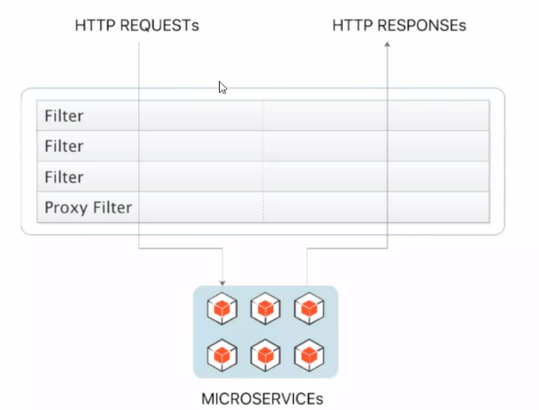
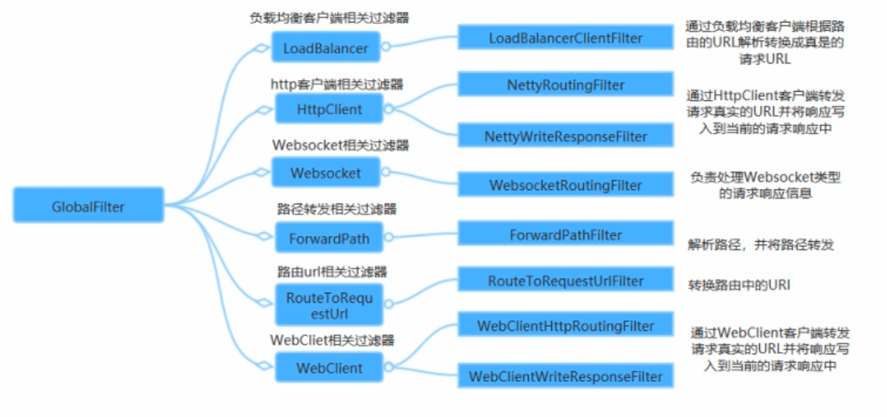
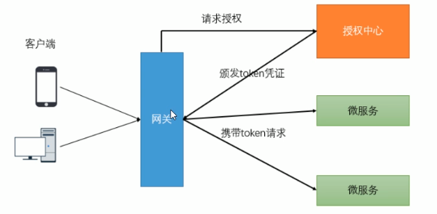
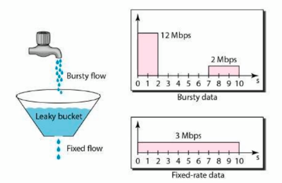
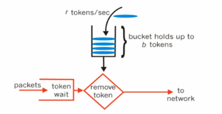

##### Spring Cloud Gateway (网关)

若是不想启动 `spring.cloud.gateway.endabled=false`

> Spring Cloud Gateway 需要 Spring Boot 和 Spring Webflux 提供的 Netty 运行时。
> 它不能在传统的 Servlet 容器中或作为 WAR 构建时使用。

**常用名称 (Glossary)**

- **Route (路由)**：网关的基本构建块，它由 ID，目标 URI，谓词集合和过滤器集合定义。如果聚合谓词为 true，则匹配路由。
- **Predicate (断言)**： `Java 8 Function Predicate`。输入类型为 *Spring Framewrok* 的 `ServerWebExchange`。这使您可以匹配 HTTP 请求中的所有内容，例如标头或参数。路由执行条件
- **Filter (过滤器)** ： 这个是 *Spring Framework* `GatewayFilter` 的实例，由特定的工厂构建。在这里，您可以在发送下游请求之前或之后修改请求和响应。Gateway filter，Global Filter

spring cloud Gateway 是通过 netty 和 webflux 实现， 但是 webflux 和 web mvc 冲突
<font color="red">spring cloud gateway 与 spring boot mvc 不兼容</font>

#### Route Predicate Factories 和 Gateway Filter Factories 配置

有两种方式配置 *predicates* 和 *filters*：shortcuts（简写）和 fully expanded arguments （全拓展参数）。大多数使用的是简写的方式。

名称和参数名称将作为 `code` 在每个部分的第一个或两个句子中列出。参数通常按快捷方式配置所需的顺序列出。

##### 简短配置 [Shortcut Configuration]

简写配置 (Shortcut configuration) 由 *filter name* 识别。跟随着等号符号 （`=`），跟随着参数值由逗号（`,`）分隔。

**application.yml**

```yaml
spring:
  cloud:
    gateway:
      routes:
      - id: after_route
        uri: https://example.org
        predicates:
        - Cookie=mycookie,mycookievalue
```

#### 全扩展的参数 [Fully Expanded Arguments]

Fully expanded arguments 的展示更像是标准的 yaml 使用 name/value 对的配置。通常，有 `name` 键值和 `args` 键值。`args` 键是用于配置谓词 (predicate) 或过滤器 (filter) 的键值对的映射。

```yaml
spring:
  cloud:
    gateway:
      routes:
      - id: after_route
        uri: https://example.org
        predicates:
        - name: Cookie
          args:
            name: mycookie
            regexp: mycookievalue
```

#### 1. API GATEWAY 使用

##### 1.1 引入依赖

```xml
<dependency>
    <groupId>org.springframework.cloud</groupId>
    <artifactId>spring-cloud-starter-gateway</artifactId>
</dependency>
```

##### 1.2 路由过滤配置

```yaml
spring:
  application:
    name: spring-cloud-api-gateway
  cloud:
    gateway:
      routes:
      - id: spring-cloud-service-provider
        uri: lb://spring-cloud-service-provider # 依据微服务名称 (id) 负载均衡
        predicates:
          # 会把 /employee/** 所有加入 http://spring-cloud-service-provider 之前
          - Path=/employee/**
        filters:
          - name: CircuitBreaker
            args:
              name: fetchIngredients
              fallbackUri: /gatewayFallback
```

##### 1.3 去除前缀配置

```yaml
spring:
  application:
    name: spring-cloud-api-gateway
  cloud:
    gateway:
      routes:
      - id: spring-cloud-service-provider
        uri: lb://spring-cloud-service-provider # 依据微服务名称 (id) 负载均衡
        predicates:
          - Path=/service-provider/**
        filters: # 路由过滤器
          - RewritePath=/service-provider/(?<segment>.*),/$\{segment} # 路径重写过滤器
# 请求 http://localhost:52101/service-provider/employee/100
# 会去掉 /service-provider/ 变为 http://spring-cloud-service-provider/employee/100
```

##### 1.4 自动依据 Eureka 中心配置

```yaml
spring:
  cloud:
    gateway:
      discovery:
        locator:
          enabled: true # 开启根据微服务名称自动转发
          lower-case-service-id: true # 使用微服务小写名称
# 请求 http://localhost:52101/spring-cloud-service-provider/employee/100
```

#### 2. 过滤器

##### 2.1 生命周期



只有 *pre* 和 *post* 两个

- *pre* 在请求被路由之前执行
- *post* 在路由到微服务以后执行

##### 2.2 过滤器类型

作用范围可以分为 *GatewayFilter* 和 *GlobalFilter*

- GatewayFilter 应用到单个路由或者一个分组路由上
- GlobalFilter 应用到所有路由上

##### 2.3 定义全局过滤器



实现 `org.springframework.cloud.gateway.filter.GlobalFilter` 接口
注意 `org.springframework.stereotype.Component` 注解交给 spring 容器管理

```java
@Component
public class AuthenticationFilter implements GlobalFilter, Ordered {
    private static final Logger log = LoggerFactory.getLogger(AuthenticationFilter.class);
    /* 执行过滤器业务逻辑,返回值 chain.filter(exchange) 才会继续执行 */
    @Override
    public Mono<Void> filter(ServerWebExchange exchange, GatewayFilterChain chain) {
        log.info("Gateway 全局过滤器 AuthenticationFilter -> filter()");
        return chain.filter(exchange);
    }

    /* 指定过滤器执行顺序，数值越小优先级越高 */
    @Override
    public int getOrder() {
        return 0;
    }
}
```

#### 3. 统一鉴权



鉴权逻辑：

1. 客户端第一次请求服务时，服务端会对用户信息进行认证 (登录)
2. 认证通过，将用户信息加密为 token ，返回给客户端，作为登录凭证
3. 以后每次访问，客户端携带认证 token
4. 服务端对 token 进行解密，判断是否有效

```java
@Component
public class AuthenticationFilter implements GlobalFilter, Ordered {
    private static final Logger log = LoggerFactory.getLogger(AuthenticationFilter.class);
    /* 执行过滤器业务逻辑,返回值 chain.filter(exchange) 才会继续执行 */
    /* ServerWebExchange 中可以获取 web 环境的上下文  */
    @Override
    public Mono<Void> filter(ServerWebExchange exchange, GatewayFilterChain chain) {
        log.info("Gateway 全局过滤器 AuthenticationFilter -> filter()");

        // 1. 获取请求参数 token
        final ServerHttpRequest request = exchange.getRequest();
        final String token = request.getQueryParams().getFirst("token");
        // 2. 判断 token 的信息
        if (StringUtils.isEmpty(token)) {
            // 2.1 token 认证失败
            log.error("认证失败， token 不可为空");
            exchange.getResponse().setStatusCode(HttpStatus.UNAUTHORIZED);
            return exchange.getResponse().setComplete(); // 请求结束
        }
        // 3. 认证通过
        return chain.filter(exchange);
    }

    /* 指定过滤器执行顺序，数值越小优先级越高 */
    @Override
    public int getOrder() {
        return 0;
    }
}
```

请求地址： *http://localhost:52101/spring-cloud-service-provider/employee/100?token=ok*

#### 4. 网关限流

4.1 常见限流算法

1. 计数器
   计数器限流是最简单的实现限流方式。本质是维护一时间单位内的计数器，每次请求计数器加 1，当单位事件内计数器累加到大于设定阈值，则之后所有请求都被拒绝，直到单位事件已经过去，再将计数器置为 0.

2. 漏桶算法
   可以很好的限制容量池的大小，从而防止流量暴增。漏桶可以看作是一个带有常量服务时间的单服务队列，如果漏桶溢出，那么数据包会被丢弃。在网络中，漏桶算法可以控制端口的流量输出速率，平滑网络上的突发流量，实现流量整形，从而为网络提供一个稳定的流量。

   
   一般会设置两个值，一个是桶的大小，支持流量突发增多是可以存多少水 (burst), 另一个是水桶漏洞大小 (rate)

3. 令牌桶算法
   令牌桶算法是对漏桶算法的一种改进，漏桶算法能够限制请求的调用速率，而令牌桶算法能够限制调用的平均速率的同时还允许一定程度的突发调用。
   

