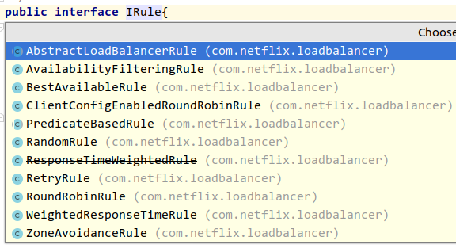

#### 1. Netflix Ribbon

客户端的负载均衡 (Client Side Load Balancer) -- Ribbon

*Ribbon* 是客户端负载平衡器，可让您对 *HTTP* 和 *TCP* 客户端的行为进行大量控制。
*Feign* 已经使用了 *Ribbon*，因此，如果您使用 `@FeignClient`，也适用。

Ribbon 的中心概念是指定客户端的概念。

每个负载均衡器都是组件装配（集合）的一部分，为了按需联系远程服务器一起协同工作，并且该组件具有您作为应用程序开发人员提供的名称（例如，使用 `@FeignClient` 批注）。
根据需要，*Spring Cloud* 通过使用 `RibbonClientConfiguration` 为每个命名客户端创建一个新的集合作为 `ApplicationContext`。
它包含（除其他事项外） `ILoadBalancer`， `RestClient` 和 `ServerListFilter`。

##### **使用 Ribbon**

```xml
<dependency>
    <groupId>org.springframework.cloud</groupId>
    <artifactId>spring-cloud-starter-netflix-ribbon</artifactId>
</dependency>

<!-- gradle -->
implement 'org.springframework.cloud:spring-cloud-starter-netflix-ribbon'
```

##### **自定义 Ribbon 客户端**

[参考配置文件](https://github.com/Netflix/ribbon/blob/master/ribbon-core/src/main/java/com/netflix/client/config/CommonClientConfigKey.java) - `CommonClientConfigKey`。使用 *Spring Boot* 配置文件，`<client>.ribbon.*`

*Spring Cloud* 允许完全控制客户端通过自定义声明额外补充的配置（`RibbonClientConfiguration`）使用注解 `@RibbonClient`

```java
@Configuration
@RibbonClient(name = "custom", configuration = CustomConfiguration.class)
public class TestConfiguration {}
```

在此案例中，客户端由已经存在的 `RibbonClientConfiguration` 配置，和任意在 `CustomConfiguration` 中的配置组成，（后者配置会覆盖前者配置）

> `@RibbonClient` 注解类配置 *Ribbon Client*，该组件自动放入 `RbiionClientConfiguraiont` 当中。
> *注意：* 自定义的配置必须声明 `@Configuration` 注解，但是要注意的是，该配置不在 `@ComponentScan` 的主 *application conetxt* 中。否则，该配置会被所有的 `@RibbonClients` 共享。应该分开一个单独的包来放置该配置文件。

由 *Spring Cloud Netflix* 为 *Ribbon* 默认提供的 *Beans* ：

|      Bean Type      |         Bean Name         |            Class Name            |
| :-----------------: | :-----------------------: | :------------------------------: |
|   `IClientConfig`   |   `ribbonClientConfig`    |    `DefaultClientConfigImpl`     |
|       `IRule`       |       `ribbonRule`        |       `ZoneAvoidanceRule`        |
|       `IPing`       |       `ribbonPing`        |           `DummyPing`            |
|    `ServerList`     |    `ribbonServerList`     |  `ConfigurationBasedServerList`  |
| `ServerListFilter`  | `ribbonServerListFilter`  | `ZonePreferenceServerListFilter` |
|   `ILoadBalancer`   |   `ribbonLoadBalancer`    |     `ZoneAwareLoadBalancer`      |
| `ServerListUpdater` | `ribbonServerListUpdater` |    `PollingServerListUpdater`    |

自定义这些类型的一个 *Bean*，它将会替换在一个 `@RibbonClient` 中的配置

```java
@Configuration(proxyBeanMethods = false)
protected static class FooConfiguration {
    @Bean
    public ZonePreferenceServerListFilter serverListFilter() {
        ZonePreferenceServerListFilter filter = new ZonePreferenceServerListFilter();
        filter.setZone("myTestZone");
        return filter;
    }
    @Bean
    public IPing ribbonPing() {
        return new PingUrl();
    }
}
// 使用 PingUrl 替换了 NoOpPing，提供了自定义的 serverListFilter
```

##### 为所有的 Ribbon 客户但自定义默认配置

一个默认的配置可以提供给所有的 *Ribbon Clients* 使用，通过配置注解 `@RibbonClients` 然后注册一个默认的配置

```java
@RibbonClients(defaultConfiguration = DefaultRibbonConfig.class)
public class RibbonClientDefaultConfigurationTestsConfig {
    public static class BazServiceList extends ConfigurationBasedServerList {
        public BazServiceList(IClientConfig config) {
            super.initWithNiwsConfig(config);
        }
    }
}

@Configuration(proxyBeanMethods = false)
class DefaultRibbonConfig {
    @Bean public IRule ribbonRule() { return new BestAvailableRule(); }
    @Bean public IPing ribbonPing() { return new PingUrl(); }
    @Bean
    public ServerList<Server> ribbonServerList(IClientConfig config) {
        return new RibbonClientDefaultConfigurationTestsConfig.BazServiceList(config);
    }
    @Bean
    public ServerListSubsetFilter serverListFilter() {
        return new ServerListSubsetFilter();
   }
}
```

##### 使用配置属性自定义 Ribbon

从 1.2.0 版本开始，*Spring Cloud Netflix* 支持自定义 *Ribbon Clients* 参考兼容 *Ribbon* 的配置 [Ribbon Configuration](https://github.com/Netflix/ribbon/wiki/Working-with-load-balancers#components-of-load-balancer)

这就允许在不同环境启动时间改变行为。

支持的配置属性：

- `<clientName>.ribbon.NFLoadBalancerClassName`: Should implement `ILoadBalancer`
- `<clientName>.ribbon.NFLoadBalancerRuleClassName`: Should implement `IRule`
- `<clientName>.ribbon.NFLoadBalancerPingClassName`: Should implement `IPing`
- `<clientName>.ribbon.NIWSServerListClassName`: Should implement `ServerList`
- `<clientName>.ribbon.NIWSServerListFilterClassName`: Should implement `ServerListFilter`

> 这些属性中定义的类要优先于定义的 Beans 通过使用注解 `@RibbonClient(configuration=MyRibbonConfig.class)` ，和默认由 *Spring Cloud Netflix* 提供的。

示例：为名称为 `users` 的服务配置 `IRule`

```yml
users:
  ribbon:
    NIWSServerListClassName: com.netflix.loadbalancer.ConfigurationBasedServerList
    NFLoadBalancerRuleClassName: com.netflix.loadbalancer.WeightedResponseTimeRule
```

##### 负载均衡器的组件

- Rule - a logic component to determine which server to return from a list
- Ping - a component running in background to ensure liveness of servers
- ServerList - this can be static or dynamic. If it is dynamic (as used by `DynamicServerListLoadBalancer`), a background thread will refresh and filter the list at certain interval

这些组件要么以编码的方式配置或者作为客户端配置属性的一部分作为反射实现。
属性应该加上前缀 `<clientName>.<nameSpace>`

```
NFLoadBalancerClassName
NFLoadBalancerRuleClassName
NFLoadBalancerPingClassName
NIWSServerListClassName
NIWSServerListFilterClassName
```

#### 2. 常用配置

```yaml
ribbon:
  ConnectTimeout: 1000 #服务请求连接超时时间（毫秒）
  ReadTimeout: 3000 #服务请求处理超时时间（毫秒）
  OkToRetryOnAllOperations: true #对超时请求启用重试机制
  MaxAutoRetriesNextServer: 1 #切换重试实例的最大个数
  MaxAutoRetries: 1 # 切换实例后重试最大次数
  NFLoadBalancerRuleClassName: com.netflix.loadbalancer.RandomRule #修改负载均衡算法
```

##### 在 Ribbon 中禁用 Eureka

```properties
ribbon.eureka.enabled=false
```

##### 显示使用 Ribbon API

```java
public class MyClass {
    @Autowired
    private LoadBalancerClient loadBalancer;
    public void doStuff() {
        ServiceInstance instance = loadBalancer.choose("stores");
        URI storesUri = URI.create(String.format("https://%s:%s", instance.getHost(), instance.getPort()));
        // ... do something with the URI
    }
}
```

#### 3. 负载算法

> 所谓的负载均衡策略，就是当 A 服务调用 B 服务时，此时 B 服务有多个实例，这时A服务以何种方式来选择调用的 B 实例，ribbon 可以选择以下几种负载均衡策略。

- com.netflix.loadbalancer.RandomRule
  从提供服务的实例中以随机的方式
- com.netflix.loadbalancer.RoundRobinRule
  以线性轮询的方式，就是维护一个计数器，从提供服务的实例中按顺序选取，第一次选第一个，第二次选第二个，以此类推，到最后一个以后再从头来过
- com.netflix.loadbalancer.RetryRule
  在 RoundRobinRule 的基础上添加重试机制，即在指定的重试时间内，反复使用线性轮询策略来选择可用实例
- com.netflix.loadbalancer.WeightedResponseTimeRule
  对 RoundRobinRule 的扩展，响应速度越快的实例选择权重越大，越容易被选择；
- com.netflix.loadbalancer.BestAvailableRule
  选择并发较小的实例
- com.netflix.loadbalancer.AvailabilityFilteringRule
  先过滤掉故障实例，再选择并发较小的实例
- com.netflix.loadbalancer.ZoneAwareLoadBalancer
  采用双重过滤，同时过滤不是同一区域的实例和故障实例，选择并发较小的实例

#### 4. Ribbon 在 Eureka 当中存在

<font color="red">Ribbon 属于客户端的负载均衡</font>

##### 4.1 Ribbon 负载均衡

```java
@Bean
@LoadBalanced
public RestTemplate restTemplate() {
    return new RestTemplate();
}
```

`@LoadBalanced` *Ribbon* 提供的负载均衡方式

##### 4.2 调用方式

```java
// 使用服务 ID 调用
@Autowired
private RestTemplate restTemplate;
// 一句 service id 来访问
restTemplate.getForObject("http://spring-cloud-service-provider/tag", String.class);
```

##### 4.3 客户端负载均衡配置

获取到了服务端的所有地址，依据内置的负载算法，算出要调用的服务地址。

`com.netflix.loadbalancer.IRule` 接口。



常用的策略：

- 轮询方式(默认) : `RoundRobinRule`
- 权重配置：`WeightedResponseTimeRule`

```yaml
# 修改 ribbon 负载的策略， 服务名 - ribbon - NFLoadBalancerRuleClassName : 全路径策略类
spring-cloud-service-provider:
  ribbon:
    NFLoadBalancerRuleClassName: com.netflix.loadbalancer.RoundRobinRule
```

##### 4.4 请求重试

引入依赖

```xml
<dependency>
    <groupId>org.springframework.retry</groupId>
    <artifactId>spring-retry</artifactId>
    <version>1.2.5.RELEASE</version>
</dependency>
```

```yaml
# 修改 ribbon 负载的策略， 服务名 - ribbon - NFLoadBalancerRuleClassName : 全路径策略类
spring-cloud-service-provider:
  ribbon:
    NFLoadBalancerRuleClassName: com.netflix.loadbalancer.RoundRobinRule
    # 重试机制
    ConnectTimeout: 250 # Ribbon 连接超时时间
    ReadTimeout: 1000 # Ribbon 数据读取超时时间
    OkToRetryOnAllOperations: true # 是否对所有操作进行重试
    MaxAutoRetriesNextServer: 1 # 切换实例的重试次数
    MaxAutoRetries: 1 # 对当前实例的重试次数
```

