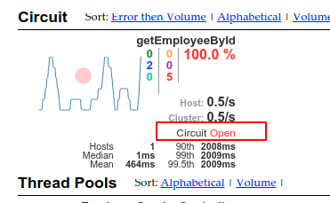

#### 1. 服务熔断 (Circuit Breaker -- Hystrix)

**停用 Spring Cloud Circuit Breaker Hystrix**
`spring.cloud.circuitbreaker.hystrix.enabled=false`

**配置 *Hystrix Circuit Breakers***
*默认的配置*
创建一个 `Customize` 的 *bean*， 传递一个  `HystrixCircuitBreakerFactory` 或者 `ReactiveHystrixCircuitBreakerFactory`

```java
@Bean
public Customizer<HystrixCircuitBreakerFactory> defaultConfig() {
    return factory -> factory.configureDefault(id -> HystrixCommand.Setter
            .withGroupKey(HystrixCommandGroupKey.Factory.asKey(id))
            .andCommandPropertiesDefaults(HystrixCommandProperties.Setter()
            .withExecutionTimeoutInMilliseconds(4000)));
}
```

*Reactive Example*

```java
@Bean
public Customizer<ReactiveHystrixCircuitBreakerFactory> defaultConfig() {
    return factory -> factory.configureDefault(id -> HystrixObservableCommand.Setter
            .withGroupKey(HystrixCommandGroupKey.Factory.asKey(id))
            .andCommandPropertiesDefaults(HystrixCommandProperties.Setter()
                    .withExecutionTimeoutInMilliseconds(4000)));
}
```

*制定自己的 Circuit Breaker 配置*
和提供一个默认的配置相似，可自定义一个 *Custom Bean* 传递一个 `HystrixCircuitBreakerFactory`

```java
@Bean
public Customizer<HystrixCircuitBreakerFactory> customizer() {
    return factory -> factory.configure(builder -> builder.commandProperties(                   HystrixCommandProperties.Setter().withExecutionTimeoutInMilliseconds(2000)), "foo", "bar");
}
```

*Reactive*

```java
@Bean
public Customizer<ReactiveHystrixCircuitBreakerFactory> customizer() {
    return factory -> factory.configure(builder -> builder.commandProperties(HystrixCommandProperties.Setter().withExecutionTimeoutInMilliseconds(2000)), "foo", "bar");
}
```

---

###### Hystrix Client 使用

依赖

```xml
<dependency>
    <groupId>org.springframework.cloud</groupId>
    <artifactId>spring-cloud-starter-netflix-hystrix</artifactId>
</dependency>
```

启动类：

```java
@SpringBootApplication
@EnableCircuitBreaker
public class Application {
    public static void main(String[] args) {
        new SpringApplicationBuilder(Application.class).web(true).run(args);
    }
}

@Component
public class StoreIntegration {
    @HystrixCommand(fallbackMethod = "defaultStores")
    public Object getStores(Map<String, Object> parameters) {
        //do stuff that might fail
    }
    public Object defaultStores(Map<String, Object> parameters) {
        return /* something useful */;
    }
}
```

`@HystrixCommand` 由一个名为 `javanica` 的 *Netflix contrib* 库提供。
*Spring Cloud* 会自动将带有该批注的 *Spring bean* 包装在连接到 *Hystrix* 断路器的代理中。
断路器计算何时断开和闭合电路，以及在发生故障时应采取的措施。

###### Hystrix Dashborad 引入

`spring-cloud-starter-netflix-hystrix-dashboard` 依赖。

```xml
<dependency>
    <groupId>org.springframework.cloud</groupId>
    <artifactId>spring-cloud-starter-netflix-hystrix-dashboard</artifactId>
</dependency>
```

在启动类上添加注解 `@EnableHystrixDashboard` ， 然后访问 `/hystrix` 和 `/hystrix.stream`

要暴露 `hystrix.stream`

```yaml
management:
  endpoints:
    web:
      exposure:
        include: 'hystrix.stream' #暴露hystrix监控端点
```


#### 2. Hystrix 的 @HystrixCommand 注解

##### 2.1 参数详情

@HystrixCommand中的常用参数

- fallbackMethod：指定服务降级处理方法；
- ignoreExceptions：忽略某些异常，不发生服务降级；
- commandKey：命令名称，用于区分不同的命令；
- groupKey：分组名称，Hystrix 会根据不同的分组来统计命令的告警及仪表盘信息；
- threadPoolKey：线程池名称，用于划分线程池。

#### 3. Hystrix 的缓存

> 当系统并发量越来越大时，我们需要使用缓存来优化系统，达到减轻并发请求线程数，提供响应速度的效果。

##### 3.1 相关注解

- @CacheResult
  开启缓存，默认所有参数作为缓存的key，cacheKeyMethod 可以通过返回 String 类型的方法指定 key
- @CacheKey
  指定缓存的 key，可以指定参数或指定参数中的属性值为缓存 key，cacheKeyMethod 还可以通过返回 String 类型的方法指定
- @CacheRemove
  移除缓存，需要指定 commandKey

##### 3.2 示例

```java
@GetMapping("/testCache/{id}")
public CommonResult testCache(@PathVariable Long id) {
    userService.getUserCache(id); // 直接调用三次
    userService.getUserCache(id);
    userService.getUserCache(id);
    return new CommonResult("操作成功", 200);
}
```

添加缓存

```java
@CacheResult(cacheKeyMethod = "getCacheKey")
@HystrixCommand(fallbackMethod = "getDefaultUser", commandKey = "getUserCache")
public CommonResult getUserCache(Long id) {
    LOGGER.info("getUserCache id:{}", id);
    return restTemplate.getForObject(userServiceUrl + "/user/{1}", CommonResult.class, id);
}

/** 为缓存生成 key 的方法 */
public String getCacheKey(Long id) {
    return String.valueOf(id);
}
```

删除缓存

```java
@CacheRemove(commandKey = "getUserCache", cacheKeyMethod = "getCacheKey")
@HystrixCommand
public CommonResult removeCache(Long id) {
    LOGGER.info("removeCache id:{}", id);
    return restTemplate.postForObject(userServiceUrl + "/user/delete/{1}", null, CommonResult.class, id);
}
```

使用过后要关闭

```java
@Component
@WebFilter(urlPatterns = "/*",asyncSupported = true)
public class HystrixRequestContextFilter implements Filter {
    @Override
    public void doFilter(ServletRequest servletRequest, ServletResponse servletResponse, FilterChain filterChain) throws IOException, ServletException {
        HystrixRequestContext context = HystrixRequestContext.initializeContext();
        try {
            filterChain.doFilter(servletRequest, servletResponse);
        } finally {
            context.close();
        }
    }
}
```

#### 4. Hystrix 熔断降级使用

##### 4.1 修改默认的连接超时配置

```java
// 启动类上添加 @EnableCircuitBreaker 注解
@EnableCircuitBreaker
public class Application() {}
```

超时时间配置

```java
@HystrixCommand(fallbackMethod = "fallbackIdMethod",
                commandProperties = {@HystrixProperty(name = "execution.isolation.thread.timeoutInMilliseconds", value = "3000")})
@RequestMapping(value = "/{id}", method = RequestMethod.GET)
public Employee getEmployeeById(@PathVariable("id") Integer id) { }
```

或者配置文件

```yaml
ribbon:
  ReadTimeout: 3000
  ConnectTimeout: 3000

hystrix:
  command:
    default:
      execution:
        isolation:
          thread:
            timeoutInMilliseconds: 3000 # 默认连接超时时间 1 秒，若没有返回数据自动触发降级策略

# 若是 Feign 的方式，开启 Hystrix 支持
feign:
  hystrix:
    enabled: true
```

##### 4.2  统一降级方式

```java
// 在类上配置统一的公共熔断设置
// DefaultProperties 指定了公共降级后 在 @HystrixCommand 就不同在指定了
@DefaultProperties(defaultFallback = "defaultFallBack")
// 注意，公共的降级方法没有参数，还有要统一返回信息，每个请求方法的返回信息应该和降级方法一致
```

##### 4.3 Feign 对 Hystrix 的支持

添加 Ribbon 支持， 在方法调用上就不用在写  `@HystrixCommand` 注解了

```yaml
feign:
  client:
    config:
      spring-cloud-service-provider: # 需要调用微服务的名称
        loggerLevel: FULL
# 若是 Feign 的方式，开启 Hystrix 支持
feign:
  hystrix:
    enabled: true
```

Feign 的接口

```java
// name -> 指定对应的服务 id
// fallback -> 指定降级的类
@FeignClient(name = "spring-cloud-service-provider", 
             fallback = EmployeeClientFallBack.class)
public interface EmployeeClient {
    @RequestMapping(value = "/employee/tag", method = RequestMethod.GET)
    String getTag();
}

// 实现了 Feign 接口的容错调用类
public class EmployeeClientFallBack implements EmployeeClient {
    @Override
    public String getTag() {
        log.info("EmployeeClientFallBack -> getTag (Feign Hystrix 熔断降级)");
        return "Feign Hystrix 熔断降级";
    }
}
```

#### 5. Hystrix 监控信息

##### 5.1 引入依赖

```xml
<dependency>
    <groupId>org.springframework.cloud</groupId>
    <artifactId>spring-cloud-starter-netflix-hystrix-dashboard</artifactId>
</dependency>
```

##### 5.2 dashboard 使用

```java
// 在 Hystrix 的客户端要使用注解
@EnableCircuitBreaker

// 在 Hystrix 监控中添加 @EnableHystrixDashboard 到启动类
@EnableHystrixDashboard

# application.yml 配置允许访问的列表
hystrix.dashboard.proxy-stream-allow-list="*"
```

监控信息

```yaml
management:
  endpoints:
    web:
      exposure:
        include: '*'
# 暴露 actuator 的监控信息
# Hystrix 监控地址 http://localhost:52102/hystrix
```

访问地址 `http://localhost:51001/actuator/hystrix.stream`

#### 6. Turbine 断路器聚合监控

监控整个系统的数据工具。收集每个微服务中的 *Hystrix* 监控信息

##### 6.1 引入依赖

```xml
<dependency>
    <groupId>org.springframework.boot</groupId>
    <artifactId>spring-boot-starter-actuator</artifactId>
</dependency>
<dependency>
    <groupId>org.springframework.cloud</groupId>
    <artifactId>spring-cloud-starter-netflix-hystrix</artifactId>
</dependency>
<dependency>
    <groupId>org.springframework.cloud</groupId>
    <artifactId>spring-cloud-starter-netflix-hystrix-dashboard</artifactId>
</dependency>
<dependency>
    <groupId>org.springframework.cloud</groupId>
    <artifactId>spring-cloud-starter-netflix-turbine</artifactId>
</dependency>
```

##### 6.2 编辑启动类

```java
@EnableEurekaClient
@EnableTurbine
@EnableHystrixDashboard
public class Application() {}
```

##### 6.3 编辑 Turbine 配置

```yaml
turbine:
  # 要监控的服务列表
  app-config: cloud-load-balancer-client,spring-cloud-service-provider
  cluster-name-expression: "'default'"
```

##### 6.4 Turbine 访问

地址 `http://localhost:52202/turbine.stream`
在 `http://localhost:52202/hystrix` 中输入上面地址

<font color="red">Hystrix 可以对请求失败，请求拒绝或请求超时做统一的降级处理</font>

#### 7. Hystrix 断路器

熔断器有三个状态 `CLOSED` `OPEN` `HALF_OPEN` 默认状态为关闭，当熔断器触发熔断后状态变更为 `OPEN`，在等待指定时间内， *Hystrix* 会请求检测服务是否开启，这期间熔断器会变为 `HALF_OPEN` 状态，熔断服务探测为可用后变更状态为 `CLOSED` 关闭熔断器。

`OPEN` 请求多次，记录请求失败的次数，若是失败频率为 85%, 此时开启断路器，调用降级方法。
`HALF_OPEN` 维持 `OPEN` 一段时间，默认开启 5s，进入半开状态，尝试放一个请求到微服务调用，若是请求成功，就会关闭熔断器，当请求不能访问，就会开启熔断器。

##### 7.1 配置熔断参数

```yaml
hystrix:
  command:
    default:
      execution:
        isolation:
          thread:
            timeoutInMilliseconds: 3000 # 默认连接超时时间 1 秒，若没有返回数据自动触发降级策略
      circuitBreaker:
        requestVolumeThreshold: 20 # 触发熔断的最小请求次数，默认 20个/10秒
        sleepWindowInMilliseconds: 10000 # 熔断后尝试次数
        errorThresholdPercentage: 50 # 触发熔断的失败请求百分比，默认 50%
```



##### 7.2 熔断器的隔离策略

Hystrix 熔断器实现了服务的自动降级，让微服务有了自我保护的能力，提升了系统的稳定性，较好的解决了雪崩效应。

- 线程池隔离策略
- 信号量隔离策略

```yaml
hystrix:
  command:
    default:
      execution:
        isolation:
          strategy: ExecutionIsolationStrategy.THREAD # 线程池隔离 SEMAPHORE 信号量隔离
```

