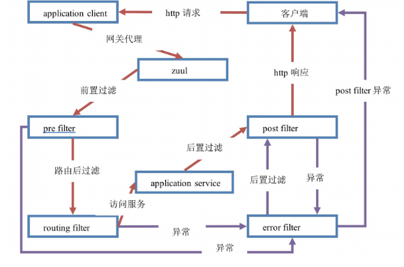

##### 路由和过滤 (Router and Filter) -- Zuul

`Zuul` 是基于 *JVM* 的路由，是服务端的负载均衡，来自于 Netflix。
**使用场景**

- Authentication 认证
- Insights
- Stress Testing
- Canary Testing
- Dynamic Routing
- Service Migration
- Load Sheding
- Security
- Static Response handing
- Active/Active traffic management

Zuul 的规则引擎使规则和过滤器基本上可以用任何 JVM 语言编写，并内置对 Java 和 Groovy 的支持。

**使用 zuul**

```xml
<dependency>
    <groupId>org.springframework.cloud</groupId>
    <artifactId>spring-cloud-starter-netflix-zuul</artifactId>
</dependency>
```

**嵌入式 Zuul 反向代理**
在 Spring Boot 的 main 类中注解 `@EnableZuulProxy`。
这样做会导致将本地呼叫转发到适当的服务。

```yaml
zuul:
  ignoredServices: '*'
  routes:
    users: /myusers/**
```

所有的请求都会被忽略，除了 `users`

#### 1. zuul 网关

##### 1.1 简介

zuul 是 Netflix 开源的微服务网关，可以和 Eureka，Ribbon，Hystrix 等组件配合使用，zuul 网关是由一系列的过滤器组成。

- 动态路由：动态将请求路由到不同后端的集群
- 压力测试：逐渐增加指向集群的流量，了解性能
- 负载均衡：为每一个负载类型分配对应的容量，并弃用超出限定的请求
- 静态响应处理：边缘位置进行响应，避免转发到内部集群
- 身份认证和安全：识别每一个请求的验证要求，并拒绝不符合的请求， spring Cloud 对 zuul 进行了整合和增强

##### 1.2 搭建 zuul 网关服务器

```xml
<dependency>
    <groupId>org.springframework.cloud</groupId>
    <artifactId>spring-cloud-starter-netflix-zuul</artifactId>
</dependency>
```

开启网关功能

```java
@EnableZuulProxy
public class Application() {}
```

##### 1.3 配置过滤规则 (路由)

路由：根据请求的 url 转发到不同的微服务当中

```yaml
zuul:
  routes:
    spring-cloud-service-provider:
      path: /service-provider/** # 映射路径 localhost/service-provider/xx
      url: http://localhost:52200 # 转发的实际微服务地址 52200
```

面向微服务配置

```yaml
zuul:
  routes:
    spring-cloud-service-provider:
      path: /service-provider/** # 映射路径 localhost/service-provider/xx
      serviceId: spring-cloud-service-provider # 配置转发的微服务 id
```

简化配置，当路由 id 和 serviceId 一致时

```yaml
zuul:
  routes:
    service-product: /product-service/**
# http://localhost:52204/spring-cloud-service-provider/employee/list
```

#### 2. zuul 网关过滤

- **PRE**
  在请求被路由之前调用。利用这个做身份验证、在集群中选择请求的微服务、记录调试信息
- **ROUTING**
  将请求转发到微服务执行的过滤器。用于构建发送给微服务的请求，并使用 Apache HttpClient 或者 Netflix Ribbon 请求微服务
- **POST**
  在路由到微服务获取返回值后执行。为响应添加标准的 HTTP header、收集统计信息和指标、将响应从微服务发送给客户端。
- **ERROR**
  在其他阶段发送错误时执行该步骤



##### 2.1 定义自己的 zuul 过滤器

继承 `com.netflix.zuul.ZuulFilter` 抽象类

```java
@Component
public class LoginZuulFilter extends ZuulFilter {
    /* 定义过滤器类型， pre|routing|post|error */
    @Override
    public String filterType() {
        return "pre";
    }

    /* 过滤器的执行顺序，返回值越小，执行顺序越高 */
    @Override
    public int filterOrder() {
        return 0;
    }

    /* 过滤器是否生效，true：使用此过滤器 */
    @Override
    public boolean shouldFilter() {
        return true;
    }

    /* 指定过滤器中的业务逻辑 */
    @Override
    public Object run() throws ZuulException {
        return null;
    }
}
```

##### 2.2 基于 zuul 的 pre 过滤器的身份认证

```java
 @Override
public Object run() throws ZuulException {
    log.info("执行 LoginZuulFilter -> run()");
    // 1. 获取 zuul 提供的 RequestContext 对象
    final RequestContext currentContext = RequestContext.getCurrentContext();
    // 2. 从 RequestContext 对象获取 Request 对象
    final HttpServletRequest request = currentContext.getRequest();
    // 3. 获取 access-token header
    final String token = request.getParameter("access-token");
    // 4. 校验 header
    if (StringUtils.isEmpty(token)) {
        // 4.1 拦截请求，校验认证失败
        currentContext.setSendZuulResponse(false);
        currentContext.setResponseStatusCode(HttpStatus.UNAUTHORIZED.value());
    }
    return null;
}
```

请求地址：`http://localhost:52204/spring-cloud-service-provider/employee/list?access-token=ok`