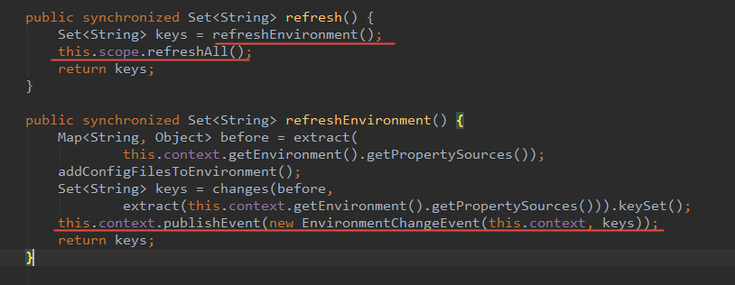
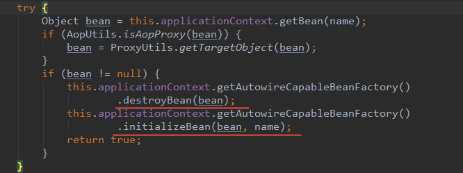
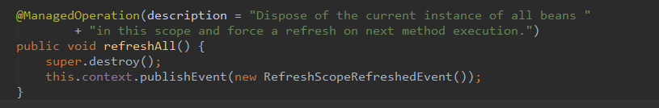
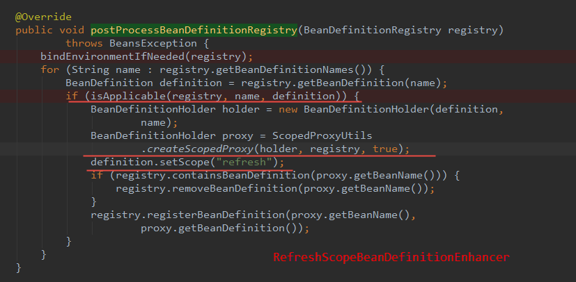

### spring cloud 配置更新

#### nacos 配置中心修复，服务自动重新绑定参数值

nacos 配置发现使用版本：2.1.0.RELEASE

1. nacos 配置中心配置修复后刷新服务配置： `com.alibaba.cloud.nacos.refresh.NacosContextRefresher#registerNacosListener`
   发布配置刷新事件：`applicationContext.publishEvent(new RefreshEvent(this, null, "Refresh Nacos config"));`
2. nacos 更新事件监听器初始配置刷新事件：
   `org.springframework.cloud.endpoint.event.RefreshEventListener#handle(org.springframework.cloud.endpoint.event.RefreshEvent)`
   调用 `org.springframework.cloud.context.refresh.ContextRefresher#refresh` 刷新 *spring 容器* 配置，重新绑定参数修改后的值。

`ContextRefresher` 处理环境参数改变和更新 *bean* 属性值

发布 *EnvironmentChangeEvent* 改变事件，然先存的 *bean* 重新绑定修改后的参数值，`org.springframework.cloud.context.properties.ConfigurationPropertiesRebinder#rebind()` 处理环境变量改变，重新绑定 *bean* 属性变量值。

`AbstractAutowireCapableBeanFactory#initializeBean(Object, String)` 重新初始化 *Bean* 对象。

`RefreshScope#refreshAll()` 更新 *spring* 容器

`RefreshScope` 先销毁，在发布 `RefreshScopeRefreshedEvent` 事件。

`RefreshAutoConfiguration` 类增强

`org.springframework.aop.scope.ScopedProxyUtils#createScopedProxy` 创建指定 **scope** 的 *Bean* 代理对象。